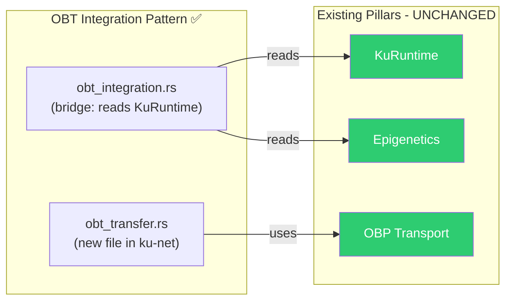
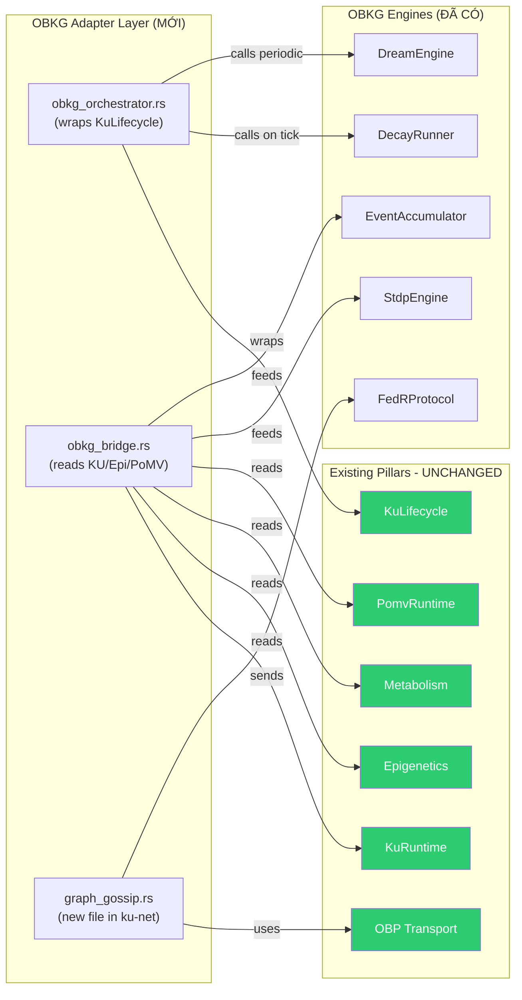

# OBKG Cross-Pillar Integration — Đính Chính

> **Phản hồi câu hỏi**: "Tại sao OBKG làm sau mà bắt OBP phải thay đổi lớn?"  
> **Trả lời**: Đúng — **KHÔNG NÊN**. Bản analysis trước SAI. Đây là bản đính chính.

---

## ⚠️ Bản Analysis Trước Sai Ở Đâu?

Bản [obkg_cross_pillar_impact.md](file:///C:/Users/shpy2/.gemini/antigravity/brain/3c24f26b-a629-4f5f-94c7-3a91a7102e59/obkg_cross_pillar_impact.md) đã **nhầm lẫn 2 điều**:

1. **Nhầm pillar numbering** — Gọi Epigenetics là "Pillar 2" nhưng thực ra P2 = OBP Network
2. **Nhầm hướng integration** — Yêu cầu pillar cũ phải thay đổi cho pillar mới. Đúng ra phải ngược lại: **OBKG (P7) build adapters, không sửa foundations**

---

## Pillar Map Chính Xác (10 Pillars)

| # | Name | Status | Thay đổi cho OBKG? |
|---|------|--------|-------------------|
| **P1** | Knowledge Unit (KU) | 🟢 98% | ❌ **KHÔNG** |
| **P2** | **OBP Network** | 🟢 95% | ❌ **KHÔNG** (chỉ thêm 1 file mới) |
| **P3** | KQL Query Language | 🟢 90% | ⚠️ storage.rs cần v6 rewrite (task riêng) |
| **P4** | Consensus (PoMV) | 🟢 85% | ❌ **KHÔNG** |
| **P5** | OBT Token | 🟢 75% | ➕ Additive only (thêm enum variant) |
| P6 | AI Layer | 🟠 30% | — |
| **P7** | **OBKG Knowledge Graph** | 🟡 45% | ✅ Build adapters/bridges |
| P8 | Storage Layer | 🟢 65% | — |
| P9 | BCI Protocol | 🔴 15% | — |
| P10 | User Interface | 🔴 10% | — |

---

## Nguyên Tắc: OBT Precedent

OBT (P5) đã chứng minh pattern đúng — **build bridges, don't break foundations**:



**OBKG phải làm tương tự:**



---

## Đính Chính Từng "Gap"

### ~~GAP 2.1: add_bond() không emit BondEvent~~ → OBKG's job

| Trước (SAI) | Sau (ĐÚNG) |
|-------------|------------|
| Sửa `epigenetics.rs::add_bond()` | `ObkgBridge` wraps bond creation, emit BondEvent |
| Modify existing code | Read existing data, build new layer on top |

**OBKG builds**: `ObkgBridge::on_bond_added(bond) → EventAccumulator.append(BondEvent::Created)`

### ~~GAP 2.2: Hai hệ thống decay song song~~ → By design!

| Trước (SAI) | Sau (ĐÚNG) |
|-------------|------------|
| "Hai decay conflict" | Hai scope khác nhau, intentional |
| Sửa `metabolism.rs` | OBKG `DecayRunner` reads metabolic_rate as input factor |

- **Metabolism** = KU-level health (usage frequency)
- **Graph Decay** = Bond-level weight (relation strength)
- Chúng **bổ sung** nhau, không conflict. `ObkgBridge` reads metabolism_rate() và dùng làm factor cho DecayRunner.

### ~~GAP 2.3: KuLifecycle không integrate OBKG~~ → Wrap, đừng sửa

| Trước (SAI) | Sau (ĐÚNG) |
|-------------|------------|
| Thêm fields vào KuLifecycle | `ObkgOrchestrator` wraps KuLifecycle |
| Sửa tick(), gc() | ObkgOrchestrator.tick() calls ku_lifecycle.tick() rồi chạy graph engines |

### GAP 4.1-4.2: storage.rs sync → Part of v6 storage rewrite

Đây thuộc **P8 Storage Layer** rewrite, không phải OBKG fix. Khi storage.rs được viết lại cho v6, OBKG indexing sẽ là phần của design mới.

### GAP 5.x: OBT missing graph rewards → Additive, later

Thêm `MintActivity::GraphContribution` variant — **additive, non-breaking**. Làm sau khi OBKG adapter layer hoạt động.

---

## Implementation Plan — OBKG Adapter Layer

### Files MỚI cần tạo (4 files)

#### 1. [NEW] `ku-core/src/obkg_orchestrator.rs` (~400 LOC)

Wraps `KuLifecycle` + OBKG engines:

```rust
pub struct ObkgOrchestrator {
    // Wraps existing lifecycle (reads, doesn't modify)
    lifecycle: KuLifecycle,
    
    // OBKG engines
    event_log: EventAccumulator,
    decay_runner: DecayRunner,
    dream_engine: DreamEngine,
    stdp: StdpEngine,
    consolidation: ConsolidationEngine,
    
    // Config
    dream_interval_ticks: u64,
    tick_count: u64,
}

impl ObkgOrchestrator {
    /// Wraps existing KuLifecycle — zero changes to it
    pub fn new(lifecycle: KuLifecycle) -> Self { ... }
    
    /// Extended tick: runs KuLifecycle.tick() then graph engines
    pub fn tick(&mut self, now: u64) {
        // 1. Original lifecycle logic (unchanged)
        self.lifecycle.tick(now);
        
        // 2. OBKG: Bond decay
        let bonds = self.collect_all_bonds();
        let report = self.decay_runner.run_decay(&bonds, now);
        for event in report.events { self.event_log.append(event); }
        
        // 3. OBKG: STDP on recent accesses
        // ... reads from lifecycle, applies to bond weights
        
        // 4. OBKG: Dream mode (periodic)
        if self.tick_count % self.dream_interval_ticks == 0 {
            let dream_report = self.dream_engine.run_dream_cycle(...);
            for event in dream_report.events { self.event_log.append(event); }
        }
        self.tick_count += 1;
    }
    
    /// Extended gc: cleans up graph edges for dead KUs
    pub fn gc(&mut self, now: u64) -> Vec<[u8; 32]> {
        let removed = self.lifecycle.gc(now);
        // Emit BondEvent::StateChanged for removed KU bonds
        for cid in &removed { ... }
        removed
    }
}
```

#### 2. [NEW] `ku-core/src/obkg_bridge.rs` (~200 LOC)

Adapter that reads from existing types, feeds OBKG engines:

```rust
/// Bridge between existing pillars and OBKG engines.
/// READS from KuRuntime/Epigenetics — never modifies them.
pub struct ObkgBridge;

impl ObkgBridge {
    /// Convert existing Bond operations to BondEvents
    pub fn bond_to_event(bond: &Bond, source_cid: &[u8; 32], now: u64) -> BondEvent { ... }
    
    /// Read all bonds from KuRuntime, convert to BondMeta for graph operations
    pub fn collect_bond_metas(ku: &KuRuntime) -> Vec<(CID, CID, RelationType, BondMeta)> { ... }
    
    /// Read metabolism rate as decay factor
    pub fn metabolism_decay_factor(ku: &KuRuntime) -> f64 { ... }
    
    /// Build AccessRecord from KuRuntime usage stats (for DreamEngine)
    pub fn build_access_log(kus: &[KuRuntime]) -> Vec<AccessRecord> { ... }
    
    /// Build entity embeddings from KuRuntime data (for FedR)
    pub fn build_entity_embedding(ku: &KuRuntime) -> EntityEmbedding { ... }
}
```

#### 3. [NEW] `ku-net/src/graph_gossip.rs` (~250 LOC)

Like `obt_transfer.rs` — handles FedR delta gossip over OBP transport:

```rust
/// OBKG gossip handler for FedR delta exchange.
/// Uses existing OBP transport layer — no modifications to OBP.
pub struct GraphGossipHandler { ... }

// Message types: 0xB0 = FedR Delta, 0xB1 = Dream Report, 0xB2 = Graph Stats
```

#### 4. [NEW] `ku-core/src/obkg_rewards.rs` (~150 LOC)

Bridge between OBKG and OBT (like obt_integration.rs pattern):

```rust
/// OBKG contribution scoring for OBT rewards.
/// Reads graph metrics, outputs reward inputs.
pub fn graph_contribution_score(orchestrator: &ObkgOrchestrator) -> f64 { ... }
```

### Thay đổi MINIMAL cho existing files (~9 dòng additive)

| File | Change | Lines |
|------|--------|-------|
| `ku-core/src/lib.rs` | `pub mod obkg_orchestrator;` | +1 |
| `ku-core/src/lib.rs` | `pub mod obkg_bridge;` | +1 |
| `ku-core/src/lib.rs` | `pub mod obkg_rewards;` | +1 |
| `ku-net/src/lib.rs` | `pub mod graph_gossip;` | +1 |
| `ku-net/src/constants.rs` | Graph gossip message codes 0xB0-0xB3 | +4 |
| `ku-core/src/obt_minting.rs` | `MintActivity::GraphContribution` variant | +1 |
| **Total additive** | | **+9 dòng** |

### Thay đổi cho existing pillar code: **ZERO**

| File | Change |
|------|--------|
| `epigenetics.rs` | ❌ KHÔNG SỬA |
| `metabolism.rs` | ❌ KHÔNG SỬA |
| `ku_lifecycle.rs` | ❌ KHÔNG SỬA |
| `ku_runtime.rs` | ❌ KHÔNG SỬA |
| `immune.rs` | ❌ KHÔNG SỬA |
| ALL `obt_*.rs` | ❌ KHÔNG SỬA (trừ +1 dòng enum variant) |
| ALL OBP transport/dht/sync | ❌ KHÔNG SỬA |

---

## Kết Luận

> [!IMPORTANT]
> **OBKG (P7) phải build adapters, không phải sửa foundations.**
> 
> - **4 files MỚI** cần tạo: `obkg_orchestrator.rs`, `obkg_bridge.rs`, `graph_gossip.rs`, `obkg_rewards.rs`
> - **9 dòng additive** vào existing files (module registration + message codes)
> - **0 dòng sửa** trong code đã hoàn thành của P1-P5

Bạn duyệt hướng này để tôi bắt đầu implement?
