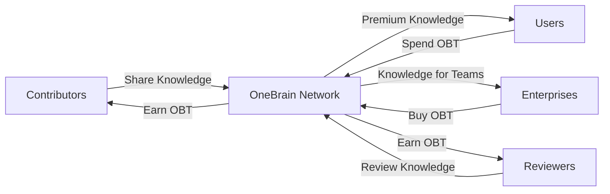

# 💰 Pillar 5: OBT Token — Phân Tích Thiết Kế Hiện Có

> Ngày phân tích: 30/06/2026

---

## 1. Tổng hợp nguồn thiết kế đã tồn tại

| # | Nguồn | File | Nội dung OBT |
|---|-------|------|-------------|
| 1 | **README.md** | [§3.3 + §7](file:///c:/Users/shpy2/Documents/OneBrain/README.md#L153) | Distribution 60/15/15/10, Circulation flow, earn/spend/stake/trade |
| 2 | **ENCODING_CONSENSUS_SPEC** | [§9](file:///c:/Users/shpy2/Documents/OneBrain/docs/specs/ENCODING_CONSENSUS_SPEC.md#L367) | Reward model cho encoding participants |
| 3 | **POK_V2_SPECIFICATION** | [Reward section](file:///c:/Users/shpy2/Documents/OneBrain/docs/specs/POK_V2_SPECIFICATION.md#L236) | OBT = internal accounting credits cho encoding |
| 4 | **encoding_reward.rs** | [Code](file:///c:/Users/shpy2/Documents/OneBrain/src/ku-core/src/encoding_reward.rs) | 209 LOC, 9 tests — reward calculation đã implement |
| 5 | **FEATURE_TREE.md** | [Line 201](file:///c:/Users/shpy2/Documents/OneBrain/docs/features/FEATURE_TREE.md#L201) | "Verifier hoàn tất encoding → nhận OBT tokens" |

> [!WARNING]
> **Không có file `tokenomics_research.md` riêng** — file đó được tham chiếu trong PILLAR_REVIEW cũ nhưng không tồn tại trên disk. Thiết kế OBT hiện tại nằm rải rác trong README và specs.

---

## 2. Thiết kế đã có — chi tiết

### 2.1. Token Distribution (từ README §7.1)

```
┌────────────────────────────────────────────┐
│         OBT TOKEN DISTRIBUTION             │
├────────────────────────┬───────────────────┤
│ 🌱 Knowledge Mining    │ 60%               │
│ 🏗️ Foundation Reserve │ 15%               │
│ 👥 Community/Ecosystem │ 15%               │
│ 🧑‍💼 Team & Advisors  │ 10%               │
└────────────────────────┴───────────────────┘
```

- **60% Knowledge Mining**: Minted gradually qua knowledge contributions, halving giống Bitcoin
- **15% Foundation**: Project development fund
- **15% Community**: Rewards cho reviewers, validators, ecosystem
- **10% Team**: Vesting schedule (chưa define chi tiết)

### 2.2. Token Circulation (từ README §7.2)



4 ways to interact:
- 🎁 **Earn**: Contribute valuable knowledge
- 🔓 **Spend**: Access premium knowledge
- 🗳️ **Stake**: Participate in governance
- 💱 **Trade**: On exchanges (future)

### 2.3. Encoding Reward Model (từ code + spec — ĐÃ IMPLEMENT)

```rust
// encoding_reward.rs — ĐÃ CODE, 9 TESTS PASSING

BASE_OBT_PER_KB = 1      // 1 OBT per KB raw text
FIRST_ENCODER_BONUS = 5   // Bonus cho AI encode đầu tiên
PRO_BONO_BONUS = 10       // Bonus cho AI giúp người không có AI
CORRECTOR_MULTIPLIER = 3  // Phát hiện lỗi → thưởng x3

// Role-based rewards:
FirstEncoder:  base × 2 + 5 + (selected ? base : 0)
Verifier:      base + (selected ? base/2 : 0)
Corrector:     base × 3
ProBono:       base × 2 + 10
Contributor:   0 (rewarded via PoMV, not encoding)
```

Ví dụ cụ thể (2KB raw text → base = 2 OBT):
| Role | Reward | Giải thích |
|------|--------|-----------|
| FirstEncoder (selected) | 11 OBT | 2×2 + 5 + 2 |
| FirstEncoder (not selected) | 9 OBT | 2×2 + 5 |
| Verifier (selected) | 3 OBT | 2 + 1 |
| Verifier (not selected) | 2 OBT | base only |
| Corrector | 6 OBT | 2 × 3 |
| ProBono | 14 OBT | 2×2 + 10 |
| Contributor | 0 OBT | Rewarded via PoMV |

### 2.4. PoMV → OBT Reward Formula (từ pomv.rs + PoK Paper §6.2)

**Code đã có** trong [pomv.rs](file:///c:/Users/shpy2/Documents/OneBrain/src/ku-core/src/pomv.rs) (line 161-166):

```rust
/// Convert PoMV score to OBToken reward amount.
/// Simple linear: reward = pomv_score × max_reward_per_epoch
pub fn to_reward(pomv_score: f32, max_reward_per_epoch: f64) -> f64 {
    pomv_score as f64 * max_reward_per_epoch
}
```

**Paper §6.2 formal formula** ([06_runtime_rewards.md](file:///c:/Users/shpy2/Documents/OneBrain/docs/paper/pok/06_runtime_rewards.md)):

$$\text{OBT\_reward}(ku, \text{period}) = \text{base\_emission}(\text{period}) \times \frac{\text{PoMV}(ku, \text{period})}{\sum_{ku'} \text{PoMV}(ku', \text{period})}$$

**Non-punitive guarantee**: G-Counters only increment → **no clawback** — once earned, rewards are permanent.

---

## 3. Thiết kế CHƯA CÓ — những lỗ hổng lớn

### 🔴 Chưa thiết kế hoàn toàn

| # | Hạng mục | Tình trạng | Tầm quan trọng |
|---|----------|-----------|----------------|
| 1 | **Total supply cap** | ❌ Không có con số | Critical — không biết tổng bao nhiêu OBT |
| 2 | **Halving schedule** | ❌ Chỉ nói "similar to Bitcoin" | Critical — cần define block/epoch intervals |
| 3 | **Token ledger/state machine** | ❌ Không có code | Critical — không có chỗ lưu balance |
| 4 | **Minting trigger** | ❌ Ai mint? Khi nào? Nguồn từ đâu? | Critical |
| 5 | **PoMV → OBT mapping** | ❌ PoMV tính score, nhưng score → OBT bao nhiêu? | Critical |
| 6 | **Vesting schedule** | ❌ Team 10% vest bao lâu? | Medium |
| 7 | **Governance mechanism** | ❌ Stake OBT để vote cái gì? | Medium |
| 8 | **Anti-inflation mechanism** | ❌ Burning? Fee redistribution? | High |
| 9 | **Exchange/liquidity model** | ❌ Chưa thiết kế | Low (Phase 3+) |

### 🟡 Thiết kế có nhưng MÂU THUẪN

| # | Vấn đề | Giải thích |
|---|--------|-----------|
| 1 | **"Cryptocurrency" vs "Internal credits"** | README §3.3 gọi OBT là "cryptocurrency" trade được trên exchanges. Nhưng KU Paper §4.9.4.5 viết: *"OBT rewards are **internal accounting credits** that compensate AI compute cost — they are not cryptocurrency tokens and carry no speculative value."* — **Mâu thuẫn trực tiếp** |
| 2 | **"Premium Knowledge" vs "Knowledge is free"** | README §8 nói "knowledge belongs to humanity, flows freely" nhưng §3.3 nói "Spend OBT to access premium knowledge" — **trực tiếp mâu thuẫn** |
| 3 | **Contributor gets 0 encoding OBT** | encoding_reward.rs cho Contributor = 0, chuyển sang PoMV. Nhưng PoMV → OBT mapping chưa define `max_reward_per_epoch` |
| 4 | **60% mining allocation** | Bitcoin-style halving cho knowledge mining, nhưng knowledge ≠ hashrate — risk inflation nếu knowledge quá dễ tạo |
| 5 | **"Reviewers earn OBT"** | README nói Reviewers earn OBT, nhưng PoMV không có voting/reviewing — nó observation-based. Ai là "reviewer"? |
| 6 | **Constants không nhất quán** | `BASE_OBT_PER_KB = 1` trong ku-core vs `ENCODING_REWARD_BASE_OBT = 5` trong ku-net/constants.rs — khác scope nhưng dễ nhầm |

---

## 4. So sánh thiết kế cũ (README) vs thực tế mới

README được viết khi dự án còn ở v1 (PoK voting-based). Bây giờ đã chuyển sang **PoMV observation-based**. Nhiều assumptions trong README đã thay đổi:

| Concept README | Thực tế v6 | Conflict? |
|---------------|-----------|----------|
| "Proof of Knowledge" voting | **PoMV** — observation, no voting | ⚠️ Yes |
| "Reviewers earn OBT" | PoMV không có reviewers | ⚠️ Yes |
| "Premium Knowledge" paywall | "Knowledge belongs to humanity" | 🔴 Yes |
| "AI Pre-screening" | AI Encoding Consensus (different purpose) | ⚠️ Yes |
| "5-dimensional scoring" | PoMV 6-signal aggregator | ⚠️ Yes |
| Token minting via mining | Encoding rewards + PoMV participation | Unclear |

---

## 5. Những gì ĐÃ VỮNG

Mặc dù OBT thiết kế tổng thể chưa hoàn chỉnh, có 2 phần đã solid:

### ✅ Encoding Reward (đã implement)
- Code hoàn chỉnh: 209 LOC, 9 tests, 5 roles, proportional rewards
- Logic rõ ràng: task lớn → reward lớn, tìm lỗi → reward cao nhất
- Tích hợp sẵn với Encoding Consensus flow

### ✅ PoMV scores (đã implement)
- 6 metabolic signals tạo ra continuous value scores
- Epistemic engine nâng/hạ KU qua 11 levels
- Scores này có thể map sang OBT rewards (nhưng mapping chưa define)

---

## 6. Tóm tắt

```
OBT Token Design Status:

  ████░░░░░░░░░░░░░░░░  ~20% designed

  ✅ Đã có:
     - Distribution ratio (60/15/15/10)
     - Circulation flow (earn/spend/stake/trade)
     - Encoding Reward code + tests
     - PoMV scores (value measurement)

  ❌ Chưa có:
     - Total supply cap
     - Halving schedule
     - Token ledger (balance storage)
     - Minting mechanism
     - PoMV → OBT conversion formula
     - Anti-inflation (burning/fees)
     - Governance rules
     - Resolution of "premium vs free" conflict
```

> [!IMPORTANT]
> **Quyết định quan trọng nhất cần đưa ra**: OBT là **utility token** hay **reward token**? Nếu reward token (chỉ để ghi nhận đóng góp, không trade), thiết kế đơn giản hơn rất nhiều. Nếu utility token (có value thực, trade được), cần giải quyết tất cả 9 hạng mục chưa thiết kế ở trên.
