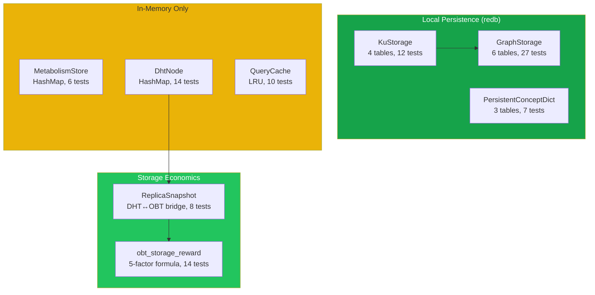
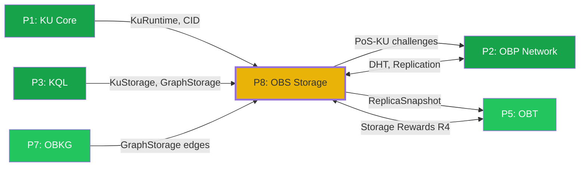

# Pillar 8: OneBrain Storage (OBS) — Phân tích hiện trạng

> **Ngày phân tích**: 06/07/2026
> **Kết luận chính**: Code nền tảng tốt (4,600 LOC, 88 tests, 13 redb tables) nhưng **thiếu nghiên cứu kiến trúc** và **thiếu 4 tầng quan trọng** (distributed storage, media/blob, async I/O, migration).

---

## A. Code đã có — Inventory

### Chi tiết modules

| Module | File | LOC | Tests | Backend | Stores |
|--------|------|-----|-------|---------|--------|
| **KuStorage** | ku-kql/storage.rs | 704 | 12 | redb (4 tables) | KU wire bytes + Epigenetics JSON |
| **GraphStorage** | ku-kql/graph_storage.rs | 1,284 | 27 | redb (6 tables) | Bond edges, 4 secondary indexes |
| **PersistentConceptDict** | ku-core/persistent_concept_dict.rs | 422 | 7 | redb (3 tables) | Concept name↔ID (bilingual) |
| **MetabolismStore** | ku-core/metabolism_store.rs | 283 | 6 | **In-memory** | Per-KU usage tracking (CRDT) |
| **DhtNode** | ku-net/dht.rs | 818 | 14 | **In-memory** | DHT key-value, routing table |
| **QueryCache** | ku-net/query/cache.rs | 351 | 10 | **In-memory** | LRU query result cache |
| **StorageReward** | ku-core/obt_storage_reward.rs | 676 | 14 | — | R4 reward computation |
| **ReplicaSnapshot** | ku-core/obt_integration.rs | 493 | 8 | — | DHT↔OBT bridge |
| **Tổng** | | **~4,600** | **88** | **13 redb tables** | |

### redb Tables (13 total)

| Module | Table | Key | Value | Purpose |
|--------|-------|-----|-------|---------|
| KuStorage | `kus` | CID [32B] | Core DNA bytes | Immutable KU content |
| KuStorage | `epigenetics` | CID [32B] | JSON string | Mutable metadata |
| KuStorage | `index_trust` | trust(u16)+CID | empty | Range query by trust |
| KuStorage | `index_concept` | concept_id(u64)+CID | empty | Lookup by concept |
| GraphStorage | `edges_out` | src+rel+tgt | BondMeta(9B) | Outgoing edges |
| GraphStorage | `edges_in` | tgt+rel+src | empty | Incoming (reverse) |
| GraphStorage | `edges_type` | rel+src+tgt | empty | Filter by relation |
| GraphStorage | `index_state` | state+src+rel+tgt | empty | Active/Weakened/Deprecated |
| GraphStorage | `bond_weight` | weight+src+tgt+rel | empty | Top-K by weight |
| GraphStorage | `edge_time` | ts+src+tgt+rel | empty | Temporal range |
| ConceptDict | `concepts` | name(str) | JSON | Name → entry |
| ConceptDict | `ids` | id(u64) | name(str) | ID → name |
| ConceptDict | `meta` | "next_id" | u64 | Auto-increment |

---

## B. Research/Docs hiện có

| Document | Nội dung | Đánh giá |
|----------|----------|----------|
| `04_STORAGE_REWARD.md` (25KB) | 5-factor formula, PoS-KU, anti-gaming | ✅ Tốt, nhưng chỉ về **economics** |
| `01_storage_reward_research.md` | Filecoin vs Arweave vs Sia so sánh | ✅ Ngắn, đủ context |
| PILLAR_REVIEW P8 section | Lists 3 modules, 4 gaps | ⚠️ Outdated |

> [!CAUTION]
> **Không có tài liệu nghiên cứu nào về kiến trúc storage!** Tất cả research hiện tại chỉ xoay quanh **storage economics** (reward cho node lưu trữ). Thiếu hoàn toàn research về: storage architecture, distributed storage, caching, media/blob, migration, benchmarks.

---

## C. Gap Analysis — 10 chiều

### ✅ Đã có (tốt)

| Chiều | Mức độ | Chi tiết |
|-------|--------|----------|
| **Local Persistence** | 80% | 13 redb tables, ACID, 4+6 indexes |
| **Content Addressing** | 70% | BLAKE3 CID, inherent dedup, PoS-KU integrity |
| **Storage Economics** | 90% | Complete 5-factor formula, 3 challenge types, anti-gaming |
| **Bond Lifecycle** | 85% | Active→Weakened→Deprecated, 4 decay curves |

### ❌ Thiếu (cần research + implement)

| # | Chiều | Mức độ | Gaps chính |
|---|-------|--------|-----------|
| 1 | **Distributed Storage** | 20% | DHT in-memory, no network replication, no persistence on restart |
| 2 | **Media/Blob Storage** | 0% | **Hoàn toàn không có.** KU chỉ 16-172 bytes, không hỗ trợ files/images |
| 3 | **Async I/O** | 0% | Tất cả redb ops blocking. Cần async wrapper cho production |
| 4 | **Schema Migration** | 0% | Không có versioning, không upgrade path Core DNA v6→v7 |
| 5 | **Caching Strategy** | 30% | Chỉ QueryCache (LRU). Thiếu KU content cache, prefetch, hot/cold |
| 6 | **Backup & Recovery** | 20% | redb WAL có sẵn, nhưng không export/import, snapshot, corruption repair |
| 7 | **IPFS Integration** | 0% | Chỉ có comment TODO trong Cargo.toml |
| 8 | **Multi-device Sync** | 0% | Không nghiên cứu |
| 9 | **Performance** | 30% | Bulk insert thiếu, batch ops thiếu, không benchmark tại scale |
| 10 | **Data Lifecycle** | 40% | DHT TTL + MetabolismStore GC có, nhưng KuStorage không có TTL/archival |

---

## D. Research cần làm (đề xuất 6 topics)

### Research 1: Storage Architecture — redb vs alternatives
> redb đang dùng tốt nhưng cần benchmark tại target scale (1M+ KUs, 10M+ edges). So sánh redb vs sled vs RocksDB vs SQLite cho workload OneBrain.

**Câu hỏi cần trả lời:**
- redb handle được bao nhiêu KU trước khi degrade?
- Read/Write throughput tại 1M entries?
- redb vs sled cho concurrent read-heavy workload?
- Disk space overhead (redb lưu WAL → file growth)?

### Research 2: Distributed KU Storage — Replication Strategy
> DHT chỉ là routing + in-memory store. Cần thiết kế actual replication: K replicas, consistency model, repair strategy.

**Câu hỏi cần trả lời:**
- K = mấy replicas? (Kademlia standard K=20 nhưng for storage K thường 3-7)
- Consistency model nào? Eventual consistency với CRDT merge? Quorum reads?
- Khi node offline, ai replicate? Protocol cho proactive replication?
- DHT persistence format? (save routing table + stored KUs to disk on shutdown)

### Research 3: Media/Blob Storage Design
> KU wire format max ~172 bytes. Cần thiết kế separate blob store cho images, PDFs, videos.

**Câu hỏi cần trả lời:**
- Blob có CID riêng hay attach vào KU CID?
- Chunking strategy? Fixed-size (4KB/64KB) hay content-defined (Rabin)?
- Max blob size?
- Blob replication khác KU replication không?
- Streaming/range-request support?

### Research 4: Hot/Cold Tiering & Caching
> MetabolismStore đã có "metabolic_rate" signal. Cần policy: KU nào giữ memory, KU nào chỉ disk, KU nào offload.

**Câu hỏi cần trả lời:**
- Hot tier (memory) capacity = bao nhiêu % total?
- Cold tier trigger: metabolic_rate < threshold? Hoặc age > N days?
- Prefetch strategy cho graph traversal (spreading activation → preload neighbors)?
- Cache invalidation khi Epigenetics update?

### Research 5: Schema Migration & Versioning
> Core DNA v6 có version byte. Nhưng không có migration path.

**Câu hỏi cần trả lời:**
- Khi upgrade v6→v7, re-encode tất cả hay lazy migration?
- Epigenetics JSON có cần schema version?
- GraphStorage bond format có cần versioning?
- Rolling upgrade strategy cho distributed network?

### Research 6: IPFS / Decentralized Storage Integration
> Cargo.toml comment: "will migrate to serde_ipld_dagcbor". Cần quyết định vai trò IPFS.

**Câu hỏi cần trả lời:**
- IPFS cho blob storage only? Hay cả KU content?
- CID format: tiếp tục raw BLAKE3 [32B] hay chuyển sang Multihash/CIDv1?
- Pin strategy? (pin = permanent storage, unpin = GC eligible)
- Arweave cho archival permanent? (write-once, pay-once)

---

## E. Cross-Pillar Dependencies

| Pillar | Direction | Integration |
|--------|-----------|-------------|
| P1 KU Core | P8 ← P1 | KuStorage lưu KuRuntime (wire bytes + epi JSON) |
| P2 OBP | P8 ↔ P2 | DHT routing + ReplicaTracker + MetabolismStore sync |
| P3 KQL | P8 ← P3 | Executor reads từ KuStorage/GraphStorage |
| P5 OBT | P8 → P5 | R4 StorageReward = 5-factor formula |
| P7 OBKG | P8 ← P7 | GraphStorage persists bond edges (6 index tables) |

---

## F. Đề xuất phương án

> [!IMPORTANT]
> **Chiến lược đề xuất**: Research trước, code sau. 6 research topics ở trên nên được analyze kỹ trước khi implement. Ưu tiên theo impact:

| Priority | Topic | Lý do |
|----------|-------|-------|
| 🥇 | **Distributed Storage** | DHT in-memory = mất data khi restart. Critical cho production |
| 🥈 | **Storage Architecture Benchmark** | Cần biết redb limits trước khi scale |
| 🥉 | **Hot/Cold Tiering** | Metabolism signal đã có, chỉ cần policy |
| 4️⃣ | **Schema Migration** | Cần trước khi release v1.0 |
| 5️⃣ | **Media/Blob Storage** | Quan trọng cho UX nhưng không block core |
| 6️⃣ | **IPFS Integration** | Long-term, có thể defer |

Bạn muốn bắt đầu research theo thứ tự nào?
