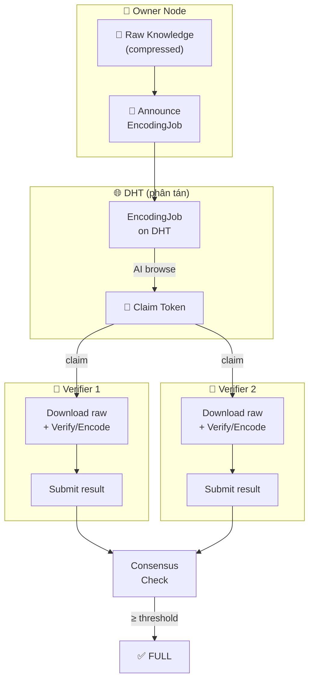
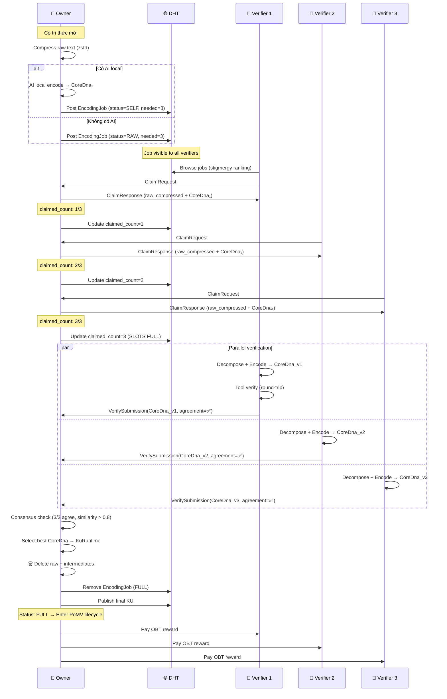
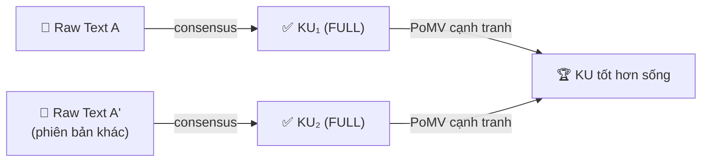

# 🧬 Distributed Encoding Consensus — Thiết Kế Chi Tiết v2

> Cập nhật: Tích hợp các quyết định thiết kế + cơ chế phân phối verify phân tán.

---

## §1 Các Quyết Định Thiết Kế (Đã Xác Nhận)

| # | Quyết định | Chi tiết |
|---|-----------|---------|
| Q1 | **Ngưỡng verify nhỏ, capped** | Dynamic theo network size nhưng có ceiling (e.g., max 5). Encoding chỉ là "đánh chỉ mục đúng", kẻ tấn công không lợi gì khi encode sai → không cần verify nhiều. |
| Q2 | **Verify 2 phần** | **(a)** AI decomposition: phân tách nội dung, xác định gene_type, chọn instructions → **đúng về ngữ nghĩa**. **(b)** Tool encoding: binary serialization chạy đúng → **đúng về kỹ thuật**. |
| Q3 | **Giữ vĩnh viễn** cho đến khi đủ verifiers | Dữ liệu nằm trên máy owner + các AI đã verify, KHÔNG trên toàn mạng. Không auto-delete. |
| Q4 | **Thưởng bằng OBT token** | Proportional to complexity/size của raw knowledge. Sẽ thiết kế ở pillar tokenomics. |
| Q5 | **Không lo data nhạy cảm** | Owner tự nguyện đưa lên. Raw text được nén (zstd) để tiết kiệm storage + bandwidth. |

---

## §2 Bài Toán Cốt Lõi: Phân Phối Verify Phân Tán

> **Vấn đề**: Trong mạng phân tán không có server, làm sao để:
> 1. AI verifiers biết có KU dở dang cần hỗ trợ
> 2. Không quá nhiều AI nhào vào cùng 1 raw (lãng phí)
> 3. KU ít phổ biến vẫn được verify (không bị bỏ quên)

### Giải pháp: Encoding Job Board + Claim Token + Stigmergy



---

## §3 Encoding Job Board (trên DHT)

Mỗi KU dở dang được đăng lên DHT dưới dạng **EncodingJob**:

```rust
/// Đăng trên DHT để AI verifiers tìm thấy
pub struct EncodingJob {
    /// BLAKE3 hash of compressed raw text — dùng làm DHT key
    pub raw_hash: [u8; 32],
    
    /// Owner node ID
    pub owner_node: u64,
    
    /// Current encoding status
    pub status: EncodingStatus,         // Raw | Self | Part
    
    /// Số verifiers đã claim
    pub claimed_count: u8,
    
    /// Số verifiers cần (dynamic, capped)
    pub needed_count: u8,               // e.g., 3
    
    /// Estimated complexity (ảnh hưởng reward)
    pub raw_size_bytes: u32,
    
    /// Reward offered (OBT)
    pub reward_per_verifier: u64,
    
    /// Timestamp đăng
    pub posted_at: u64,
    
    /// Có bản SELF encode chưa (để verifier so sánh)
    pub has_self_encoding: bool,
    
    /// Time spent by AI to produce encoding (ms)
    pub encoding_time_ms: u64,
}
```

### DHT Key Design

```
key = BLAKE3("encoding-job:" || raw_hash)
```

AI verifiers chỉ cần browse DHT theo prefix `encoding-job:*` để tìm việc.

---

## §4 Claim Token — Chống Stampede

> **Vấn đề**: 20 AI cùng thấy 1 job, cùng download raw, cùng encode → 17 bản thừa.
>
> **Giải pháp**: Claim Token mechanism (probabilistic, không cần lock server).

### Cách hoạt động:

```rust
/// AI muốn verify → gửi claim request
pub struct ClaimRequest {
    pub raw_hash: [u8; 32],
    pub verifier_node: u64,
    pub claim_nonce: u64,        // Random nonce
    pub timestamp: u64,
}

/// Owner trả lời
pub enum ClaimResponse {
    Accepted {
        raw_text_compressed: Vec<u8>,   // Gửi raw text (nén zstd)
        self_encoding: Option<CoreDna>, // Bản SELF nếu có
        claim_token: [u8; 32],          // Token xác nhận quyền verify
    },
    Rejected {
        reason: ClaimRejectReason,
    },
}

pub enum ClaimRejectReason {
    AlreadyFull,       // Đã đủ verifiers
    SlotsFull,         // Đã đủ claims (chưa submit)
    TooSoon,           // Claim quá gần claim trước (rate limit)
}
```

### Luồng:

```
1. AI thấy EncodingJob trên DHT (claimed_count < needed_count)
2. AI gửi ClaimRequest đến owner node
3. Owner kiểm tra:
   - Còn slot? (claimed_count < needed_count + buffer)
   - Node này đã claim chưa? (deduplicate)
   - Rate limit OK?
4. Nếu OK → gửi raw text + claim_token
5. AI verify/encode → submit kết quả kèm claim_token
6. Owner cập nhật DHT: claimed_count++
```

### Anti-Stampede Features:

| Cơ chế | Mục đích |
|--------|---------|
| **`needed_count` trên DHT** | AI thấy job đã đủ người → bỏ qua |
| **Claim trước khi download** | Không download raw rồi mới biết đã có người |
| **Owner là gatekeeper** | Owner quyết định accept/reject claim |
| **Nonce dedup** | Tránh replay attack |
| **Buffer slots** | `needed_count + 1` slots cho trường hợp AI claim nhưng không submit |

---

## §5 Verification 2 Pha

### Phase A: AI Decomposition Verification

AI verifier nhận raw text (nén) → giải nén → tự encode bằng AI local → so sánh với bản SELF (nếu có):

```rust
pub struct DecompositionResult {
    /// AI này chọn gene_type gì
    pub gene_type: u8,
    
    /// Danh sách instructions AI này tạo ra
    pub instructions: Vec<Instruction>,
    
    /// Concept IDs đã dùng
    pub concept_ids: Vec<ConceptId>,
    
    /// Confidence score (AI tự đánh giá)
    pub confidence: f32,
}
```

**So sánh ngữ nghĩa:**

```rust
fn decomposition_agreement(a: &DecompositionResult, b: &DecompositionResult) -> f32 {
    let mut score = 0.0;
    
    // 1. Gene type match (weight: 0.3)
    if a.gene_type == b.gene_type { score += 0.3; }
    
    // 2. Instruction type overlap (weight: 0.3)
    //    Cùng số opcodes? Cùng loại opcodes?
    let opcode_overlap = jaccard_similarity(
        &a.instructions.iter().map(|i| i.opcode()).collect(),
        &b.instructions.iter().map(|i| i.opcode()).collect(),
    );
    score += 0.3 * opcode_overlap;
    
    // 3. Concept ID overlap (weight: 0.4)
    //    Cùng nhận diện các concepts?
    let concept_overlap = jaccard_similarity(&a.concept_ids, &b.concept_ids);
    score += 0.4 * concept_overlap;
    
    score
}
```

### Phase B: Tool Encoding Verification

Sau khi đồng ý về decomposition → chạy tool encode → verify binary output:

```rust
fn tool_encoding_check(dna: &CoreDna) -> ToolVerifyResult {
    // 1. Encode thành binary
    let bytes = encode_core_dna(dna)?;
    
    // 2. Decode lại
    let decoded = decode_core_dna(&bytes)?;
    
    // 3. Round-trip check: decoded == original?
    assert_eq!(dna, &decoded);  // Must be bit-identical
    
    // 4. CRC check
    // 5. CID computation check
    
    ToolVerifyResult::Pass
}
```

> Phase B gần như luôn pass (tool là deterministic). Nếu fail → tool bị tamper → cảnh báo network.

---

## §6 Stigmergy — Cân Bằng Tải Tự Nhiên

Vấn đề: Một số jobs hấp dẫn (reward cao, size nhỏ) → nhiều AI muốn làm. Jobs khó (size lớn, reward thấp) → không ai làm.

**Giải pháp**: Dùng stigmergy (đã có trong OBP) — "pheromone" signals:

```rust
/// Pheromone signal trên DHT cho mỗi job
pub struct JobPheromone {
    pub raw_hash: [u8; 32],
    pub activity_level: f32,     // Cao = nhiều AI đang làm → tránh
    pub waiting_time: u64,       // Lâu = ít AI quan tâm → ưu tiên
    pub estimated_reward: u64,   // OBT reward
}
```

### AI Verifier Decision Logic:

```rust
fn should_claim(job: &EncodingJob, pheromone: &JobPheromone) -> f32 {
    let mut attractiveness = 0.0;
    
    // Jobs chờ lâu → hấp dẫn hơn (giúp KU không bị bỏ quên)
    attractiveness += (pheromone.waiting_time as f32 / 3600.0).min(10.0);
    
    // Jobs ít AI đang làm → hấp dẫn hơn
    attractiveness += (job.needed_count - job.claimed_count) as f32 * 2.0;
    
    // Reward cao → hấp dẫn hơn
    attractiveness += (pheromone.estimated_reward as f32).ln();
    
    // Jobs quá nhiều AI đang làm → kém hấp dẫn
    attractiveness -= pheromone.activity_level * 5.0;
    
    attractiveness
}
```

**Kết quả**: Jobs cũ + ít người làm tự động hấp dẫn hơn → cân bằng tải tự nhiên mà không cần coordinator.

---

## §7 Verify Threshold — Dynamic nhưng Capped

```rust
pub fn compute_needed_verifiers(network_size: usize) -> u8 {
    match network_size {
        0..=5     => 1,   // Mạng quá nhỏ → 1 verifier đủ
        6..=20    => 2,   // Mạng nhỏ → 2 verifiers
        21..=100  => 3,   // Mạng trung bình → 3 verifiers
        _         => 3,   // Mạng lớn → VẪN CHỈ 3 (capped)
    }
    // Lý do cap tại 3: encoding chỉ là "đánh chỉ mục",
    // kẻ tấn công không lợi gì khi encode sai.
    // 3 AI independent đã đủ cross-verify.
}
```

> [!TIP]
> Cap tại 3 vì: (1) encoding sai không gây hại — PoMV sẽ đánh giá tri thức sau, (2) kẻ tấn công tốn 3 AI fake để bypass nhưng chẳng được gì, (3) giảm overhead cho network lớn.

---

## §8 Data Flow Hoàn Chỉnh



---

## §9 Reward Model (OBT Token)

```rust
pub struct EncodingReward {
    /// Base reward per verification (tỷ lệ với raw size)
    pub base_reward: u64,
    
    /// Bonus nếu bản encode của verifier được chọn làm final
    pub selection_bonus: u64,
    
    /// Bonus cho AI encode đầu tiên (SELF)
    pub first_encoder_bonus: u64,
    
    /// Bonus cho AI giúp encode RAW (pro-bono cho người không có AI)
    pub pro_bono_bonus: u64,
}

pub fn calculate_reward(raw_size: u32, role: VerifierRole) -> u64 {
    // Base: 1 OBT per 1KB raw text (đơn giản hóa)
    let base = (raw_size / 1024).max(1) as u64;
    
    match role {
        VerifierRole::FirstEncoder  => base * 2 + FIRST_ENCODER_BONUS,
        VerifierRole::Verifier      => base,
        VerifierRole::Corrector     => base * 3,  // Phát hiện lỗi → thưởng cao
        VerifierRole::ProBono       => base * 2 + PRO_BONO_BONUS,
        VerifierRole::Contributor   => 0,  // Contributor được thưởng bởi PoMV sau
    }
}
```

> [!IMPORTANT]
> OBT tokenomics chi tiết sẽ thiết kế ở pillar riêng. Ở đây chỉ xác nhận: verify task lớn hơn → reward lớn hơn.

### OBT Quality Gates

Before an encoding reward is eligible for OBT minting, the KU must pass 4 quality gates
(see `obt_anti_gaming.rs`):

1. **Gate 1 — Minimum Size**: `wire_bytes >= 256` AND `instruction_count >= 2`
2. **Gate 2 — Encoding Consensus**: `verifier_count >= 3` AND `is_duplicate == false`
3. **Gate 3 — PoMV Score**: `pomv_score >= threshold` (grace period for new KUs)
4. **Gate 4 — Complexity**: `encoding_time_ms >= 100` AND `bond_count >= 1`

The integration layer (`obt_integration.rs`) orchestrates these gates via `run_quality_gates()`.

See also:
- `docs/specs/obt/05_ANTI_GAMING.md` for detailed gate specifications
- `docs/specs/obt/03_MINTING.md` for reward formulas

---

## §10 Tổng Hợp — Tại Sao Thiết Kế Này Hoạt Động

| Yêu cầu | Giải pháp | Cơ chế |
|---------|----------|--------|
| AI biết có KU cần verify | **EncodingJob trên DHT** | DHT browse + gossip |
| Không quá nhiều AI cùng 1 job | **Claim Token + DHT counter** | Owner gatekeeper + claimed_count visible |
| KU ít phổ biến không bị bỏ quên | **Stigmergy** (waiting_time → attractiveness) | Jobs chờ lâu tự động hấp dẫn hơn |
| Không cần server điều phối | **DHT + Owner-as-coordinator** | Owner chỉ quản lý job CỦA MÌNH |
| Verify đúng | **2-phase** (decomposition + tool) | AI agreement + round-trip check |
| Threshold hợp lý | **Dynamic capped tại 3** | Không lãng phí cho mạng lớn |
| Reward công bằng | **OBT tỷ lệ với size + role** | Verify task lớn → reward lớn |
| Storage tối ưu | **zstd compression + cleanup khi FULL** | Nén raw, xóa khi xong |
| Không lo data nhạy cảm | **Owner tự nguyện** | Không cần encrypt |

---

## §11 Module Map (Mới)

| Module | Crate | Chức năng |
|--------|-------|-----------|
| `encoding_consensus.rs` | ku-core | EncodingStatus, EncodingSubmission, EncodingConsensus, ConsensusConfig |
| `encoding_verifier.rs` | ku-core | DecompositionResult, decomposition_agreement(), tool_encoding_check() |
| `encoding_reward.rs` | ku-core | EncodingReward, calculate_reward() |
| `encoding_job.rs` | ku-net | EncodingJob, ClaimRequest, ClaimResponse trên DHT |
| `encoding_gossip.rs` | ku-net | Job announcement, claim protocol, submission protocol |
| `encoding_stigmergy.rs` | ku-net | JobPheromone, should_claim() attractiveness scoring |

---

## §12 Consensus Selection — Weighted Multi-Factor Scoring (Đã Xác Nhận)

Khi nhiều AI submit bản encode khác nhau nhưng đều "đúng" (similarity > 0.8), chọn bản **tổng điểm cao nhất** từ 3 yếu tố:

```rust
pub struct SelectionScore {
    /// Bao nhiêu AI khác đồng ý với bản encode này (Jaccard similarity > 0.8)
    pub agreement_score: f32,      // Weight: 0.50
    
    /// Bản encode chi tiết hơn (nhiều instructions = capture nhiều tri thức hơn)
    pub detail_score: f32,         // Weight: 0.30
    
    /// Uy tín AI đã encode (track record qua các lần verify trước)
    pub reputation_score: f32,     // Weight: 0.20
}

pub fn compute_selection_score(submission: &EncodingSubmission, ctx: &ConsensusContext) -> f32 {
    const W_AGREEMENT: f32  = 0.50;
    const W_DETAIL: f32     = 0.30;
    const W_REPUTATION: f32 = 0.20;
    
    // Factor 1: Agreement — bao nhiêu bản khác đồng ý với bản này?
    let agreement = ctx.count_agreements(submission) as f32 
                    / ctx.total_submissions as f32;
    
    // Factor 2: Detail richness — nhiều instructions + nhiều concepts = chi tiết hơn
    let max_instructions = ctx.max_instruction_count() as f32;
    let detail = if max_instructions > 0.0 {
        submission.core_dna.instructions.len() as f32 / max_instructions
    } else { 0.0 };
    
    // Factor 3: AI reputation — tỷ lệ verify đúng trong quá khứ
    let reputation = ctx.node_reputation(submission.encoder_node_id);
    
    W_AGREEMENT * agreement + W_DETAIL * detail + W_REPUTATION * reputation
}
```

**Ví dụ thực tế:**

| Bản | Agreement (×0.50) | Detail (×0.30) | Reputation (×0.20) | **Tổng** |
|-----|-------------------|----------------|--------------------|---------:|
| CoreDna₁ (AI_A) | 2/3 = 0.33 | 5/7 inst = 0.21 | 0.9 × 0.20 = 0.18 | **0.72** |
| CoreDna₂ (AI_B) | 3/3 = 0.50 | 7/7 inst = 0.30 | 0.8 × 0.20 = 0.16 | **0.96** ✅ |
| CoreDna₃ (AI_C) | 2/3 = 0.33 | 6/7 inst = 0.26 | 0.7 × 0.20 = 0.14 | **0.73** |

→ **CoreDna₂ thắng** (nhiều AI đồng ý nhất + chi tiết nhất).

---

## §13 FULL = Immutable (Đã Xác Nhận)

> [!IMPORTANT]
> **FULL là trạng thái cuối cùng, không cho phép re-encode.**

| Quy tắc | Lý do |
|---------|-------|
| FULL → immutable (giống CoreDna) | Nhiều AI đã đồng thuận, CID đã cố định, PoMV đã bắt đầu track |
| Muốn encode khác → submit raw text mới → **KU mới** (CID mới) | Giữ tính nhất quán: 1 raw text + consensus = 1 KU duy nhất |
| KU mới cạnh tranh với KU cũ qua PoMV | Tri thức tốt hơn tự nhiên thay thế tri thức kém → đúng triết lý OneBrain |



---

## ✅ Tất Cả Quyết Định Thiết Kế Đã Hoàn Tất

| # | Câu hỏi | Quyết định |
|---|---------|-----------|
| Q1 | Ngưỡng verify | Dynamic theo network size, **capped tại 3** |
| Q2 | Verify đúng là gì | **2 pha**: AI decomposition (ngữ nghĩa) + tool encoding (binary round-trip) |
| Q3 | Timeout policy | **Không timeout** — giữ đến khi đủ verifiers (trên máy owner) |
| Q4 | Reward source | **OBT token**, tỷ lệ với raw size + role |
| Q5 | Data nhạy cảm | **Không lo** — owner tự nguyện. Nén zstd. |
| Q6 | Chọn bản encode nào | **Weighted scoring**: agreement (50%) + detail (30%) + reputation (20%) |
| Q7 | Re-encode sau FULL | **Không** — FULL = immutable. Raw khác = KU mới. |
