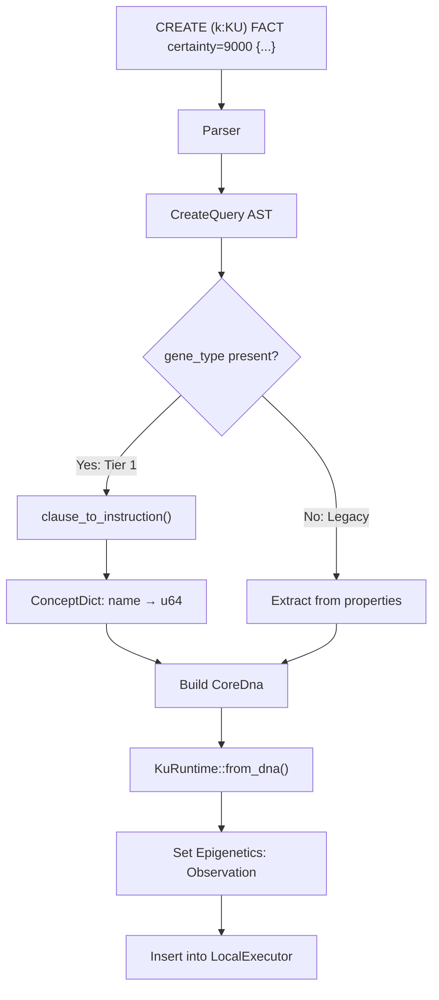
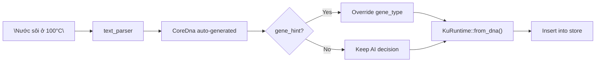
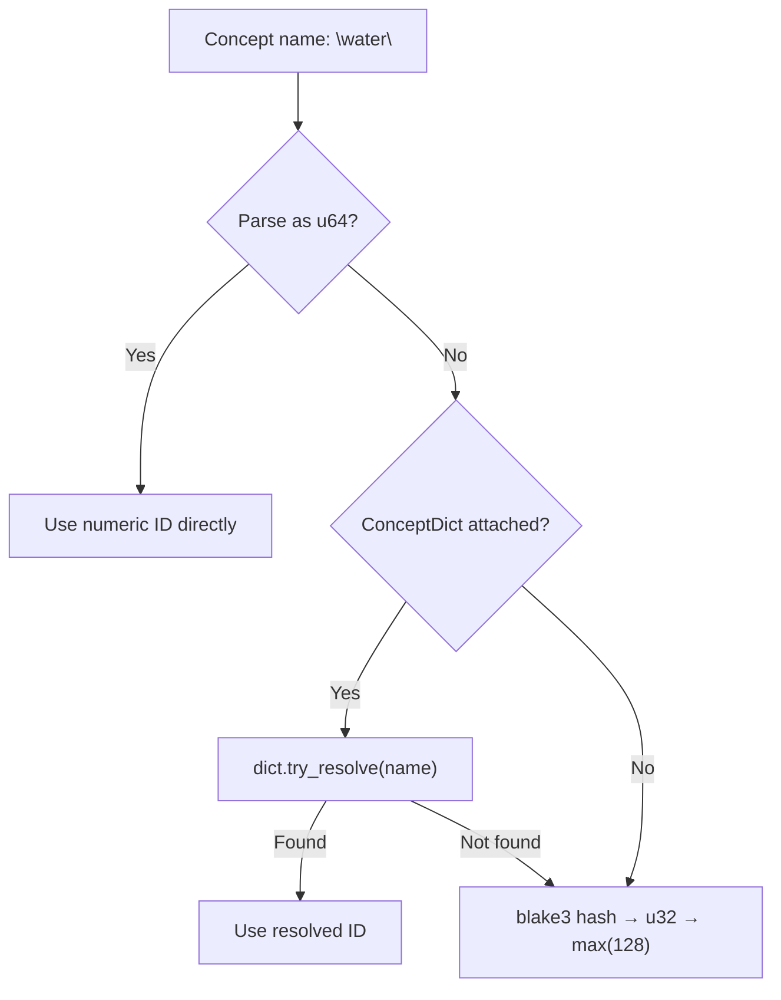

# KQL — Knowledge Query Language Specification

> **Version**: 3.0 — KU v6 Core DNA  
> **Crate**: `ku-kql` v0.1.0  
> **Cập nhật**: 2026-06-30  
> **Depends on**: `ku-core` (KuRuntime, CoreDna, ConceptDict, text\_parser)

---

## §1 Overview

### 1.1 KQL là gì?

**KQL** (Knowledge Query Language) là ngôn ngữ truy vấn kiểu SQL dành cho hệ thống tri thức OneBrain. KQL cho phép:

- **Tìm kiếm** tri thức (`FIND`) với graph pattern matching
- **Tạo mới** tri thức (`CREATE`) — cả cú pháp có cấu trúc lẫn AI-assisted
- **Cập nhật** metadata (`UPDATE`) — chỉ Epigenetics layer (CoreDna bất biến)
- **Đánh dấu lỗi thời** (`DEPRECATE`) — hạ trust\_score, chuyển trạng thái Rumor
- **Theo dõi realtime** (`WATCH`) — standing queries kích hoạt khi có sự kiện
- **Phân tích query plan** (`EXPLAIN`) — chiến lược thực thi và indexes

### 1.2 Kiến trúc 3 lớp — KuRuntime

KQL hoạt động trên **KuRuntime** — cấu trúc composite 3 lớp của kiến trúc v6:

```
┌─────────────────────────────────────────┐
│              KuRuntime                  │
├─────────────────────────────────────────┤
│  Layer 1: CoreDna        (bất biến)     │  ← Gene type + Instructions
│  Layer 2: Epigenetics    (biến đổi)     │  ← Trust, epistemic status
│  Layer 3: Membrane       (runtime)      │  ← Network, routing
└─────────────────────────────────────────┘
```

> [!IMPORTANT]
> **CoreDna là bất biến.** Mọi mutation (UPDATE, DEPRECATE) chỉ tác động lên Epigenetics layer. Đây là nguyên tắc thiết kế cốt lõi.

### 1.3 Parser

- **Engine**: [nom](https://docs.rs/nom) v7 — parser combinator
- **Case-insensitive** keywords: `FIND`, `find`, `Find` đều hợp lệ (dùng `tag_no_case`)
- **Entry point**: `parse_query(input: &str) -> Result<Query, ParseError>`

### 1.4 Crate Dependencies

| Dependency | Mục đích |
|---|---|
| `ku-core` | KuRuntime, CoreDna, ConceptDict, text\_parser |
| `nom` 7 | Parser combinator |
| `blake3` 1 | Hash concept names → IDs |
| `serde` + `serde_json` | Serialization |
| `redb` 2 *(optional, feature `storage`)* | Persistent ACID storage |

### 1.5 Module Structure

```
ku-kql/src/
├── lib.rs          // Module declarations
├── ast.rs          // Query AST types (§3)
├── parser.rs       // nom-based parser
├── executor.rs     // LocalExecutor (§4)
├── storage.rs      // redb storage (behind 'storage' feature)
└── graph_storage.rs // redb-backed graph edge persistence, adjacency queries
```

---

## §2 Syntax Reference

### §2.1 FIND — Tìm kiếm tri thức

#### Cú pháp

```
FIND (k:KU)
  [WHERE <condition>]
  [SCOPE <scope>]
  [RETURN <expr>, ...]
  [ORDER BY <field> [ASC|DESC], ...]
  [LIMIT <n>]
```

#### Ví dụ

```sql
-- Tìm tất cả KU có trust_score > 8000
FIND (k:KU) WHERE k.trust_score > 8000 LIMIT 10

-- Tìm KU theo concept, sắp xếp giảm dần
FIND (k:KU) WHERE k.gene_type = 0 ORDER BY k.trust_score DESC

-- Tổng hợp: đếm và tính trung bình
FIND (k:KU) WHERE k.certainty > 5000
  RETURN COUNT(k.trust_score), AVG(k.certainty)

-- Kết hợp điều kiện AND / OR / NOT
FIND (k:KU) WHERE k.trust_score > 5000 AND NOT k.gene_type = 7

-- Lọc theo encoding status (Encoding Consensus)
FIND (k:KU) WHERE k.encoding_status = "Full" RETURN k.gene_type, k.trust_score

-- Tìm KU đang chờ verification
FIND (k:KU) WHERE k.encoding_status = "Part" RETURN k.cid, k.encoding_status

-- Loại trừ KU chưa encode (raw text)
FIND (k:KU) WHERE k.encoding_status != "Raw" AND k.gene_type = "Definition"
  RETURN k.text LIMIT 10
```

#### Conditions — Mệnh đề WHERE

| Loại | Cú pháp | Ví dụ |
|---|---|---|
| So sánh | `field op value` | `k.trust_score > 8000` |
| AND | `cond AND cond` | `k.certainty > 5000 AND k.gene_type = 0` |
| OR | `cond OR cond` | `k.gene_type = 0 OR k.gene_type = 5` |
| NOT | `NOT cond` | `NOT k.gene_type = 7` |
| EXISTS | `EXISTS(field)` | `EXISTS(k.certainty)` |
| CONTAINS | `value IN field` | `301 IN k.concept_ids` |

**Comparison operators**:

| Operator | Ký hiệu | Rust enum |
|---|---|---|
| Bằng | `=` | `CompOp::Eq` |
| Không bằng | `!=` | `CompOp::NotEq` |
| Lớn hơn | `>` | `CompOp::Gt` |
| Lớn hơn hoặc bằng | `>=` | `CompOp::GtEq` |
| Nhỏ hơn | `<` | `CompOp::Lt` |
| Nhỏ hơn hoặc bằng | `<=` | `CompOp::LtEq` |

#### Scope — Phạm vi truy vấn

| Scope | Chiến lược (EXPLAIN) | Mô tả |
|---|---|---|
| `LOCAL` | `local_scan` | Chỉ node hiện tại |
| `NEIGHBORS` | `neighbor_broadcast` | Broadcast tới neighbors |
| `CLUSTER` | `super_peer_route` | Route qua super peer |
| `DHT` | `kademlia_lookup` | Kademlia DHT lookup |
| `SEMANTIC` | `semantic_similarity_search` | Tìm kiếm semantic |
| `GLOBAL` | `global_flood` | Flood toàn mạng |
| `AUTO` *(default)* | `auto_escalation` | Tự động leo thang scope |

#### RETURN — Kết quả trả về

| Kiểu | Cú pháp | Ví dụ |
|---|---|---|
| Alias | `k` | Trả toàn bộ KuRuntime |
| Field | `k.trust_score` | Trả giá trị field cụ thể |
| Aggregate | `FUNC(k.field) [AS alias]` | `COUNT(k.trust_score) AS cnt` |

**Aggregation functions**: `COUNT`, `SUM`, `AVG`, `MIN`, `MAX`

#### Extractable Fields

Các field trích xuất được từ `KuRuntime::extract_field()` — tổng cộng **28 fields**:

**Core DNA Fields** (instruction scan):

| Field | Kiểu | Mô tả |
|---|---|---|
| `gene_type` | `Text` | Tên gene type (Fact, Hypothesis, Experience, Procedure, Rule, Definition, Relation, Meta, Creative, Belief, FormalProof) |
| `primary_concept` | `Integer` | Primary concept ID |
| `certainty` | `Integer` | Certainty score (cast từ u16) |
| `difficulty` | `Integer` | Difficulty score (cast từ u16) |
| `instruction_count` | `Integer` | Số instructions trong CoreDna |
| `has_triple` | `Bool` | Có TripleRelation gene hay không |
| `has_step` | `Bool` | Có Step gene hay không |
| `wire_size` | `Integer` | Wire format size (bytes) |

**Epigenetics Fields** (direct access):

| Field | Kiểu | Mô tả |
|---|---|---|
| `trust_score` | `Integer` | Composite trust score (u16 → i64) |
| `confidence` | `Integer` | Confidence level (u16 → i64) |
| `verification_level` | `Integer` | Verification level 0-4 (u8 → i64) |
| `corroboration_count` | `Integer` | Số lần corroboration (u16 → i64) |
| `challenge_count` | `Integer` | Số lần challenge (u16 → i64) |
| `error_susceptibility` | `Integer` | Error susceptibility score (u16 → i64) |
| `bond_count` | `Integer` | Số epistemic bonds |
| `epistemic_status` | `Text` | Trạng thái nhận thức (Rumor, Hearsay, Testimony, Observation, Hypothesis, Evidence, Corroborated, PeerReviewed, Consensus, FormallyProven, Axiomatic) |
| `evidence_type` | `Integer` | Evidence type (u8 → i64) |

**PoMV Signal Fields**:

| Field | Kiểu | Mô tả |
|---|---|---|
| `metabolic_rate` | `Integer` | PoMV metabolic rate (u16 → i64) |
| `prediction_score` | `Integer` | Prediction accuracy score (u16 → i64) |
| `entropy_at_creation` | `Integer` | Information entropy at creation (u16 → i64) |
| `survival_score` | `Integer` | Evolutionary survival score (u16 → i64) |
| `synaptic_centrality` | `Integer` | Network centrality (u16 → i64) |
| `niche_fitness` | `Integer` | Ecological niche fitness (u16 → i64) |

**Expression Fields**:

| Field | Kiểu | Mô tả |
|---|---|---|
| `text` | `Text` | Text expression content |

**System Fields**:

| Field | Kiểu | Mô tả |
|---|---|---|
| `epi` | `Bool` | Epigenetics data tồn tại (always true trong v6) |
| `expression` | `Bool` | Expression data tồn tại |
| `encoding_status` | `Text` | Encoding status (Raw/Self/Part/Full) |
| `cid` | `Text` | Content identifier (hex string) |

---

### §2.2 CREATE — Tier 1 Structured (Offline)

#### Cú pháp

```
CREATE (k:KU) <GENE_TYPE> [certainty=<0-10000>] {
  <INSTRUCTION_CLAUSE>
  ...
}
[SIGNED BY "<signer>"]
```

#### Ví dụ đầy đủ

```sql
-- Tạo một FACT: nước sôi ở 100°C
CREATE (k:KU) FACT certainty=9000 {
  TRIPLE(water, boils_at, 100_celsius)
  QUANTITY(temperature, 100, celsius)
}
SIGNED BY "scientist_01"

-- Tạo PROCEDURE: quy trình pha cà phê
CREATE (k:KU) PROCEDURE certainty=8000 {
  STEP(1, grind, coffee_beans)
  STEP(2, boil, water)
  STEP(3, pour, filter)
  PRECOND(coffee_beans)
  PRECOND(water)
  EFFECT(coffee)
}
SIGNED BY "barista"

-- Tạo HYPOTHESIS với constraint
CREATE (k:KU) HYPOTHESIS certainty=4000 {
  CAUSAL(gravity, orbital_motion)
  CONSTRAINT(mass, GT, threshold)
  TOLERANCE(speed, 299792458, 0.001)
  RANGE(temperature, 2.7, 1e8)
}
```

#### Gene Types — Loại tri thức

| Keyword | `to_u8()` | Mô tả |
|---|---|---|
| `FACT` | 0 | Sự thật đã được xác minh |
| `HYPOTHESIS` | 1 | Giả thuyết chưa chứng minh |
| `EXPERIENCE` | 2 | Kinh nghiệm thực tế |
| `PROCEDURE` | 3 | Quy trình, hướng dẫn |
| `RULE` | 4 | Quy tắc, luật |
| `DEFINITION` | 5 | Định nghĩa |
| `RELATION` | 6 | Quan hệ giữa các khái niệm |
| `META` | 7 | Metadata về tri thức khác |
| `CREATIVE` | 8 | Sáng tạo, tường thuật |
| `BELIEF` | 9 | Niềm tin, quan điểm |
| `FORMALPROOF` | 10 | Chứng minh hình thức |

#### Instruction Clauses — Chỉ thị cấu trúc

Mỗi clause được chuyển đổi thành `CoreDna::Instruction` tại thời điểm thực thi. Concept names được phân giải qua `ConceptDict`.

| Clause | Tham số | Ví dụ | AST Variant |
|---|---|---|---|
| `TRIPLE(s, p, o)` | 3 concepts | `TRIPLE(water, boils_at, 100c)` | `CreateClause::Triple` |
| `QUALITY(s, q)` | 2 concepts | `QUALITY(gold, shiny)` | `CreateClause::Quality` |
| `QUANTITY(s, val, unit)` | concept, f64, concept | `QUANTITY(temp, 100, celsius)` | `CreateClause::Quantity` |
| `STEP(ord, action, target)` | u8, 2 concepts | `STEP(1, grind, beans)` | `CreateClause::Step` |
| `PRECOND(concept)` | 1 concept | `PRECOND(water)` | `CreateClause::Precond` |
| `EFFECT(concept)` | 1 concept | `EFFECT(coffee)` | `CreateClause::Effect` |
| `PARTOF(part, whole)` | 2 concepts | `PARTOF(wheel, car)` | `CreateClause::PartOf` |
| `LOCATED(s, location)` | 2 concepts | `LOCATED(eiffel, paris)` | `CreateClause::Located` |
| `TEMPORAL(s, time)` | 2 concepts | `TEMPORAL(event, 2024)` | `CreateClause::Temporal` |
| `CAUSAL(cause, effect)` | 2 concepts | `CAUSAL(heat, expansion)` | `CreateClause::Causal` |
| `CERTAINTY(level)` | u16 | `CERTAINTY(9500)` | `CreateClause::Certainty` |
| `TOLERANCE(s, val, delta)` | concept, 2× f64 | `TOLERANCE(speed, 300, 0.1)` | `CreateClause::Tolerance` |
| `RANGE(s, min, max)` | concept, 2× f64 | `RANGE(temp, -40, 60)` | `CreateClause::Range` |
| `CONSTRAINT(src, op, tgt)` | 2 concepts, operator | `CONSTRAINT(mass, GT, 10)` | `CreateClause::Constraint` |

**Constraint operators**: `eq`/`=`, `ne`/`!=`, `lt`/`<`, `le`/`<=`, `gt`/`>`, `ge`/`>=` *(case-insensitive)*

#### Execution Flow — Luồng thực thi



> [!NOTE]
> **Encoding Consensus**: Khi CREATE thực thi thành công, KU mới được tạo với `encoding_status = SELF` — nghĩa là đã được encode cục bộ bởi node tạo ra, nhưng chưa được xác minh bởi mạng lưới. Quá trình chuyển từ SELF → PART → FULL diễn ra thông qua Encoding Consensus Protocol (xem OBP_SPEC §4.5).

---

### §2.3 CREATE FROM TEXT — Tier 2 AI-Assisted

#### Cú pháp

```
CREATE FROM TEXT "<natural_language_text>"
  WITH AI model="<model_name>"
  [gene_hint="<gene_type>"]
  [SIGNED BY "<signer>"]
```

#### Ví dụ

```sql
-- Tiếng Việt
CREATE FROM TEXT "Nước sôi ở 100 độ C ở áp suất tiêu chuẩn"
  WITH AI model="gemma4"

-- Tiếng Anh với gene_hint override
CREATE FROM TEXT "Water boils at 100°C at standard pressure"
  WITH AI model="qwen" gene_hint="fact"
  SIGNED BY "researcher"

-- Procedure inference
CREATE FROM TEXT "First grind the beans, then add hot water, wait 4 minutes"
  WITH AI model="phi-3" gene_hint="procedure"
```

#### Hoạt động

1. Parser tạo `CreateFromTextQuery` AST node
2. Executor gọi `ku_core::text_parser::parse_text_to_core_dna(&text, &dict)`
3. AI model phân tích text → tạo `CoreDna` với instructions tự động
4. Nếu có `gene_hint`, override `dna.header.gene_type`
5. `KuRuntime::from_dna(dna)` → insert vào store



> [!NOTE]
> `gene_hint` là tùy chọn. Nếu AI đã xác định đúng gene\_type, bạn không cần override. Dùng khi muốn ép buộc phân loại cụ thể.

> [!NOTE]
> **Encoding Consensus**: Tương tự CREATE (§2.2), KU tạo qua CREATE FROM TEXT cũng bắt đầu với `encoding_status = SELF`. AI model thực hiện encoding cục bộ (Phase A), sau đó mạng lưới xác minh qua Encoding Consensus Protocol để nâng lên PART và FULL.

#### Supported Models

| Model | Ghi chú |
|---|---|
| `gemma4` | Google Gemma — local inference |
| `qwen` | Qwen — local inference |
| `phi-3` | Microsoft Phi-3 — local inference |

---

### §2.4 CREATE — Legacy Property-Bag

#### Cú pháp

```
CREATE (k:KU {<key>: <value>, ...}) [SIGNED BY "<signer>"]
```

#### Ví dụ

```sql
CREATE (k:KU {
  gene_type: "Fact",
  certainty: 9000,
  concept_id: 301
}) SIGNED BY "admin"
```

#### Hành vi

Khi `gene_type` field **không** có trong AST (không dùng cú pháp Tier 1), executor:

1. Trích `gene_type` từ properties → map string → `u8`
2. Trích `certainty` từ properties (default: `5000`)
3. Trích `concept_id` hoặc `primary_concept` (default: `1`)
4. Tạo minimal `CoreDna` với 1 Triple + 1 Certainty instruction

> [!TIP]
> Ưu tiên dùng Tier 1 structured syntax (§2.2) cho tri thức mới. Legacy property-bag chỉ nên dùng khi migrate data cũ.

---

### §2.5 UPDATE — Cập nhật Epigenetics

#### Cú pháp

```
UPDATE (k:KU) WHERE <condition> SET <field> = <value>, ... [SIGNED BY "<signer>"]
```

#### Ví dụ

```sql
-- Tăng trust_score
UPDATE (k:KU) WHERE k.gene_type = 0
  SET k.trust_score = 9500

-- Thay đổi epistemic status
UPDATE (k:KU) WHERE k.certainty > 8000
  SET k.epistemic_status = "Corroborated"

-- Cập nhật evidence_type
UPDATE (k:KU) WHERE k.trust_score > 7000
  SET k.evidence_type = "Experimental"
```

#### Updatable Fields — Chỉ Epigenetics Layer

| Field | Kiểu giá trị | Mô tả |
|---|---|---|
| `trust_score` | Integer (u16) | Điểm tin cậy |
| `confidence` | Integer (u16) | Độ tự tin |
| `verification_level` | Integer (u8) | Mức xác minh |
| `corroboration_count` | Integer (u16) | Số lần xác nhận |
| `challenge_count` | Integer (u16) | Số lần phản bác |
| `metabolic_rate` | Integer (u16) | Tốc độ trao đổi chất |
| `epistemic_status` | Text | Trạng thái nhận thức |
| `evidence_type` | Text | Loại chứng cứ |

**Epistemic Status values**: `Rumor`, `Hearsay`, `Observation`, `Hypothesis`, `Evidence`, `Corroborated`, `PeerReviewed`, `Consensus`, `FormallyProven`, `Axiomatic`

**Evidence Type values**: `Anecdotal`, `CaseStudy`, `Observational`, `Correlational`, `Experimental`, `MetaAnalysis`, `FormalProof`, `Computational`

> [!WARNING]
> CoreDna fields (`gene_type`, `certainty`, instructions) **KHÔNG THỂ UPDATE**. Gán vào CoreDna field sẽ bị bỏ qua im lặng (silently ignored). Đây là do nguyên tắc bất biến của Core DNA.

---

### §2.6 DEPRECATE — Đánh dấu lỗi thời

#### Cú pháp

```
DEPRECATE (k:KU) WHERE <condition> REASON "<reason>" [SIGNED BY "<signer>"]
```

#### Ví dụ

```sql
DEPRECATE (k:KU) WHERE k.trust_score < 1000
  REASON "Outdated information"
  SIGNED BY "curator"
```

#### Hành vi

Khi DEPRECATE được thực thi trên mỗi KU khớp:

1. `trust_score` → `0`
2. `verification_level` → `0`
3. `epistemic_status` → `Rumor`

KU **không bị xóa** — chỉ bị đánh dấu ở Epigenetics layer. CoreDna vẫn nguyên vẹn.

---

### §2.7 WATCH — Theo dõi sự kiện

#### Cú pháp

```
WATCH FIND (k:KU) [WHERE <condition>] [SCOPE <scope>]
  ON <event> NOTIFY "<endpoint>"
```

#### Ví dụ

```sql
-- Theo dõi KU mới được tạo
WATCH FIND (k:KU) WHERE k.gene_type = 0
  ON CREATE NOTIFY "ws://localhost:8080/events"

-- Theo dõi bất kỳ thay đổi nào
WATCH FIND (k:KU) WHERE k.trust_score > 5000
  ON ANY NOTIFY "callback://my_handler"
```

#### Watch Events

| Event | Rust enum | Mô tả |
|---|---|---|
| `CREATE` | `WatchEvent::Create` | KU mới được tạo |
| `UPDATE` | `WatchEvent::Update` | KU được cập nhật |
| `DEPRECATE` | `WatchEvent::Deprecate` | KU bị deprecate |
| `ANY` | `WatchEvent::Any` | Bất kỳ sự kiện nào |

#### API liên quan

| Method | Mô tả |
|---|---|
| `executor.execute(&Query::Watch(...))` | Đăng ký watch, nhận `watch_id` |
| `executor.check_watches(&ku)` | Kiểm tra KU khớp watch nào |
| `executor.unwatch(watch_id)` | Hủy đăng ký watch |
| `executor.watch_count()` | Số lượng watch đang hoạt động |

---

### §2.8 EXPLAIN — Phân tích Query Plan

#### Cú pháp

```
EXPLAIN <query>
```

#### Ví dụ

```sql
EXPLAIN FIND (k:KU) WHERE k.trust_score > 8000 SCOPE DHT
```

#### Kết quả — QueryPlan

```rust
QueryPlan {
    scope: Scope::Dht,
    estimated_results: 1500,     // = số KU hiện có
    strategy: "kademlia_lookup", // chiến lược tìm kiếm
    indexes_used: [
        "concept_id_index",
        "trust_score_index",
    ],
}
```

**Strategy mapping** theo Scope:

| Scope | Strategy |
|---|---|
| Local | `local_scan` |
| Neighbors | `neighbor_broadcast` |
| Cluster | `super_peer_route` |
| Dht | `kademlia_lookup` |
| Semantic | `semantic_similarity_search` |
| Global | `global_flood` |
| Auto | `auto_escalation` |

---

## §3 AST Types

Toàn bộ types được định nghĩa trong [ast.rs](file:///c:/Users/shpy2/Documents/OneBrain/src/ku-kql/src/ast.rs).

### 3.1 Query — Top-level Enum

```rust
#[derive(Debug, Clone, PartialEq)]
pub enum Query {
    Find(FindQuery),
    Create(CreateQuery),
    CreateFromText(CreateFromTextQuery),
    Update(UpdateQuery),
    Deprecate(DeprecateQuery),
    Watch(WatchQuery),
    Explain(Box<Query>),
}
```

Parser dispatch order (ưu tiên từ trên xuống):

```
EXPLAIN → WATCH → UPDATE → DEPRECATE → FIND → CREATE FROM TEXT → CREATE
```

### 3.2 FindQuery

```rust
pub struct FindQuery {
    pub pattern:       Pattern,
    pub where_clause:  Option<Condition>,
    pub scope:         Scope,               // Default: Auto
    pub return_clause: Option<Vec<ReturnExpr>>,
    pub limit:         Option<u32>,
    pub order_by:      Option<Vec<OrderExpr>>,
}
```

### 3.3 CreateQuery

```rust
pub struct CreateQuery {
    pub pattern:      Pattern,
    pub properties:   Vec<Property>,         // Legacy property-bag
    pub gene_type:    Option<KqlGeneType>,   // Tier 1 structured
    pub certainty:    Option<u16>,           // 0–10000, default 5000
    pub instructions: Vec<CreateClause>,     // Tier 1 instruction block
    pub signed_by:    String,
}
```

### 3.4 CreateFromTextQuery

```rust
pub struct CreateFromTextQuery {
    pub text:      String,                   // Natural language input
    pub model:     String,                   // AI model name
    pub gene_hint: Option<KqlGeneType>,      // Optional override
    pub signed_by: String,
}
```

### 3.5 UpdateQuery

```rust
pub struct UpdateQuery {
    pub pattern:      Pattern,
    pub set_clause:   Vec<Assignment>,
    pub where_clause: Option<Condition>,
    pub signed_by:    String,
}
```

### 3.6 DeprecateQuery

```rust
pub struct DeprecateQuery {
    pub pattern:      Pattern,
    pub where_clause: Option<Condition>,
    pub reason:       String,
    pub signed_by:    String,
}
```

### 3.7 WatchQuery

```rust
pub struct WatchQuery {
    pub find:   FindQuery,
    pub event:  WatchEvent,
    pub notify: String,
}

pub enum WatchEvent {
    Create,
    Update,
    Deprecate,
    Any,
}
```

### 3.8 KqlGeneType

```rust
pub enum KqlGeneType {
    Fact,         // 0
    Hypothesis,   // 1
    Experience,   // 2
    Procedure,    // 3
    Rule,         // 4
    Definition,   // 5
    Relation,     // 6
    Meta,         // 7
    Creative,     // 8
    Belief,       // 9
    FormalProof,   // 10
}
```

### 3.9 CreateClause

```rust
pub enum CreateClause {
    Triple     { s: String, p: String, o: String },
    Quality    { s: String, q: String },
    Quantity   { s: String, value: f64, unit: String },
    PartOf     { part: String, whole: String },
    Located    { s: String, location: String },
    Temporal   { s: String, time: String },
    Causal     { cause: String, effect: String },
    Step       { ord: u8, action: String, target: String },
    Precond    { concept: String },
    Effect     { concept: String },
    Certainty  { level: u16 },
    Tolerance  { s: String, value: f64, delta: f64 },
    Range      { s: String, min: f64, max: f64 },
    Constraint { source: String, op: String, target: String },
}
```

> [!NOTE]
> Tất cả concept names trong `CreateClause` là `String`. Phân giải thành `u64` (ConceptId) diễn ra tại thời điểm thực thi qua `ConceptDict`, KHÔNG phải lúc parse.

### 3.10 Pattern & Graph Matching

```rust
pub struct Pattern {
    pub nodes: Vec<NodePattern>,
    pub edges: Vec<EdgePattern>,
}

pub struct NodePattern {
    pub alias:      Option<String>,    // e.g., "k" in (k:KU)
    pub label:      NodeLabel,
    pub properties: Vec<Property>,
}

pub enum NodeLabel {
    KU,
    Concept,
}

pub struct EdgePattern {
    pub alias:      Option<String>,
    pub edge_types: Vec<String>,
    pub direction:  EdgeDirection,
    pub from:       usize,             // Index in Pattern::nodes
    pub to:         usize,
}

pub enum EdgeDirection {
    Outgoing,    // -[r:TYPE]->
    Incoming,    // <-[r:TYPE]-
    Undirected,  // -[r:TYPE]-
}
```

### 3.11 Condition — WHERE Clause

```rust
pub enum Condition {
    Comparison { field: FieldPath, op: CompOp, value: Value },
    And(Box<Condition>, Box<Condition>),
    Or(Box<Condition>, Box<Condition>),
    Not(Box<Condition>),
    Exists(FieldPath),
    Contains { field: FieldPath, value: Value },
}

pub enum CompOp { Eq, NotEq, Gt, GtEq, Lt, LtEq }

pub struct FieldPath {
    pub segments: Vec<String>,  // e.g., ["k", "trust_score"]
}
```

### 3.12 Value — Literal Types

```rust
pub enum Value {
    Integer(i64),
    Float(f64),
    Text(String),
    Bool(bool),
    ConceptId(u64),
    EpistemicStatus(EpistemicStatus),   // from ku_core
    EvidenceType(EvidenceType),         // from ku_core
    Role(RoleId),                       // from ku_core
}
```

### 3.13 Return & Ordering

```rust
pub enum ReturnExpr {
    Field(FieldPath),                                    // k.trust_score
    Aggregate { func: AggFunc, field: FieldPath,
                alias: Option<String> },                 // COUNT(k.id)
    Alias(String),                                       // k
}

pub enum AggFunc { Count, Sum, Avg, Min, Max }

pub struct OrderExpr {
    pub field:      FieldPath,
    pub descending: bool,
}

pub struct Assignment {
    pub field: FieldPath,
    pub value: Value,
}

pub struct Property {
    pub key:   String,
    pub value: Value,
}
```

### 3.14 Scope

```rust
pub enum Scope {
    Local,
    Neighbors,
    Cluster,
    Dht,
    Semantic,
    Global,
    Auto,       // Default
}
```

### 3.15 ParseError

```rust
pub struct ParseError {
    pub message:  String,
    pub position: usize,
}
```

---

## §4 Executor

Toàn bộ executor logic nằm trong [executor.rs](file:///c:/Users/shpy2/Documents/OneBrain/src/ku-kql/src/executor.rs).

### 4.1 LocalExecutor

```rust
pub struct LocalExecutor {
    kus:           Vec<KuRuntime>,
    watches:       Vec<(WatchId, WatchQuery)>,
    next_watch_id: WatchId,
    concept_dict:  Option<ConceptDict>,   // Cho Tier 1 name→ID
}
```

#### Public API

| Method | Signature | Mô tả |
|---|---|---|
| `new()` | `fn new() -> Self` | Tạo executor rỗng |
| `with_dict(dict)` | `fn with_dict(ConceptDict) -> Self` | Tạo với ConceptDict |
| `insert(ku)` | `fn insert(&mut self, KuRuntime)` | Thêm KU vào store |
| `count()` | `fn count(&self) -> usize` | Số KU trong store |
| `execute(query)` | `fn execute(&mut self, &Query) -> Result<QueryResult, ExecError>` | Thực thi query |
| `watch_count()` | `fn watch_count(&self) -> usize` | Số watch đang active |
| `unwatch(id)` | `fn unwatch(&mut self, WatchId) -> bool` | Hủy watch |
| `check_watches(ku)` | `fn check_watches(&self, &KuRuntime) -> Vec<WatchId>` | Kiểm tra KU match |

#### Dispatch — Phân phối query

```rust
pub fn execute(&mut self, query: &Query) -> Result<QueryResult, ExecError> {
    match query {
        Query::Find(find)           => self.exec_find(find),
        Query::Create(create)       => self.exec_create(create),
        Query::CreateFromText(cft)  => self.exec_create_from_text(cft),
        Query::Update(update)       => self.exec_update(update),
        Query::Deprecate(deprecate) => self.exec_deprecate(deprecate),
        Query::Watch(watch)         => self.exec_watch(watch),
        Query::Explain(inner)       => self.exec_explain(inner),
    }
}
```

### 4.2 QueryResult

```rust
pub struct QueryResult {
    pub rows:           Vec<KuRuntime>,         // KU khớp (FIND)
    pub total_count:    usize,                  // Tổng số khớp
    pub scope_used:     Scope,                  // Scope đã dùng
    pub aggregates:     Vec<AggregateResult>,   // Kết quả aggregate
    pub watch_id:       Option<WatchId>,         // ID nếu là WATCH
    pub plan:           Option<QueryPlan>,       // Plan nếu là EXPLAIN
    pub affected_count: usize,                  // Số KU bị ảnh hưởng
}
```

| Query Type | Các field có giá trị |
|---|---|
| `FIND` | `rows`, `total_count`, `scope_used`, `aggregates` |
| `CREATE` | `rows` (KU mới), `affected_count` = 1 |
| `CREATE FROM TEXT` | `affected_count` = 1 |
| `UPDATE` | `total_count`, `affected_count` |
| `DEPRECATE` | `total_count`, `affected_count` |
| `WATCH` | `watch_id` |
| `EXPLAIN` | `plan`, `total_count` |

### 4.3 ExecError

```rust
pub enum ExecError {
    Unsupported(String),    // Query type chưa hỗ trợ
    InvalidField(String),   // Field không tồn tại
    CoreDnaError(String),   // Lỗi khi tạo CoreDna
}
```

### 4.4 ConceptDict Integration

Executor phân giải concept names thành `u64` IDs theo thứ tự ưu tiên:



- **Numeric strings** (e.g., `"301"`) → parse trực tiếp thành `u64`
- **ConceptDict** → lookup/register nếu có dict
- **Fallback** → `blake3::hash(name)` → lấy 4 bytes đầu → `u32` → đảm bảo `>= 128` (tránh tier 0 reserved)

### 4.5 Aggregation Functions

| Function | Behavior | Return type |
|---|---|---|
| `COUNT` | Đếm giá trị non-null | `AggValue::Integer` |
| `SUM` | Tổng (cast qua f64) | `AggValue::Float` |
| `AVG` | Trung bình (0.0 nếu rỗng) | `AggValue::Float` |
| `MIN` | Giá trị nhỏ nhất | `AggValue::Float` |
| `MAX` | Giá trị lớn nhất | `AggValue::Float` |

### 4.6 Helper Functions

| Function | Mô tả |
|---|---|
| `evaluate_condition(ku, cond)` | Đánh giá condition trên KuRuntime |
| `apply_assignment(ku, assignment)` | Gán giá trị vào Epigenetics |
| `compare_values(extracted, op, target)` | So sánh giá trị trích xuất vs target |
| `compare_extracted(a, b)` | So sánh 2 ExtractedValue để ordering |
| `compute_aggregates(kus, exprs)` | Tính toán aggregate trên tập KU |
| `field_path_to_name(field)` | Lấy field name từ FieldPath (bỏ alias) |

---

## §5 Implementation Status

### 5.1 Tổng quan

| Component | Status | Ghi chú |
|---|---|---|
| Parser (`parser.rs`) | ✅ Complete | nom-based, case-insensitive |
| AST (`ast.rs`) | ✅ Complete | 7 query types, 14 create clauses |
| Executor (`executor.rs`) | ✅ Complete | Tất cả 7 query types |
| Storage (`storage.rs`) | ✅ Complete | redb-backed, behind feature flag |
| Tests | ✅ 125 tests passing | Unit + integration |

### 5.2 Query Support Matrix

| Query | Parse | Execute | Test coverage |
|---|---|---|---|
| `FIND` | ✅ | ✅ | ✅ WHERE, ORDER BY, LIMIT, aggregates |
| `CREATE` (Tier 1) | ✅ | ✅ | ✅ All 14 clause types |
| `CREATE FROM TEXT` (Tier 2) | ✅ | ✅ | ✅ With/without gene\_hint |
| `CREATE` (Legacy) | ✅ | ✅ | ✅ Property-bag fallback |
| `UPDATE` | ✅ | ✅ | ✅ All epigenetics fields |
| `DEPRECATE` | ✅ | ✅ | ✅ Trust reset + status change |
| `WATCH` | ✅ | ✅ | ✅ Register, check, unwatch |
| `EXPLAIN` | ✅ | ✅ | ✅ All scope strategies |

### 5.3 Giới hạn hiện tại

| Giới hạn | Mô tả |
|---|---|
| Chỉ local execution | Chưa có distributed query routing |
| ConceptDict bridge | `text_parser` dùng dict riêng, chưa bridge với v6 ConceptDict |
| Edge pattern matching | Parsed nhưng chưa evaluate trong FIND |
| WATCH notification | Đăng ký thành công nhưng chưa push notification thực tế |
| Graph edge persistence | `graph_storage.rs` cung cấp OBKG edge persistence (redb-backed), adjacency queries cho knowledge graph |

---

## Phụ lục A — Quick Reference Card

```sql
-- ═══════════════════════════════════════════════
--  KQL Quick Reference
-- ═══════════════════════════════════════════════

-- FIND
FIND (k:KU) WHERE k.trust_score > 8000 SCOPE LOCAL LIMIT 10

-- CREATE (Tier 1)
CREATE (k:KU) FACT certainty=9000 {
  TRIPLE(water, boils_at, 100c)
} SIGNED BY "author"

-- CREATE FROM TEXT (Tier 2)
CREATE FROM TEXT "Nước sôi ở 100°C"
  WITH AI model="gemma4"

-- CREATE (Legacy)
CREATE (k:KU {gene_type: "Fact", certainty: 9000})

-- UPDATE
UPDATE (k:KU) WHERE k.gene_type = 0
  SET k.trust_score = 9500

-- DEPRECATE
DEPRECATE (k:KU) WHERE k.trust_score < 1000
  REASON "Obsolete" SIGNED BY "curator"

-- WATCH
WATCH FIND (k:KU) WHERE k.gene_type = 0
  ON CREATE NOTIFY "ws://localhost/events"

-- EXPLAIN
EXPLAIN FIND (k:KU) WHERE k.certainty > 5000 SCOPE DHT
```
