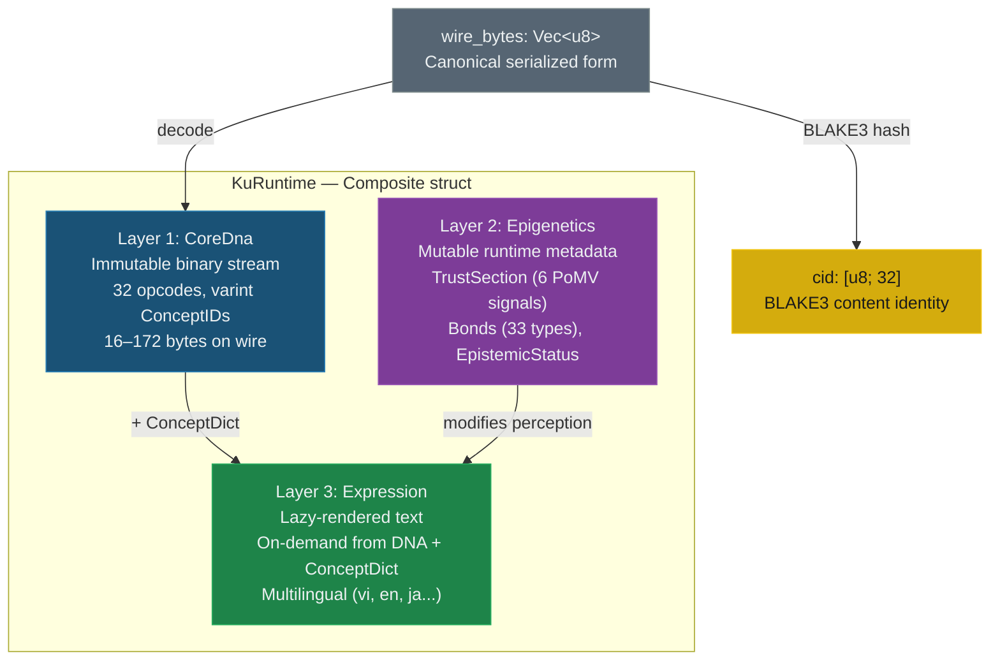
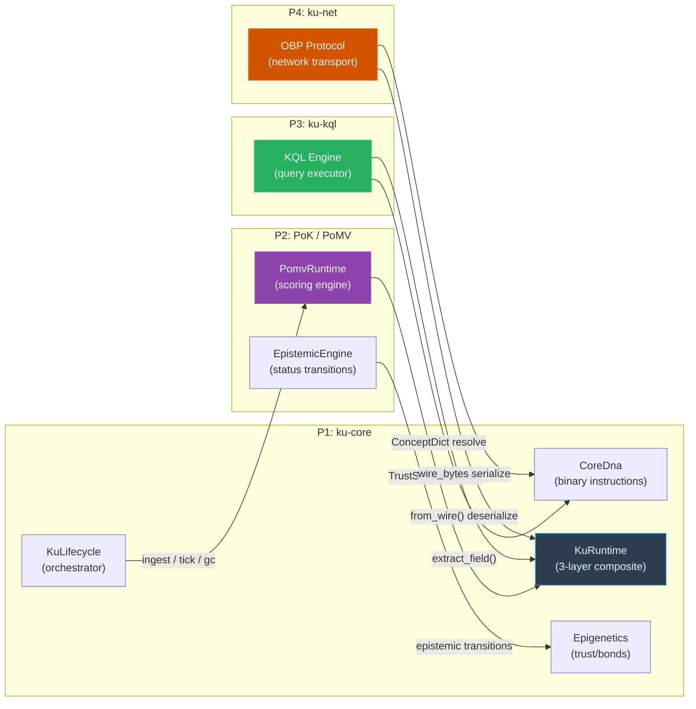

# KU v6 Architecture — Core DNA 3-Layer Knowledge Unit

> **Pillar**: P1 — Knowledge Representation Engine
> **Crate**: `ku-core` v0.2.0
> **Source**: [`src/ku-core/`](file:///c:/Users/shpy2/Documents/OneBrain/src/ku-core)
> **Last Updated**: 2026-06-30

---

## §1 Overview

### Triết lý: "Knowledge as Living Organisms"

Kiến trúc KU v6 mô phỏng sinh học phân tử: mỗi đơn vị tri thức (Knowledge Unit — KU) được thiết kế như một **sinh vật sống** với DNA, biểu hiện gene, và vòng đời tiến hóa.

Thiết kế gồm **3 lớp** tách biệt hoàn toàn:

1. **Core DNA** (Layer 1) — chuỗi opcode nhị phân bất biến, lưu trữ nội dung tri thức
2. **Epigenetics** (Layer 2) — metadata runtime thay đổi được (trust, bond, epistemic status)
3. **Expression** (Layer 3) — văn bản tự nhiên được render on-demand từ DNA + ConceptDict

### Bảng tương đồng sinh học

| Sinh học | KU v6 | Vai trò |
|----------|-------|---------|
| Chuỗi nucleotide (ATCG) | `CoreDna` — instruction stream (32 opcodes) | Lưu trữ bất biến, compact, language-agnostic |
| Histone modification / Methylation | `Epigenetics` — TrustSection, Bond, EpistemicStatus | Điều chỉnh "biểu hiện" mà không thay đổi DNA |
| Protein synthesis | `Expression` — rendered natural language text | Phenotype tạo on-demand từ DNA |
| Genome hash | `cid: [u8; 32]` — BLAKE3 hash của wire bytes | Định danh nội dung bất biến |
| Metabolism / Ecosystem | `PomvRuntime` — 6 tín hiệu PoMV | Đánh giá "sức sống" của tri thức |
| Cell lifecycle | `KuLifecycle` — ingest/tick/gc | Vòng đời: sinh ra → tiến hóa → chết |

---

## §2 Three-Layer Architecture

### Sơ đồ tổng quát



### Layer 1: CoreDna — Immutable Binary Instruction Stream

Chuỗi opcode nhị phân ultra-compact, nhỏ hơn cả văn bản tự nhiên. Language-agnostic — không chứa text nào, chỉ có ConceptID dạng varint.

```text
Wire Format:
MAGIC(0x4B) | VER_META(1B) | INSTRUCTION_STREAM | END(0x1E) | CRC-16(2B)
             ┌─────────────┐
             │ bits 7-5: version (3 bits, current = 1)
             │ bits 4-1: gene_type (4 bits, 0-15)
             │ bit 0:    has_qualifiers
             └─────────────┘
```

**Rust struct** — source: [core_dna.rs](file:///c:/Users/shpy2/Documents/OneBrain/src/ku-core/src/core_dna.rs):

```rust
pub struct CoreDna {
    pub header: CoreDnaHeader,
    pub instructions: Vec<Instruction>,
}

pub struct CoreDnaHeader {
    pub version: u8,        // 0-7 (current = 1)
    pub gene_type: u8,      // 0-15 → GeneType mapping
    pub has_qualifiers: bool,
}
```

### Layer 2: Epigenetics — Runtime Metadata Overlay

Dữ liệu mutable, lưu riêng khỏi Core DNA (ví dụ: SQLite dạng CBOR). **Không ảnh hưởng CID** — thay đổi Epigenetics không tạo KU mới.

**Rust struct** — source: [epigenetics.rs](file:///c:/Users/shpy2/Documents/OneBrain/src/ku-core/src/epigenetics.rs):

```rust
pub struct Epigenetics {
    pub trust: TrustSection,           // PoMV 6 signals, trust_score, confidence
    pub bonds: Vec<Bond>,              // Directed edges (33 relation types)
    pub epistemic_status: EpistemicStatus, // 11 levels: Rumor → Axiomatic
    pub evidence_type: EvidenceType,   // 9 GRADE-aligned types
    pub epigenetic: Option<EpigeneticSection>, // Embeddings, temporal, versioning
}
```

### Layer 3: Expression — Natural Language Phenotype

Rendered on-demand — không lưu trữ. Tạo bằng cách walk instruction stream, resolve mỗi ConceptID qua ConceptDict sang tên human-readable.

**Rust struct** — source: [epigenetics.rs](file:///c:/Users/shpy2/Documents/OneBrain/src/ku-core/src/epigenetics.rs#L154-L176):

```rust
pub struct Expression {
    pub text: String,                         // Rendered sentence
    pub lang: String,                         // ISO 639-1: "vi", "en", "ja"
    pub concept_names: Vec<(ConceptId, String)>, // Resolved name cache
}
```

---

## §3 KuRuntime — Primary v6 Type

`KuRuntime` là struct chính kết hợp cả 3 lớp thành một composite duy nhất. Đây là type mà KQL queries, PoK/PoMV scoring, và OBP transport đều thao tác.

### Struct Definition

Source: [ku_runtime.rs](file:///c:/Users/shpy2/Documents/OneBrain/src/ku-core/src/ku_runtime.rs):

```rust
pub struct KuRuntime {
    /// BLAKE3 hash of wire_bytes — globally unique content identity
    pub cid: [u8; 32],
    /// Layer 1: Core DNA — compact binary instruction stream
    pub dna: CoreDna,
    /// Layer 2: Epigenetics — runtime metadata overlay
    pub epi: Epigenetics,
    /// Layer 3: Expression — lazy-rendered natural language (None until requested)
    pub expr: Option<Expression>,
    /// Raw Core DNA wire bytes — for storage and network transport
    pub wire_bytes: Vec<u8>,
    /// Encoding verification status (RAW/SELF/PART/FULL)
    pub encoding_status: EncodingStatus,
}
```

### Storage Table

| Layer | Field | Stored? | Format | Affects CID? |
|-------|-------|---------|--------|---------------|
| 1. Core DNA | `dna` | ✅ Persistent | Custom binary (16–172B) | ✅ Yes |
| 2. Epigenetics | `epi` | ✅ Separate store | CBOR → SQLite | ❌ No |
| 3. Expression | `expr` | ❌ Generated | On-demand text | ❌ No |
| — | `wire_bytes` | ✅ Primary | Raw bytes | ✅ (is the source) |
| — | `cid` | ✅ Derived | BLAKE3 `[u8; 32]` | — (is the hash) |
| — | `encoding_status` | ✅ Separate store | EncodingStatus enum | ❌ No |

### Key Methods

| Method | Signature | Mô tả |
|--------|-----------|-------|
| `new` | `(CoreDna, Vec<u8>) -> Self` | Tạo từ decoded DNA + raw bytes |
| `from_wire` | `(Vec<u8>) -> Result<Self, KuError>` | Decode từ raw wire bytes |
| `from_dna` | `(CoreDna) -> Result<Self, KuError>` | Encode DNA → wire → compute CID |
| `with_epigenetics` | `(self, Epigenetics) -> Self` | Attach loaded epigenetics |
| `expression` | `(&mut self, &str, &ConceptDict) -> &Expression` | Lazy render Layer 3 |
| `apply_pomv_update` | `(&mut self, &TrustSectionUpdate)` | Bridge PoMV → Epigenetics |
| `extract_field` | `(&self, &str) -> Option<ExtractedValue>` | KQL field extraction |
| `cid_bytes` | `(&self) -> [u8; 32]` | CID for PomvRuntime key lookup |
| `recompute` | `(&mut self)` | Re-encode DNA → update wire_bytes + CID |
| `concept_ids` | `(&self) -> Vec<ConceptId>` | All ConceptIDs in instruction stream |
| `primary_concept` | `(&self) -> Option<ConceptId>` | First subject ConceptID |
| `certainty` | `(&self) -> Option<u16>` | From CERTAINTY instruction |
| `difficulty` | `(&self) -> Option<u8>` | From DIFFICULTY instruction |
| `gene_type` | `(&self) -> u8` | Header gene type |
| `instruction_count` | `(&self) -> usize` | Instructions (excluding END) |
| `wire_size` | `(&self) -> usize` | Wire bytes length |
| `trust_score` | `(&self) -> u16` | Convenience: `epi.trust.trust_score` |
| `confidence` | `(&self) -> u16` | Convenience: `epi.trust.confidence` |
| `bond_count` | `(&self) -> usize` | Convenience: `epi.bonds.len()` |
| `has_triple` | `(&self) -> bool` | Contains any Triple instructions |
| `has_step` | `(&self) -> bool` | Contains any Step instructions |
| `contains_concept` | `(&self, ConceptId) -> bool` | ConceptID exists in stream |

### ExtractedValue — KQL Field Extraction

Kiểu trả về cho `extract_field()`, dùng trong KQL query evaluation:

```rust
pub enum ExtractedValue {
    Integer(i64),    // Numeric fields
    Float(f64),      // Computed values (PoMV composite)
    Text(String),    // gene_type name, epistemic_status name, expression text
    Bool(bool),      // has_triple, has_step, existence checks
    Null,            // Missing value
}
```

**Extractable fields**: `gene_type`, `primary_concept`, `certainty`, `difficulty`, `instruction_count`, `has_triple`, `has_step`, `wire_size`, `trust_score`, `confidence`, `verification_level`, `corroboration_count`, `challenge_count`, `error_susceptibility`, `bond_count`, `epistemic_status`, `evidence_type`, `metabolic_rate`, `prediction_score`, `entropy_at_creation`, `survival_score`, `synaptic_centrality`, `niche_fitness`, `text`, `epi`, `expression`, `cid`.

---

## §4 Instruction Set — 32 Opcodes (0x00–0x1F)

Mỗi opcode chiếm **5 bits** trong OPCODE byte, cùng với 3 modifier bits.

Source: [core_dna.rs — `Op` enum](file:///c:/Users/shpy2/Documents/OneBrain/src/ku-core/src/core_dna.rs#L48-L115)

### Opcode Table

| Dec | Hex | Tên | Operands | Mô tả |
|-----|-----|-----|----------|-------|
| 0 | `0x00` | `TRIPLE` | `S, P, O` (3× varint) | Subject-Predicate-Object fact |
| 1 | `0x01` | `QUALITY` | `S, Q` (2× varint) | Subject has quality Q |
| 2 | `0x02` | `QUANTITY` | `S, value, unit` (varint, NumericValue, varint) | Numeric measurement |
| 3 | `0x03` | `SEQUENCE` | `N, items...` (varint count + N× varint) | Ordered list of concepts |
| 4 | `0x04` | `PART_OF` | `part, whole` (2× varint) | Hierarchical containment |
| 5 | `0x05` | `LOCATED` | `S, location` (2× varint) | Spatial relation |
| 6 | `0x06` | `TEMPORAL` | `S, time` (2× varint) | Time relation |
| 7 | `0x07` | `CAUSAL` | `cause, effect` (2× varint) | Causation link |
| 8 | `0x08` | `SIMULATES` | `S, model` (2× varint) | Analogy/simulation relation |
| 9 | `0x09` | `CONDITION` | `if, then` (2× varint) | Conditional logic |
| 10 | `0x0A` | `AGENT` | `actor, action` (2× varint) | Who performs action |
| 11 | `0x0B` | `TOOL` | `action, instrument` (2× varint) | Action uses instrument |
| 12 | `0x0C` | `RANGE` | `S, min, max` (varint, 2× NumericValue) | Value range `[min, max]` |
| 13 | `0x0D` | `TOLERANCE` | `S, value, ±delta` (varint, 2× NumericValue) | Precision with error margin |
| 14 | `0x0E` | `CONSTRAINT` | `source, op_code, target` (varint, u8, varint) | Numeric constraint (≤,≥,=,≠) |
| 15 | `0x0F` | `ENUM_VAL` | `S, N, values...` (varint, count + N× varint) | One of a set of values |
| 16 | `0x10` | `CERTAINTY` | `level_u16` (2B) | Confidence 0–10000 (0.00%–100.00%) |
| 17 | `0x11` | `DIFFICULTY` | `level_u8` (1B) | Difficulty 0–4 |
| 18 | `0x12` | `CID_REF` | `cid` (32B) | BLAKE3 content reference to another KU |
| 19 | `0x13` | `STEP` | `ord, action, target` (u8, 2× varint) | Procedure step |
| 20 | `0x14` | `PRECOND` | `concept` (varint) | Step precondition |
| 21 | `0x15` | `EFFECT` | `concept` (varint) | Step effect/result |
| 22 | `0x16` | `AFFECT` | `V_i16, A_i16, D_i16` (6B) | VAD emotion model (Valence/Arousal/Dominance) |
| 23 | `0x17` | `LABEL` | `key, value` (2× varint) | Generic key-value metadata |
| 24 | `0x18` | `TEXT_REF` | `lang, len, bytes` (u8, varint, bytes) | Compressed canonical text |
| 25 | `0x19` | `FORMULA` | `format, len, bytes` (u8, varint, bytes) | LaTeX/MathML notation |
| 26 | `0x1A` | `WITNESS` | `count, proximity` (u16, u8) | Testimony witness data |
| 27 | `0x1B` | `MEDIA_REF` | `system, len, id_bytes` (u8, varint, bytes) | External media reference |
| 28 | `0x1C` | `COMPOSITE_HDR` | `type, completeness, version` (u8, u8, u32) | Composite KU header |
| 29 | `0x1D` | `MEMBER` | `order, role, required, label, cid` (u16, u8, bool, varint, 32B) | Composite member entry |
| 30 | `0x1E` | `END` | *(none)* | Terminates instruction stream |
| 31 | `0x1F` | `EXTENDED` | `ext_byte, ...` | Future extension escape |

### Instruction Enum (typed variants)

Mỗi opcode được decode thành variant của `Instruction` enum:

```rust
pub enum Instruction {
    Triple    { s: ConceptId, p: ConceptId, o: ConceptId },
    Quality   { s: ConceptId, q: ConceptId },
    Quantity  { s: ConceptId, value: NumericValue, unit: ConceptId },
    Sequence  { items: Vec<ConceptId> },
    PartOf    { part: ConceptId, whole: ConceptId },
    Located   { s: ConceptId, location: ConceptId },
    Temporal  { s: ConceptId, time: ConceptId },
    Causal    { cause: ConceptId, effect: ConceptId },
    Simulates { s: ConceptId, model: ConceptId },
    Condition { cond: ConceptId, result: ConceptId },
    Agent     { actor: ConceptId, action: ConceptId },
    Tool      { action: ConceptId, instrument: ConceptId },
    Range     { s: ConceptId, min: NumericValue, max: NumericValue },
    Tolerance { s: ConceptId, value: NumericValue, delta: NumericValue },
    Constraint { source: ConceptId, op: ConstraintOp, target: ConceptId },
    EnumVal   { s: ConceptId, values: Vec<ConceptId> },
    Certainty { level: u16 },
    Difficulty { level: u8 },
    CidRef    { cid: [u8; 32] },
    Step      { ord: u8, action: ConceptId, target: ConceptId },
    Precond   { concept: ConceptId },
    Effect    { concept: ConceptId },
    Affect    { v: i16, a: i16, d: i16 },
    Label     { key: ConceptId, value: ConceptId },
    TextRef   { lang: u8, data: Vec<u8> },
    Formula   { format: u8, data: Vec<u8> },
    Witness   { count: u16, proximity: u8 },
    MediaRef  { system: u8, id: Vec<u8> },
    CompositeHdr { composite_type: u8, completeness: u8, version: u32 },
    Member    { order: u16, role: u8, required: bool, label: ConceptId, cid: [u8; 32] },
    End,
}
```

### NumericValue — Inline Numeric Literals

Các giá trị số inline sử dụng prefix byte nằm ngoài dải varint (`0xFA–0xFF`):

| Prefix | Hex | Type | Size |
|--------|-----|------|------|
| `NUM_U8` | `0xFA` | `u8` | 2B (prefix + 1B) |
| `NUM_U16` | `0xFB` | `u16` | 3B (prefix + 2B BE) |
| `NUM_I16` | `0xFC` | `i16` | 3B (prefix + 2B BE) |
| `NUM_U32` | `0xFD` | `u32` | 5B (prefix + 4B BE) |
| `NUM_I32` | `0xFE` | `i32` | 5B (prefix + 4B BE) |
| `NUM_F32` | `0xFF` | `f32` | 5B (prefix + 4B BE) |

### ConstraintOp — Comparison Operators

Dùng bởi opcode `CONSTRAINT` (0x0E):

| Value | Operator | Symbol |
|-------|----------|--------|
| 0 | `Eq` | `==` |
| 1 | `Ne` | `!=` |
| 2 | `Lt` | `<` |
| 3 | `Le` | `<=` |
| 4 | `Gt` | `>` |
| 5 | `Ge` | `>=` |

---

## §5 ConceptDict — Bilingual Concept Dictionary

Hệ thống từ điển khái niệm ánh xạ hai chiều giữa tên human-readable và ConceptID dạng varint, hỗ trợ đa ngôn ngữ.

### ConceptEntry

Source: [concept_dict.rs](file:///c:/Users/shpy2/Documents/OneBrain/src/ku-core/src/concept_dict.rs):

```rust
pub struct ConceptEntry {
    pub id: ConceptId,           // Numeric ID (varint-encoded in Core DNA)
    pub name: String,            // Canonical name (language-neutral)
    pub name_vi: Option<String>, // Vietnamese name
    pub name_en: Option<String>, // English name
    pub tier: u8,                // Varint tier (0–4)
    pub category: Option<String>,// Domain category
}
```

### Varint Tier Mapping

ConceptID được gán theo tier tương ứng với độ rộng varint byte:

| Tier | ID Range | Bytes | Usage |
|------|----------|-------|-------|
| 0 | 0–127 | 1B | Core grammar (reserved) |
| 1 | 128–16,383 | 2B | Common concepts |
| 2 | 16,384–2,097,151 | 3B | Domain knowledge |
| 3 | 2,097,152–268,435,455 | 4B | Specialized terms |
| 4 | 268,435,456+ | 5B+ | Rare/unique |

### ConceptDict (in-memory)

In-memory bidirectional HashMap. Tra cứu < 1μs. Case-insensitive qua tất cả ngôn ngữ.

```rust
pub struct ConceptDict {
    by_id: HashMap<ConceptId, ConceptEntry>,   // ID → Entry
    by_name: HashMap<String, ConceptId>,       // name (lowercase) → ID
    next_id: ConceptId,                        // Next auto-assign ID
}
```

**Key methods**: `resolve(&str) -> Result<ConceptId>`, `name(ConceptId) -> Option<&str>`, `name_lang(id, "vi")`, `register(&str) -> ConceptId`, `register_multilingual(name, name_vi, name_en)`, `resolve_or_register(&str)`.

### PersistentConceptDict (redb backend)

Source: [persistent_concept_dict.rs](file:///c:/Users/shpy2/Documents/OneBrain/src/ku-core/src/persistent_concept_dict.rs) — behind `persist` feature flag.

Pure Rust storage (không cần C compiler). Dùng `redb` cho ACID transactions.

```rust
pub struct PersistentConceptDict {
    db: Database,  // redb::Database
}
```

| Table | Key | Value |
|-------|-----|-------|
| `concepts` | `name` (`&str`) | JSON `ConceptEntry` |
| `ids` | `id` (`u64`) | `name` (`&str`) |
| `meta` | `"next_id"` | `u64` |

### text_parser::ConceptDict (T1 parsing)

Source: [text_parser.rs](file:///c:/Users/shpy2/Documents/OneBrain/src/ku-core/src/text_parser.rs#L69-L105) — simple HashMap cho T1 text-to-DNA parsing.

```rust
// text_parser module — simplified dict for NL→CoreDna parsing
pub struct ConceptDict {
    map: HashMap<String, ConceptId>,
    next_id: ConceptId,  // starts at 1000
}
```

Methods: `insert(word, id)`, `lookup(word) -> ConceptId`, `lookup_or_create(word) -> ConceptId`.

---

## §6 Gene Types — 11 Content Classifications

Mỗi KU có một `gene_type` (4 bits, 0–15) trong CoreDnaHeader VER_META byte, xác định loại tri thức:

| Value | Gene Type | Mô tả | Ví dụ |
|-------|-----------|-------|-------|
| 0 | `Fact` | Sự kiện khách quan | "Nước sôi ở 100°C" |
| 1 | `Hypothesis` | Giả thuyết chưa chứng minh | "Nước tối tồn tại ở vùng cực Mặt Trăng" |
| 2 | `Experience` | Trải nghiệm cá nhân | "Tôi thấy trời mưa hôm qua" |
| 3 | `Procedure` | Quy trình từng bước | "Cách pha cà phê phin" |
| 4 | `Rule` | Luật/nguyên tắc | "Không được đỗ xe ở đây" |
| 5 | `Definition` | Định nghĩa khái niệm | "Entropy là thước đo hỗn loạn" |
| 6 | `Relation` | Quan hệ giữa các khái niệm | "Python thuộc nhóm ngôn ngữ kịch bản" |
| 7 | `Meta` | Metadata về KU khác | "KU #abc có 5 trích dẫn" |
| 8 | `Creative` | Nội dung sáng tạo | "Bài thơ về mùa thu" |
| 9 | `Belief` | Niềm tin/quan điểm cá nhân | "Tôi tin AI sẽ thay đổi giáo dục" |
| 10 | `FormalProof` | Chứng minh toán học chính thức | "Chứng minh √2 là số vô tỉ" |

> [!NOTE]
> Giá trị 11–15 được dự trữ cho mở rộng tương lai.

---

## §7 Epistemic Status Ladder — 11 Levels

Thang đo trưởng thành tri thức 11 cấp, chuyển đổi bởi tín hiệu PoMV observable.

Source: [types.rs — `EpistemicStatus`](file:///c:/Users/shpy2/Documents/OneBrain/src/ku-core/src/types.rs#L389-L401)

```rust
#[repr(u8)]
pub enum EpistemicStatus {
    Rumor          = 0x00,
    Hearsay        = 0x01,
    Testimony      = 0x02,
    Observation    = 0x03,
    Hypothesis     = 0x04,
    Evidence       = 0x05,
    Corroborated   = 0x06,
    PeerReviewed   = 0x07,
    Consensus      = 0x08,
    FormallyProven = 0x09,
    Axiomatic      = 0x0A,
}
```

| Level | Hex | Name | Mô tả |
|-------|-----|------|-------|
| 0 | `0x00` | `Rumor` | Tin đồn — chưa xác minh, nguồn không rõ |
| 1 | `0x01` | `Hearsay` | Nghe nói — từ bên thứ ba, không trực tiếp |
| 2 | `0x02` | `Testimony` | Chứng ngôn — từ nhân chứng trực tiếp |
| 3 | `0x03` | `Observation` | Quan sát — dữ liệu thu thập trực tiếp |
| 4 | `0x04` | `Hypothesis` | Giả thuyết — mô hình có thể kiểm chứng |
| 5 | `0x05` | `Evidence` | Bằng chứng — dữ liệu hỗ trợ giả thuyết |
| 6 | `0x06` | `Corroborated` | Xác nhận — nhiều nguồn độc lập đồng thuận |
| 7 | `0x07` | `PeerReviewed` | Phản biện — đánh giá bởi chuyên gia |
| 8 | `0x08` | `Consensus` | Đồng thuận — cộng đồng chấp nhận rộng rãi |
| 9 | `0x09` | `FormallyProven` | Chứng minh — qua logic hình thức |
| 10 | `0x0A` | `Axiomatic` | Tiên đề — chấp nhận không cần chứng minh |

### EvidenceType — 9 GRADE-aligned Types

Source: [types.rs — `EvidenceType`](file:///c:/Users/shpy2/Documents/OneBrain/src/ku-core/src/types.rs#L406-L416)

| Value | Hex | Name | Mô tả |
|-------|-----|------|-------|
| 0 | `0x00` | `None` | Không có bằng chứng |
| 1 | `0x01` | `Anecdotal` | Giai thoại cá nhân |
| 2 | `0x02` | `CaseStudy` | Nghiên cứu trường hợp |
| 3 | `0x03` | `Observational` | Nghiên cứu quan sát |
| 4 | `0x04` | `Correlational` | Nghiên cứu tương quan |
| 5 | `0x05` | `Experimental` | Thí nghiệm có kiểm soát |
| 6 | `0x06` | `MetaAnalysis` | Phân tích tổng hợp |
| 7 | `0x07` | `FormalProof` | Chứng minh hình thức |
| 8 | `0x08` | `Computational` | Mô phỏng/tính toán |

### TrustSection — Full Trust Metadata

Source: [types.rs](file:///c:/Users/shpy2/Documents/OneBrain/src/ku-core/src/types.rs#L471-L547)

```rust
pub struct TrustSection {
    pub epistemic_status: EpistemicStatus,
    pub evidence_type: EvidenceType,
    pub verification_level: u8,     // 0=none, 1=self, 2=peer, 3=expert, 4=formal
    pub corroboration_count: u16,
    pub challenge_count: u16,
    pub error_susceptibility: u16,  // 16-bit bitfield (16 independent flags)
    pub trust_score: u16,           // [0, 10000] → 0.0–1.0
    pub confidence: u16,            // [0, 10000]
    pub domain_codes: Vec<u64>,
    pub verifications: Vec<Vec<u8>>,
    pub challenges: Vec<Vec<u8>>,
    // PoMV 6 signals:
    pub metabolic_rate: u16,        // Usage/activity [0, 10000]
    pub prediction_score: u16,      // Prediction accuracy [0, 10000]
    pub entropy_at_creation: u16,   // Novelty at creation [0, 10000]
    pub survival_score: u16,        // Battle-hardened bonus [0, 10000]
    pub synaptic_centrality: u16,   // Network position [0, 10000]
    pub niche_fitness: u16,         // Ecological fitness [0, 10000]
}
```

**PoMV Composite Score** — weighted average (from `Epigenetics::pomv_score()`):

```rust
pub fn pomv_score(&self) -> f64 {
    let t = &self.trust;
    let scores = [
        (t.metabolic_rate as f64,      0.35),  // Heaviest weight
        (t.prediction_score as f64,    0.15),
        (t.entropy_at_creation as f64, 0.10),
        (t.survival_score as f64,      0.10),
        (t.synaptic_centrality as f64, 0.15),
        (t.niche_fitness as f64,       0.15),
    ];
    scores.iter().map(|(s, w)| s * w).sum::<f64>() / 10000.0
}
```

### Bond — 33 Relation Types across 8 Categories

Source: [types.rs](file:///c:/Users/shpy2/Documents/OneBrain/src/ku-core/src/types.rs#L124-L174)

| Category | Range | Relations |
|----------|-------|-----------|
| **A: Epistemic** | `0x01–0x06` | Extends, Supplements, Refutes, Corroborates, Supersedes, Qualifies |
| **B: Structural** | `0x10–0x13` | PartOf, InstanceOf, Specializes, Generalizes |
| **C: Causal** | `0x20–0x23` | Causes, Enables, Prevents, DependsOn |
| **D: Derivation** | `0x30–0x33` | ExampleOf, AnalogyOf, AppliesTo, DerivedFrom |
| **E: Similarity** | `0x40–0x43` | Duplicates, Translates, Paraphrases, Inspires |
| **F: Temporal** | `0x50–0x51` | Precedes, Cooccurs |
| **G: Provenance** | `0x60–0x62` | Cites, AuthoredBy, ReviewedBy |
| **H: Experiential** | `0x70–0x76` | ReactionTo, TestimonyAbout, FormallyProves, EvolvesInto, VariantOf, SensoryEvidenceFor, CulturallyContextualizes |

Bond struct fields: `target_cid`, `relation`, `weight` (u16, 0–10000), `creator` (Human/Ai/System/Hybrid), `state` (Active/Weakened/Deprecated), `decay` (None/Slow/Med/Fast), `evidence`, `context`, `order`, `required`, `bidirectional`.

---

## §8 KuLifecycle — Orchestrator

`KuLifecycle` là integration layer kết nối `KuRuntime` storage với `PomvRuntime` computation. Quản lý toàn bộ vòng đời từ sinh ra đến chết.

Source: [ku_lifecycle.rs](file:///c:/Users/shpy2/Documents/OneBrain/src/ku-core/src/ku_lifecycle.rs)

```rust
pub struct KuLifecycle {
    pub kus: HashMap<[u8; 32], KuRuntime>,  // All KUs by CID
    pub pomv: PomvRuntime,                   // PoMV scoring engine
}
```

### Lifecycle Flow

```mermaid
sequenceDiagram
    participant App as Application
    participant LC as KuLifecycle
    participant KR as KuRuntime (HashMap)
    participant PR as PomvRuntime

    Note over App,PR: ① Creation
    App->>LC: ingest(ku, niches, novelty, bridge, now)
    LC->>PR: register_ku(cid, now, niches, novelty, bridge)
    LC->>KR: insert(cid, ku)
    LC-->>App: cid: [u8; 32]

    Note over App,PR: ② Events
    App->>LC: record_event(&cid, MetabolismEvent, now)
    LC->>PR: record_event(cid, event, now)

    Note over App,PR: ③ Tick (scoring cycle)
    App->>LC: tick(now, &niche_stats)
    LC->>PR: tick(now, niche_stats) → Vec<(cid, score, update)>
    loop For each scored KU
        LC->>KR: ku.apply_pomv_update(&update)
    end
    LC-->>App: Vec<(cid, PomvScore)>

    Note over App,PR: ④ Garbage Collection
    App->>LC: gc(now)
    LC->>PR: gc(now) → removed count
    LC->>KR: remove dead CIDs
    LC-->>App: total removed count
```

### Methods

| Method | Signature | Mô tả |
|--------|-----------|-------|
| `new` | `(PomvConfig) -> Self` | Tạo lifecycle manager |
| `ingest` | `(&mut self, KuRuntime, niches, novelty, bridge, now) -> [u8; 32]` | Thêm KU mới + register PoMV |
| `record_event` | `(&mut self, &cid, MetabolismEvent, now)` | Ghi sự kiện metabolism |
| `tick` | `(&mut self, now, &niche_stats) -> Vec<(cid, PomvScore)>` | Compute PoMV → update KuRuntimes |
| `gc` | `(&mut self, now) -> usize` | Xóa KU đã chết khỏi cả hai stores |
| `get` | `(&self, &cid) -> Option<&KuRuntime>` | Tra cứu KU theo CID |
| `get_mut` | `(&mut self, &cid) -> Option<&mut KuRuntime>` | Tra cứu mutable |
| `len` | `(&self) -> usize` | Số KU đang active |
| `advance_encoding_status` | `(&mut self, &cid, EncodingStatus) -> Result<(), KuError>` | Chuyển trạng thái encoding (RAW→SELF→PART→FULL) |
| `pending_encodings` | `(&self) -> Vec<([u8; 32], EncodingStatus)>` | Danh sách KU chưa đạt FULL encoding |

> [!NOTE]
> `KuLifecycle` hỗ trợ `advance_encoding_status()` và `pending_encodings()` cho encoding consensus integration. Trạng thái encoding được quản lý song song với PoMV lifecycle — encoding status không ảnh hưởng CID nhưng ảnh hưởng khả năng tham gia network consensus.

---

## §9 Module Map

Source: [lib.rs](file:///c:/Users/shpy2/Documents/OneBrain/src/ku-core/src/lib.rs)

### Core — Layer 1/2/3 Types

| Module | Mô tả |
|--------|-------|
| `core_dna` | Layer 1: Op enum (32 opcodes), Instruction, CoreDna, CoreDnaHeader, encode/decode |
| `epigenetics` | Layer 2: Epigenetics struct, Layer 3: Expression struct |
| `ku_runtime` | KuRuntime composite (3 layers + CID), ExtractedValue for KQL |
| `types` | Shared types: ConceptId, TrustSection, Bond, RelationType, EpistemicStatus, EvidenceType, GeneType |
| `error` | `KuError` error type |
| `varint` | Varint encode/decode for ConceptID wire encoding |
| `encoder` | Legacy KU encoder functions |
| `decoder` | Legacy KU decoder functions |
| `encoding_consensus` | EncodingStatus state machine, EncodingSubmission, EncodingConsensus logic |
| `encoding_verifier` | 2-phase verification: (A) AI decomposition agreement (gene_type + opcode Jaccard + concept Jaccard), (B) tool encoding round-trip |
| `encoding_reward` | OBT token reward calculation and distribution |

### PoMV — Proof-of-Metabolic-Value

| Module | Mô tả |
|--------|-------|
| `pomv` | PoMV score computation (6 signals → composite score) |
| `pomv_runtime` | PomvRuntime: manages per-KU PoMV state, TrustSectionUpdate |
| `metabolism` | MetabolismEvent types, metabolic rate tracking |
| `metabolism_store` | Persistent metabolism event storage |
| `prediction` | Prediction scoring engine |
| `entropy` | Information entropy at creation |
| `synaptic` | Synaptic centrality (network position) computation |
| `immune` | Immune system — challenge/refutation handling |
| `ecosystem` | Niche ecosystem: NicheId, NicheStats, niche fitness |
| `eigentrust` | EigenTrust reputation propagation |
| `spread_analysis` | Information spread pattern analysis |
| `epistemic_engine` | Epistemic status transition engine |

### Storage & Query

| Module | Mô tả |
|--------|-------|
| `concept_dict` | In-memory bidirectional ConceptDict (name ↔ ConceptId) |
| `persistent_concept_dict` | redb-backed persistent ConceptDict (feature: `persist`) |
| `crdt` | CRDT merge operations for distributed KU synchronization |
| `ku_lifecycle` | KuRuntime + PomvRuntime lifecycle orchestrator |

### Utility

| Module | Mô tả |
|--------|-------|
| `text_parser` | Natural language → CoreDna parser (T1 ConceptDict) |
| `ku_tools` | Tool definitions for AI tool-calling interface |
| `ku_tool_executor` | Tool execution engine |
| `ku_system_prompt` | System prompt generation for LLM integration |

### OBT Token Modules (P5)

| Module | File | Purpose |
|--------|------|---------|
| Constants | `obt_constants.rs` | Protocol constants, NodeTier enum |
| Ledger | `obt_ledger.rs` | Account-Chain ledger, TransferBlock |
| Minting | `obt_minting.rs` | Emission formula, MintProof, R1-R4 rewards |
| Storage Reward | `obt_storage_reward.rs` | 5-factor reward, PoS-KU challenges |
| Penalty | `obt_penalty.rs` | 5-tier graduated penalties |
| Anti-Gaming | `obt_anti_gaming.rs` | Rate limiter, quality gates, pattern detection |
| Gossip Security | `obt_gossip_security.rs` | Gossip gap, connectivity proof |
| Fork Pipeline | `obt_fork_pipeline.rs` | Fork detection → penalty lifecycle |
| Epoch | `obt_epoch.rs` | Epoch boundary settlement |
| Integration | `obt_integration.rs` | KU↔OBT builders, quality gate orchestration |

### Re-exports (from `lib.rs`)

```rust
pub use ku_runtime::{KuRuntime, ExtractedValue};
pub use epigenetics::{Epigenetics, Expression};
pub use concept_dict::{ConceptDict, ConceptEntry};
pub use core_dna::{
    encode_core_dna, decode_core_dna,
    ku_to_core_dna, core_dna_to_ku, decode_any,
    CoreDna, CoreDnaHeader, Instruction,
    CORE_DNA_MAGIC, CORE_DNA_VERSION,
};
```

---

## §10 Dependencies

### Cargo.toml

Source: [ku-core/Cargo.toml](file:///c:/Users/shpy2/Documents/OneBrain/src/ku-core/Cargo.toml)

```toml
[package]
name = "ku-core"
version = "0.2.0"
edition = "2021"

[features]
default = []
persist = ["dep:redb"]  # Enable PersistentConceptDict

[dependencies]
serde = { version = "1", features = ["derive"] }
serde_json = "1"         # JSON for AI tool-calling interface
ciborium = "0.2"         # CBOR serialization (Epigenetics storage)
serde_bytes = "0.11"     # Efficient byte vector serialization
crc32fast = "1.4"        # CRC for legacy format
blake3 = "1"             # BLAKE3 hash for CID computation
redb = { version = "2", optional = true }  # Pure Rust ACID KV store
```

### Workspace

Source: [src/Cargo.toml](file:///c:/Users/shpy2/Documents/OneBrain/src/Cargo.toml)

```toml
[workspace]
members = ["ku-core", "ku-net", "ku-kql", "ku-demo"]
resolver = "2"

[profile.release]
opt-level = "z"    # Size optimization
lto = true         # Link-time optimization
strip = true       # Strip debug symbols
codegen-units = 1  # Single codegen unit for max optimization
```

| Crate | Role |
|-------|------|
| `ku-core` | P1: Knowledge representation engine (this spec) |
| `ku-net` | P4: OBP network transport |
| `ku-kql` | P3: KQL query language |
| `ku-demo` | Demo/test application |

---

## §11 Relationship to Other Pillars



### P2: PoK/PoMV — via PomvRuntime Bridge

`KuLifecycle` kết nối `KuRuntime` với `PomvRuntime`:

- **Ingest**: `KuLifecycle::ingest()` → `PomvRuntime::register_ku()`
- **Events**: `KuLifecycle::record_event()` → metabolism tracking
- **Tick**: `PomvRuntime::tick()` → produces `TrustSectionUpdate` → `KuRuntime::apply_pomv_update()`
- **Bridge method**: `KuRuntime::cid_bytes()` returns `[u8; 32]` for PomvRuntime key lookup
- **6 PoMV signals**: `metabolic_rate`, `prediction_score`, `entropy_at_creation`, `survival_score`, `synaptic_centrality`, `niche_fitness`

### P3: KQL — Operates on KuRuntime

KQL query engine sử dụng `KuRuntime::extract_field()` để evaluate query conditions:

```text
SELECT * WHERE gene_type = "Fact" AND trust_score > 7000 AND certainty > 8000
```

→ Calls `extract_field("gene_type")`, `extract_field("trust_score")`, `extract_field("certainty")` trên mỗi KuRuntime → trả về `ExtractedValue` cho comparison.

ConceptDict cũng được dùng trong KQL `CREATE` statements qua `resolve_or_register()`.

### P4: OBP — Serializes CoreDna for Network

OBP transport layer chỉ cần `wire_bytes` (Core DNA binary):

- **Send**: `ku.wire_bytes` → network
- **Receive**: `KuRuntime::from_wire(bytes)` → decoded KU
- **Identity**: `ku.cid` = BLAKE3 hash → content-addressable deduplication
- Epigenetics được sync riêng (separate channel/store)

### P5: OBT Token

KU provides the data substrate that OBT tokenizes:
- `KuRuntime.cid` → `MintProof.ku_cid` (content identifier)
- `KuRuntime.wire_bytes.len()` → `FormulaInputs.raw_size_kb` (size-based rewards)
- `Epigenetics.pomv_score()` → `FormulaInputs.pomv_score` (quality-based rewards)
- `EncodingConsensus.verifier_count()` → quality gate 2 (consensus check)
- `EncodingConsensus.encoding_time_ms` → quality gate 4 (complexity check)

See `obt_integration.rs` for the full bridge layer.

**Encoding Consensus Integration**: Encoding jobs được broadcast trên DHT, verifiers sử dụng stigmergy-based selection. Các message types mới cho encoding consensus:

| Message Type | Code | Mô tả |
|-------------|------|-------|
| `EncodingJobAnnounce` | `0x90` | Broadcast job mới lên DHT |
| `EncodingClaimReq` | `0x91` | Verifier yêu cầu claim job |
| `EncodingClaimResp` | `0x92` | DHT trả về ClaimToken |
| `EncodingSubmission` | `0x93` | Verifier submit kết quả verification |
| `EncodingConsensusResult` | `0x94` | Kết quả consensus cuối cùng |
| `EncodingJobUpdate` | `0x95` | Cập nhật trạng thái job (status change) |

**DHT TTL**: Encoding jobs được lưu dưới dạng `DhtEntry` với TTL 7 ngày (`ENCODING_JOB_TTL_S`). Hàm `expire_stale()` dọn các job hết hạn. Typed helpers `store_encoding_job()` / `find_encoding_job()` sử dụng CBOR serialization.

**Hybrid Discovery (DHT + PubSub)**: Jobs được lưu trên DHT (persistence cho node mới/restart) và đồng thời broadcast qua PubSub topic `ENCODING_JOBS_TOPIC (0xFFFF)` để verifier online nhận real-time.

**Error Handling**: `EncodingError` enum trong `error.rs` (variants: `JobNotFound`, `ClaimRejected`, `ConsensusTimeout`, `InvalidClaimToken`, `VerificationFailed`, `JobExpired`) tích hợp vào `NetError::Encoding`.

**ku-net Encoding Modules**:

| Module | Mô tả |
|--------|-------|
| `encoding_job.rs` | `EncodingJob` DHT entry, `ClaimRequest`/`ClaimResponse`, DHT key computation |
| `encoding_gossip.rs` | `OwnerJobManager`, claim handling, anti-stampede |
| `encoding_stigmergy.rs` | `JobPheromone` attractiveness, `should_claim()`, `rank_jobs()` |

---

> [!IMPORTANT]
> **Immutability guarantee**: Thay đổi bất kỳ instruction nào trong CoreDna sẽ tạo ra CID mới → KU mới. Epigenetics thay đổi tự do mà không ảnh hưởng CID. Đây là tính chất cốt lõi cho content-addressable storage và network deduplication.
