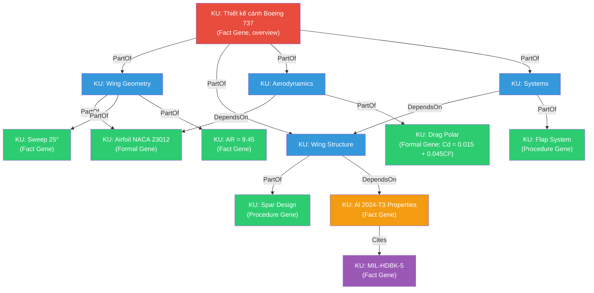
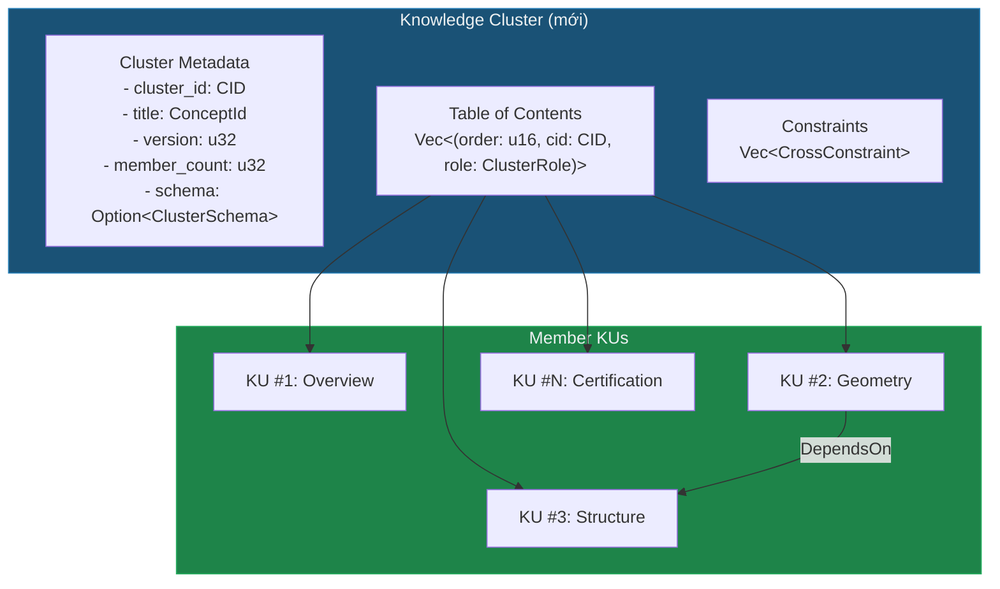

# 🔬 Phân tích: KU xử lý tri thức phức tạp, dài, cần chính xác cao như thế nào?

> **Câu hỏi cốt lõi:** Nếu một kiến thức dài, phức tạp và cần chính xác (ví dụ: thiết kế máy bay), thì KU sẽ lưu trữ và chia nhỏ ra sao?

---

## 1. Hiện trạng: KU được thiết kế cho gì?

Theo kiến trúc hiện tại trong [types.rs](file:///c:/Users/shpy2/Documents/OneBrain/src/ku-core/src/types.rs) và [03_architecture.md](file:///c:/Users/shpy2/Documents/OneBrain/docs/paper/ku/03_architecture.md):

| Đặc điểm | Giá trị |
|-----------|---------|
| Max payload | **65,535 bytes** (u16 PAYLOAD_LEN) |
| Minimal fact KU | ~264 bytes |
| Maximal KU (full layers) | ~3,500 bytes |
| Gene types | 10 loại (Fact, Procedure, Formal, ...) |
| Cơ chế kết nối | 33 Bond types (đặc biệt: `PartOf`, `DependsOn`, `Specializes`) |

> [!IMPORTANT]
> KU được thiết kế như **"atomic unit"** — tương đương 1 fact, 1 procedure, 1 formula. **Không có cơ chế chính thức nào để nhóm nhiều KU thành 1 tài liệu phức tạp có cấu trúc phân cấp.**

---

## 2. Thử nghiệm tư duy: Thiết kế cánh máy bay Boeing 737

Hãy hình dung tri thức "thiết kế cánh máy bay Boeing 737" bao gồm:

```
Thiết kế cánh Boeing 737
├── 1. Hình học cánh (Wing Geometry)
│   ├── 1.1 Airfoil profile (NACA 23012 modified)
│   ├── 1.2 Sweep angle: 25°
│   ├── 1.3 Aspect ratio: 9.45
│   ├── 1.4 Dihedral angle: 6°
│   └── 1.5 Wing area: 124.6 m²
├── 2. Cấu trúc (Structure)
│   ├── 2.1 Spar design (Front spar, Rear spar)
│   ├── 2.2 Rib layout (every 20 inches)
│   ├── 2.3 Skin panels (aluminum 2024-T3)
│   ├── 2.4 Fatigue life: 75,000 cycles
│   └── 2.5 Load factor: 2.5g ultimate
├── 3. Khí động lực học (Aerodynamics)
│   ├── 3.1 Lift coefficient (Cl_max = 2.73 with flaps)
│   ├── 3.2 Drag polar: Cd = 0.015 + 0.045*Cl²
│   ├── 3.3 Stall speed: 110 knots (clean)
│   ├── 3.4 Flutter analysis (boundary conditions)
│   └── 3.5 CFD simulation results
├── 4. Hệ thống (Systems)
│   ├── 4.1 Flap system (LE slats, TE fowler flaps)
│   ├── 4.2 Spoiler/speed brake arrangement
│   ├── 4.3 Fuel tank layout (integral wing tanks)
│   ├── 4.4 De-icing system (pneumatic boot)
│   └── 4.5 Wiring harness routing
├── 5. Vật liệu & Quy trình (Materials)
│   ├── 5.1 Al 2024-T3 properties (tensile, fatigue, corrosion)
│   ├── 5.2 Composite components (winglets)
│   ├── 5.3 Fastener specifications (Hi-Lok, rivets)
│   └── 5.4 Manufacturing tolerances
└── 6. Chứng nhận (Certification)
    ├── 6.1 FAR 25 compliance matrix
    ├── 6.2 Static test results
    ├── 6.3 Fatigue test program
    └── 6.4 Damage tolerance analysis
```

Đây là **hàng trăm facts, procedures, formulas** liên kết chặt chẽ, trong đó sai 1 con số có thể gây tai nạn chết người.

---

## 3. Cách KU hiện tại XỬ LÝ ĐƯỢC

Kiến trúc KU **có** một số công cụ để chia nhỏ tri thức phức tạp:

### 3.1 Bonds — Kết nối phân cấp



**Bonds có thể dùng:**
- `PartOf` (0x10) — tạo cây phân cấp part-whole
- `DependsOn` (0x23) — thể hiện dependency giữa các phần
- `Specializes` (0x12) — chi tiết hóa
- `Cites` (0x60) — tham chiếu nguồn
- `Precedes` (0x50) — thứ tự quy trình

### 3.2 Gene Types — Mỗi loại tri thức dùng gene phù hợp

| Tri thức | Gene Type | Ví dụ |
|----------|-----------|-------|
| Thông số kỹ thuật | **Fact** | Sweep angle = 25° |
| Phương trình | **Formal** | Cd = 0.015 + 0.045·Cl² |
| Quy trình lắp ráp | **Procedure** | 10 bước rivet wing skin |
| Kết quả thử nghiệm | **Testimony** / **Sensory** | Static test load = 150% DLL |
| Giả thuyết thiết kế | **Hypothesis** | "Winglet giảm drag 4%" |

### 3.3 Trust Layer — Đảm bảo chính xác

- `EpistemicStatus::PeerReviewed` hoặc `Consensus` cho kiến thức hàng không đã certification
- `EvidenceType::Experimental` cho kết quả thử nghiệm
- `verification_level = 4` (Formal) cho certified knowledge
- `error_susceptibility` flags rõ ràng

---

## 4. Những gì KU hiện tại CHƯA XỬ LÝ ĐƯỢC

> [!CAUTION]
> Đây là các **lỗ hổng thực sự** trong thiết kế KU khi đối mặt với tri thức phức tạp.

### 4.1 ❌ Không có khái niệm "Document" / "Knowledge Bundle"

**Vấn đề:** Không có cách nào chính thức để nói "200 KU này cùng thuộc về 1 tài liệu thiết kế cánh máy bay". Bonds `PartOf` tạo được cây, nhưng:

- **Không có root marker:** Không field nào đánh dấu "đây là KU gốc của một cluster"
- **Không có ordering:** Bonds không có thứ tự — KU nào đọc trước, KU nào đọc sau?
- **Không đảm bảo completeness:** Không cách nào biết "tài liệu này có đủ hết chưa?" hay "thiếu section nào?"

### 4.2 ❌ Không có "Sequence" / "Ordering" trong Bonds

Bond `PartOf` chỉ nói "A là phần của B", nhưng **không nói A là phần thứ mấy**. Trong thiết kế máy bay, thứ tự rất quan trọng:
- Bước 1 phải trước bước 2
- Section 3.2 phải sau section 3.1

Bond `Precedes` (0x50) tồn tại nhưng nó dùng cho temporal ordering (thời gian), không phải logical ordering (thứ tự trong tài liệu).

### 4.3 ❌ Không có "Version Bundle"

Khi cánh máy bay đi từ Rev A → Rev B → Rev C:
- `prev_cid` trong EpigeneticSection chỉ version **1 KU đơn lẻ**
- Không có cách version **cả cluster 200 KU** cùng lúc
- Vấn đề: đổi 1 tolerance → phải update hàng chục KU liên quan, nhưng không có "atomic commit" cho cluster

### 4.4 ❌ Không có Constraint / Validation Rules

Trong thiết kế máy bay, có các **ràng buộc chéo (cross-constraints)**:
- *"Nếu sweep angle > 20° thì phải dùng supercritical airfoil"*
- *"Load factor phải ≥ 1.5 × limit load"*
- *"Fuel capacity phải ≥ mission fuel + reserves"*

KU không có cơ chế mã hóa constraints giữa các KU. Mỗi KU là đơn vị độc lập.

### 4.5 ❌ Granularity không rõ ràng

**Câu hỏi:** "Sweep angle = 25°" có nên là 1 KU riêng, hay nó quá nhỏ?

Hiện tại không có **guideline** nào cho:
- **Kích thước tối thiểu / tối đa** hợp lý cho 1 KU
- **Khi nào nên tách** (split) và **khi nào nên gộp** (merge)
- **Trade-off** giữa granularity và queryability

### 4.6 ❌ Không có Schema / Template cho domain

Mỗi lĩnh vực (hàng không, y tế, phần mềm) có cấu trúc tri thức riêng. KU hiện tại xử lý tất cả bằng chung 1 bộ Gene types — thiếu **domain-specific templates** để đảm bảo đầy đủ và nhất quán.

---

## 5. Sáng kiến thiết kế: Giải quyết như thế nào?

### Phương án A: "Knowledge Cluster" — Thêm 1 lớp trên KU



**Ưu điểm:** Giải quyết hầu hết vấn đề (ordering, completeness, versioning bundle)
**Nhược điểm:** Thêm 1 tầng trừu tượng, phức tạp hóa hệ thống

### Phương án B: "Composite Gene" — Dùng 1 KU đặc biệt làm manifest

Tận dụng cơ chế `EXTENDED` gene (hiện mới dùng 3/256 slot), thêm gene type mới:

```rust
// Gene type EXTENDED 0x03 (slot chưa dùng)
Gene::Composite {
    /// Danh sách member KU CIDs, có thứ tự
    members: Vec<CompositeEntry>,
    /// Schema / template cho domain
    schema: Option<Vec<u8>>,  // serialized schema
    /// Cross-constraints giữa members
    constraints: Vec<Constraint>,
    /// Cluster version
    cluster_version: u32,
}

struct CompositeEntry {
    cid: Vec<u8>,       // Member KU CID
    order: u16,         // Thứ tự trong cluster  
    role: u8,           // 0=ROOT, 1=CHAPTER, 2=SECTION, 3=DETAIL, 4=APPENDIX
    required: bool,     // Bắt buộc hay optional?
    label: ConceptId,   // Tên section
}
```

**Ưu điểm:** Không cần tầng trừu tượng mới, tái sử dụng KU infrastructure
**Nhược điểm:** 1 KU mang metadata cho cả cluster — payload có thể lớn nếu cluster lớn

### Phương án C: "Bond Enhancement" — Mở rộng Bond hiện có

Thêm fields vào Bond struct hiện tại:

```rust
pub struct Bond {
    // ... existing fields ...
    
    /// ★ NEW: Ordering within parent (cho PartOf bonds)
    #[serde(rename = "ord", skip_serializing_if = "Option::is_none", default)]
    pub order: Option<u16>,
    
    /// ★ NEW: Required flag (member bắt buộc?)  
    #[serde(rename = "req", skip_serializing_if = "Option::is_none", default)]
    pub required: Option<bool>,
    
    /// ★ NEW: Section role
    #[serde(rename = "sr", skip_serializing_if = "Option::is_none", default)]
    pub section_role: Option<u8>,
}
```

**Ưu điểm:** Thay đổi nhỏ nhất, backward compatible (tất cả fields đều Optional)
**Nhược điểm:** Không giải quyết cluster versioning và cross-constraints

---

## 6. So sánh 3 phương án

| Tiêu chí | A: Knowledge Cluster | B: Composite Gene | C: Bond Enhancement |
|-----------|---------------------|-------------------|---------------------|
| Ordering | ✅ TOC rõ ràng | ✅ members có order | ✅ Bond.order |
| Completeness check | ✅ member_count + required | ✅ required flag | ⚠️ Phải suy luận |
| Cluster versioning | ✅ cluster_version | ✅ cluster_version | ❌ Không có |
| Cross-constraints | ✅ Constraints field | ✅ Constraints field | ❌ Không có |
| Domain schemas | ✅ ClusterSchema | ✅ schema field | ❌ Không có |
| Backward compatible | ❌ Thêm entity mới | ✅ Dùng EXTENDED gene | ✅ Optional fields |
| Complexity | 🔴 Cao | 🟡 Trung bình | 🟢 Thấp |
| Phù hợp bio-metaphor | ⚠️ Không tự nhiên | ✅ "Organism" chứa bản đồ gene | ✅ Mở rộng "molecular bond" |

---

## 7. Đề xuất: Phương án B+C (Hybrid)

> [!TIP]
> **Kết hợp B + C**: Dùng **Composite Gene** cho cluster-level metadata, đồng thời **mở rộng Bond** với `order` field.

### Ví dụ cụ thể: Thiết kế cánh Boeing 737

```
KU_root (Gene::Composite)
├── members:
│   ├── [0] KU_geometry     (order=0, role=CHAPTER, required=true)
│   ├── [1] KU_structure    (order=1, role=CHAPTER, required=true)
│   ├── [2] KU_aerodynamics (order=2, role=CHAPTER, required=true)
│   ├── [3] KU_systems      (order=3, role=CHAPTER, required=true)
│   ├── [4] KU_materials    (order=4, role=CHAPTER, required=true)
│   └── [5] KU_certification(order=5, role=CHAPTER, required=true)
├── constraints:
│   ├── "KU_structure.load_factor >= 1.5 * KU_aerodynamics.limit_load"
│   └── "IF KU_geometry.sweep > 20 THEN KU_geometry.airfoil.type = SUPERCRITICAL"
└── cluster_version: 3

KU_geometry (Gene::Fact, nhiều triples)
├── Bond(PartOf → KU_root, order=0)
├── Bond(PartOf ← KU_airfoil, order=0)
├── Bond(PartOf ← KU_sweep, order=1)
└── Bond(PartOf ← KU_aspect_ratio, order=2)

KU_airfoil (Gene::Formal)
├── Bond(PartOf → KU_geometry, order=0)
├── Bond(DependsOn → KU_cfd_results)
└── notation_source: "NACA 23012 modified, t/c=0.12, ..."

KU_drag_polar (Gene::Formal)
├── Bond(PartOf → KU_aerodynamics, order=1)
├── Bond(DependsOn → KU_airfoil)
└── notation_source: "C_D = C_{D_0} + \\frac{C_L^2}{\\pi e AR}"
```

### Với phương án này:

1. **Query:** `FIND (ku:KU) WHERE ku.gene_type = "composite" AND ku.codons CONTAINS "Boeing 737 wing"` → trả về root KU → traversal members
2. **Completeness:** Đọc root composite → biết thiếu section nào
3. **Ordering:** Mỗi member có order → render đúng thứ tự  
4. **Versioning:** Thay đổi 1 KU → tạo composite mới với `prev_cid` → version cả cluster
5. **Precision:** Mỗi thông số kỹ thuật là 1 KU riêng biệt → truy vấn chính xác, trust score riêng

---

## 8. Câu hỏi mở cần quyết định

> [!IMPORTANT]
> Những câu hỏi thiết kế sau đây cần founder quyết định trước khi implement:

1. **Granularity guideline:** "Sweep angle = 25°" có nên là 1 KU riêng hay gộp vào KU "Wing Geometry" cùng 5 thông số khác?
   - **Option A (Ultra-atomic):** Mỗi fact = 1 KU → dễ query, dễ trust, nhưng 1 tài liệu = hàng nghìn KU
   - **Option B (Section-level):** Mỗi section = 1 KU → dễ quản lý, nhưng khó query 1 fact cụ thể
   - **Option C (Adaptive):** Tùy domain — engineering facts cần atomic, narrative knowledge có thể gộp

2. **Composite Gene hay entity mới?** Composite Gene giữ mọi thứ trong KU paradigm, nhưng liệu có đủ cho các tài liệu 10,000+ members?

3. **Cross-constraints:** Mã hóa constraints bằng gì? KQL expressions? JSON logic? Formal logic (first-order)?

4. **Recursive composites:** Composite KU có thể chứa Composite KU khác không? (tài liệu → chapter → section → subsection)

5. **Payload limit:** 65KB (u16) có đủ cho Composite Gene với hàng nghìn members? Hay cần nâng lên u32?
