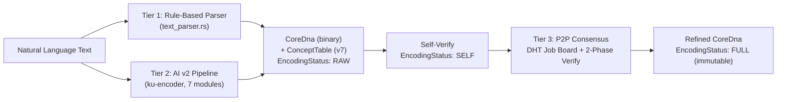
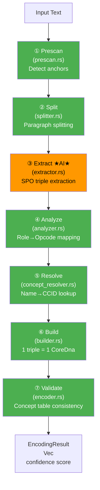
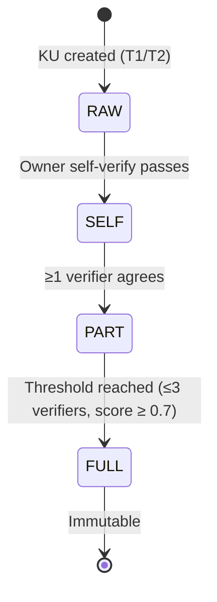

# KU Encoding Pipeline — 3-Tier Knowledge Encoding

> Specification version: 7.1 | Last updated: 2026-07-19
>
> *v7.1 update: Tier 2 (v2 pipeline) fully implemented. encode_v2 wired to OneBrainNode. CCID index added.*

---

## §1 Overview

The encoding pipeline converts natural language text into compact binary CoreDna using a 3-tier approach:



| Tier | Method | Accuracy | Status |
|------|--------|----------|--------|
| T1 | Rule-based pattern matching (`text_parser.rs`) | ~60-70% | ✅ Implemented |
| T2 | AI JSON extraction + deterministic build (`ku-encoder` v2) | ~85-90% | ✅ **Fully Implemented** |
| T3 | Distributed Encoding Consensus (DHT + 2-phase verify) | ~95%+ | 🔧 Designed (see [ENCODING_CONSENSUS_SPEC.md](file:///c:/Users/shpy2/Documents/OneBrain/docs/specs/ENCODING_CONSENSUS_SPEC.md)) |

### Node Integration (✅ Implemented)

`OneBrainNode` tự động chọn pipeline phù hợp:

```rust
// node.rs — encode_text()
if let Some(ref registry) = self.registry {
    // ConceptRegistry loaded → use v2 pipeline
    encoder.encode_v2(text, registry).await
} else {
    // Fallback to v1 (tool-calling)
    encoder.encode(text).await
}
```

- `ConceptRegistry` loaded from `concepts.obr` (~200MB, ~8M concepts) at startup
- Graceful fallback: if `concepts.obr` missing → v1 pipeline

---

## §2 Tier 1 — Rule-Based Parser

**Source**: [`text_parser.rs`](file:///c:/Users/shpy2/Documents/OneBrain/src/ku-core/src/text_parser.rs)

### 2.1 ConceptDict (Text Parser Version)

Simple word → ConceptId mapping for fast lookups:

```rust
pub struct ConceptDict {
    map: HashMap<String, ConceptId>,
    next_id: ConceptId,  // starts at 1000
}
```

### 2.2 Tier 0 Constants

80 universal concepts (IDs 0–79) in [`tier0_concepts.rs`](file:///c:/Users/shpy2/Documents/OneBrain/src/ku-core/src/tier0_concepts.rs). Encode as 1-byte varint.

### 2.3 Supported Patterns

| Pattern (VI) | Pattern (EN) | Instruction |
|-------------|-------------|-------------|
| "X là Y" | "X is Y" | Triple(X, IS_A, Y) |
| "X gồm A, B" | "X consists of A, B" | PartOf(A, X), PartOf(B, X) |
| "Bước N: action target" | "Step N: action target" | Step(N, act, tgt) |
| "= 35.2°" | "= 35.2°" | Quantity(F32) |
| "± 0.1" | "± 0.1" | Tolerance |

### 2.4 Core Function

```rust
pub fn parse_text_to_core_dna(
    text: &str,
    dict: &ConceptDict,
) -> Result<CoreDna, KuError>
```

---

## §3 Tier 2 — AI v2 Pipeline (✅ Fully Implemented)

**Source**: [`ku-encoder/src/`](file:///c:/Users/shpy2/Documents/OneBrain/src/ku-encoder/src)

### 3.1 Design Philosophy

> "Phần nào cần AI thì hãy dùng AI, còn phần nào không cần thì dùng code bình thường."

- **AI chỉ dùng cho extraction** (bước 3). Tất cả bước khác là deterministic code.
- **1 triple = 1 KU**: mỗi `ResolvedTriple` tạo 1 `CoreDna` riêng biệt
- **ConceptRegistry** (CCID-based) thay thế ConceptDict (deprecated)
- **Anchor protection**: formula/number anchors được bảo vệ khỏi AI hallucination

### 3.2 Pipeline Diagram



> 🟠 = AI required | 🟢 = Deterministic code

### 3.3 Step-by-Step Detail

#### Step 1: Prescan Anchors

**Module**: [`prescan.rs`](file:///c:/Users/shpy2/Documents/OneBrain/src/ku-encoder/src/prescan.rs)

Phát hiện các "anchor" — thuật ngữ cần bảo vệ khỏi AI:

| Anchor Type | Ví dụ | Detection Method |
|-------------|-------|------------------|
| Chemical formula | H₂O, NaCl, C₆H₁₂O₆ | Regex: uppercase + subscript digits |
| Math expression | E=mc², ΔG = −RT ln K | Unicode math symbols |
| Number + unit | 100°C, 3.14 rad | Regex: digits + unit suffix |
| Novel term | CRISPR-Cas9 | Heuristic: mixed case, hyphenated |

**Abbreviation filter**: 80+ common abbreviations (WHO, NASA, CPU, DNA, etc.) + heuristic (all-caps, no digits, ≤5 chars) → excluded from chemical formula detection.

```rust
pub fn prescan_anchors(text: &str) -> Vec<Anchor>
pub fn verify_anchors(anchors: &[Anchor], ai_output: &str) -> Vec<VerifyResult>
pub fn override_corrected(triples: &mut [SpoTriple], verified: &[VerifyResult])
```

#### Step 2: Split Paragraphs

**Module**: [`splitter.rs`](file:///c:/Users/shpy2/Documents/OneBrain/src/ku-encoder/src/splitter.rs)

```rust
pub fn split_paragraphs(text: &str) -> Vec<String>
```

Unicode-aware, handles CRLF/LF, filters empty paragraphs.

#### Step 3: Extract SPO Triples (★ AI Step)

**Module**: [`extractor.rs`](file:///c:/Users/shpy2/Documents/OneBrain/src/ku-encoder/src/extractor.rs)

Gọi AI qua `ModelBackend::chat()` (plain text JSON output, KHÔNG dùng tool-calling):

```rust
pub struct SpoExtractor<'a> { /* ... */ }

impl<'a> SpoExtractor<'a> {
    pub fn new(backend: &'a dyn ModelBackend) -> Self;
    pub fn with_temperature(self, t: f32) -> Self;
    pub fn with_max_retries(self, n: usize) -> Self;
    pub async fn extract(&self, paragraph: &str, anchors: &[Anchor])
        -> Result<Vec<SpoTriple>, EncoderError>;
}
```

**3-strategy JSON parser**: Xử lý output AI không chuẩn:
1. Code fence extraction (```` ```json ... ``` ````)
2. Bare array detection (`[{...}]`)
3. Full text parse (fallback)

**Output**: `Vec<SpoTriple>`

```rust
pub struct SpoTriple {
    pub subject: String,
    pub predicate: String,
    pub object: String,
    pub role: String,           // "subject", "causes", "part_of", "step", etc.
    pub certainty: String,      // "high", "medium", "low"
    pub context: Option<String>,
}
```

#### Step 4: Analyze

**Module**: [`analyzer.rs`](file:///c:/Users/shpy2/Documents/OneBrain/src/ku-encoder/src/analyzer.rs)

Deterministic mapping — không dùng AI:

| Role (from AI) | → Opcode | Instruction |
|----------------|----------|-------------|
| `subject` | Triple | SPO fact |
| `causes` | Causal | cause → effect |
| `enables` | Causal | enables |
| `part_of` | PartOf | part → whole |
| `located_at` | Located | S → location |
| `step` | Step | Procedure step |
| `has_quality` | Quality | S has Q |
| `measured_as` | Quantity | S = value unit |
| `similar_to` | Simulates | analogy |
| `condition` | Condition | if → then |
| `agent` | Agent | actor → action |
| `tool` | Tool | action → instrument |

**Certainty mapping**:

| AI Output | → u16 Value |
|-----------|------------|
| "certain", "high" | 9500 |
| "likely", "medium" | 7000 |
| "possible", "low" | 4000 |
| "uncertain" | 2000 |
| "speculative" | 1000 |

**Gene type detection**: `determine_gene_type(&[AnalyzedTriple]) -> u8`

```rust
pub fn analyze(triples: Vec<SpoTriple>) -> Vec<AnalyzedTriple>
```

#### Step 5: Resolve Concepts

**Module**: [`concept_resolver.rs`](file:///c:/Users/shpy2/Documents/OneBrain/src/ku-encoder/src/concept_resolver.rs)

Map concept names → CCIDs using `ConceptRegistry` (~8M concepts):

```rust
pub struct ConceptResolver<'a> {
    registry: &'a ConceptRegistry,
    local_map: HashMap<String, ConceptId>,
    next_local_id: ConceptId,  // starts at 16512 (Tier 2)
    warnings: Vec<ResolutionWarning>,
}
```

**Unicode normalization**: `lowercase + whitespace collapse` cho deterministic matching.

**Resolution strategies**:

| Result | Action |
|--------|--------|
| `Found` | Use CCID directly |
| `Fuzzy` | Use best match + emit `ResolutionWarning::Fuzzy` |
| `Ambiguous` | Pick first + emit `ResolutionWarning::Ambiguous` |
| `NotFound` | Create fallback CCID from BLAKE3(normalized_name) + emit `ResolutionWarning::Fallback` |

**Structured warnings** (replaces eprintln! logging):

```rust
pub struct ResolutionWarning {
    pub warning_type: ResolutionWarningType,
    pub original: String,
    pub resolved_to: String,
    pub candidate_count: usize,
}

pub enum ResolutionWarningType {
    Fuzzy,
    Ambiguous,
    Fallback,
}
```

#### Step 6: Build CoreDna

**Module**: [`builder.rs`](file:///c:/Users/shpy2/Documents/OneBrain/src/ku-encoder/src/builder.rs)

> **Quy tắc quan trọng: 1 ResolvedTriple = 1 CoreDna KU**

Mỗi triple được build thành CoreDna riêng biệt, self-contained:

```rust
pub struct KuBuilder;

impl KuBuilder {
    pub fn build(resolved: Vec<ResolvedTriple>)
        -> Result<Vec<(CoreDna, Vec<u8>)>, BuildError>;
}
```

Flow: ResolvedTriple → CoreDnaHeader (gene_type, has_concept_table=true) → ConceptTable (Tier 2+ entries only) → Instructions (Triple/Causal/PartOf/... + Certainty) → encode → wire bytes.

#### Step 7: Validate

**Inline trong [`encoder.rs`](file:///c:/Users/shpy2/Documents/OneBrain/src/ku-encoder/src/encoder.rs)**

Kiểm tra tính toàn vẹn sau khi build:

1. **Concept table consistency**: Mọi concept ref (Tier 2+) trong instruction stream phải có entry trong concept table
2. **Wire roundtrip**: `encode → decode → verify` không lỗi
3. **Drop tracking**: Nếu >50% paragraphs bị drop → return error

**Confidence formula**:

```
confidence = 0.5 × paragraph_success_rate + 0.5 × validation_success_rate

where:
  paragraph_success_rate = (total - dropped) / total
  validation_success_rate = valid_kus / (valid_kus + failed)
```

### 3.4 Data Types

**Module**: [`types.rs`](file:///c:/Users/shpy2/Documents/OneBrain/src/ku-encoder/src/types.rs)

```
SpoTriple (AI output) → AnalyzedTriple (opcoded) → ResolvedTriple (CCID'd) → CoreDna (binary)
```

| Type | Fields | Source |
|------|--------|--------|
| `Anchor` | text, anchor_type, notation, byte_range | prescan |
| `SpoTriple` | subject, predicate, object, role, certainty, context | extractor |
| `AnalyzedTriple` | subject, predicate, object, opcode, certainty_u16, gene_type | analyzer |
| `ResolvedTriple` | s_id, p_id, o_id, opcode, certainty_u16, gene_type, concept_entries | resolver |

### 3.5 Error Handling

**Module**: [`error.rs`](file:///c:/Users/shpy2/Documents/OneBrain/src/ku-encoder/src/error.rs)

```rust
pub enum EncoderError {
    NoToolCalls,        // AI produced no output
    NoTriples,          // Extraction found 0 triples  
    ToolExecution(String),
    AiError(AiError),
    CoreDnaError(String),
    ParseError(String),
}
```

### 3.6 Debug Logging

All debug output uses `debug_log!` macro — silenced in release builds:

```rust
macro_rules! debug_log {
    ($($arg:tt)*) => {
        #[cfg(debug_assertions)]
        eprintln!($($arg)*)
    };
}
```

### 3.7 Module Map

| Module | LOC | Tests | Purpose |
|--------|-----|-------|--------|
| `encoder.rs` | ~660 | 6 | v1 (tool-calling) + v2 (JSON) pipeline |
| `types.rs` | ~120 | — | SpoTriple, AnalyzedTriple, ResolvedTriple, Anchor |
| `splitter.rs` | ~60 | 8 | Paragraph splitting |
| `prescan.rs` | ~250 | 13 | Anchor detection + abbreviation filter |
| `extractor.rs` | ~340 | 10 | AI extraction + 3-strategy JSON parser |
| `analyzer.rs` | ~200 | 10 | Role→Opcode, certainty→u16 mapping |
| `concept_resolver.rs` | ~250 | 7 | ConceptRegistry→CCID resolution |
| `builder.rs` | ~180 | 6 | CoreDna build (1 triple = 1 KU) |
| `verifier.rs` | ~244 | 5 | Structural verification |
| `prompt.rs` | ~126 | 4 | Prompt construction |
| `fallback.rs` | ~252 | 5 | Accept/Retry/Tier1 decision |
| `batch.rs` | ~167 | 3 | Sequential multi-text encoding |
| `log.rs` | ~198 | 4 | Encoding audit log |
| `error.rs` | ~70 | — | Error types |
| **Total** | **~3100** | **118** | |

### 3.8 Public API (lib.rs)

```rust
// v1 pipeline
pub use encoder::{AiEncoder, EncodingResult, EncoderConfig};
pub use verifier::{EncodingVerifier, VerificationResult};
pub use fallback::{FallbackChain, EncodingDecision};
pub use batch::{BatchEncoder, BatchResult};
pub use log::{EncodingLog, LogEntry};
pub use error::EncoderError;

// v2 pipeline
pub use types::{SpoTriple, AnalyzedTriple, ResolvedTriple, Anchor, NotationType};
pub use concept_resolver::{ConceptResolver, ResolutionWarning, ResolutionWarningType};
pub use builder::KuBuilder;
pub use extractor::SpoExtractor;
```

---

## §4 Tier 1 — AI v1 Pipeline (Tool-Calling)

**Source**: [`encoder.rs`](file:///c:/Users/shpy2/Documents/OneBrain/src/ku-encoder/src/encoder.rs) — `AiEncoder::encode()`

Pipeline cũ, vẫn hoạt động như fallback khi ConceptRegistry không available:

```
Text → PromptBuilder → LLM (chat_with_tools) → ToolCallResponse[]
     → KuToolExecutor.execute() → finalize_all() → Vec<Vec<u8>>
     → EncodingVerifier → FallbackChain → EncodingResult
```

- AI generates tool calls: `new_ku()`, `add_triple()`, `add_quantity()`, `finalize()`
- Auto-fix: inject missing `new_ku` and `finalize` if model forgets
- FallbackChain: confidence ≥ 0.60 → Accept, else retry (max 2), else T1 fallback

---

## §5 Tier 3 — Distributed Encoding Consensus (Designed)

> Xem chi tiết: [ENCODING_CONSENSUS_SPEC.md](file:///c:/Users/shpy2/Documents/OneBrain/docs/specs/ENCODING_CONSENSUS_SPEC.md)

### 5.1 EncodingStatus State Machine



### 5.2 Two-Phase Verification

| Phase | Method | Check |
|-------|--------|-------|
| A: AI Decomposition | Run AI independently on raw text | gene_type match + Jaccard similarity ≥ 0.6 |
| B: Tool Encoding | Decode → re-encode wire bytes | BLAKE3 match + CRC-16 valid |

### 5.3 OBT Token Rewards

- Reward proportional to `raw_text.len()`
- Split equally among valid verifiers
- Bonus for consensus agreement

---

## §6 Storage Integration (✅ Implemented)

### 6.1 KuStorage Tables (redb)

| Table | Key | Value | Purpose |
|-------|-----|-------|--------|
| `kus` | CID (32B) | wire bytes | Core DNA (immutable) |
| `epigenetics` | CID (32B) | JSON | Layer 2 metadata |
| `index_trust` | trust_score(2B) + CID(32B) | empty | Range query index |
| `index_concept` | concept_id(8B) + CID(32B) | empty | Concept lookup |
| `index_ccid` | CCID(16B) + CID(32B) | empty | ★ NEW: O(1) concept→KU lookup |

### 6.2 GraphStorage (6 tables)

Bond edge indexes for O(1) graph traversal. See [OBS_SPEC.md](file:///c:/Users/shpy2/Documents/OneBrain/docs/specs/OBS_SPEC.md).

### 6.3 KQL Integration

`OneBrainNode::execute_kql()` uses real `LocalExecutor`:

```rust
let query = ku_kql::parser::parse_query(query_str)?;
let mut executor = ku_kql::executor::LocalExecutor::new();
for ku in storage.get_all()? {
    executor.insert(ku);
}
let result = executor.execute(&query)?;
```

`FIND HISTORY` wired to `EventAccumulator` — returns only KUs with recorded bond events.

---

## §7 Concept System Architecture (v7)

### 7.1 ConceptRegistry (Primary)

Offline lookup from concept name → CCID, loaded from `concepts.obr`:

```rust
pub enum ResolveResult {
    Found(ResolvedConcept),     // Exact match
    Ambiguous(Vec<ResolvedConcept>), // Multiple candidates
    Fuzzy(ResolvedConcept),     // Close match
    NotFound,                   // → fallback CCID from BLAKE3(name)
}
```

### 7.2 text_parser::ConceptDict (T1 only)

Simple `HashMap<String, ConceptId>` — still used by Tier 1 parser.

### 7.3 concept_dict::ConceptDict (Deprecated)

> [!WARNING]
> **Deprecated in v7** — use ConceptRegistry for new code.

---

## §8 Test Coverage

| Package | Tests | Status |
|---------|-------|--------|
| ku-encoder | 118 | ✅ All pass |
| ku-kql | 86 | ✅ All pass |
| ku-core | 834/840 | ✅ (6 pre-existing unrelated) |
| onebrain-node | — | ✅ Compiles clean |

---

## §9 Related Specifications

| Spec | Topic |
|------|-------|
| [KU_ARCHITECTURE.md](file:///c:/Users/shpy2/Documents/OneBrain/docs/specs/KU_ARCHITECTURE.md) | KU v7 3-layer architecture |
| [KU_CORE_DNA_SPEC.md](file:///c:/Users/shpy2/Documents/OneBrain/docs/specs/KU_CORE_DNA_SPEC.md) | Wire format, opcodes, concept table |
| [ENCODING_CONSENSUS_SPEC.md](file:///c:/Users/shpy2/Documents/OneBrain/docs/specs/ENCODING_CONSENSUS_SPEC.md) | Distributed T3 consensus |
| [PILLAR6_AI_TECHNICAL_SPEC.md](file:///c:/Users/shpy2/Documents/OneBrain/docs/specs/PILLAR6_AI_TECHNICAL_SPEC.md) | AI layer crate architecture |
| [KQL_SPEC.md](file:///c:/Users/shpy2/Documents/OneBrain/docs/specs/KQL_SPEC.md) | Query language |
| [OBS_SPEC.md](file:///c:/Users/shpy2/Documents/OneBrain/docs/specs/OBS_SPEC.md) | Storage layer |
