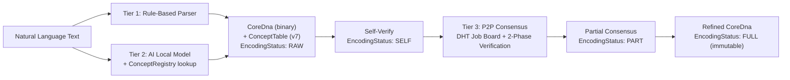
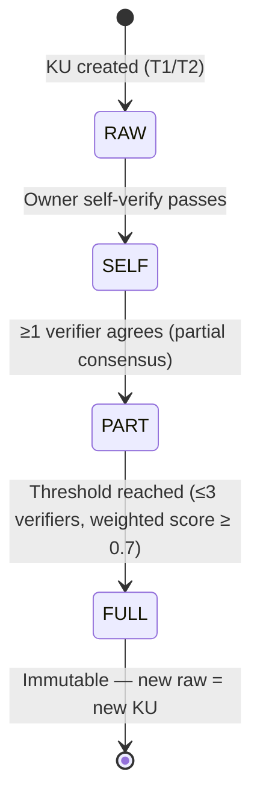

# KU Encoding Pipeline — 3-Tier Knowledge Encoding

> Specification version: 7.0 | Last updated: 2026-07-11

## §1 Overview

The encoding pipeline converts natural language text into compact binary CoreDna using a 3-tier approach:



| Tier | Method | Accuracy Target | Status |
|------|--------|----------------|--------|
| T1 | Rule-based pattern matching | ~60-70% | ✅ Implemented |
| T2 | Local AI model (Gemma, Qwen, etc.) | ~85-90% | 🔧 Stub (awaiting model integration) |
| T3 | Distributed Encoding Consensus — DHT job board + 2-phase verification + weighted scoring | ~95%+ | 🔧 Designed |

---

## §2 Tier 1 — Rule-Based Parser

**Source**: `text_parser.rs`

### 2.1 ConceptDict (Text Parser Version)

Simple word → ConceptId mapping for fast lookups:

```rust
pub struct ConceptDict {
    map: HashMap<String, ConceptId>,
    next_id: ConceptId,
}
```

Methods: `insert()`, `lookup()`, `lookup_or_create()`, `len()`, `is_empty()`, `iter()`

### 2.2 Well-Known ConceptIds (Tier 0 — v7)

v7 defines 80 universal Tier 0 concepts (IDs 0–79) in [tier0_concepts.rs](file:///c:/Users/shpy2/Documents/OneBrain/src/ku-core/src/tier0_concepts.rs). These replace the ad-hoc well-known IDs from v6:

| ID | Constant | Meaning |
|----|----------|---------|
| 0 | SELF_REF | Self-reference (identity) |
| 1 | IS_A | "is a" / "là" relationship |
| 2 | HAS_PART | "has part" / "gồm" relationship |
| 3 | RELATED_TO | Generic relation (fallback) |
| 16 | CAUSES | Causation |
| 18 | ENABLES | Enablement |
| 28 | AT | Location |
| 44 | UNIT_METER | m (meter) |
| 45 | UNIT_KILOGRAM | kg (kilogram) |
| 46 | UNIT_SECOND | s (second) |
| 48 | UNIT_KELVIN | K (kelvin) |
| 59 | UNIT_PERCENT | % (percent) |
| 63 | UNIT_DIMENSIONLESS | Dimensionless quantity |
| 127 | UNKNOWN_CONCEPT | Unknown/fallback (sentinel) |

> [!NOTE]
> Full list: 80 constants across 8 categories (Structural, Causal, Spatial, Logical, SI Units, Derived Units, Epistemological, Agentive Roles). See [tier0_concepts.rs](file:///c:/Users/shpy2/Documents/OneBrain/src/ku-core/src/tier0_concepts.rs).

### 2.3 Default Dictionary

`default_dict()` returns ~100 common concepts covering:
- Structural/meta predicates (is_a, has_part, related_to)
- Vietnamese terms (là, gồm, ở, tại)
- English terms (is, has, at, in)
- Scientific units and common nouns
- Sports, science, everyday vocabulary

### 2.4 Supported Patterns

| Pattern (VI) | Pattern (EN) | Instruction |
|-------------|-------------|-------------|
| "X là Y" | "X is Y" | Triple(X, IS_A, Y) |
| "X gồm A, B" | "X consists of A, B" | PartOf(A, X), PartOf(B, X) |
| "Bước N: action target" | "Step N: action target" | Step(N, act, tgt) |
| "= 35.2°" | "= 35.2°" | Quantity(F32) |
| "± 0.1" | "± 0.1" | Tolerance |
| bare numbers | bare numbers | Quantity |

### 2.5 Core Function

```rust
pub fn parse_text_to_core_dna(
    text: &str,
    dict: &ConceptDict,
) -> Result<CoreDna, KuError>
```

Output: `CoreDna` with auto-detected `gene_type` based on text patterns (v7: 13 gene types, values 0–12).

---

## §3 Tier 2 — AI Local Model (via KQL)

### 3.1 KQL Syntax

```
CREATE FROM TEXT "Nước sôi ở 100 độ C" WITH AI model="gemma4"
CREATE FROM TEXT "Water boils at 100°C" WITH AI model="qwen" gene_hint="fact"
```

### 3.2 AST

```rust
pub struct CreateFromTextQuery {
    pub text: String,
    pub model: String,
    pub gene_hint: Option<KqlGeneType>,
    pub signed_by: String,
}
```

### 3.3 Executor Flow

1. Parse natural language text via `text_parser::parse_text_to_core_dna()`
2. Override `gene_type` if `gene_hint` is provided
3. Create `KuRuntime::from_dna(dna)`
4. Insert into executor's KU store

**TODO**: When local AI models are integrated, the executor will call the model via `ku_tools.rs` / `ku_tool_executor.rs` for higher-accuracy decomposition. v7 adds `ConceptRegistry::resolve()` for CCID-based concept lookup instead of ConceptDict.

---

## §4 Tier 3 — Distributed Encoding Consensus (Designed)

> Reference: [ENCODING_CONSENSUS_SPEC.md](file:///c:/Users/shpy2/Documents/OneBrain/docs/specs/ENCODING_CONSENSUS_SPEC.md) for full specification.

### 4.1 EncodingStatus State Machine

Mỗi KU có một `EncodingStatus` theo dõi trạng thái encoding verification lifecycle:



| Status | Mô tả |
|--------|-------|
| `RAW` | Vừa tạo bởi T1 hoặc T2, chưa qua verification nào |
| `SELF` | Owner đã tự verify encoding round-trip thành công |
| `PART` | ≥1 verifier đồng ý, nhưng chưa đạt consensus threshold |
| `FULL` | Đạt consensus — encoding bất biến. Muốn sửa → tạo KU mới với raw mới |

### 4.2 EncodingJob — DHT Job Board

Khi KU đạt trạng thái `SELF`, owner đăng một **EncodingJob** lên DHT:

```rust
pub struct EncodingJob {
    pub ku_cid: [u8; 32],         // CID of the KU to verify
    pub raw_text: String,          // Original natural language text
    pub proposed_dna: Vec<u8>,     // Owner's proposed CoreDna wire bytes
    pub gene_hint: Option<u8>,     // Expected gene_type
    pub reward_obt: u64,           // OBT reward pool (proportional to raw size)
    pub max_verifiers: u8,         // Capped at 3
    pub posted_at: u64,            // Timestamp
    pub status: EncodingJobStatus, // Open / Claimed / Completed / Expired
}
```

Verifiers duyệt DHT job board, chọn job phù hợp với chuyên môn của mình.

### 4.3 ClaimToken — Anti-Stampede Mechanism

Để tránh nhiều verifiers cùng claim một job (stampede), sử dụng **ClaimToken**:

1. Verifier gửi `EncodingClaimReq` cho job
2. DHT cấp `ClaimToken` với TTL (time-to-live)
3. Chỉ verifier giữ token hợp lệ mới được submit kết quả
4. Token hết hạn → job trở lại trạng thái Open
5. Tối đa 3 ClaimTokens active cùng lúc per job (capped at 3 verifiers)

### 4.4 Two-Phase Verification

#### Phase A: AI Decomposition Agreement

Verifier chạy AI model độc lập trên `raw_text`, so sánh kết quả với `proposed_dna`:

| Metric | Phương pháp | Weight |
|--------|------------|--------|
| `gene_type` match | Exact match (binary 0/1) | Required — mismatch = reject |
| Opcode Jaccard | `\|opcodes_A ∩ opcodes_B\| / \|opcodes_A ∪ opcodes_B\|` | Similarity threshold ≥ 0.6 |
| Concept Jaccard | `\|concepts_A ∩ concepts_B\| / \|concepts_A ∪ concepts_B\|` | Similarity threshold ≥ 0.5 |

#### Phase B: Tool Encoding Round-Trip

Verifier kiểm tra tính toàn vẹn kỹ thuật:

1. Decode `proposed_dna` → `CoreDna` struct
2. Re-encode `CoreDna` → `wire_bytes_2`
3. So sánh: `BLAKE3(wire_bytes_2) == BLAKE3(proposed_dna)` ?
4. Validate: CRC-16 correct, all opcodes valid, varint well-formed

Cả hai phase phải PASS để verifier đồng ý.

### 4.5 Consensus Selection — Weighted Scoring

Khi đủ verifiers submit kết quả, consensus được tính bằng **weighted scoring**:

| Factor | Weight | Mô tả |
|--------|--------|-------|
| Agreement | 50% | Tỷ lệ verifiers đồng ý (agree / total) |
| Detail | 30% | Trung bình Jaccard scores (opcode + concept) |
| Reputation | 20% | Trung bình EigenTrust score của verifiers |

```
consensus_score = 0.50 × agreement_ratio
                + 0.30 × avg_detail_score
                + 0.20 × avg_reputation_score
```

Threshold: `consensus_score ≥ 0.7` → FULL. Nếu không đạt → giữ PART, có thể mở thêm verification round.

### 4.6 Immutability Rule

> **FULL = immutable**. Khi EncodingStatus đạt FULL, CoreDna bất biến hoàn toàn. Nếu cần sửa encoding, phải tạo KU mới với raw text mới → CID mới → vòng đời encoding mới.

Điều này đảm bảo content-addressable integrity: CID luôn đại diện chính xác nội dung đã được consensus verify.

### 4.7 OBT Token Rewards

Verifiers nhận **OBT tokens** khi tham gia encoding consensus:

- Reward tỷ lệ thuận với `raw_text.len()` (raw size)
- Chia đều giữa các verifiers đã submit kết quả hợp lệ
- Bonus cho verifier đồng ý với kết quả consensus cuối cùng
- Penalty nhẹ cho reject sai (verifier reject nhưng consensus = agree)

### 4.8 Stigmergy — Load Balancing

Sử dụng **pheromone-based load balancing** (stigmergy) để phân phối jobs hiệu quả:

- Mỗi domain/niche có "pheromone level" phản ánh workload hiện tại
- Verifiers ưu tiên jobs ở niches có pheromone thấp (ít người verify)
- Pheromone evaporate theo thời gian → tự cân bằng
- Tránh bottleneck ở domains phổ biến

### 4.9 Code Modules

| Crate | Module | Mô tả |
|-------|--------|-------|
| `ku-core` | `encoding_consensus.rs` | EncodingStatus state machine, EncodingSubmission, EncodingConsensus logic |
| `ku-core` | `encoding_verifier.rs` | 2-phase verification: AI decomposition agreement + tool encoding round-trip |
| `ku-core` | `encoding_reward.rs` | OBT token reward calculation and distribution |
| `ku-net` | `encoding_job.rs` | EncodingJob DHT job board, posting and browsing |
| `ku-net` | `encoding_gossip.rs` | Gossip protocol for encoding job announcements |
| `ku-net` | `encoding_stigmergy.rs` | Pheromone-based load balancing for verifier selection |

---

## §5 Concept System Architecture (v7)

### 5.1 ConceptRegistry (v7 — primary)

Offline concept name → CCID lookup from `concepts.obr` file (~200MB, ~8M concepts). See [concept_registry.rs](file:///c:/Users/shpy2/Documents/OneBrain/src/ku-core/src/concept_registry.rs).

```rust
pub struct ConceptRegistry {
    label_index: HashMap<String, Vec<usize>>,
    fuzzy_index: HashMap<String, String>,
    entries: Vec<ResolvedConcept>,
}

pub enum ResolveResult {
    Found(ResolvedConcept),
    Ambiguous(Vec<ResolvedConcept>),
    Fuzzy(ResolvedConcept),
    NotFound,  // → AI creates Definition KU, BLAKE3 → CCID
}
```

Encoding flow: AI extracts concept → `registry.resolve(name)` → CCID → local_id + ConceptTable entry.

### 5.2 text_parser::ConceptDict (Tier 1 — legacy)

Simple `HashMap<String, ConceptId>` for fast word → ID lookups during rule-based parsing. Still used by Tier 1 parser.

### 5.3 concept_dict::ConceptDict (deprecated)

> [!WARNING]
> **Deprecated in v7** — use `ConceptRegistry` for new code. Legacy code will be migrated.

Rich bilingual dictionary with `ConceptEntry`:

```rust
pub struct ConceptEntry {
    pub id: ConceptId,
    pub name: String,
    pub name_vi: Option<String>,
    pub name_en: Option<String>,
    pub tier: u8,
    pub category: Option<String>,
}
```

Still used by `KuRuntime::expression()` for multilingual rendering until migration complete.

### 5.4 PersistentConceptDict (deprecated)

redb-backed persistence. **Deprecated in v7** — will be replaced by ConceptRegistry persistence.

---

## §6 Varint Encoding for ConceptIds

| Range | Bytes | Tier | Use |
|-------|-------|------|-----|
| 0 – 127 | 1 | 0 | Universal primitives (IS_A, units) |
| 128 – 16,383 | 2 | 1 | Common concepts (~15K) |
| 16,384 – 2,097,151 | 3 | 2 | Domain-specific (~2M) |
| 2,097,152+ | 4-10 | 3+ | Rare/auto-generated |

Lower-tier concepts use fewer bytes → more compact encoding for common knowledge.

---

## §7 Binary Wire Format

```
MAGIC(0x4B) | VER_META(1B) | [CONCEPT_TABLE] | INSTRUCTION_STREAM | END(0x1E) | CRC-16(2B)
```

v7: VER_META bit[0] = `has_concept_table`. If set, ConceptTable follows header before instructions.

### Concept Table (v7)

```
varint(entry_count) | { varint(local_id) + CCID(16 bytes) } × entry_count
```

Only Tier 2+ concepts (ID ≥ 16512) need entries. Tier 0 (0–127) and Tier 1 (128–16511) are universal.

### Instruction Encoding

Each instruction: `OPCODE_BYTE | operands...`

OPCODE_BYTE layout:
- bits[7:3] = opcode (0x00-0x1F)
- bits[2:0] = modifier bits (instruction-specific)

Operands use varint encoding for ConceptIds and type-prefixed encoding for numeric values (0xFA-0xFF prefix bytes).

### CID Computation

```rust
let encoded = encode_core_dna(&dna)?;
let cid: [u8; 32] = blake3::hash(&encoded).into();
```

BLAKE3 produces a 32-byte content identifier. This CID is the KU's permanent identity.
