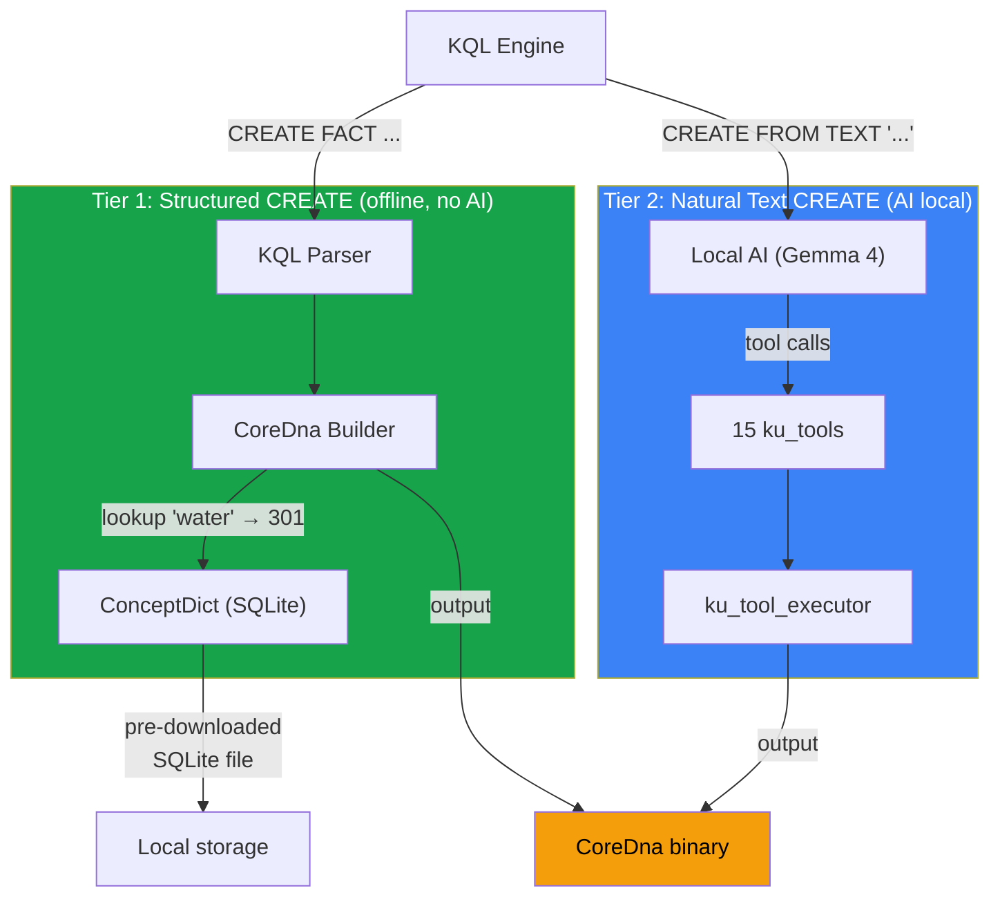
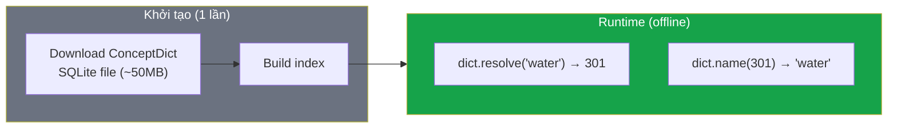
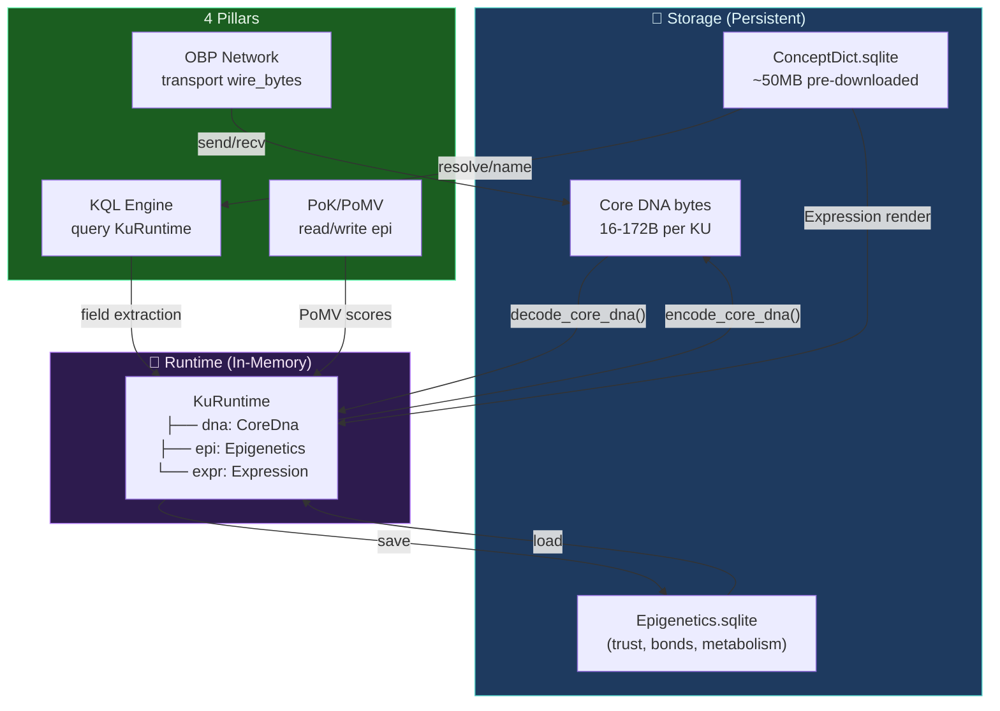

# Giải quyết 3 câu hỏi kiến trúc KU v6

## Bối cảnh

- **Không có backward compatibility** — thiết kế mới hoàn toàn cho v6
- **Không có data cũ** — không cần migration
- **Tuân thủ phân tán** — AI local, không cần mạng runtime
- **ConceptDict có thể download trước** — data khởi tạo offline

---

## Q1: In-memory struct nào cho KQL?

### Vấn đề

Hiện tại có 2 struct song song:

| Struct | File | Vai trò |
|--------|------|---------|
| `KnowledgeUnit` | [types.rs](file:///c:/Users/shpy2/Documents/OneBrain/src/ku-core/src/types.rs#L1210-L1236) | v5 — codons, bonds, gene, trust, epigenetic |
| `CoreDna` | [core_dna.rs](file:///c:/Users/shpy2/Documents/OneBrain/src/ku-core/src/core_dna.rs#L354-L357) | v6 — header + Vec\<Instruction\> |

KQL hiện dùng `KnowledgeUnit`. Câu hỏi: tiếp tục dùng `KnowledgeUnit` hay chuyển sang `CoreDna`?

### Phân tích

```
KnowledgeUnit (v5)              CoreDna (v6)
├── codons: Vec<Codon>          ├── header: CoreDnaHeader
├── bonds: Vec<Bond>            │   ├── version: u8
├── gene: Gene                  │   ├── gene_type: u8
├── flags: HeaderFlags          │   └── has_qualifiers: bool
├── epistemic_status            └── instructions: Vec<Instruction>
├── evidence_type                       ├── Triple { s, p, o }
├── trust: TrustSection                 ├── Quality { s, q }
└── epigenetic: EpigeneticSection       ├── Quantity { s, value, unit }
                                        ├── Step { ord, action, target }
                                        ├── Certainty { level }
                                        ├── ... (32 opcodes)
                                        └── End
```

| Tiêu chí | `KnowledgeUnit` | `CoreDna` |
|-----------|:---:|:---:|
| Chứa knowledge content | ✅ (codons, gene) | ✅ (instructions) |
| Chứa trust metadata | ✅ (trust, epigenetic) | ❌ (Epigenetics layer riêng) |
| Query-friendly | ✅ Named fields | 🟡 Phải scan instructions |
| Compact storage | ❌ CBOR bloated | ✅ 16-88B binary |
| v6 native | ❌ Legacy v5 | ✅ Core DNA native |
| Phản ánh 3-layer đúng | ❌ Trộn tất cả vào 1 struct | ✅ Chỉ Layer 1 |

### 🎯 Quyết định: **Dùng kiến trúc 3-struct tương ứng 3-layer**

Thay vì chọn 1 trong 2 struct cũ, tạo kiến trúc mới phản ánh đúng 3-layer:

```rust
/// === LAYER 1: Core DNA (Stored) ===
/// Đây là struct CoreDna đã có — KHÔNG thay đổi
pub struct CoreDna {
    pub header: CoreDnaHeader,
    pub instructions: Vec<Instruction>,
}

/// === LAYER 2: Epigenetics (Runtime) ===  
/// Tách từ KnowledgeUnit cũ — metadata runtime
pub struct Epigenetics {
    pub trust: Option<TrustSection>,        // PoMV ghi 6 scores
    pub bonds: Vec<Bond>,                    // 33 bond types
    pub epistemic_status: EpistemicStatus,
    pub evidence_type: EvidenceType,
    pub epigenetic: Option<EpigeneticSection>,
}

/// === LAYER 3: Expression (Generated) ===
/// Generated on-demand từ CoreDna + ConceptDict
pub struct Expression {
    pub text: String,        // Natural language
    pub lang: String,        // "vi", "en", etc.
    pub concept_names: HashMap<ConceptId, String>, // Cached names
}

/// === FULL KU: Runtime composite ===
/// Tổng hợp cả 3 layers cho KQL queries
pub struct KuRuntime {
    /// Content identity
    pub cid: [u8; 32],          // BLAKE3(core_dna_bytes)
    
    /// Layer 1: Core DNA (always present)
    pub dna: CoreDna,
    
    /// Layer 2: Epigenetics (optional — may not exist for new KU)
    pub epi: Option<Epigenetics>,
    
    /// Layer 3: Expression (lazy-generated)
    pub expr: Option<Expression>,
    
    /// Raw wire bytes (for storage/transport)
    pub wire_bytes: Vec<u8>,
}
```

### Tại sao đây là lựa chọn tốt nhất?

1. **Phản ánh đúng kiến trúc 3-layer** — mỗi struct = 1 layer
2. **KQL queries** vào `KuRuntime` — có access vào cả 3 layers
3. **Storage** chỉ persist `wire_bytes` (Core DNA) — compact
4. **PoK/PoMV** chỉ đọc/ghi `epi` (Epigenetics) — không cần Core DNA
5. **OBP transport** chỉ gửi `wire_bytes` — minimal bandwidth
6. **Expression** lazy-generated — không tốn memory nếu không cần

### KQL field extraction trên `KuRuntime`

```rust
impl KuRuntime {
    /// Extract field value — scan Core DNA instructions
    fn extract_field(&self, field: &str) -> Option<FieldValue> {
        match field {
            // Core DNA fields (scan instructions)
            "concept_ids" => {
                let ids = self.dna.extract_concept_ids();
                Some(FieldValue::List(ids))
            }
            "primary_concept" => {
                self.dna.instructions.iter().find_map(|i| match i {
                    Instruction::Triple { s, .. } => Some(FieldValue::U64(*s)),
                    Instruction::Quality { s, .. } => Some(FieldValue::U64(*s)),
                    Instruction::PartOf { part, .. } => Some(FieldValue::U64(*part)),
                    _ => None,
                })
            }
            "certainty" => {
                self.dna.instructions.iter().find_map(|i| match i {
                    Instruction::Certainty { level } => Some(FieldValue::U16(*level)),
                    _ => None,
                })
            }
            "gene_type" => Some(FieldValue::U8(self.dna.header.gene_type)),
            "instruction_count" => Some(FieldValue::Usize(self.dna.instructions.len())),
            
            // Epigenetics fields (direct access)
            "trust_score" => self.epi.as_ref()
                .and_then(|e| e.trust.as_ref())
                .map(|t| FieldValue::U16(t.trust_score)),
            "confidence" => self.epi.as_ref()
                .and_then(|e| e.trust.as_ref())
                .map(|t| FieldValue::U16(t.confidence)),
            "bond_count" => self.epi.as_ref()
                .map(|e| FieldValue::Usize(e.bonds.len())),
            "epistemic_status" => self.epi.as_ref()
                .map(|e| FieldValue::Status(e.epistemic_status)),
            
            // Expression fields (lazy)
            "text" => self.expr.as_ref()
                .map(|e| FieldValue::String(e.text.clone())),
                
            _ => None,
        }
    }
}
```

> [!IMPORTANT]
> **Instruction scan có performance tốt**: Một KU điển hình có 3-8 instructions. Scan O(n) với n < 10 là negligible — nhanh hơn cả hash lookup cho struct cũ vì cache locality tốt hơn trên Vec nhỏ.

---

## Q2: CID migration — Không cần

Vì không có data cũ, CID chỉ tính từ Core DNA v6 bytes:

```rust
pub fn compute_cid(core_dna_bytes: &[u8]) -> [u8; 32] {
    blake3::hash(core_dna_bytes).into()
}
```

Đơn giản, thống nhất. Không có v5 CID nào cần lo.

---

## Q3: KQL CREATE — Build CoreDna trực tiếp qua ConceptDict

### Phân tích 3 options

| Option | Mô tả | Phân tán? | Offline? | Chất lượng |
|--------|--------|:---:|:---:|:---:|
| A. Bridge convert | Tạo `KnowledgeUnit` → convert sang `CoreDna` | ✅ | ✅ | 🟡 Qua trung gian |
| **B. Build CoreDna trực tiếp** | KQL tạo `CoreDna` trực tiếp từ ConceptDict | ✅ | ✅ | ✅ Native |
| C. Gọi AI tools | KQL gọi AI local → AI gọi tools → tạo CoreDna | ✅ | ⚠️ Cần AI model | ✅ Mạnh |

### 🎯 Quyết định: **Option B + C hybrid** (2-tier trong KQL)



### Tier 1: Structured CREATE (KQL syntax → CoreDna trực tiếp)

Khi user viết KQL query có cấu trúc rõ ràng:

```sql
-- KQL structured CREATE  
CREATE FACT gene=Fact certainty=9000
  TRIPLE(water, boils_at, 100_celsius)
  LOCATED(water, sea_level)
```

KQL parser → tạo CoreDna trực tiếp:

```rust
impl KqlEngine {
    fn exec_create_structured(&self, create: &CreateQuery) -> Result<KuRuntime> {
        let mut instructions = Vec::new();
        
        for clause in &create.clauses {
            match clause {
                Clause::Triple(s, p, o) => {
                    instructions.push(Instruction::Triple {
                        s: self.dict.resolve(s)?,  // "water" → 301
                        p: self.dict.resolve(p)?,  // "boils_at" → 500
                        o: self.dict.resolve(o)?,  // "100_celsius" → 1042
                    });
                }
                Clause::Located(s, loc) => {
                    instructions.push(Instruction::Located {
                        s: self.dict.resolve(s)?,
                        location: self.dict.resolve(loc)?,
                    });
                }
                Clause::Certainty(level) => {
                    instructions.push(Instruction::Certainty { level: *level });
                }
                // ... other clause types
            }
        }
        
        let dna = CoreDna {
            header: CoreDnaHeader {
                version: 1,
                gene_type: create.gene_type as u8,
                has_qualifiers: false,
            },
            instructions,
        };
        
        let wire = encode_core_dna(&dna)?;
        let cid = blake3::hash(&wire).into();
        
        Ok(KuRuntime {
            cid,
            dna,
            epi: Some(Epigenetics::default()),
            expr: None,
            wire_bytes: wire,
        })
    }
}
```

**Đặc điểm Tier 1:**
- ✅ **100% offline** — chỉ cần ConceptDict (SQLite file, pre-downloaded)
- ✅ **Nhanh** — no AI inference, pure Rust logic
- ✅ **Xác định** — cùng input → cùng output
- ⚠️ **Yêu cầu user biết concept names** hoặc concept IDs

### Tier 2: Natural Text CREATE (AI local → tools)

Khi user muốn encode text tự nhiên:

```sql
-- KQL natural text CREATE
CREATE FROM TEXT "Nước sôi ở 100 độ C tại mực nước biển"
  WITH AI model="gemma4" tier=2
```

KQL → gọi local AI → AI gọi 15 tools → CoreDna:

```rust
impl KqlEngine {
    fn exec_create_from_text(&self, text: &str) -> Result<Vec<KuRuntime>> {
        // Generate system prompt + tool definitions
        let prompt = ku_system_prompt::generate(&self.dict);
        let tools = ku_tools::get_tool_definitions();
        
        // Call local AI (pluggable runtime)
        let ai_response = self.ai_runtime.chat(prompt, text, &tools)?;
        
        // Execute tool calls → build CoreDna
        let kus = ku_tool_executor::execute_tool_calls(
            &ai_response.tool_calls,
            &self.dict,
        )?;
        
        Ok(kus.into_iter().map(|dna| {
            let wire = encode_core_dna(&dna).unwrap();
            KuRuntime {
                cid: blake3::hash(&wire).into(),
                dna,
                epi: Some(Epigenetics::default()),
                expr: None,
                wire_bytes: wire,
            }
        }).collect())
    }
}
```

**Đặc điểm Tier 2:**
- ✅ **Local AI** — Gemma 4, Qwen, Phi-3 (chạy local trên device)
- ✅ **Phân tán** — không cần cloud, không cần mạng
- ✅ **Pluggable** — đổi AI model bất cứ lúc nào
- ⚠️ **Cần GPU/NPU** — cần phần cứng đủ mạnh cho AI inference

### ConceptDict — Pre-downloaded SQLite



```rust
/// ConceptDict — SQLite-backed bidirectional concept lookup
pub struct ConceptDict {
    db: rusqlite::Connection,  // SQLite file
}

impl ConceptDict {
    /// Open from pre-downloaded SQLite file
    pub fn open(path: &str) -> Result<Self> {
        let db = Connection::open(path)?;
        Ok(Self { db })
    }
    
    /// Text → ConceptId (supports multiple languages)
    pub fn resolve(&self, text: &str) -> Result<ConceptId> {
        self.db.query_row(
            "SELECT concept_id FROM concepts WHERE name = ?1 
             OR name_vi = ?1 OR name_en = ?1",
            [text],
            |row| row.get(0),
        ).map_err(|_| KuError::ConceptNotFound(text.into()))
    }
    
    /// ConceptId → Text (for Expression layer)
    pub fn name(&self, id: ConceptId, lang: &str) -> Result<String> {
        let col = match lang {
            "vi" => "name_vi",
            "en" => "name_en",
            _ => "name",
        };
        self.db.query_row(
            &format!("SELECT {} FROM concepts WHERE concept_id = ?1", col),
            [id],
            |row| row.get(0),
        ).map_err(|_| KuError::ConceptNotFound(format!("ID:{}", id)))
    }
    
    /// Register new concept (returns new ConceptId)
    pub fn register(&mut self, name: &str, lang: &str) -> Result<ConceptId> {
        // Auto-assign ID based on tier
        let next_id = self.next_available_id()?;
        self.db.execute(
            "INSERT INTO concepts (concept_id, name, language) VALUES (?1, ?2, ?3)",
            rusqlite::params![next_id, name, lang],
        )?;
        Ok(next_id)
    }
}
```

**ConceptDict phân phối:**
- **Khởi tạo**: Download SQLite file chứa ~16K core concepts (Tier 0 + Tier 1)
- **Runtime**: Hoàn toàn offline
- **Mở rộng**: Node tự register concepts mới → sync qua OBP gossip
- **Không cần mạng** cho operations bình thường

---

## Tổng hợp kiến trúc mới



## Checklist quyết định

| Câu hỏi | Quyết định | Lý do |
|----------|-----------|-------|
| In-memory struct? | **`KuRuntime`** (3-struct composite) | Phản ánh đúng 3-layer, mỗi pillar access đúng layer |
| Backward compat? | **Không** — bỏ hết v4/v5 code | Thiết kế mới, không có data cũ |
| KQL CREATE? | **Tier 1 + Tier 2 hybrid** | Tier 1 offline (ConceptDict), Tier 2 local AI |
| ConceptDict? | **SQLite pre-downloaded** | Offline, phân tán, mở rộng được |
| OBP payload? | **Core DNA bytes trực tiếp** | Không qua CBOR, nhỏ nhất |
| PoK storage? | **Epigenetics SQLite riêng** | Tách stored (DNA) khỏi runtime (Epi) |
| Expression? | **Lazy-generated** | Chỉ tạo text khi user cần xem |

> [!WARNING]
> ### Breaking Changes cần thực hiện
> 
> Vì không cần backward compat, các thay đổi sau sẽ clean hơn:
> 1. **Xóa** `KnowledgeUnit` struct trong `types.rs` (thay bằng `KuRuntime`)
> 2. **Xóa** `encoder.rs` và `decoder.rs` (v5 CBOR encoder/decoder)  
> 3. **Xóa** bridge conversion code (không cần v5↔v6 convert)
> 4. **Đổi** KQL executor dùng `KuRuntime` thay vì `KnowledgeUnit`
> 5. **Đổi** OBP message fields: `results_cbor` → `results_payload`
> 6. **Thêm** `ConceptDict` SQLite module
> 7. **Thêm** `Epigenetics` struct tách riêng

> [!CAUTION]
> ### Giữ lại gì?
> 
> Tuy bỏ backward compat, các module sau **vẫn giữ nguyên**:
> - `core_dna.rs` — Core DNA encoder/decoder ✅
> - `varint.rs` — 5-tier varint ✅  
> - `crdt.rs` — 5 CRDT types ✅
> - Toàn bộ 12 PoK/PoMV modules ✅
> - `text_parser.rs` — Tier 1 rule-based parser ✅
> - `ku_tools.rs`, `ku_tool_executor.rs`, `ku_system_prompt.rs` — AI tools ✅
> - `types.rs` — giữ TrustSection, EpistemicStatus, Gene enum, Bond, BondType (move vào module mới)
