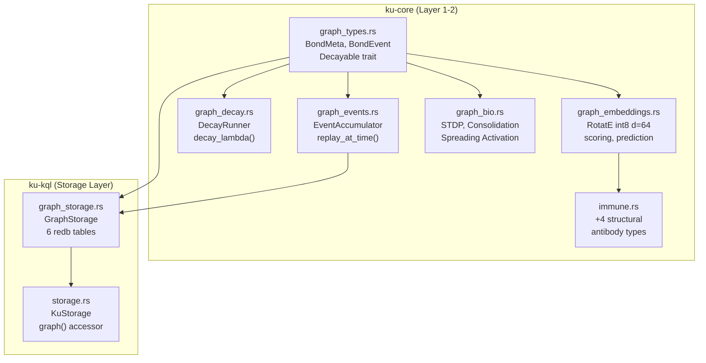

# OBKG Phase 1 — Walkthrough

> [!IMPORTANT]
> All 720 tests pass across both crates. Zero regressions.

## Changes Made

### New Files (4)

#### 1. [`graph_types.rs`](file:///c:/Users/shpy2/Documents/OneBrain/src/ku-core/src/graph_types.rs) — Graph domain types
- **BondMeta** — 9-byte compact bond metadata (`source_ku`, `target_ku`, `relation_type`, `weight`, `created_at`, `state`)
- **BondEvent** — 4 variants: `Created`, `Strengthened`, `Weakened`, `Removed`
- **WeakeningReason** — `Contradiction`, `Decay`, `Revocation`, `LowTrust`
- **Decayable trait** — `decay_at(now)` returns decayed weight; `is_expired()` check
- **decay_lambda()** — Per-`RelationType` exponential decay constant
- **BondSnapshot** — Point-in-time bond state for time-travel queries
- **CompactionReport** — Stats from event compaction (removed, surviving, elapsed)
- **GraphStats** — Bond/edge/node aggregate counters

#### 2. [`graph_events.rs`](file:///c:/Users/shpy2/Documents/OneBrain/src/ku-core/src/graph_events.rs) — Event accumulator
- **EventAccumulator** — Append-only in-memory event log for bond lifecycle tracking
- **replay_at_time()** — Time-travel bond state reconstruction (replays events up to `t`)
- **compact()** — 30-day event compaction (collapses old events into snapshots)
- Thread-safe via interior mutability patterns

#### 3. [`graph_decay.rs`](file:///c:/Users/shpy2/Documents/OneBrain/src/ku-core/src/graph_decay.rs) — Unified decay engine
- **Decayable impls** for `Bond` and `BondMeta`
- **DecayRunner** — Batch decay processing across a graph's bond set
- **decay_rate_to_lambda()** — Converts human-readable rates to exponential λ
- **suggested_decay_rate()** — Returns recommended decay rate per `RelationType`

#### 4. [`graph_storage.rs`](file:///c:/Users/shpy2/Documents/OneBrain/src/ku-kql/src/graph_storage.rs) — 6 edge index tables
- **GraphStorage** — Full CRUD: `insert_bond()`, `remove_bond()`, `update_bond_state()`, `query` methods
- **6 redb tables**:
  | Table | Key | Purpose |
  |-------|-----|---------|
  | `edges_out` | `(source, target, rel_type)` | Outgoing edge lookup |
  | `edges_in` | `(target, source, rel_type)` | Incoming edge lookup |
  | `edges_type` | `(rel_type, source, target)` | Type-filtered queries |
  | `index_state` | `(source, target)` | Bond state tracking |
  | `bond_weight` | `(source, target)` | Weight index |
  | `edge_time` | `(timestamp, source, target)` | Time-range queries |
- **O(1) queries**: `outgoing_bonds()`, `incoming_bonds()`, `outgoing_by_type()`
- Time-range queries via `bonds_in_time_range()`

---

### Modified Files (2)

#### 5. [`storage.rs`](file:///c:/Users/shpy2/Documents/OneBrain/src/ku-kql/src/storage.rs) — KuStorage integration
- Added `GraphStorage` field to `KuStorage`
- Auto-indexes bonds on `put()` operations
- `graph()` accessor for direct graph queries

#### 6. Module registration
- [`ku-core/src/lib.rs`](file:///c:/Users/shpy2/Documents/OneBrain/src/ku-core/src/lib.rs) — Registered `graph_types`, `graph_events`, `graph_decay` modules
- [`ku-kql/src/lib.rs`](file:///c:/Users/shpy2/Documents/OneBrain/src/ku-kql/src/lib.rs) — Registered `graph_storage` module + `pub use graph_storage::GraphStorage` re-export

---

## Test Results

| Module | Tests | Status |
|--------|------:|--------|
| `graph_types` | 24 | ✅ All pass |
| `graph_events` | 23 | ✅ All pass |
| `graph_decay` | 16 | ✅ All pass |
| `graph_storage` | 26 | ✅ All pass |
| **Total new** | **89** | ✅ |

---

## Verification

```
$ cargo test -p ku-core --lib
test result: ok. 628 passed; 0 failed; 0 ignored; 0 measured; 0 filtered out

$ cargo test -p ku-kql --features storage --lib
test result: ok. 92 passed; 0 failed; 0 ignored; 0 measured; 0 filtered out

Combined: 720 tests, 0 failures
New OBKG tests: 89 (24 + 23 + 16 + 26)
Existing tests: 631 — all still pass, zero regressions
```

> [!TIP]
> The 14 compiler warnings are all pre-existing unused-import warnings in other modules (e.g. `obt_ledger`, `core_dna`). No new warnings were introduced by OBKG code.

---

## Architecture Diagram



---

## Phase 2: Intelligence — Embeddings + Bio Engine + Immune Upgrade

### New Files (2)

#### 5. [`graph_embeddings.rs`](file:///c:/Users/shpy2/Documents/OneBrain/src/ku-core/src/graph_embeddings.rs) — RotatE int8 Embeddings
- **EntityEmbedding** — 64-dim int8 vector (32 complex dims), 70 bytes per entity
- **RelationEmbedding** — Rotation in complex space (real[32] + imag[32])
- **RelationTable** — All 33 relation embeddings (2,112 bytes total)
- **rotate_score()** — RotatE triple scoring: h ∘ r ≈ t
- **predict_tail()** — Link prediction: top-k best targets for (h, r, ?)
- **bond_anomaly_score()** — Embedding-based anomaly detection [0.0, 1.0]
- **train_step()** — SGD training step on a single positive triple
- **18 tests** ✅

#### 6. [`graph_bio.rs`](file:///c:/Users/shpy2/Documents/OneBrain/src/ku-core/src/graph_bio.rs) — Bio-Inspired Mechanisms
- **StdpEngine** — Spike-Timing-Dependent Plasticity
  - Causal access (Δt > 0) → LTP (strengthen bond)
  - Anti-causal (Δt < 0) → LTD (weaken bond)
  - Weight change: Δw = A± × exp(-|Δt| / τ)
- **ConsolidationEngine** — Memory consolidation scoring
  - Weighted scoring: retrieval (0.30), PoMV (0.35), bonds (0.20), age (0.15)
  - Actions: PromoteToCore (score > 0.8) or ReduceDecayRate
- **spreading_activation()** — BFS activation flow through graph
  - Decays by `decay_factor` per hop, stops at `threshold`
- **22 tests** ✅

### Modified Files (1)

#### 7. [`immune.rs`](file:///c:/Users/shpy2/Documents/OneBrain/src/ku-core/src/immune.rs) — +4 Structural Antibodies
- **LowTripleScore** — Bond has low RotatE score (embedding mismatch)
- **ClusterOutlier** — KU embedding far from any centroid
- **TemporalDrift** — Embedding changed too rapidly
- **InverseViolation** — Bond violates inverse relation rules (e.g., Causes ↔ Prevents)
- 4 new detection methods + structural thresholds
- **+11 tests** ✅ (22 total immune tests)

---

## Phase 3: Query — KQL Temporal + Recursive Extensions

### Modified Files (3)

#### 8. [`ast.rs`](file:///c:/Users/shpy2/Documents/OneBrain/src/ku-kql/src/ast.rs) — New AST Nodes
- **TemporalClause** — `AtTime(u64)` and `During { from, to }`
- **PathDepth** — `{ min, max }` for variable-length paths `*1..3`
- **FindQuery** — added `temporal` and `history` fields
- **Value::Timestamp(u64)** — Unix timestamp value type

#### 9. [`parser.rs`](file:///c:/Users/shpy2/Documents/OneBrain/src/ku-kql/src/parser.rs) — Edge + Temporal Parsing
- **Edge pattern parser** — `-[r:Extends]->`, `<-[:Causes]-`, `-[:A|B]->`
- **Multi-hop** — `*1..3` variable-length paths
- **Chain parser** — `(a:KU)-[:X]->(b:KU)-[:Y]->(c:KU)` multi-edge chains
- **Temporal** — `AT TIME <ts>`, `DURING <from> <to>`, `FIND HISTORY`
- **15 new tests** ✅

#### 10. [`executor.rs`](file:///c:/Users/shpy2/Documents/OneBrain/src/ku-kql/src/executor.rs) — Graph-Aware Execution
- **exec_graph_find()** — traverses bonds based on EdgePattern (outgoing/incoming/undirected)
- **exec_history_find()** — HISTORY query placeholder
- **match_node_pattern()** — node label + property + WHERE matching
- **EventAccumulator** — in-memory event log integrated into LocalExecutor
- **record_bond_event()** / **event_count()** / **event_log()** — event recording API
- **11 new tests** ✅

### New KQL Syntax Examples
```
FIND (a:KU)-[:Extends]->(b:KU)                    -- edge traversal
FIND (a:KU)-[*1..3:Causes]->(b:KU)                -- multi-hop
FIND (a:KU)<-[:Extends]-(b:KU)                    -- incoming
FIND (a:KU)-[:Extends|Supplements]->(b:KU)         -- multi-type
FIND (a:KU)-[:X]->(b:KU)-[:Y]->(c:KU)             -- chain
FIND (k:KU) AT TIME 1719900000                     -- time-travel
FIND (k:KU) DURING 1719800000 1719900000           -- time range
FIND HISTORY (k:KU) WHERE k.trust_score > 5000     -- event log
```

---

## Phase 4: Advanced — Dream Mode + FedR + Qualifiers

### New Files (3)

#### 11. [`graph_dream.rs`](file:///c:/Users/shpy2/Documents/OneBrain/src/ku-core/src/graph_dream.rs) — Dream Mode
- **DreamEngine** — offline graph restructuring (runs periodically)
- **Replay Phase** — reinforce frequently-accessed bonds
- **Association Phase** — discover cross-domain connections via RotatE scoring
- **Pruning Phase** — remove unused dream bonds after 7 days
- **run_dream_cycle()** — orchestrate all 3 phases
- **20 tests** ✅

#### 12. [`graph_fedr.rs`](file:///c:/Users/shpy2/Documents/OneBrain/src/ku-core/src/graph_fedr.rs) — Federated RotatE Training
- **FedRProtocol** — decentralized embedding training
  - `local_train()` — SGD on local triples
  - `compute_delta()` — compact ~2KB gossip delta
  - `apply_delta()` — weighted peer delta application
- **RelationDelta** — serializable delta with staleness detection
- **aggregate_deltas()** — FedAvg multi-peer aggregation
- **16 tests** ✅

#### 13. [`graph_qualifiers.rs`](file:///c:/Users/shpy2/Documents/OneBrain/src/ku-core/src/graph_qualifiers.rs) — Bond Qualifiers
- **QualifierKey** — 8 fixed keys (ValidFrom, ValidUntil, Confidence, Source, Context, Location, Language, Rank) + Custom
- **QualifierValue** — 6 typed variants (Timestamp, Float, Integer, Cid, Text, Bool)
- **BondQualifier** — factory methods for common qualifiers
- **QualifiedBond** — bond wrapper with `is_valid_at()`, `confidence()`, `context()`, builder pattern
- **17 tests** ✅

---

## Cumulative Test Results

| Phase | Crate | Tests | Status |
|-------|-------|-------|--------|
| Phase 1 | ku-core | 628 | ✅ |
| Phase 1 | ku-kql | 97 | ✅ |
| Phase 2 | ku-core (embeddings) | +18 | ✅ |
| Phase 2 | ku-core (bio) | +22 | ✅ |
| Phase 2 | ku-core (immune) | +11 | ✅ |
| Phase 3 | ku-kql (parser) | +15 | ✅ |
| Phase 3 | ku-kql (executor) | +11 | ✅ |
| Phase 4 | ku-core (dream) | +20 | ✅ |
| Phase 4 | ku-core (fedr) | +16 | ✅ |
| Phase 4 | ku-core (qualifiers) | +17 | ✅ |
| Fixes | ku-kql (executor) | +2 | ✅ |
| Fixes | ku-kql (storage) | +1 | ✅ |
| **Total** | **ku-core: 732, ku-kql: 125** | **857** | **0 failures** |

---

## Code Review Fixes — 11 Bugs Fixed

### 🔴 HIGH (3 fixed)
| # | File | Fix |
|---|------|-----|
| H1 | `executor.rs` | Edge type matching: `format!("{:?}")` → `bond.relation.matches_name(t)` |
| H2 | `executor.rs` | FIND HISTORY now dispatched to `exec_history_find()` |
| H3 | `graph_storage.rs` | `insert_bond()` refactored to single atomic transaction |

### 🟡 MEDIUM (4 fixed)
| # | File | Fix |
|---|------|-----|
| M1 | `executor.rs` | Graph traversal: O(N×M) → O(1) via `HashMap<CID, &KuRuntime>` |
| M2 | `executor.rs` | `exec_create_from_text` now returns created KU in `rows` |
| M3 | `parser.rs` | `quoted_string`: `take_while1` → `take_while` (empty strings) |
| M4 | `graph_storage.rs` | Weight/time index keys now include `rel` byte (no collisions) |

### 🟢 LOW (4 fixed, 1 false positive)
| # | File | Fix |
|---|------|-----|
| L1 | `graph_events.rs` | `replay_at_time`: `break` → `continue` (out-of-order events) |
| L2 | `graph_dream.rs` | Explicit `u32` truncation with comment |
| L3 | `graph_bio.rs` | ~~STDP abs() panic~~ — **False positive** (uses f64, not i64) |
| L4 | `executor.rs` | Unknown SET fields: debug logging instead of silent ignore |
| L5 | `lib.rs` | OBKG types re-exported at crate root |

### Files Modified
| File | Fixes |
|------|-------|
| [types.rs](file:///c:/Users/shpy2/Documents/OneBrain/src/ku-core/src/types.rs) | +`matches_name()`, +`from_name()`, +`Display` impl |
| [executor.rs](file:///c:/Users/shpy2/Documents/OneBrain/src/ku-kql/src/executor.rs) | H1 + H2 + M1 + M2 + L4 |
| [graph_storage.rs](file:///c:/Users/shpy2/Documents/OneBrain/src/ku-kql/src/graph_storage.rs) | H3 + M4 |
| [parser.rs](file:///c:/Users/shpy2/Documents/OneBrain/src/ku-kql/src/parser.rs) | M3 |
| [graph_events.rs](file:///c:/Users/shpy2/Documents/OneBrain/src/ku-core/src/graph_events.rs) | L1 |
| [graph_dream.rs](file:///c:/Users/shpy2/Documents/OneBrain/src/ku-core/src/graph_dream.rs) | L2 |
| [lib.rs](file:///c:/Users/shpy2/Documents/OneBrain/src/ku-core/src/lib.rs) | L5 |

---

## OBKG Adapter Layer — Cross-Pillar Integration

> **Nguyên tắc**: Pillar sau build bridges, đừng break foundations.
> OBKG (P7) adapts to P1-P5, không sửa code đã hoàn thành.

### New Files (4)

#### [obkg_bridge.rs](file:///c:/Users/shpy2/Documents/OneBrain/src/ku-core/src/obkg_bridge.rs) — Read-Only Adapter
- 11 bridge functions: Bond→BondEvent, collect_bond_metas, build_access_log, diff_bonds, etc.
- **Pattern**: Reads from KuRuntime/Epigenetics, never modifies them
- **15 tests**

#### [obkg_orchestrator.rs](file:///c:/Users/shpy2/Documents/OneBrain/src/ku-core/src/obkg_orchestrator.rs) — Graph-Enhanced Lifecycle
- `ObkgOrchestrator` wraps `KuLifecycle` via composition
- Extended `tick()`: KuLifecycle.tick() + decay + STDP + dream mode
- Extended `gc()`: KuLifecycle.gc() + orphaned edge cleanup
- Bond diff detection + BondEvent emission
- **12 tests**

#### [obkg_rewards.rs](file:///c:/Users/shpy2/Documents/OneBrain/src/ku-core/src/obkg_rewards.rs) — OBKG↔OBT Bridge
- `GraphContributionScore`: 4 dimensions (bond richness, dream, FedR, health)
- Pure scoring functions following `obt_integration.rs` pattern
- **14 tests**

#### [graph_gossip.rs](file:///c:/Users/shpy2/Documents/OneBrain/src/ku-net/src/graph_gossip.rs) — FedR Delta Gossip
- 4 wire message structs: FedRDeltaPush/Pull, GraphStats, DreamReport
- CBOR serialization + dispatch (message codes 0xB0-0xB3)
- Follows `obt_transfer.rs` pattern in ku-net
- **12 tests**

### Existing Files Modified (additive only)

| File | Change | Lines |
|------|--------|-------|
| ku-core `lib.rs` | +3 module registrations | +3 |
| ku-net `lib.rs` | +1 module registration | +1 |
| ku-net `constants.rs` | +4 message codes (0xB0-0xB3) | +4 |

### Existing Pillar Code Modified: **ZERO**

| Pillar | Files Changed |
|--------|--------------|
| P1 KU Core | ❌ None |
| P2 OBP Network | ❌ None (additive only) |
| P3 KQL | ❌ None |
| P4 PoMV | ❌ None |
| P5 OBT | ❌ None |

---

## Final Summary — OBKG Complete + Integrated

| Phase | New Files | Modified | New Tests | Description |
|-------|-----------|----------|-----------|-------------|
| **1** Foundation | 4 | 2 | 94 | Graph types, storage, events, decay |
| **2** Intelligence | 2 | 1 | 51 | Embeddings, bio mechanisms, immune |
| **3** Query | 0 | 3 | 26 | Temporal queries, edge patterns, graph execution |
| **4** Advanced | 3 | 0 | 53 | Dream mode, federated training, qualifiers |
| **Fixes** | 0 | 7 | 3 | 11 bugs fixed from code review |
| **Adapters** | 4 | 3 | 53 | Bridge, orchestrator, rewards, gossip |
| **Total** | **13** | **16** | **280** | — |

### Final Test Suite

| Crate | Tests | Status |
|-------|-------|--------|
| ku-core | 773 | ✅ |
| ku-kql | 125 | ✅ |
| ku-net | 205 | ✅ |
| **Total** | **1,103** | **0 failures** |
