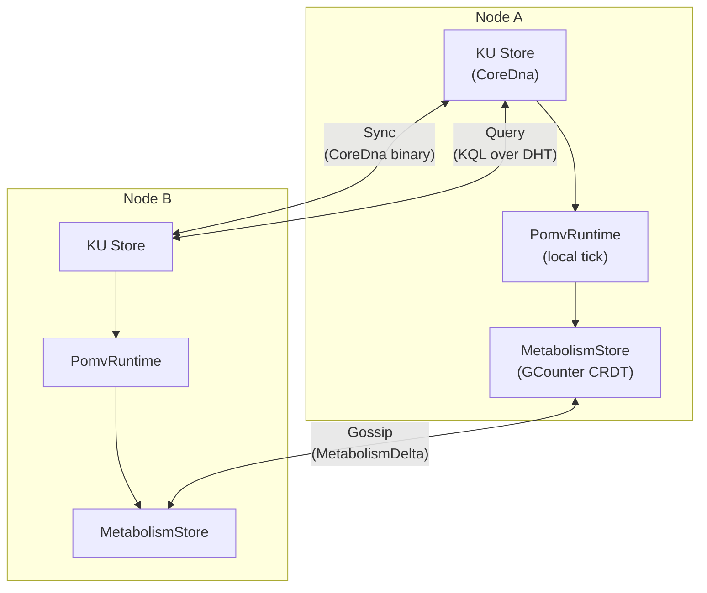
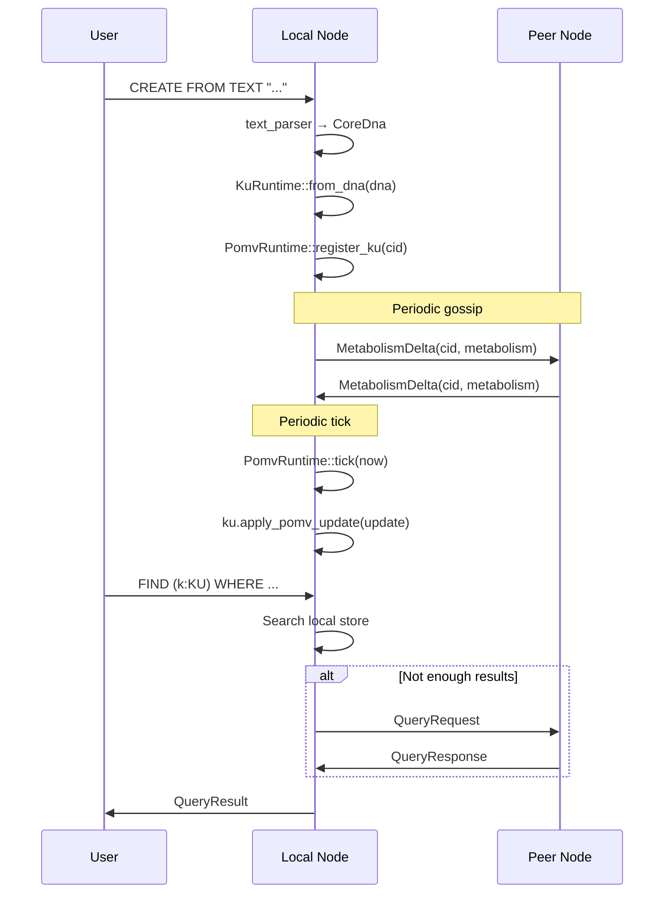

# OBP Specification — OneBrain Protocol

> Specification version: 2.0 | Last updated: 2026-06-30

## §1 Overview

OneBrain Protocol (OBP) is a decentralized P2P network protocol for knowledge sharing between OneBrain nodes. Each node:

- Stores KUs locally as CoreDna (binary, immutable)
- Runs PoMV locally (no central coordination)
- Gossips metabolism data via CRDT merge
- Resolves queries via DHT and stigmergy

### Design Principles

| Principle | Implementation |
|-----------|---------------|
| Fully decentralized | No central server or authority |
| Local-first | All computation runs on local node |
| Eventually consistent | CRDT-based metabolism counters |
| Privacy-preserving | Nodes share usage data, not user identity |
| Bio-inspired | Stigmergy (ant-colony routing) for query propagation |
| Account-Chain ledger | Account-Chain ledger for OBT token (per-account, no global chain) |

---

## §2 Network Architecture



### 2.1 Node Identity

**Source**: `identity.rs`

Each node has a unique identity for CRDT coordination:
- `node_id: u64` — used as GCounter key
- Public key for authentication (planned)

### 2.2 Transport

**Source**: `transport.rs` (behind `quic` feature flag)

- Primary: QUIC (UDP-based, encrypted)
- Fallback: TCP

---

## §3 Protocol Modules

**Source**: `ku-net/src/lib.rs`

| Module | File | Description |
|--------|------|-------------|
| Identity | `identity.rs` | Node identity management |
| Messages | `messages.rs` | Message type definitions |
| Membership | `membership.rs` | Cluster membership protocol |
| Discovery | `discovery.rs` | Peer discovery (mDNS, bootstrap) |
| Transport | `transport.rs` | QUIC/TCP transport layer |
| DHT | `dht.rs` | Distributed Hash Table for KU lookup |
| Stigmergy | `stigmergy.rs` | Ant-colony query routing |
| Vacuum | `vacuum.rs` | Unused data cleanup |
| PubSub | `pubsub.rs` | Topic-based event distribution |
| Query | `query/` | Distributed KQL query execution |
| Sync | `sync.rs` | KU synchronization between peers |
| Metabolism Gossip | `metabolism_gossip.rs` | CRDT metabolism data exchange |
| Encoding Job | `encoding_job.rs` | DHT-based encoding job board & ClaimToken anti-stampede |
| Encoding Gossip | `encoding_gossip.rs` | Encoding status & verification result propagation |
| Encoding Stigmergy | `encoding_stigmergy.rs` | Pheromone-based load balancing for encoding tasks |
| Constants | `constants.rs` | Protocol constants |
| Error | `error.rs` | Error types |
| OBT Constants | `obt_constants.rs` | OBT protocol constants, NodeTier enum (7 tiers) |
| OBT Ledger | `obt_ledger.rs` | Account-Chain ledger, TransferBlock, ForkWarrant |
| OBT Minting | `obt_minting.rs` | Emission formula, MintProof, R1-R4 reward streams |
| OBT Storage Reward | `obt_storage_reward.rs` | 5-factor storage reward, PoS-KU challenges |
| OBT Penalty | `obt_penalty.rs` | 5-tier graduated penalties, transfer eligibility |
| OBT Anti-Gaming | `obt_anti_gaming.rs` | Rate limiter, 4 quality gates, 4 pattern detectors |
| OBT Gossip Security | `obt_gossip_security.rs` | Gossip gap, connectivity proof, epoch settlement |
| OBT Fork Pipeline | `obt_fork_pipeline.rs` | Fork detection → penalty lifecycle |
| OBT Epoch | `obt_epoch.rs` | Epoch boundary settlement, EpochAccumulator |
| OBT Integration | `obt_integration.rs` | KU↔OBT builders, quality gate orchestration |
| Graph Gossip | `graph_gossip.rs` | OBKG FedR delta exchange, graph stats, dream reports (4 wire structs) |

> **Note:** OBT core logic (ledger, minting, penalties, storage rewards, anti-gaming, fork pipeline, epoch settlement) is implemented in `ku-core`. The modules listed above in `ku-net` handle only the network-facing aspects: message serialization, gossip security, and integration with the P2P transport layer.

---

## §4 Key Protocols

### 4.1 Metabolism Gossip

The most critical protocol — synchronizes usage data across nodes:

```
Node A                          Node B
  |                               |
  |--- MetabolismDelta(cid, KUMetabolism) -->|
  |                               |
  |                    merge_remote(cid, remote)
  |                               |
  |<-- MetabolismDelta(cid, KUMetabolism) ---|
  |                               |
  merge_remote(cid, remote)       |
```

**CRDT Merge**: `merged[node_id] = max(local[node_id], remote[node_id])`

Each `MetabolismDelta` contains:
```rust
pub struct MetabolismDelta {
    pub cid: [u8; 32],           // KU content ID
    pub metabolism: KUMetabolism, // GCounter-based usage data
}
```

### 4.2 KU Sync

Binary CoreDna synchronization:

1. Node announces available CIDs (bloom filter or CID list)
2. Peer requests missing CIDs
3. Sender transmits raw CoreDna bytes
4. Receiver creates `KuRuntime::from_wire(bytes)`

### 4.3 Distributed Query

KQL queries can span the network:

| Scope | Strategy |
|-------|----------|
| Local | Search local KU store only |
| Neighbors | Query directly connected peers |
| Cluster | Query all peers in cluster |
| DHT | CID-based lookup across network |
| Semantic | Similarity-based discovery |
| Global | Full network broadcast |
| Auto | Optimistic: local → neighbors → DHT |

### 4.4 Stigmergy

Ant-colony-inspired query routing:
- Successful query paths are reinforced (pheromone)
- Unused paths evaporate over time
- Nodes learn which peers have what knowledge domains

### 4.5 Encoding Consensus Protocol

Distributed encoding verification for KU knowledge units:

1. **Job Board (DHT)**: When a KU transitions from RAW → SELF (local encoding complete), the originating node publishes an `EncodingJob` to the DHT, advertising the CID and required verification count (capped at 3 verifiers). Jobs are stored as `DhtEntry` with **7-day TTL** (`ENCODING_JOB_TTL_S`) and automatically expired via `expire_stale()`.
2. **Hybrid Discovery (DHT + PubSub)**: Jobs are stored on DHT for persistence (new/restarting nodes can discover them). Simultaneously, `EncodingJobAnnounce` is broadcast via PubSub on reserved topic `ENCODING_JOBS_TOPIC (0xFFFF)` for real-time push to active verifiers.
3. **ClaimToken**: Peers interested in verifying claim the job via a `ClaimToken` — an anti-stampede mechanism ensuring at most 3 concurrent verifiers per job. Cooldown: `ENCODING_CLAIM_COOLDOWN_S` (60s).
4. **2-Phase Verification**:
   - *Phase A*: AI decomposition agreement — verifier independently decomposes the source text and compares structural agreement with the original encoding.
   - *Phase B*: Tool encoding round-trip — verifier re-encodes via CoreDna tools and checks binary equivalence.
5. **Consensus Scoring**: Weighted scoring across verifiers: agreement (50%), detail (30%), reputation (20%). Threshold (`ENCODING_CONSENSUS_THRESHOLD = 0.70`) determines PART → FULL transition.
6. **Stigmergy Load Balancing**: `encoding_stigmergy.rs` uses pheromone trails to route encoding jobs toward nodes with available capacity. Constants centralized in `constants.rs`.
7. **Reward**: Successful verifiers receive OBT token rewards via `encoding_reward.rs` (base: `ENCODING_REWARD_BASE_OBT = 5`).
8. **Immutability**: Once a KU reaches FULL status, its CoreDna is immutable. Any new raw content creates a new KU.
9. **Error Handling**: `EncodingError` enum in `error.rs` — variants: `JobNotFound`, `ClaimRejected`, `ConsensusTimeout`, `InvalidClaimToken`, `VerificationFailed`, `JobExpired`.


---

## §5 Message Format

All messages use binary encoding with a 6-byte header:
- Message type (u8)
- Flags (u8)
- Payload length (u32 BE, up to 16 MB)
- Payload (type-specific)
- Optional: signature (Ed25519)

### Message Categories

| Category | Examples |
|----------|---------|
| Membership | Join, Leave, Heartbeat, PeerList |
| Discovery | Announce, Probe, Bootstrap |
| Sync | RequestCids, SendCoreDna, AckSync |
| Query | QueryRequest, QueryResponse, QueryForward |
| Metabolism | MetabolismGossip, MetabolismAck |
| PubSub | Subscribe, Unsubscribe, Publish |
| Encoding (0x90–0x95) | EncodingJobAnnounce (0x90), EncodingClaimReq (0x91), EncodingClaimResp (0x92), EncodingSubmission (0x93), EncodingConsensusResult (0x94), EncodingJobUpdate (0x95) |
| OBT Token (0xA0–0xA6) | ObtTransferRequest (0xA0), ObtTransferConfirm (0xA1), ObtBalanceQuery (0xA2), ObtBalanceResponse (0xA3), ObtMintBroadcast (0xA4), ObtStorageChallenge (0xA5), ObtForkWarrant (0xA6) |
| Graph/OBKG (0xB0–0xB3) | FedR Delta Push (0xB0), FedR Delta Pull (0xB1), Graph Stats (0xB2), Dream Report (0xB3) |

---

## §6 Data Flow



---

## §7 Security Model

| Threat | Mitigation |
|--------|-----------|
| Sybil attack | Metabolism is observation-based — fake nodes need real usage |
| Data tampering | CoreDna CID = BLAKE3 hash → immutable verification |
| Spam | Metabolism decay (30-day half-life) → spam fades naturally |
| Eclipse attack | Multiple peer discovery mechanisms (mDNS, bootstrap, DHT) |
| Free-riding | No incentive needed — each node benefits from local computation |

---

## §8 Implementation Status

| Component | Status |
|-----------|--------|
| Message types | ✅ Defined |
| Identity | ✅ Implemented |
| DHT | ✅ Implemented |
| Membership | ✅ Implemented |
| Discovery | ✅ Implemented |
| Metabolism Gossip | ✅ Implemented |
| Stigmergy | ✅ Implemented |
| Sync | ✅ Implemented |
| Transport (QUIC) | 🔧 Feature-gated |
| Query routing | 🔧 Basic structure |
| Encoding Job Board | 🔧 Designed |
| Encoding Gossip | 🔧 Designed |
| Encoding Stigmergy | 🔧 Designed |
| OBT Constants | ✅ Implemented |
| OBT Ledger | ✅ Implemented |
| OBT Minting | ✅ Implemented |
| OBT Storage Reward | ✅ Implemented |
| OBT Penalty | ✅ Implemented |
| OBT Anti-Gaming | ✅ Implemented |
| OBT Gossip Security | ✅ Implemented |
| OBT Fork Pipeline | ✅ Implemented |
| OBT Epoch | ✅ Implemented |
| OBT Integration | ✅ Implemented |
| Graph Gossip | ✅ Implemented |
| E2E encryption | 📋 Planned |
