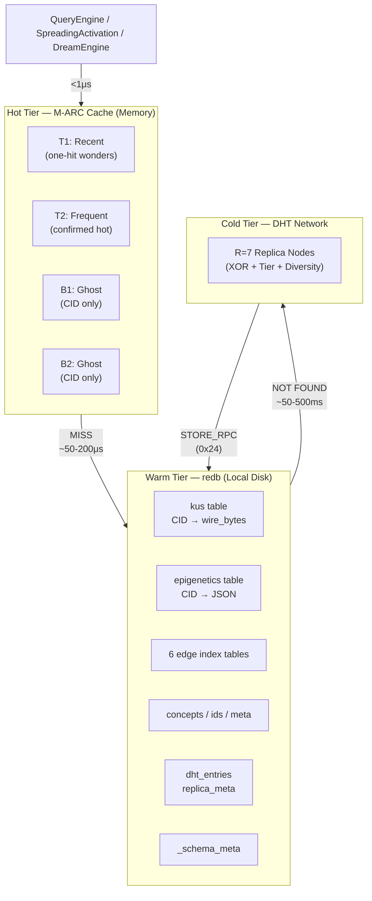
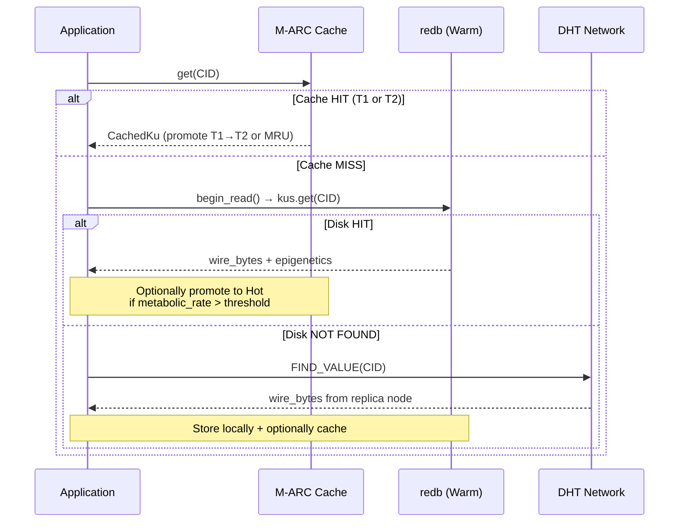
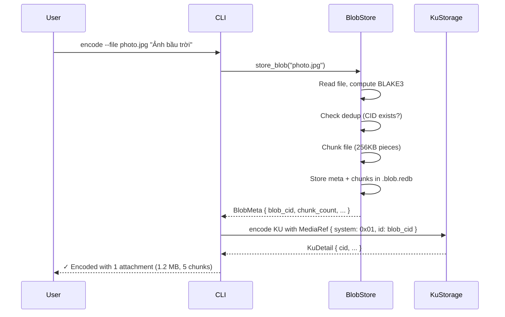

# OBS — OneBrain Storage Layer (Pillar 8)

> Technical Specification v1.0 | Last updated: 2026-07-07

---

## §1 Overview

OneBrain Storage (OBS) is the persistent, distributed, cache-optimized storage subsystem responsible for durably storing Knowledge Units (KUs), graph bonds, concept dictionaries, and DHT state across the OneBrain network. It spans two crates — `ku-core` (schema versioning, in-memory cache) and `ku-net` (DHT persistence, replication) — and provides the foundation for all data lifecycle operations.

### 1.1 Purpose

| What OBS Stores | Where | Format |
|-----------------|-------|--------|
| KU Core DNA wire bytes | `kus` table (redb) | Raw binary, 16–172 bytes |
| KU Epigenetics | `epigenetics` table (redb) | JSON with `#[serde(default)]` |
| Graph bonds & edge indexes | 6 tables in `.graph.redb` | Composite byte keys + 9-byte BondMeta |
| Concept dictionary | 3 tables in concept `.redb` | JSON ConceptEntry |
| DHT entries | `dht_entries` table (redb) | CBOR via ciborium |
| Replica metadata | `replica_meta` table (redb) | CBOR via ciborium |
| Schema version tracking | `_schema_meta` table per DB | String key-value pairs |

### 1.2 Design Philosophy

OBS is **bio-inspired** at every layer:

| Principle | Implementation |
|-----------|---------------|
| Metabolism-aware caching | Eviction priority = lowest `metabolic_rate` first (M-ARC cache) |
| Stigmergy repair | Replication pheromones detect under-replicated CIDs; nodes "forage" for weak pheromones |
| Tier-aware placement | Replicas anchored to high-tier nodes (T2+, T3+) for infrastructure durability |
| Immutable content addressing | CID = BLAKE3(wire_bytes) — Core DNA is never migrated or modified |
| CRDT-first consistency | Layer 2 (Epigenetics) converges via GCounter, PNCounter, LWWRegister, ORSet |

### 1.3 Relationship to Other Pillars

| Pillar | Integration Point |
|--------|-------------------|
| **P1 Core DNA** | CID = BLAKE3(wire_bytes); OBS stores and verifies immutable wire bytes |
| **P2 OBP Network** | STORE_RPC/ACK messages (0x24/0x25); DHT routing for replica target selection |
| **P5 OBT Token** | `StorageReward` reads `ReplicaTracker`; `storage_challenge` uses BLAKE3 byte-range proofs |
| **P7 OBKG** | GraphStorage schema versioning; bond metadata extensibility via BondMeta versions |

---

## §2 Architecture

### 2.1 Three-Tier Storage Model

OBS implements a **Hot → Warm → Cold** tiering strategy where data flows between tiers based on access frequency and metabolic activity:



### 2.2 Data Flow



### 2.3 Module Map

| Crate | Module | Responsibility |
|-------|--------|---------------|
| `ku-core` | `obs_schema.rs` | Schema versioning framework, migration registries |
| `ku-core` | `obs_cache.rs` | Metabolism-Aware ARC cache (M-ARC) |
| `ku-net` | `dht_store.rs` | DHT entry and replica metadata persistence |
| `ku-net` | `replication.rs` | R=7 tier-aware replication manager |
| `ku-net` | `constants.rs` | All OBS-related protocol constants |
| `ku-kql` | `storage.rs` | KuStorage (4 tables: kus, epigenetics, index_trust, index_concept) |
| `ku-kql` | `graph_storage.rs` | GraphStorage (6 edge index tables) |
| `ku-core` | `persistent_concept_dict.rs` | PersistentConceptDict (3 tables) |

---

## §3 Schema Versioning (`obs_schema`)

**Source**: [obs_schema.rs](file:///c:/Users/shpy2/Documents/OneBrain/src/ku-core/src/obs_schema.rs)

### 3.1 `_schema_meta` Table Design

Every redb database file contains a `_schema_meta` table (`TableDefinition<&str, &str>`) that tracks:

| Key | Value | Purpose |
|-----|-------|---------|
| `"version"` | `u32` as string (e.g., `"1"`) | Current schema version |
| `"schema_name"` | Module identifier (e.g., `"ku_storage"`) | Which module owns this DB |
| `"updated_at"` | Timestamp string | Last migration time |

### 3.2 Core Types

```rust
/// Schema version — wraps u32 with Ord for comparison.
pub struct SchemaVersion(pub u32);

/// A single migration step: from_version → from_version + 1.
pub struct Migration {
    pub from_version: u32,
    pub description: &'static str,
}

/// Registry of migrations for a storage module.
pub struct MigrationRegistry {
    pub schema_name: &'static str,
    pub current_version: SchemaVersion,
    pub migrations: Vec<Migration>,
}

/// redb-specific migration with optional data-transform function.
/// (Behind `persist` feature flag)
pub struct RedbMigration {
    pub from_version: u32,
    pub description: &'static str,
    pub migrate_fn: Option<fn(&Database) -> Result<(), String>>,
}
```

### 3.3 `ensure_schema()` Algorithm

The main entry point is `ensure_schema()` (or `ensure_schema_with_redb_migrations()` for data transforms), called from every `Storage::open()`:

```
1. Validate migration chain (contiguous 0..current_version)
2. Read current DB version from _schema_meta
3. If version == 0 (fresh DB):
   → Write initial version + schema_name → return Ok
4. If version == current_version:
   → Already up to date → return Ok
5. If version > current_version:
   → return Err("Downgrade not supported")
6. For each pending migration (from_version >= db_version):
   a. If a matching RedbMigration with migrate_fn exists → execute it
   b. If migrate_fn fails → return Err (database unchanged, ACID rollback)
7. Write final version to _schema_meta → commit
```

### 3.4 Standard Registries

Four storage modules register migration chains:

| Registry Function | Schema Name | Current Version | Initial Migration |
|-------------------|------------|-----------------|-------------------|
| `ku_storage_registry()` | `"ku_storage"` | v1 | 4 tables: kus, epigenetics, index_trust, index_concept |
| `graph_storage_registry()` | `"graph_storage"` | v1 | 6 edge index tables (out, in, type, state, weight, time) |
| `concept_dict_registry()` | `"concept_dict"` | v1 | 3 tables: concepts, ids, meta |
| `dht_store_registry()` | `"dht_store"` | v1 | 2 tables: dht_entries, replica_meta |

### 3.5 Migration Philosophy

> **Critical invariant**: Core DNA wire bytes are **NEVER** migrated. `CID = BLAKE3(wire_bytes)` makes wire format changes destructive to all references (bonds, graph edges, external indexes). Stored wire bytes are immutable — like Git blob objects.

New features are added exclusively via:
- New opcodes in the instruction stream (forward-compatible decoder)
- Mutable Epigenetics layer (JSON with `#[serde(default)]`)
- Auxiliary metadata tables

---

## §4 Metabolism-Aware ARC Cache (`obs_cache`)

**Source**: [obs_cache.rs](file:///c:/Users/shpy2/Documents/OneBrain/src/ku-core/src/obs_cache.rs) | 841 LOC, 15 tests

### 4.1 ARC Algorithm Overview

The `ObsCache` implements an **Adaptive Replacement Cache** (Megiddo & Modha, USENIX FAST 2003) extended with metabolism-aware eviction. ARC self-tunes between recency-favoring and frequency-favoring policies using ghost lists that track recently evicted CIDs.

### 4.2 Four-List Structure

```
┌─────────────────────────────────────────────────────┐
│                    ObsCache                          │
│                                                     │
│  T1 (IndexMap<[u8;32], CachedKu>)                  │
│  ├── Recently accessed (one-hit wonders)            │
│  └── Insertion order = LRU order                    │
│                                                     │
│  T2 (IndexMap<[u8;32], CachedKu>)                  │
│  ├── Frequently accessed (confirmed hot)            │
│  └── Promoted from T1 on second access              │
│                                                     │
│  B1 (VecDeque<[u8;32]>)                            │
│  ├── Ghost list: CIDs evicted from T1               │
│  └── Ghost hit → increase p (favor recency)         │
│                                                     │
│  B2 (VecDeque<[u8;32]>)                            │
│  ├── Ghost list: CIDs evicted from T2               │
│  └── Ghost hit → decrease p (favor frequency)       │
│                                                     │
│  p: usize (self-tuning parameter)                   │
│  └── Target size for T1; starts at capacity/2       │
│                                                     │
│  Constraint: |T1| + |T2| ≤ capacity                │
│  Ghost cap: |B1| ≤ capacity, |B2| ≤ capacity       │
└─────────────────────────────────────────────────────┘
```

### 4.3 Self-Tuning Parameter `p`

The parameter `p` controls the balance between T1 (recency) and T2 (frequency):

- **B1 ghost hit** → `p += max(1, |B2|/|B1|)` — favor recency (enlarge T1 target)
- **B2 ghost hit** → `p -= max(1, |B1|/|B2|)` — favor frequency (shrink T1 target)
- On eviction: if `|T1| > p`, evict from T1; otherwise evict from T2

### 4.4 Metabolism-Aware Eviction

Standard ARC evicts the LRU entry. M-ARC instead evicts the entry with the **lowest `metabolic_rate`** within the candidate list (T1 or T2), using `find_lowest_metabolism_victim()`. Ties are broken by LRU order (oldest first, via `IndexMap` insertion order).

This leverages OneBrain's existing `KUMetabolism` system where `metabolic_rate ∈ [0.0, 1.0]` encodes a decay-weighted access frequency with 30-day half-life.

Additional bulk eviction: `evict_dead(threshold)` removes all entries below a given metabolic rate in a single O(n) pass via `IndexMap::retain()`.

### 4.5 `CachedKu` Entry Format

```rust
pub struct CachedKu {
    pub wire_bytes: Vec<u8>,         // Core DNA binary (16-172 bytes)
    pub epigenetics_json: String,    // Serialized Epigenetics
    pub neighbor_cids: Vec<[u8; 32]>,// 1-hop neighbors for prefetch
    pub metabolic_rate: f64,         // Cached rate [0.0, 1.0]
    pub inserted_at: u64,            // Epoch seconds
    pub hit_count: u32,              // Cache hits since insertion
}
```

### 4.6 Cache Statistics

`CacheStats` provides a real-time snapshot: `hits`, `misses`, `evictions`, `t1_size`, `t2_size`, `b1_size`, `b2_size`, `capacity`. The `hit_rate()` method computes `hits / (hits + misses)`.

### 4.7 Prefetch Support

`prefetch_candidates(cid, min_weight)` returns the `neighbor_cids` of a cached entry — the CIDs of 1-hop graph neighbors. The caller uses this to speculatively load neighbors into the cache before they are explicitly requested, leveraging knowledge graph locality (spreading activation patterns).

### 4.8 Constants

| Constant | Value | Description |
|----------|-------|-------------|
| `DEFAULT_CACHE_CAPACITY` | 10,000 | Default KU entries (~4MB at ~400 bytes/entry) |
| `METABOLISM_DEAD_THRESHOLD` | 0.001 | KUs below this rate are considered metabolically dead |

### 4.9 Performance Characteristics

| Operation | Complexity | Notes |
|-----------|-----------|-------|
| `get()` | O(1) | `IndexMap` hash lookup + shift_remove + insert |
| `put()` | O(1) amortized | Ghost list scan is O(n) in worst case but bounded by capacity |
| `contains()` | O(1) | Non-promoting read (no side effects) |
| `invalidate()` | O(1) | Removes from data + ghost lists |
| `evict_dead()` | O(n) | Single-pass `retain()` over T1 and T2 |

---

## §5 DHT Persistence (`dht_store`)

**Source**: [dht_store.rs](file:///c:/Users/shpy2/Documents/OneBrain/src/ku-net/src/dht_store.rs) | 568 LOC, 14 tests

Feature-gated behind the `persist` feature. Provides redb-backed persistence for DHT entries and replica tracking metadata so data survives node restarts.

### 5.1 Record Types

```rust
/// Serializable DHT entry for persistence.
pub struct DhtEntryRecord {
    pub value: Vec<u8>,        // The stored value bytes
    pub stored_at: u64,        // Epoch seconds when stored
    pub ttl_secs: Option<u64>, // None = permanent entry
}

/// Serializable replica metadata for persistence.
pub struct StoredKuMetaRecord {
    pub actual_replicas: u32,     // Known replica count
    pub first_stored_epoch: u64,  // When this KU was first stored
    pub epochs_stored: u64,       // Total epochs stored (for storage reward)
}
```

### 5.2 Table Layout

| Table | Key Type | Value Type | Purpose |
|-------|----------|-----------|---------|
| `dht_entries` | `&[u8; 32]` (CID) | `&[u8]` (CBOR) | DHT entry data with TTL |
| `replica_meta` | `&[u8; 32]` (CID) | `&[u8]` (CBOR) | Replica tracking for storage rewards |
| `_schema_meta` | `&str` | `&str` | Schema versioning (via `obs_schema`) |

### 5.3 CBOR Serialization

All record types use **ciborium** for CBOR serialization (`Serialize`/`Deserialize` via serde). The CBOR encoding is compact and self-describing, suitable for heterogeneous DHT payloads.

> **Future**: Migration path to `serde_ipld_dagcbor` for IPLD compatibility (deterministic encoding, CID-aware CBOR tag 42).

### 5.4 Proactive Table Creation

On `DhtPersistence::open()`, both tables are created proactively within the initial write transaction, ensuring subsequent reads never encounter `TableDoesNotExist` errors.

### 5.5 TTL-Based Expiration

`remove_expired(now_secs)` performs a two-pass cleanup:

1. **Read pass**: Scan all entries, collect keys where `stored_at + ttl_secs ≤ now_secs`
2. **Write pass**: Remove expired keys in a single write transaction

Entries with `ttl_secs = None` are permanent and never expired.

### 5.6 Batch Persistence

`persist_batch(entries)` stores multiple DHT entries in a **single write transaction**, used during epoch flush to amortize I/O overhead. This is critical for the hourly epoch boundary when `ReplicaTracker` state is checkpointed.

### 5.7 Key Operations

| Method | Description |
|--------|-------------|
| `persist_entry()` | Single-entry STORE (CBOR encode → write txn → commit) |
| `persist_batch()` | Multi-entry atomic STORE (epoch flush) |
| `load_entries()` | Load all DHT entries on startup |
| `persist_replica_meta()` | Save replica tracking state |
| `load_replica_meta()` | Restore replica tracking on restart |
| `remove_expired()` | TTL-based garbage collection |
| `entry_count()` / `replica_count()` | Table cardinality queries |

---

## §6 Replication Manager (`replication`)

**Source**: [replication.rs](file:///c:/Users/shpy2/Documents/OneBrain/src/ku-net/src/replication.rs) | 663 LOC, 17 tests

### 6.1 R=7 Placement Strategy

Storage replication factor R=7 is **deliberately decoupled** from the DHT routing parameter K=20. KU objects are tiny (16–172 bytes), making R=7 replication negligible in bandwidth and storage cost (7 × 172B = 1.2KB per KU across the network).

The 7 target nodes are selected using a **tier-aware placement** algorithm:

```
R = 7 Targets:
├── 4 × XOR-closest nodes    (standard Kademlia proximity)
├── 2 × Tier-anchored nodes   (1 at T2+, 1 at T3+ for durability)
└── 1 × Diversity node        (different subnet for geo-distribution)
```

### 6.2 Target Selection Algorithm

`select_targets(cid, candidates)` implements the placement strategy:

1. Sort all candidates by XOR distance to CID (BLAKE3-hashed node IDs)
2. Take top 4 as `xor_closest`
3. From remaining, find first node with tier ≥ 2 → `tier_anchored[0]`
4. From remaining, find first node with tier ≥ 3 → `tier_anchored[1]`
5. From remaining, pick first available → `diversity[0]`
6. If any category is short, fill from XOR overflow

XOR distance is computed over 256-bit keys derived via `node_id_to_key(u64)` = `BLAKE3(node_id.to_be_bytes())`, ensuring uniform distribution across all 32 bytes.

### 6.3 `ReplicationStatus` Enum

```rust
pub enum ReplicationStatus {
    Healthy,           // actual ≥ STORAGE_REPLICATION_FACTOR (7)
    Degraded(usize),   // actual ≥ MIN_HEALTHY_REPLICAS (4) but < 7
    Critical(usize),   // actual < MIN_HEALTHY_REPLICAS (4)
    Unknown,           // No replication data available
}
```

### 6.4 `PendingStore` Tracking

Each STORE operation creates a `PendingStore` that tracks ACK progress:

```rust
pub struct PendingStore {
    pub cid: [u8; 32],
    pub target_nodes: Vec<u64>,   // Selected R=7 targets
    pub acked_nodes: Vec<u64>,    // Nodes that have ACKed
    pub initiated_at: u64,        // For timeout detection
}
```

Duplicate ACKs from the same node are ignored. `timed_out_stores(now, timeout_secs)` identifies stalled operations. `cleanup_completed()` removes entries where all targets have ACKed.

### 6.5 Message Codes

| Code | Name | Direction | Purpose |
|------|------|-----------|---------|
| `0x24` | `MSG_STORE_RPC` | Requester → Target | Request a peer to store a KU value |
| `0x25` | `MSG_STORE_ACK` | Target → Requester | Acknowledgment of successful STORE |
| `0x26` | `MSG_REPLICATION_CHECK` | Any → Any | Query replica count for a CID |

### 6.6 Health Thresholds

| Constant | Value | Meaning |
|----------|-------|---------|
| `STORAGE_REPLICATION_FACTOR` | 7 | Target replica count per KU |
| `MIN_HEALTHY_REPLICAS` | 4 | Below this triggers Critical status |
| `REPAIR_TARGET_REPLICAS` | 7 | Target after repair (same as factor) |

---

## §7 Storage Backend: redb

### 7.1 Why redb

| Property | Detail |
|----------|--------|
| **Pure Rust** | No C compiler or FFI dependencies; easy cross-compilation |
| **ACID** | Full ACID compliance via Copy-on-Write B+tree with MVCC |
| **Embedded** | In-process, single-file database; no separate server |
| **Read performance** | Excellent B+tree point lookups and range scans |
| **Crash safety** | CoW semantics prevent WAL corruption |
| **Type-safe API** | Compile-time key/value type checking via `TableDefinition<K, V>` |

redb is the optimal choice for OneBrain's workload: read-heavy (~10-100 reads/sec), low write rate (~0.02-0.17 writes/sec), range scans on small values (16–172 bytes), single-writer model. The engine has **2,000–50,000× headroom** over current load.

### 7.2 Tables by Module

#### KuStorage (4 tables — main `.redb` file)

| Table | Key | Value | Purpose |
|-------|-----|-------|---------|
| `kus` | CID `[u8; 32]` | Core DNA wire bytes | Immutable Layer 1 content |
| `epigenetics` | CID `[u8; 32]` | JSON string | Mutable Layer 2 metadata |
| `index_trust` | `trust(u16 BE) + CID(32B)` = 34B | empty | Range scan by trust score |
| `index_concept` | `concept_id(u64 BE) + CID(32B)` = 40B | empty | Lookup by concept |

#### GraphStorage (6 tables — `.graph.redb` file)

| Table | Key (composite bytes) | Value | Purpose |
|-------|----------------------|-------|---------|
| `edges_out` | `src(32) + rel(1) + tgt(32)` = 65B | BondMeta (9B) | Outgoing edges |
| `edges_in` | `tgt(32) + rel(1) + src(32)` = 65B | empty | Incoming edge index |
| `edges_type` | `rel(1) + src(32) + tgt(32)` = 65B | empty | Type-first lookup |
| `index_state` | `state(1) + src(32) + rel(1) + tgt(32)` = 66B | empty | State filter |
| `bond_weight` | `weight(2) + src(32) + tgt(32) + rel(1)` = 67B | empty | Weight-sorted scan |
| `edge_time` | `ts(4) + src(32) + tgt(32) + rel(1)` = 69B | empty | Temporal ordering |

#### PersistentConceptDict (3 tables)

| Table | Key | Value | Purpose |
|-------|-----|-------|---------|
| `concepts` | name (str) | JSON ConceptEntry | Concept lookup |
| `ids` | id (u64) | name (str) | Reverse mapping |
| `meta` | `"next_id"` | u64 | ID sequence generator |

#### DhtPersistence (2 tables + schema)

| Table | Key | Value | Purpose |
|-------|-----|-------|---------|
| `dht_entries` | `&[u8; 32]` | CBOR bytes | DHT entry data |
| `replica_meta` | `&[u8; 32]` | CBOR bytes | Replica tracking metadata |

### 7.3 CID Integrity Verification

`CID = BLAKE3(wire_bytes)` serves as a cryptographic commitment. On every `get()` from the warm tier, the caller can verify integrity by recomputing `BLAKE3(wire_bytes)` and comparing with the stored CID. Any mismatch indicates data corruption or tampering. This is also the basis for OBT's Proof-of-Storage-KU (PoS-KU) challenges.

---

## §8 Cross-Pillar Integration

### 8.1 P1 — Core DNA

```
CID = BLAKE3(wire_bytes)  →  Immutable, never migrate

Core DNA v6 wire format:
  MAGIC(0x4B) | VER_META(1B) | INSTRUCTION_STREAM | END(0x1E) | CRC-16(2B)

Decoder supports multiple versions via 3-bit version field in VER_META.
New KUs may use future versions; old KUs keep their encoding forever.
```

### 8.2 P2 — OBP Network

| Integration | Mechanism |
|-------------|-----------|
| STORE replication | `MSG_STORE_RPC (0x24)` sends wire_bytes to R=7 target nodes |
| STORE acknowledgment | `MSG_STORE_ACK (0x25)` confirms successful storage |
| Health monitoring | `MSG_REPLICATION_CHECK (0x26)` queries replica counts |
| Target selection | DHT routing (`FIND_NODE`) identifies XOR-closest candidates |
| Tier information | Membership module provides node tier for placement algorithm |

### 8.3 P5 — OBT Token

| Integration | Mechanism |
|-------------|-----------|
| Storage reward input | `ReplicaTracker` fields (`actual_replicas`, `epochs_stored`) feed the 5-factor formula |
| PoS-KU challenges | `StorageChallenge` types (FullHash, ByteRange, FieldExtract) use BLAKE3 on stored wire bytes |
| Rarity weighting | `rarity_w` in the reward formula naturally incentivizes storing under-replicated KUs |
| Epoch persistence | `epochs_stored` counter survives restarts via `DhtPersistence::persist_replica_meta()` |

### 8.4 P7 — OBKG (Knowledge Graph)

| Integration | Mechanism |
|-------------|-----------|
| Graph schema versioning | `graph_storage_registry()` tracks schema version for 6 edge index tables |
| Bond metadata extensibility | BondMeta (currently 9 bytes) supports version-prefixed variable-length format for future OBKG fields |
| FedR delta persistence | Graph gossip (0xB0–0xB3) deltas flow through the storage layer |
| Dream consolidation bypass | DreamEngine reads directly from warm tier (redb), bypassing hot cache to avoid thrashing |

---

## §9 Wire Format & Serde

### 9.1 Format Summary

| Data Type | Serialization | Rationale |
|-----------|--------------|-----------|
| Core DNA wire bytes | Raw binary (custom format) | CID = hash of bytes; never changed for CID stability |
| Epigenetics | JSON with `#[serde(default)]` | Forward-compatible; new fields default safely |
| DHT records | CBOR via `ciborium` | Compact binary; self-describing; serde-compatible |
| Replica metadata | CBOR via `ciborium` | Same as DHT records |
| BondMeta | Fixed 9-byte binary | `[weight:2][creator:1][state:1][decay:1][timestamp:4]` |
| ConceptEntry | JSON | Flexible schema; `#[serde(default)]` for evolution |

### 9.2 Epigenetics Forward Compatibility

All Epigenetics fields use `#[serde(default)]` to ensure old JSON (missing new fields) deserializes correctly. Adding a field never breaks existing data:

```rust
#[derive(Serialize, Deserialize)]
pub struct Epigenetics {
    #[serde(rename = "tr", default)]
    pub trust: TrustSection,
    #[serde(rename = "bn", skip_serializing_if = "Vec::is_empty", default)]
    pub bonds: Vec<Bond>,
    // Future fields automatically safe with #[serde(default)]
}
```

### 9.3 Future Migration Path

The `ku-core/Cargo.toml` comment `ciborium = "0.2" # will migrate to serde_ipld_dagcbor` signals intent to adopt IPLD-compatible serialization. `serde_ipld_dagcbor` provides:
- Deterministic encoding (canonical map key ordering)
- Native CID links via CBOR tag 42
- Drop-in serde compatibility (same traits, different codec)

---

## §10 Media/Blob Storage

> Upgraded from "Future Roadmap" to full specification — 2026-07-07

### 10.1 Overview

KUs are optimized for structured knowledge (16–172 bytes Core DNA). Media files (images, videos, documents) are stored in a dedicated **Blob Store** — a separate redb database (`.blob.redb`) with its own schema versioning, chunking, and replication strategy.

**Design principles**:

| Principle | Implementation |
|-----------|---------------|
| KU stays lightweight | KU contains only a 34-byte `MediaRef` CID reference, not the blob itself |
| Content-addressed dedup | BLAKE3 whole-file hash → identical files stored once |
| Tiered replication | Blobs use R=3 (not R=7 like KUs) to reduce network storage |
| Device-adaptive quotas | Default storage quota scales with device capability (min 10GB) |
| Lazy fetch | Nodes do NOT auto-replicate blobs — fetch on-demand or pin explicitly |
| Separate from KU ACID | Blob DB is isolated → large blob writes don't block KU transactions |

### 10.2 Blob CID Format (OB-CID)

A Blob CID is 34 bytes, distinct from KU CIDs (32 bytes):

```
OB-CID (34 bytes):
┌──────────┬──────────┬──────────────────────────────────┐
│ version  │  type    │        blake3 hash               │
│  (1B)    │  (1B)    │         (32B)                    │
└──────────┴──────────┴──────────────────────────────────┘
   0x01      0x00-0x04    BLAKE3(entire_file_bytes)
```

| Field | Size | Values |
|-------|------|--------|
| `version` | 1 byte | `0x01` (current) |
| `type` | 1 byte | `0x00` Raw, `0x01` Image, `0x02` Video, `0x03` Audio, `0x04` Document |
| `blake3` | 32 bytes | BLAKE3 hash of the entire original file |

**Type detection**: Inferred from file extension and/or magic bytes:

| Type | Extensions | Magic bytes |
|------|-----------|-------------|
| Image | `.jpg .jpeg .png .webp .gif .bmp .svg` | `FF D8`, `89 50 4E 47`, `52 49 46 46` |
| Video | `.mp4 .webm .mkv .avi .mov` | `00 00 00 .. 66 74 79 70` |
| Audio | `.mp3 .ogg .flac .wav .m4a` | `49 44 33`, `4F 67 67 53` |
| Document | `.pdf .docx .xlsx .txt .md .csv` | `25 50 44 46`, `50 4B 03 04` |
| Raw | (everything else) | — |

### 10.3 Chunking Strategy

**Phase 1**: Fixed-size 256KB chunks (IPFS-compatible).

```
Original file: 1.2 MB
  → Chunk 0: bytes[0..262143]       = 256KB
  → Chunk 1: bytes[262144..524287]  = 256KB
  → Chunk 2: bytes[524288..786431]  = 256KB
  → Chunk 3: bytes[786432..1048575] = 256KB
  → Chunk 4: bytes[1048576..1228799] = 180KB (remainder)

chunk_count = ceil(total_size / BLOB_CHUNK_SIZE)
```

Each chunk gets its own BLAKE3 hash for integrity verification on retrieval:

```
chunk_hash = BLAKE3(chunk_data)
```

**Phase 2** (deferred): Content-Defined Chunking via FastCDC for better dedup across similar files.

### 10.4 Storage Schema

Blob data lives in a **separate** `.blob.redb` file (following the GraphStorage pattern):

```
{data_dir}/
  ├── ku.redb              ← KU Core DNA + Epigenetics
  ├── ku.graph.redb         ← OBKG bond indexes
  └── ku.blob.redb          ← Blob metadata + chunks  ← NEW
```

**Tables**:

| Table | Key | Value | Purpose |
|-------|-----|-------|---------|
| `blob_meta` | `OB-CID` (34B) | JSON `BlobMeta` | Metadata: name, size, type, references |
| `blob_chunks` | `OB-CID` (34B) + `index` (4B BE) = 38B | Raw chunk bytes (≤256KB) | Actual blob data |
| `_schema_meta` | `&str` | `&str` | Schema versioning (standard OBS pattern) |

**Schema registry**:

```rust
pub fn blob_store_registry() -> MigrationRegistry {
    MigrationRegistry::new("blob_store", 1)
        .with_migration(Migration::new(0, "Initial: blob_meta, blob_chunks tables"))
}
```

**`BlobMeta` structure** (JSON-serialized):

```rust
pub struct BlobMeta {
    pub blob_cid: [u8; 34],          // OB-CID
    pub original_name: String,        // "photo.jpg"
    pub mime_type: String,            // "image/jpeg"
    pub total_size: u64,              // bytes
    pub chunk_count: u32,             // ceil(size / 256KB)
    pub chunk_size: u32,              // 262144 (256KB default)
    pub blob_type: u8,                // BlobType enum value
    pub created_at: u64,              // epoch seconds
    pub blake3_hash: [u8; 32],        // whole-file BLAKE3
    pub referencing_kus: Vec<[u8; 32]>, // KU CIDs referencing this blob
    pub pinned: bool,                 // true = always keep local
}
```

### 10.5 MediaRef Linkage

KUs reference blobs via the existing `MediaRef` opcode (`0x1B`) in Core DNA:

```
Instruction::MediaRef {
    system: 0x01,                // OBS Blob Store
    id: Vec<u8>,                 // 34-byte OB-CID
}
```

**Wire format** (already implemented in `core_dna.rs`):

```
[opcode_byte: 1B][system: 1B][len: 1B][ob_cid: 34B] = 37 bytes total
```

A single KU can contain **multiple** `MediaRef` instructions (e.g., a KU about a trip with 5 photos).

**Lifecycle**:



### 10.6 Deduplication

Content-addressed storage provides **automatic deduplication**:

```
User A: encode --file einstein.jpg "Portrait of Einstein"
  → blob_cid = OB-CID(0x01, 0x01, BLAKE3(einstein.jpg))
  → Stored: 1 copy in .blob.redb

User B: encode --file einstein.jpg "Einstein 1921 photo"
  → blob_cid = OB-CID(0x01, 0x01, BLAKE3(einstein.jpg))
  → Same CID! → Skip chunk storage, only add KU reference

Result: 2 KUs, 1 blob copy. Savings = 50%.
```

The `referencing_kus` field in `BlobMeta` tracks all KU CIDs that point to this blob.

### 10.7 Replication Strategy

Blobs use **different replication** from KUs to manage storage costs:

| Data Type | Replication | Overhead | Rationale |
|-----------|:-----------:|:--------:|-----------|
| KU Core DNA (16-172B) | R=7 full | 7x | Tiny, critical knowledge |
| Blob HOT (active) | R=3 full | 3x | Moderate, frequently accessed |
| Blob WARM/COLD | RS(10,4) erasure | 1.4x | Phase 2, large savings |

**Phase 1** (current): Hot R=3 only. All blobs get 3 full replicas.

**Phase 2** (deferred): Erasure coding via Reed-Solomon. Blobs that transition from HOT to WARM (metabolic_rate < 0.3) are re-encoded as 14 erasure chunks (10 data + 4 parity), distributed across 14 nodes. Any 10 chunks reconstruct the full blob.

**Pin-based model**: Nodes do NOT auto-store other nodes' blobs. A node stores a blob only if:
1. It is the **origin** (user uploaded it)
2. User explicitly **pins** it (`blob pin <cid>`)
3. Node volunteers as **storage provider** (earns R4 storage reward)
4. Node receives a **STORE_RPC** during replication

### 10.8 Device-Adaptive Storage Quotas

Default blob storage quota adapts to device type, minimum 10GB:

| Device Tier | Example | Default Quota | Rationale |
|-------------|---------|:-------------:|-----------|
| Server | Dedicated node | 200 GB | Abundance of disk |
| Desktop | PC, workstation | 50 GB | Typical >500GB disk |
| Laptop | MacBook, ThinkPad | 20 GB | Limited SSD |
| Mobile/Tablet | Phone, iPad | 10 GB (min) | Constrained storage |
| IoT/Embedded | Raspberry Pi, Arduino | 2 GB | Very constrained |

**Auto-detection heuristic** (Phase 1: simple, upgradeable):

```rust
fn default_blob_quota() -> u64 {
    let available = disk_available_bytes();
    let quota = match available {
        _ if available > 500_GB => 200_GB,   // Server
        _ if available > 200_GB =>  50_GB,   // Desktop
        _ if available > 50_GB  =>  20_GB,   // Laptop
        _ if available > 15_GB  =>  10_GB,   // Mobile (min)
        _                        =>   2_GB,   // IoT
    };
    quota.max(10_GB) // absolute minimum 10GB
}
```

**User override**: `config set blob_quota 30GB`

### 10.9 Upload Size Limits

| Limit | Value | Configurable |
|-------|:-----:|:------------:|
| Max single blob | 100 MB | Yes |
| Max total blob storage | Device-adaptive | Yes |
| Max blobs per KU | 10 | No |
| Min blob size | 1 byte | No |

### 10.10 Garbage Collection

Blobs with zero KU references are **orphaned** and eligible for garbage collection:

```
blob gc
  Scanning blob_meta...
  Found 3 orphaned blobs (12.5 MB):
    - abc123... (photo.jpg, 3.2 MB) — 0 KU references
    - def456... (video.mp4, 8.1 MB) — 0 KU references
    - ghi789... (doc.pdf, 1.2 MB)   — 0 KU references
  Delete? (y/N): y
  ✓ Freed 12.5 MB
```

Pinned blobs are exempt from GC even with zero references.

### 10.11 Future Extensions (Phase 2+)

| Feature | Description | Dependency |
|---------|-------------|------------|
| Erasure coding RS(10,4) | 1.4x overhead instead of 3x | `reed-solomon-erasure` crate |
| FastCDC chunking | Content-defined chunks for better cross-file dedup | `fastcdc` crate |
| Thumbnail generation | Auto-generate 128×128 preview for images | `image` crate |
| Upload deposit | OBT deposit proportional to blob size | OBT wallet wire |
| Progressive resolution | Multi-resolution storage (thumb/preview/full) | Thumbnail gen |
| IPFS bridge | Export blobs as IPFS-compatible CIDv1 | `StorageBridge` trait |

---

## Appendix A: Constants Reference

All OBS-related constants from [constants.rs](file:///c:/Users/shpy2/Documents/OneBrain/src/ku-net/src/constants.rs):

| Constant | Value | Location | Description |
|----------|-------|----------|-------------|
| `STORAGE_REPLICATION_FACTOR` | 7 | `constants.rs:196` | Target replicas per KU |
| `MIN_HEALTHY_REPLICAS` | 4 | `constants.rs:198` | Critical threshold — triggers repair below this |
| `REPAIR_TARGET_REPLICAS` | 7 | `constants.rs:200` | Target after repair (= replication factor) |
| `MSG_STORE_RPC` | `0x24` | `constants.rs:205` | STORE request message code |
| `MSG_STORE_ACK` | `0x25` | `constants.rs:207` | STORE acknowledgment message code |
| `MSG_REPLICATION_CHECK` | `0x26` | `constants.rs:209` | Replication health check message code |
| `DEFAULT_CACHE_CAPACITY` | 10,000 | `obs_cache.rs:33` | M-ARC cache entries |
| `METABOLISM_DEAD_THRESHOLD` | 0.001 | `obs_cache.rs:36` | Below this = dead KU |
| `K_BUCKET_SIZE` | 20 | `constants.rs:80` | DHT routing K (distinct from storage R=7) |
| `OBT_EPOCH_DURATION_S` | 3,600 | `constants.rs:146` | Epoch duration (1 hour) — batch persistence boundary |
| `SCHEMA_META_TABLE` | `"_schema_meta"` | `obs_schema.rs:17` | Schema versioning table name |
| `VERSION_KEY` | `"version"` | `obs_schema.rs:20` | Version entry key in _schema_meta |
| `NAME_KEY` | `"schema_name"` | `obs_schema.rs:23` | Schema name entry key |

---

## Appendix B: Test Coverage

| Module | File | Test Count | Key Tests |
|--------|------|-----------|-----------|
| `obs_schema` | `obs_schema.rs` | 11 | version ordering, chain validation, migration runner, downgrade rejection, RedbMigration with data-transform |
| `obs_cache` | `obs_cache.rs` | 15 | ARC promotion (T1→T2), ghost list B1/B2 self-tuning, metabolism-aware eviction, LRU ordering, prefetch candidates, ghost list capping, stress (1000 puts), zero-capacity edge case |
| `dht_store` | `dht_store.rs` | 14 | persist/load entries, batch persistence, TTL expiration, permanent entry preservation, replica metadata CRUD, schema version initialization, 1MB large value, overwrite semantics |
| `replication` | `replication.rs` | 17 | tier-aware target selection, insufficient nodes fallback, no-high-tier fallback, STORE initiation + ACK tracking, health status transitions, timeout detection, deduplication, XOR distance correctness, BLAKE3 node key derivation |

**Total**: 57 tests across 4 OBS modules.
