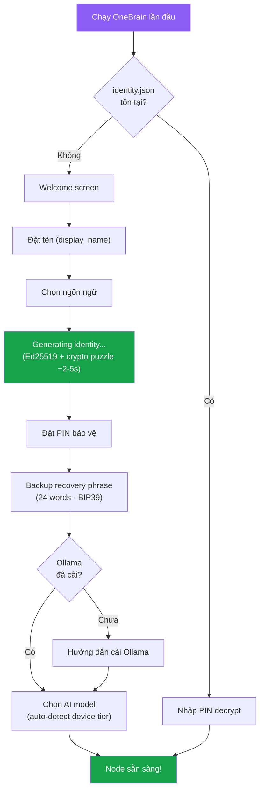
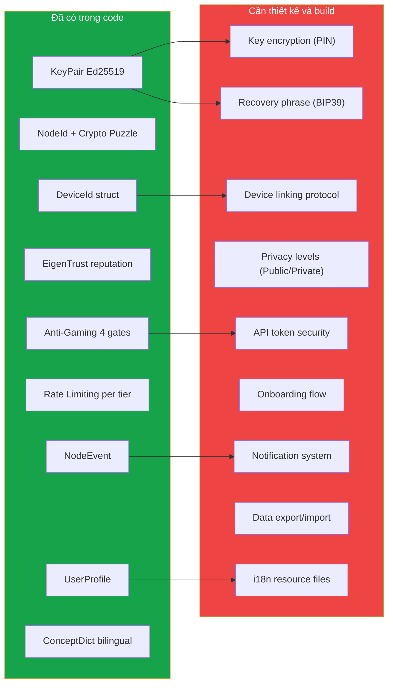

# 🔐 Pillar 10: Cross-Cutting Features — Phân tích nền tảng chung

> **Phân tích các tính năng chung mà TẤT CẢ platforms đều cần**
> Trước khi implement bất kỳ UI nào, phải thống nhất các quyết định nền tảng này.
> Ngày: 07/07/2026 | Trạng thái: ĐANG PHÂN TÍCH

---

## Tổng quan: 10 Cross-Cutting Concerns

| # | Concern | Đã có code? | Cần thiết kế thêm? |
|---|---------|------------|-------------------|
| 1 | Identity & Authentication | ✅ Phần lớn | 🟡 Cần hoàn thiện |
| 2 | Multi-device Sync | 🟡 Struct có, logic chưa | 🔴 Cần thiết kế |
| 3 | Human vs Bot (Sybil Resistance) | ✅ Nhiều lớp | 🟢 Đủ dùng |
| 4 | Privacy & Access Control | 🟡 Một phần | 🔴 Cần thiết kế |
| 5 | Session & Local API Security | ❌ Chưa | 🔴 Cần thiết kế |
| 6 | User Profile & Settings | ✅ Có | 🟡 Cần mở rộng |
| 7 | Onboarding / First Run | ❌ Chưa | 🔴 Cần thiết kế |
| 8 | Notifications | 🟡 NodeEvent có | 🟡 Cần chuẩn hóa |
| 9 | Data Portability | ❌ Chưa | 🟡 Cần thiết kế |
| 10 | Internationalization (i18n) | 🟡 Bilingual dict | 🟡 Cần mở rộng |

---

## 1. 🔑 Identity & Authentication

### Câu hỏi: "Có đăng nhập không?"

**Trả lời: KHÔNG có đăng nhập kiểu truyền thống** (username/password → central server). Trong hệ thống phi tập trung, **private key CỦA BẠN chính là identity**.

### Đã có trong code

| Component | File | Mô tả |
|-----------|------|-------|
| `KeyPair` | `identity.rs` | Ed25519 keypair — generate, sign, verify |
| `NodeId` | `identity.rs` L33 | BLAKE3(pubkey \|\| nonce) với crypto puzzle |
| `DeviceId` | `identity.rs` L86 | BLAKE3(device_pubkey) — cho multi-device |
| `NodeIdProof` | `identity.rs` L144 | Proof-of-work puzzle (chống Sybil) |
| DID format | `identity.rs` L232 | `did:key:z6Mk<hex>` — W3C standard |
| `identity.json` | `config.rs` L34 | Persist keypair to disk |

### Mô hình identity phi tập trung (**KHÔNG có login**)

> [!IMPORTANT]
> OneBrain **KHÔNG CÓ LOGIN**. Không có username, không có password gửi lên server, không có session. Private key của bạn chính là identity.

```mermaid
graph TD
    subgraph FIRST_RUN["Lần đầu chạy (= Tạo identity)"]
        GEN["Generate Ed25519 keypair"]
        PUZZLE["Giải crypto puzzle → NodeId"]
        SETPW["User đặt password bảo vệ"]
        SAVE["Lưu identity.json (encrypted)"]
        BIP39["Hiện BIP39 recovery phrase"]
    end

    subgraph STARTUP["Lần chạy sau (= Node tự khởi động)"]
        BOOT["OS boot / App start"]
        LOAD["Tự động load identity.json"]
        DECRYPT["Tự động decrypt (keychain/OS)"]
        READY["Node chạy background"]
    end

    subgraph APPLOCK["App Lock (chỉ Mobile)"]
        OPEN["User mở app"]
        BIO["Vân tay / Khuôn mặt / PIN"]
        USE["Dùng app"]
    end

    GEN --> PUZZLE --> SETPW --> SAVE --> BIP39
    BOOT --> LOAD --> DECRYPT --> READY
    OPEN --> BIO --> USE

    style FIRST_RUN fill:#16a34a,color:#fff
    style STARTUP fill:#3b82f6,color:#fff
    style APPLOCK fill:#8b5cf6,color:#fff
```



### So sánh với hệ thống quen thuộc

| | Truyền thống | Bitcoin | **OneBrain** |
|---|---|---|---|
| Identity | Username + Password | Private key (seed phrase) | **Ed25519 private key** |
| Đăng ký | Gửi info lên server | Generate key locally | **Generate key locally + crypto puzzle** |
| Đăng nhập | POST credentials → server | Load wallet file | **❌ KHÔNG CÓ LOGIN** — node tự chạy |
| Bảo vệ app | Session cookie | Wallet password | **App Lock** (biometric, chỉ mobile) |
| Quên mật khẩu | "Reset password" email | Mất key = mất coin | **BIP39 recovery phrase (24 words)** |
| Multi-device | Server nhận ra bạn | Import key sang thiết bị | **DeviceId linking (max 16 devices)** |

### Cần thiết kế thêm

- [ ] **Key encryption**: `identity.json` hiện lưu plain → cần encrypt bằng user **password** (AES-256-GCM + Argon2 key derivation)
- [ ] **OS Keychain integration**: Sau khi decrypt lần đầu, lưu derived key vào OS keychain để node tự khởi động lần sau không cần nhập lại
- [ ] **Recovery phrase**: BIP39 24-word mnemonic để khôi phục key khi mất thiết bị
- [ ] **App Lock (Mobile)**: Integrate OS biometric (fingerprint/face) để bảo vệ khỏi người lạ cầm điện thoại
- [ ] **Key export/import**: QR code hoặc file encrypted để chuyển identity sang thiết bị mới

---

## 2. 📱 Multi-device: "Dùng thiết bị khác thì sao?"

### Đã thiết kế (chưa implement đầy đủ)

- `DeviceId` struct đã có — mỗi device có keypair riêng
- `DEVICE_GROUP_MAX = 16` — tối đa 16 thiết bị per identity
- SPEC B §11 đã đề cập "personal mesh for multi-device sync"

### 2 chiến lược

| Chiến lược | Mô tả | Ưu điểm | Nhược điểm |
|-----------|-------|---------|------------|
| **A: Same key** | Copy `identity.json` sang thiết bị mới | Đơn giản | Nếu 1 device bị hack → tất cả bị |
| **B: Device keys** (khuyến nghị) | Mỗi device có keypair riêng, link đến master identity | An toàn hơn, revoke được từng device | Phức tạp hơn |

### Chiến lược B: Device Key Linking

```
Master Identity (Ed25519):     pubkey_master
├── Device 1 (Laptop):         DeviceId_1 = BLAKE3(pubkey_device1)
│   └── authorization = sign(pubkey_device1, master_private_key)
├── Device 2 (Phone):          DeviceId_2 = BLAKE3(pubkey_device2)  
│   └── authorization = sign(pubkey_device2, master_private_key)
└── Device 3 (AR Glasses):     DeviceId_3 = BLAKE3(pubkey_device3)
    └── authorization = sign(pubkey_device3, master_private_key)
```

**Flow liên kết thiết bị mới:**
1. Thiết bị cũ hiển thị QR code chứa: `master_pubkey + one-time-link-token`
2. Thiết bị mới quét QR → generate device keypair → gửi `device_pubkey` về thiết bị cũ
3. Thiết bị cũ ký `sign(device_pubkey, master_key)` → trả authorization
4. Thiết bị mới lưu authorization → bắt đầu sync KUs qua P2P

**Knowledge sync giữa devices:**
- Devices trong cùng group tự sync KUs qua P2P (dùng existing sync protocol)
- Tất cả devices share cùng OBT wallet (vì cùng master identity)
- Conflict resolution: CRDT (đã có — `crdt.rs`)

### Cần thiết kế thêm

- [ ] Device linking protocol (QR flow)
- [ ] Device revocation (xóa 1 device khỏi group)
- [ ] Selective sync (không phải mọi KU cần sync sang mọi device)

---

## 3. 🤖 Human vs Bot: "Làm sao xác nhận là người hay bot?"

### Đã có — hệ thống chống bot nhiều lớp

OneBrain **KHÔNG dùng CAPTCHA** (vì không có server tập trung). Thay vào đó, dùng **4 lớp phòng thủ**:

| Lớp | Cơ chế | File | Chống gì? |
|-----|--------|------|-----------|
| 🔒 **L1: Crypto Puzzle** | NodeId = BLAKE3(pubkey \|\| nonce) phải có N leading zeros | `identity.rs` | Mass account creation (tạo 1 identity mất ~65K hash iterations) |
| ⏱️ **L2: Rate Limiting** | Leaf: 1 KU/hour, Contributor: 5, SP+: 10 | `obt_anti_gaming.rs` | Spam flooding |
| 📊 **L3: Quality Gates** | Min 256 bytes, min 2 instructions, encoding verification | `anti_gaming_guard.rs` | Low-quality/nonsense KUs |
| ⭐ **L4: Reputation** | EigenTrust score dựa trên quality KUs + PoMV history | `eigentrust.rs` | Long-term gaming |

### Tại sao đủ mà không cần CAPTCHA?

```
Bot tạo 1000 fake identities:
  → L1: Mỗi identity mất ~65K hashes = tốn CPU đáng kể
  → L2: Mỗi identity chỉ post 1 KU/hour = 1000 KU/hour (vẫn ít)
  → L3: Mỗi KU phải qua AI encoding + verification = không fake được
  → L4: New identities = Leaf tier = gần như không có influence
  → PoMV: Fake KUs không có real metabolic value = tự chết
  → Immune System: Phát hiện patterns bất thường → quarantine
```

**Kết luận**: Hệ thống hiện tại **đủ mạnh** cho Phase 1-3. Không cần thêm CAPTCHA hay KYC.

### Tùy chọn nâng cao (Phase 3+)

- [ ] Proof-of-Humanity (POH) integration — cho high-trust operations
- [ ] Web-of-Trust — các node uy tín vouch cho nhau
- [ ] Stake-based identity — deposit OBT để tạo identity (economic cost)

### Phân tích kịch bản: "Tạo 100 identity để thao túng"

> [!WARNING]
> **Vấn đề**: 1 người tạo 100 identity khác nhau (Sybil attack) để spam hoặc thao túng mạng?

**Phân tích chi phí vs lợi ích:**

| Lớp | Chi phí attacker phải trả | Kết quả |
|-----|--------------------------|--------|
| **L1: Crypto Puzzle** | 100 × ~65K hashes = **6.5M hashes** (~vài phút CPU) | Có 100 identity nhưng tất cả đều **Leaf tier** |
| **L2: Rate Limit** | 100 identity × 1 KU/hour = **100 KU/hour** | Vẫn ít so với mạng (legitimate nodes cũng tạo KU) |
| **L3: Quality Gate** | Mỗi KU phải ≥256 bytes + ≥2 genes + **qua AI encoding** | Không fake được nội dung |
| **L4: EigenTrust** | 100 identity mới = **trust ≈ 0** | Mạng không tin, KU không được lan truyền nhanh |
| **PoMV** | Fake KUs không ai dùng → `metabolic_rate → 0` | KU **tự chết** vì không có metabolic value |
| **Immune System** | Detect pattern: cùng IP, cùng behavior, cùng timing | **Quarantine** hàng loạt |

**Kịch bản chi tiết:**

```
Attacker tạo 100 fake identities từ 1 máy:
  ── Tạo identity: 100 × 65K hashes = ~6.5M hashes (~5 giây)
  ── Gửi KU: 100 KU/hour (tất cả Leaf tier)
  ── Mỗi KU phải qua AI encoding (cần Ollama chạy thật)
  ── 100 nodes mới, trust = 0.001 mỗi node
  ── Immune System phát hiện: cùng IP range, similar content pattern
  ── → Quarantine tất cả
  ── → Kết quả: Tốn nhiều CPU + GPU (AI), chẳng được gì
```

**Và khi mạng lớn hơn, tự động khó hơn:**

| Mạng | Puzzle difficulty | Chi phí tạo 100 identities |
|-------|------------------|---------------------------|
| <1M nodes | `C = 16` → ~65K hashes/id | ~6.5M hashes (~5 giây) |
| 1M-1B nodes | `C = 20` → ~1M hashes/id | ~100M hashes (~vài phút) |
| >1B nodes | `C = 24` → ~16M hashes/id | ~1.6B hashes (~nhiều giờ) |

**Kết luận**: Chi phí tăng **exponential** theo kích thước mạng, lợi ích gần bằng 0 vì PoMV + Immune System. **Đủ mạnh cho Phase 1-3.**

---

## 4. 🔒 Privacy & Access Control

### Triết lý cốt lõi của OneBrain

> [!IMPORTANT]
> **Khi đã publish lên OneBrain = dành cho TOÀN NHÂN LOẠI.**
> Không có "shared KU" hay "private published KU". Kiến thức trên mạng OneBrain là commons — không phục vụ riêng ai.

| Loại | Mô tả | Lưu ở đâu? | Phase |
|------|-------|-----------|-------|
| **Published KU** | Kiến thức đã publish lên mạng OB | Toàn mạng (P2P replicate) | ✅ Phase 1 |
| **Local Draft** | Bản nháp chưa publish, ghi chú cá nhân | **Chỉ local node** — không sync, không gửi P2P | 🟡 Phase 2 |

### Phase 1: Tất cả KU đều public
- Encode → publish → toàn mạng nhận
- Không có visibility setting
- Đơn giản, đúng triết lý

### Phase 2+: Local Drafts
- User có thể lưu draft local trước khi quyết định publish
- Draft chỉ nằm trên máy đó, **không bao giờ tự động gửi P2P**
- Khi user publish → trở thành public KU cho toàn nhân loại
- Cần encrypt draft bằng password (AES-256-GCM)

### Cần thiết kế (Phase 2)

- [ ] `KuStatus` enum: `Draft | Published`
- [ ] Draft storage: encrypted local, không đi vào P2P sync
- [ ] Publish action: Draft → encode → broadcast to network

---

## 5. 🛡️ Session & Local API Security

### Vấn đề
Local API chạy trên `localhost:4280` — nhưng browser có thể bị exploit (CSRF, XSS) để gọi API trái phép.

### Giải pháp: API Token

```
Khi node khởi động:
  1. Generate random API token (256-bit)
  2. Lưu vào ~/.onebrain/api_token
  3. Web Dashboard đọc token (hoặc user paste vào lần đầu)
  4. Mọi API call phải có header: Authorization: Bearer <token>
```

| Nền tảng | Cách lấy token |
|----------|----------------|
| **CLI** | Không cần — CLI chạy cùng process |
| **Web Dashboard** | User paste token lần đầu → lưu localStorage |
| **Desktop (Tauri)** | Đọc file trực tiếp (cùng process) |
| **Mobile (Flutter)** | Đọc qua flutter_rust_bridge (cùng process) |
| **Bots** | Config file |

### Cần thiết kế

- [ ] API token generation khi node start
- [ ] Token validation middleware cho axum
- [ ] CORS policy: chỉ accept `localhost` origins
- [ ] Rate limiting cho API endpoints

---

## 6. 👤 User Profile & Settings

### Đã có

`profile.rs` — `UserProfile` với:
- `display_name`, `preferred_language`, `response_style`
- `expertise_areas`, `concept_frequency`
- `total_kus_encoded`, `total_queries`
- Serialize/Deserialize (JSON), Save/Load to disk

### Cần mở rộng cho multi-platform

| Setting | Scope | Sync? | Mô tả |
|---------|-------|-------|-------|
| `display_name` | Identity | ✅ Sync | Tên hiển thị |
| `preferred_language` | Device | ❌ Local | Ngôn ngữ UI |
| `response_style` | Identity | ✅ Sync | AI response style |
| `theme` | Device | ❌ Local | Dark/Light mode |
| `notification_settings` | Device | ❌ Local | Mute, DND hours |
| `ai_model` | Device | ❌ Local | Mỗi device khác nhau (GPU khác) |
| `expertise_areas` | Identity | ✅ Sync | Lĩnh vực chuyên môn |
| `proactive_encoding` | Identity | ✅ Sync | Auto-detect knowledge |

**Nguyên tắc**: Settings chia 2 loại:
- **Identity-level** (sync qua devices): tên, style, expertise
- **Device-level** (local only): theme, language, AI model, notifications

---

## 7. 🚀 Onboarding / First Run

### Flow lần đầu chạy OneBrain (mọi platform)



### Shared Onboarding Components (mọi platform dùng chung logic)

| Step | Rust backend | UI layer |
|------|-------------|----------|
| Key generation | `KeyPair::generate()` + `generate_node_id()` | Progress indicator |
| Password encryption | AES-256-GCM + Argon2 KDF | Password input + confirm + strength indicator |
| Recovery phrase | BIP39 mnemonic generation | Word display + verify |
| AI detection | `DeviceProfile::detect()` | Model selector |
| Tutorial encode | `node.encode_and_store()` **local-only, không publish** | Interactive tutorial overlay |

---

## 8. 🔔 Notifications

### Đã có: `NodeEvent` enum

```rust
pub enum NodeEvent {
    PeerConnected(PeerInfo),
    KuReceived { cid_hex, from, wire_bytes },
    VerifyResult { cid_hex, agreement_score, verified, from },
    Notification(String),
}
```

### Cần chuẩn hóa cross-platform

| Event | CLI | Web | Desktop | Mobile | AR |
|-------|-----|-----|---------|--------|-----|
| Peer connected | eprintln | Toast | System tray | Push | Badge |
| KU received | eprintln | Toast + badge | Notification | Push | Glance |
| Verify result | eprintln | Inline | Notification | Push | — |
| Encoding done | println | Toast | Notification | Push | Badge |
| OBT reward | — | Toast + counter | System tray | Push | — |

### Cần thiết kế

- [ ] `NotificationEvent` unified enum (superset of `NodeEvent`)
- [ ] Priority levels: `Silent`, `Normal`, `Important`, `Urgent`
- [ ] User preferences: mute per event type, DND schedule
- [ ] WebSocket push cho Web Dashboard

---

## 9. 📦 Data Portability

### Export / Import / Backup

| Tính năng | Mô tả | Format |
|-----------|-------|--------|
| **Full backup** | Toàn bộ node data (KUs + profile + keys) | Encrypted archive (.onebrain) |
| **Export KUs** | Xuất knowledge base (không có keys) | JSON / CSV / Markdown |
| **Import KUs** | Nhập từ file text, CSV, PDF | Text → encode pipeline |
| **Identity backup** | Recovery phrase (24 words) | BIP39 mnemonic |
| **Migrate device** | Chuyển toàn bộ sang device mới | QR + P2P sync |

---

## 10. 🌐 Internationalization (i18n)

### Đã có

- `ConceptDict` bilingual (English + Vietnamese) — cho AI encoding
- `preferred_language` trong `UserProfile`

### Cần cho UI

| Nội dung | Cách xử lý |
|----------|------------|
| UI text (buttons, labels, menus) | i18n resource files (JSON per language) |
| AI responses | `preferred_language` → Mediator system prompt |
| KU display | Original language + optional translation |
| Error messages | i18n resource files |
| Onboarding | Multi-language |

**Phase 1 languages**: 🇻🇳 Tiếng Việt + 🇬🇧 English

---

## Tổng hợp: Nền tảng đã có vs Cần build



---

## Open Questions — ✅ Tất cả đã quyết định

1. ~~**PIN hay Password?**~~ → ✅ **Password** — an toàn hơn, dùng Argon2 key derivation.
2. ~~**Private KU có cần ngay Phase 1?**~~ → ✅ **Phase 2**. Phase 1 tất cả KU public. Triết lý: **publish lên OB = dành cho toàn nhân loại**, không phục vụ riêng ai. Local drafts (Phase 2) chỉ lưu local, không sync.
3. ~~**Recovery phrase?**~~ → ✅ **BIP39** (24 words) — chuẩn công nghiệp, user đã quen từ crypto wallets.
4. ~~**Onboarding tutorial?**~~ → ✅ **Có tutorial** — demo encode KU đầu tiên nhưng **không publish lên mạng OB** (chỉ local practice).
