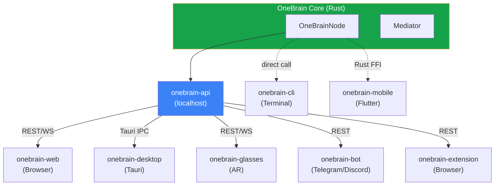

# 📋 Pillar 10: Đặc tả tính năng chung — Tất cả nền tảng

> **Mỗi nền tảng OneBrain PHẢI implement đầy đủ các tính năng dưới đây.**
> Tài liệu này là "contract" giữa các project interface — đảm bảo user trải nghiệm nhất quán dù dùng platform nào.
> Ngày: 07/07/2026

---

## Danh sách Projects theo Interface

| # | Project | Interface | Công nghệ | Platforms | Phase |
|---|---------|-----------|-----------|-----------|-------|
| 0 | **onebrain-api** | Local API | Rust (axum) | Foundation cho tất cả | Phase 1 |
| 1 | **onebrain-cli** | CLI REPL | Rust (đã có) | Terminal | ✅ Done |
| 2 | **onebrain-web** | Web Dashboard | React + Vite + TypeScript | Browser | Phase 1 |
| 3 | **onebrain-desktop** | Desktop App | Tauri 2.x (wraps onebrain-web) | Windows, macOS, Linux | Phase 2 |
| 4 | **onebrain-mobile** | Mobile App | Flutter + `flutter_rust_bridge` | Android, iOS | Phase 3 |
| 5 | **onebrain-glasses** | AR Glasses | Web App (JS) / visionOS | Meta Ray-Ban, Apple Vision Pro | Phase 4 |
| 6 | **onebrain-bot** | Chat Bot | REST API client (Node.js/Python) | Telegram, Discord | Phase 2 |
| 7 | **onebrain-extension** | Browser Extension | WebExtension API | Chrome, Firefox, Edge | Phase 3 |

### Kiến trúc tổng thể



---

## Quy ước tài liệu

- ✅ = Bắt buộc implement
- 🟡 = Tuỳ chọn (nếu platform hỗ trợ)
- ❌ = Không áp dụng
- **Mỗi tính năng có ID** (F-XX) để reference trong code và test

---

## Module A: Identity & Bảo vệ

### F-A01: Tạo Identity mới (First Run)

| Thuộc tính | Giá trị |
|-----------|---------|
| **Mô tả** | Tự động generate Ed25519 keypair + giải crypto puzzle → NodeId |
| **Input** | Display name, password |
| **Output** | `identity.json` (encrypted), BIP39 recovery phrase |
| **Backend** | `KeyPair::generate()`, `generate_node_id()`, AES-256-GCM + Argon2 |

| Platform | Hỗ trợ | Ghi chú |
|----------|--------|---------|
| CLI | ✅ | Interactive prompt |
| Web | ✅ | Welcome wizard UI |
| Desktop | ✅ | Native wizard |
| Mobile | ✅ | Onboarding screens |
| AR Glasses | ❌ | Phải setup từ device khác trước, link qua QR |
| Bot | ❌ | Bot dùng API token, không tạo identity |
| Extension | ❌ | Kết nối đến node đã chạy |

### F-A02: App Lock (Khoá ứng dụng)

| Thuộc tính | Giá trị |
|-----------|---------|
| **Mô tả** | Bảo vệ app khỏi người khác cầm thiết bị. **Không phải login** — không gửi gì lên server, không xác thực tài khoản |
| **Mục đích** | Ngăn người lạ cầm điện thoại mở app và thực hiện thao tác (encode, gửi KU...) |
| **Cơ chế** | OS-level: biometric (vân tay/khuôn mặt) hoặc PIN thiết bị |

> [!IMPORTANT]
> **Đây KHONG phải login.** Không có tài khoản, không có server kiểm tra. App Lock chỉ là lớp bảo vệ vật lý — giống như khoá màn hình điện thoại, không phải đăng nhập.

| Platform | Hỗ trợ | Ghi chú |
|----------|--------|---------|
| CLI | ❌ | Terminal đã được OS bảo vệ (user session) |
| Web | ❌ | Browser đã được OS bảo vệ |
| Desktop | 🟡 | Tuỳ chọn: lock app khi minimize hoặc sau N phút |
| Mobile | ✅ | **Bắt buộc**: biometric (fingerprint/face) hoặc PIN khi mở app |
| AR Glasses | 🟡 | Voice passphrase hoặc paired device xong mới dùng |
| Bot | ❌ | Bot chạy trên server, không cần |
| Extension | ❌ | Browser đã bảo vệ |

### F-A03: Recovery (Khôi phục Identity)

| Thuộc tính | Giá trị |
|-----------|---------|
| **Mô tả** | Khôi phục keypair từ BIP39 24-word mnemonic |
| **Input** | 24 từ recovery phrase + password mới |
| **Output** | `identity.json` mới (cùng keypair) |

| Platform | Hỗ trợ | Ghi chú |
|----------|--------|---------|
| CLI | ✅ | `onebrain recover` command |
| Web | ✅ | Recovery wizard |
| Desktop | ✅ | Recovery wizard |
| Mobile | ✅ | Recovery screen |
| AR Glasses | ❌ | Recovery từ device khác |
| Bot | ❌ | — |
| Extension | ❌ | — |

### F-A04: Liên kết thiết bị (Device Linking)

| Thuộc tính | Giá trị |
|-----------|---------|
| **Mô tả** | Liên kết thiết bị mới vào identity group (max 16 devices) |
| **Input** | QR code từ thiết bị cũ |
| **Output** | Device keypair + authorization certificate |
| **Backend** | `DeviceId::from_pubkey()`, Ed25519 sign authorization |

| Platform | Hỗ trợ | Ghi chú |
|----------|--------|---------|
| CLI | ✅ | Hiển thị QR code text / accept link code |
| Web | ✅ | QR display + scan (webcam) |
| Desktop | ✅ | QR display + scan |
| Mobile | ✅ | QR scan native (camera) |
| AR Glasses | ✅ | Scan QR bằng camera kính |
| Bot | ❌ | — |
| Extension | ❌ | — |

---

## Module B: Knowledge Operations

### F-B01: Encode (Đóng góp kiến thức)

| Thuộc tính | Giá trị |
|-----------|---------|
| **Mô tả** | Nhập text → AI phân tích → tạo KU → publish lên mạng OB |
| **Input** | Text (+ tùy chọn: voice, file) |
| **Output** | KU với CID, genes, bonds, PoMV khởi tạo |
| **Backend** | `node.encode_and_store()` → Mediator → ku-encoder → ku-ai |
| **Triết lý** | Publish = dành cho toàn nhân loại |

| Platform | Hỗ trợ | Input types | Ghi chú |
|----------|--------|------------|---------|
| CLI | ✅ | Text | `encode <text>` command |
| Web | ✅ | Text, file drag-drop | Rich editor + KU preview |
| Desktop | ✅ | Text, file drag-drop, clipboard | System-wide hotkey encode |
| Mobile | ✅ | Text, voice, photo, share sheet | Quick capture widget |
| AR Glasses | ✅ | Voice only | "Hey OneBrain, remember..." |
| Bot | ✅ | Text (chat message) | `/encode <text>` command |
| Extension | ✅ | Selected text trên web page | Right-click → Encode to OneBrain |

### F-B02: Search (Tìm kiến thức)

| Thuộc tính | Giá trị |
|-----------|---------|
| **Mô tả** | Tìm kiếm KUs theo ngữ nghĩa (semantic search) |
| **Input** | Query text |
| **Output** | Danh sách KUs liên quan (ranked by relevance) |
| **Backend** | `node.process_input()` → Mediator (SearchKnowledge intent) |

| Platform | Hỗ trợ | Ghi chú |
|----------|--------|---------|
| CLI | ✅ | `search <query>` command |
| Web | ✅ | Search bar + filter panel + card results |
| Desktop | ✅ | Global search (Cmd/Ctrl+K) |
| Mobile | ✅ | Search screen + voice search |
| AR Glasses | ✅ | Voice query → glanceable results |
| Bot | ✅ | `/search <query>` → inline results |
| Extension | ✅ | Popup search bar |

### F-B03: Browse KUs (Knowledge Explorer)

| Thuộc tính | Giá trị |
|-----------|---------|
| **Mô tả** | Duyệt danh sách KUs, filter, xem chi tiết |
| **Input** | Filters (gene type, trust level, date, domain) |
| **Output** | Paginated list/grid of KU cards |

| Platform | Hỗ trợ | Ghi chú |
|----------|--------|---------|
| CLI | ✅ | `list` command + table output |
| Web | ✅ | Full explorer: cards, filters, sort, pagination |
| Desktop | ✅ | Same as web |
| Mobile | ✅ | Scrollable list + pull-to-refresh |
| AR Glasses | 🟡 | Simplified list (5-10 items) |
| Bot | 🟡 | `/list` → inline buttons |
| Extension | 🟡 | Mini popup list |

### F-B04: KU Detail View

| Thuộc tính | Giá trị |
|-----------|---------|
| **Mô tả** | Xem chi tiết 1 KU: nội dung, genes, bonds, PoMV score, metadata |
| **Input** | KU CID |
| **Output** | Full KU card: text, gene types, bond weights, encoding quality, author, timestamp |

| Platform | Hỗ trợ | Ghi chú |
|----------|--------|---------|
| CLI | ✅ | Formatted text output |
| Web | ✅ | Detail panel / modal |
| Desktop | ✅ | Detail panel |
| Mobile | ✅ | Full screen detail |
| AR Glasses | 🟡 | Condensed view (title + summary) |
| Bot | ✅ | Formatted message |
| Extension | 🟡 | Popup card |

### F-B05: Graph Visualization

| Thuộc tính | Giá trị |
|-----------|---------|
| **Mô tả** | Hiển thị knowledge graph tương tác (nodes = KUs, edges = bonds) |
| **Input** | Tùy chọn: center node, depth, filters |
| **Output** | Interactive 2D (Cytoscape.js) + 3D (3d-force-graph) toggle |

| Platform | Hỗ trợ | Ghi chú |
|----------|--------|---------|
| CLI | ❌ | Terminal không hỗ trợ graph visual |
| Web | ✅ | Full 2D + 3D toggle, zoom/pan, click expand |
| Desktop | ✅ | Same as web |
| Mobile | ✅ | 2D only (touch gestures), pinch zoom |
| AR Glasses | 🟡 | 3D spatial graph (Vision Pro) |
| Bot | ❌ | — |
| Extension | ❌ | — |

---

## Module C: AI Chat & Mediator

### F-C01: Chat Interface

| Thuộc tính | Giá trị |
|-----------|---------|
| **Mô tả** | Trò chuyện với AI qua Mediator — hỏi đáp, tổng hợp, phân tích |
| **Input** | Text message (+ voice trên mobile/AR) |
| **Output** | `MediatorResponse`: text, intent, suggestions, KUs liên quan |
| **Backend** | `node.process_input()` → Mediator → ku-ai → Ollama |

| Platform | Hỗ trợ | Ghi chú |
|----------|--------|---------|
| CLI | ✅ | REPL free-text input (đã có) |
| Web | ✅ | Chat panel: bubbles, streaming, suggestions chips |
| Desktop | ✅ | Same as web + floating widget |
| Mobile | ✅ | Full chat screen + voice input |
| AR Glasses | ✅ | Voice-first: speak → AI responds (text overlay + TTS) |
| Bot | ✅ | Native chat (Telegram/Discord message) |
| Extension | 🟡 | Mini chat popup |

### F-C02: Intent Display

| Thuộc tính | Giá trị |
|-----------|---------|
| **Mô tả** | Hiển thị intent đã detect từ user input (Encode, Search, Analyze...) |
| **Output** | Badge/label: `🔍 Search`, `📝 Encode`, `💬 Chat`, `📊 Analyze` |

| Platform | Hỗ trợ | Ghi chú |
|----------|--------|---------|
| CLI | ✅ | Text prefix: `[Intent: Search]` |
| Web | ✅ | Colored badge trên message |
| Desktop | ✅ | Same as web |
| Mobile | ✅ | Badge chip |
| AR Glasses | 🟡 | Icon overlay |
| Bot | ✅ | Emoji prefix |
| Extension | 🟡 | Badge |

### F-C03: Suggestions

| Thuộc tính | Giá trị |
|-----------|---------|
| **Mô tả** | Hiển thị gợi ý hành động tiếp theo từ Mediator |
| **Output** | List of actionable suggestion chips |

| Platform | Hỗ trợ | Ghi chú |
|----------|--------|---------|
| CLI | ✅ | Numbered list, user nhập số |
| Web | ✅ | Clickable chips dưới message |
| Desktop | ✅ | Same as web |
| Mobile | ✅ | Tappable chips + swipe |
| AR Glasses | 🟡 | Voice menu: "Option 1, 2, or 3" |
| Bot | ✅ | Inline keyboard buttons |
| Extension | 🟡 | Clickable chips |

---

## Module D: Node Status & Network

### F-D01: Dashboard / Status Overview

| Thuộc tính | Giá trị |
|-----------|---------|
| **Mô tả** | Tổng quan trạng thái node: KU count, peer count, OBT balance, uptime |
| **Backend** | `node.ku_count()`, `node.peer_count()`, OBT balance API |

| Platform | Hỗ trợ | Ghi chú |
|----------|--------|---------|
| CLI | ✅ | `status` command → formatted table |
| Web | ✅ | Dashboard screen: cards + charts |
| Desktop | ✅ | Dashboard + system tray mini-status |
| Mobile | ✅ | Home screen + widget (Android/iOS) |
| AR Glasses | 🟡 | Glanceable: "3 KUs, 5 peers" |
| Bot | ✅ | `/status` command |
| Extension | ✅ | Badge icon: KU count |

### F-D02: Peer List

| Thuộc tính | Giá trị |
|-----------|---------|
| **Mô tả** | Danh sách peers đang kết nối |
| **Backend** | `node.peer_list_snapshot()` |

| Platform | Hỗ trợ | Ghi chú |
|----------|--------|---------|
| CLI | ✅ | `peers` command |
| Web | ✅ | Network screen: peer table + map |
| Desktop | ✅ | Same as web |
| Mobile | ✅ | Peer list screen |
| AR Glasses | ❌ | Không cần trên kính |
| Bot | ✅ | `/peers` command |
| Extension | 🟡 | Mini peer count |

### F-D03: Connect to Peer

| Thuộc tính | Giá trị |
|-----------|---------|
| **Mô tả** | Kết nối thủ công đến peer qua address |
| **Input** | `IP:Port` hoặc domain |
| **Backend** | `node.connect_to_peer()` |

| Platform | Hỗ trợ | Ghi chú |
|----------|--------|---------|
| CLI | ✅ | `connect <addr>` command |
| Web | ✅ | Input field + connect button |
| Desktop | ✅ | Same as web |
| Mobile | ✅ | Input + connect |
| AR Glasses | ❌ | Auto-connect qua seed |
| Bot | 🟡 | `/connect <addr>` |
| Extension | ❌ | — |

---

## Module E: Notifications & Events

### F-E01: Real-time Event Stream

| Thuộc tính | Giá trị |
|-----------|---------|
| **Mô tả** | Nhận events real-time từ node: peer connected, KU received, verify result |
| **Backend** | `NodeEvent` enum → WebSocket `/ws/events` |

| Platform | Hỗ trợ | Delivery | Ghi chú |
|----------|--------|---------|---------|
| CLI | ✅ | stderr print | Real-time trong REPL |
| Web | ✅ | WebSocket → Toast | Toast notification + badge count |
| Desktop | ✅ | OS notification | System tray popup |
| Mobile | ✅ | Push notification | FCM (Android) / APNs (iOS) |
| AR Glasses | ✅ | Visual badge | Subtle overlay |
| Bot | ✅ | Message push | Forward important events |
| Extension | ✅ | Badge + popup | Browser notification API |

### F-E02: Notification Preferences

| Thuộc tính | Giá trị |
|-----------|---------|
| **Mô tả** | User tùy chỉnh notification: mute per type, DND schedule |
| **Storage** | Device-level settings (không sync) |

| Platform | Hỗ trợ | Ghi chú |
|----------|--------|---------|
| CLI | 🟡 | Config file |
| Web | ✅ | Settings panel |
| Desktop | ✅ | Settings + OS integration |
| Mobile | ✅ | Settings + OS notification categories |
| AR Glasses | 🟡 | Minimal settings |
| Bot | ✅ | `/mute`, `/unmute` commands |
| Extension | ✅ | Popup settings |

---

## Module F: Profile & Settings

### F-F01: User Profile

| Thuộc tính | Giá trị |
|-----------|---------|
| **Mô tả** | Xem/sửa display name, response style, expertise areas |
| **Scope** | Identity-level (sync qua devices) |
| **Backend** | `UserProfile` struct → `user_profile.json` |

| Platform | Hỗ trợ | Ghi chú |
|----------|--------|---------|
| CLI | ✅ | `profile` command + edit sub-commands |
| Web | ✅ | Settings → Profile tab |
| Desktop | ✅ | Settings → Profile |
| Mobile | ✅ | Profile screen |
| AR Glasses | ❌ | Sửa từ device khác |
| Bot | 🟡 | `/profile` command |
| Extension | ❌ | — |

### F-F02: Device Settings

| Thuộc tính | Giá trị |
|-----------|---------|
| **Mô tả** | Theme, language, AI model, notification, port |
| **Scope** | Device-level (không sync) |

| Platform | Hỗ trợ | Settings |
|----------|--------|---------|
| CLI | ✅ | Config file (TOML) |
| Web | ✅ | Theme (dark/light), language |
| Desktop | ✅ | + AI model, port, auto-start, system tray |
| Mobile | ✅ | + voice language, notification channels |
| AR Glasses | 🟡 | Minimal: language, voice |
| Bot | 🟡 | Bot config file |
| Extension | ✅ | Theme, language |

### F-F03: AI Model Management

| Thuộc tính | Giá trị |
|-----------|---------|
| **Mô tả** | Chọn/thay đổi Ollama model, test connection, xem GPU info |
| **Backend** | Ollama REST API (`/api/tags`, `/api/show`) |

| Platform | Hỗ trợ | Ghi chú |
|----------|--------|---------|
| CLI | ✅ | Config setting |
| Web | ✅ | Model selector dropdown + test button |
| Desktop | ✅ | + Ollama auto-detect/install guide |
| Mobile | ✅ | Model selector (mobile Ollama limited) |
| AR Glasses | ❌ | Dùng model từ paired device |
| Bot | ❌ | Dùng model của node host |
| Extension | ❌ | — |

---

## Module G: Data Portability

### F-G01: Export Knowledge

| Thuộc tính | Giá trị |
|-----------|---------|
| **Mô tả** | Xuất KUs ra file (không bao gồm private keys) |
| **Output** | JSON / CSV / Markdown |

| Platform | Hỗ trợ | Ghi chú |
|----------|--------|---------|
| CLI | ✅ | `export --format json -o file.json` |
| Web | ✅ | Download button |
| Desktop | ✅ | Native save dialog |
| Mobile | ✅ | Share sheet |
| AR Glasses | ❌ | Export từ device khác |
| Bot | 🟡 | `/export` → send file |
| Extension | ❌ | — |

### F-G02: Import Knowledge

| Thuộc tính | Giá trị |
|-----------|---------|
| **Mô tả** | Nhập text/file → encode thành KUs |
| **Input** | Text file, CSV, PDF, Markdown |

| Platform | Hỗ trợ | Ghi chú |
|----------|--------|---------|
| CLI | ✅ | `import <file>` command |
| Web | ✅ | File upload + drag-drop |
| Desktop | ✅ | Native file picker + drag-drop |
| Mobile | ✅ | File picker + share sheet receive |
| AR Glasses | ❌ | — |
| Bot | ✅ | Send file → auto-encode |
| Extension | ✅ | Right-click page → Import |

### F-G03: Full Backup & Restore

| Thuộc tính | Giá trị |
|-----------|---------|
| **Mô tả** | Backup toàn bộ: identity + KUs + profile + settings |
| **Output** | Encrypted `.onebrain` archive |

| Platform | Hỗ trợ | Ghi chú |
|----------|--------|---------|
| CLI | ✅ | `backup` / `restore` commands |
| Web | ✅ | Settings → Backup |
| Desktop | ✅ | Settings → Backup + auto-backup schedule |
| Mobile | ✅ | Settings → Backup (save to cloud storage) |
| AR Glasses | ❌ | — |
| Bot | ❌ | — |
| Extension | ❌ | — |

---

## Module H: Onboarding

### F-H01: Welcome & Setup Wizard

| Thuộc tính | Giá trị |
|-----------|---------|
| **Mô tả** | First run: tạo identity, chọn ngôn ngữ, setup AI model |
| **Steps** | Name → Language → Generate keys → Set password → Backup recovery phrase → AI setup |

| Platform | Hỗ trợ | Ghi chú |
|----------|--------|---------|
| CLI | ✅ | Interactive prompts |
| Web | ✅ | Step-by-step wizard UI |
| Desktop | ✅ | Native wizard |
| Mobile | ✅ | Onboarding slides |
| AR Glasses | ❌ | Setup từ device khác |
| Bot | ❌ | — |
| Extension | ❌ | — |

### F-H02: Tutorial (Practice Encode)

| Thuộc tính | Giá trị |
|-----------|---------|
| **Mô tả** | Demo encode KU đầu tiên — **local only, không publish lên mạng OB** |
| **Flow** | Guided encode → xem KU result → giải thích genes/bonds → "Ready!" |

| Platform | Hỗ trợ | Ghi chú |
|----------|--------|---------|
| CLI | ✅ | Interactive tutorial mode |
| Web | ✅ | Overlay tutorial with highlights |
| Desktop | ✅ | Same as web |
| Mobile | ✅ | Coach marks / tooltips |
| AR Glasses | ❌ | — |
| Bot | 🟡 | `/tutorial` command |
| Extension | 🟡 | Quick tip popup |

---

## Module I: Internationalization (i18n)

### F-I01: Multi-language UI

| Thuộc tính | Giá trị |
|-----------|---------|
| **Mô tả** | UI text, labels, error messages đa ngôn ngữ |
| **Phase 1** | 🇻🇳 Tiếng Việt + 🇬🇧 English |
| **Implementation** | JSON resource files per language |

| Platform | Hỗ trợ | Ghi chú |
|----------|--------|---------|
| CLI | ✅ | Locale từ config |
| Web | ✅ | Language switcher |
| Desktop | ✅ | Language switcher + OS locale detect |
| Mobile | ✅ | Language switcher + OS locale detect |
| AR Glasses | ✅ | Follow paired device setting |
| Bot | ✅ | `/lang vi` / `/lang en` |
| Extension | ✅ | Follow browser locale |

### F-I02: AI Response Language

| Thuộc tính | Giá trị |
|-----------|---------|
| **Mô tả** | AI trả lời theo ngôn ngữ user chọn |
| **Backend** | `UserProfile.preferred_language` → Mediator system prompt |

| Platform | Hỗ trợ | Ghi chú |
|----------|--------|---------|
| Tất cả | ✅ | Inject vào Mediator context |

---

## Module T: Đặc tả kỹ thuật chung

> **Xem tài liệu chi tiết đầy đủ tại: [P10_TECHNICAL_GUIDE.md](file:///c:/Users/shpy2/Documents/OneBrain/docs/specs/P10_TECHNICAL_GUIDE.md)**
>
> Technical Guide bao gồm 20 sections:
> - Kiến trúc 10 crates, dependency graph
> - Data Model đầy đủ (KU, Gene 11 types, Bond 33 relations, Codon, TrustSection...)
> - Local API Specification (40+ REST endpoints, authentication, CORS)
> - WebSocket Event Protocol (10 event types)
> - Configuration & File Paths per platform
> - Mediator Pipeline (Intent → Dispatch → Response)
> - AI Architecture (Device Tiers T0-T6, Model Registry, GPU detection)
> - Encoding Pipeline (Quality Gates, Consensus RAW→FULL)
> - P2P Network Protocol (81 OBP message types, SWIM, DHT, Bootstrap)
> - OBT Token System (7 tiers, 4 reward streams, penalty system)
> - OBKG Knowledge Graph (Dream Mode, FedR, Decay, Bio-inspired)
> - Anti-Gaming & Security (4 layers, Immune System)
> - Error Handling (15 unified error codes cho UI)
> - Offline Mode (feature availability matrix)
> - Wire Protocols (5 formats)
> - Build Configuration (feature flags, dependencies)
> - CLI Command Reference (implemented vs planned)
> - Protocol Constants (50+ constants)
> - Seed Node Architecture
> - CRDT Types (4 types cho multi-device sync)

### Tóm tắt: 3 loại platform

| Loại | Platforms | Connection | Đặc điểm |
|------|----------|-----------|----------|
| **Full Node** | CLI, Desktop, Mobile | Direct Rust / Tauri IPC / FFI | Chạy toàn bộ stack, join P2P, chạy AI |
| **API Client** | Web, Bot, Extension | REST/WebSocket → `localhost:4280` | Kết nối node đang chạy |
| **Paired Device** | AR Glasses | REST/WS → paired device | Phụ thuộc device khác |

### T-01: Tham gia mạng P2P (OB Network)

| Thuộc tính | Giá trị |
|-----------|---------|
| **Mô tả** | Node tham gia mạng OneBrain phi tập trung, kết nối peers, trao đổi KUs |
| **Protocol** | OBP (OneBrain Protocol) — TCP/QUIC, ALPN: `obp/1`, port: `4242` |
| **Peer Discovery** | Seed nodes (`n1.onebrain.live`, `n2.onebrain.live`) + Kademlia DHT |
| **Backend** | `ku-net`: `PeerManager`, `NetworkService`, `NodeEvent` |

| Platform | Cách kết nối | Ghi chú |
|----------|-------------|---------|
| CLI | ✅ Trực tiếp — `PeerManager` chạy trong process | Full node |
| Web | ✅ Qua Local API — node chạy sẵn, Web Dashboard subscribe events | Web không tự join P2P |
| Desktop | ✅ Trực tiếp — Tauri embed `PeerManager` | Full node, chạy background |
| Mobile | ✅ Trực tiếp — Rust FFI embed `PeerManager` | Full node hoặc Light node |
| AR Glasses | ✅ Qua Local API — paired device chạy node | Glasses không tự join P2P |
| Bot | ✅ Qua Local API — bot kết nối node đang chạy | |
| Extension | ✅ Qua Local API — extension kết nối node đang chạy | |

**Yêu cầu kỹ thuật chung:**
- [ ] Auto-reconnect khi mất kết nối
- [ ] Peer memory: nhớ peers đã kết nối trước (`known_peers.json`)
- [ ] NAT traversal: hole punching cho users sau router
- [ ] Bandwidth management: giới hạn upload/download rate
- [ ] Light node mode (Mobile): chỉ store relevant KUs, relay qua seed

---

### T-02: Local AI (Ollama Integration)

| Thuộc tính | Giá trị |
|-----------|---------|
| **Mô tả** | AI chạy hoàn toàn trên máy user (local-first, không gửi data ra ngoài) |
| **Backend** | `ku-ai`: REST API → `http://localhost:11434` (Ollama) |
| **Models** | Mặc định `qwen3:8b`, hỗ trợ mọi model Ollama |
| **Dùng cho** | Encoding, search ranking, chat, intent detection, concept extraction |

| Platform | AI chạy ở đâu? | Ghi chú |
|----------|----------------|---------|
| CLI | ✅ Ollama trên cùng máy | Yêu cầu GPU/CPU đủ mạnh |
| Web | ✅ Ollama trên máy chạy node | Web chỉ gọi API, AI chạy backend |
| Desktop | ✅ Ollama trên cùng máy | Auto-detect + hướng dẫn cài |
| Mobile | 🟡 Ollama trên device HOẶC remote node | Phone có thể không đủ mạnh |
| AR Glasses | ✅ Ollama trên paired device | Glasses không chạy AI local |
| Bot | ✅ Ollama trên máy host bot | |
| Extension | ✅ Ollama trên máy chạy node | |

**Yêu cầu kỹ thuật chung:**
- [ ] Health check: kiểm tra Ollama đang chạy trước khi gọi
- [ ] Model auto-detection: liệt kê models đã tải
- [ ] Fallback: nếu Ollama không có → hướng dẫn cài, không crash
- [ ] Device tier detection: recommend model phù hợp GPU/RAM
- [ ] Timeout handling: AI request có thể chậm trên máy yếu

---

### T-03: KU Encoding Pipeline

| Thuộc tính | Giá trị |
|-----------|---------|
| **Mô tả** | Chuyển đổi text thành Knowledge Unit (KU) — đơn vị kiến thức chuẩn hoá |
| **Pipeline** | Text → AI Analysis → Gene Extraction → Bond Creation → CID Generation → KU |
| **Backend** | `ku-encoder`: `KuEncoder::encode()` → `KnowledgeUnit` struct |

**Flow chi tiết:**
```
User Input (text)
  → ku-ai: phân tích ngữ nghĩa, phát hiện concepts
  → ku-encoder: tạo Genes (Instructional, Conceptual, Contextual, Procedural, Metacognitive)
  → ku-encoder: tạo Bonds (liên kết giữa KUs)
  → ku-core: calculate CID = BLAKE3(content)
  → ku-core: khởi tạo PoMV (metabolic_rate = 1.0)
  → Storage: lưu vào redb
  → Network: broadcast đến peers
```

| Platform | Cách access | Ghi chú |
|----------|------------|---------|
| CLI | `node.encode_and_store(text)` | Direct call |
| Web | `POST /api/encode` | REST API |
| Desktop | Tauri IPC → `encode_and_store()` | |
| Mobile | FFI → `encode_and_store()` | |
| AR Glasses | `POST /api/encode` (voice → text → encode) | |
| Bot | `POST /api/encode` | |
| Extension | `POST /api/encode` | |

**Yêu cầu kỹ thuật chung:**
- [ ] Progress callback: encoding có thể mất 5-30s, UI cần hiện progress
- [ ] Cancel support: user có thể hủy encoding đang chạy
- [ ] Preview mode: xem KU trước khi publish (genes, bonds, metadata)
- [ ] Batch encode: import nhiều text → encode lần lượt

---

### T-04: KU Storage (Local Database)

| Thuộc tính | Giá trị |
|-----------|---------|
| **Mô tả** | Lưu trữ KUs local trên mỗi node |
| **Engine** | `redb` (embedded key-value store, Rust native) |
| **Path** | `{data_dir}/ku.redb` |
| **Addressing** | CID-based (Content ID = BLAKE3 hash) |
| **Backend** | `ku-core`: `KuStorage` |

| Platform | Storage location |
|----------|-----------------|
| CLI / Desktop | `~/.onebrain/ku.redb` hoặc custom data_dir |
| Mobile | App sandbox directory |
| AR Glasses | Paired device storage |
| Web / Bot / Ext | Kết nối đến node storage qua API |

**Yêu cầu kỹ thuật chung:**
- [ ] ACID guarantees (redb đã hỗ trợ)
- [ ] Disk usage monitoring: cảnh báo khi gần đầy
- [ ] Compaction: định kỳ tối ưu database size
- [ ] Migration: schema upgrade khi version mới

---

### T-05: PoMV (Proof of Metabolic Value)

| Thuộc tính | Giá trị |
|-----------|---------|
| **Mô tả** | Đo lường "sức sống" của KU — KU được dùng nhiều = metabolic rate cao, không ai dùng = tự chết |
| **Signals** | Citation count, retrieval frequency, verification agreements, decay over time |
| **Backend** | `ku-core`: `pomv.rs` — `MetabolicSignals`, `EpistemicLadder` |

| Platform | Cách hiển thị |
|----------|--------------|
| CLI | PoMV score text output |
| Web | PoMV meter/gauge trên KU detail + PoMV Monitor screen |
| Desktop | Same as Web |
| Mobile | PoMV indicator trên KU card |
| AR Glasses | ❌ Không hiện (quá chi tiết cho glasses) |
| Bot | PoMV score trong message |
| Extension | 🟡 Mini indicator |

**Yêu cầu kỹ thuật chung:**
- [ ] Real-time update: PoMV thay đổi khi có verification events
- [ ] WebSocket push: notify UI khi PoMV score thay đổi
- [ ] Decay handling: periodic recalculation

---

### T-06: KQL (Knowledge Query Language)

| Thuộc tính | Giá trị |
|-----------|---------|
| **Mô tả** | Ngôn ngữ truy vấn kiến thức chuyên biệt cho OneBrain |
| **Backend** | `ku-kql`: `KqlEngine` |
| **Syntax** | `FIND concepts WHERE domain = "physics" AND trust > 0.7` |

| Platform | Cách access |
|----------|------------|
| CLI | `kql <query>` command (cần thêm) |
| Web | KQL editor với syntax highlighting |
| Desktop | Same as Web |
| Mobile | Simplified search (KQL dưới hood) |
| AR Glasses | ❌ Quá phức tạp cho voice |
| Bot | `/kql <query>` |
| Extension | ❌ |

---

### T-07: OBKG (OneBrain Knowledge Graph)

| Thuộc tính | Giá trị |
|-----------|---------|
| **Mô tả** | Knowledge graph lưu trữ quan hệ giữa KUs (nodes = KUs, edges = bonds) |
| **Backend** | `ku-core`: `obkg.rs` — graph operations, neighbor lookup, traversal |
| **Operations** | Add node, add edge, get neighbors, shortest path, subgraph extraction |

| Platform | Cách access |
|----------|------------|
| CLI | `graph <cid>` command → text neighbor list |
| Web | Full interactive graph viz (Cytoscape.js 2D + 3d-force-graph 3D) |
| Desktop | Same as Web |
| Mobile | 2D graph view (touch gestures) |
| AR Glasses | 🟡 3D spatial graph (Vision Pro only) |
| Bot | ❌ |
| Extension | ❌ |

---

### T-08: OBT Token System

| Thuộc tính | Giá trị |
|-----------|---------|
| **Mô tả** | Token thưởng cho đóng góp kiến thức có giá trị |
| **Backend** | `ku-core`: `obt_constants.rs`, `obt_anti_gaming.rs` |
| **Earning** | Encode quality KU → earn OBT; KU được verify → earn thêm |
| **Tiers** | Leaf → Contributor → SuperPeer → Hub (rate limits tăng theo tier) |

| Platform | Cách hiển thị |
|----------|--------------|
| CLI | `wallet` command (cần thêm) |
| Web | Wallet screen: balance, history, earnings |
| Desktop | Same as Web + system tray balance |
| Mobile | Wallet screen + widget |
| AR Glasses | 🟡 Glanceable balance |
| Bot | `/wallet` command |
| Extension | Badge balance |

---

### T-09: Cryptographic Foundation

| Thuộc tính | Giá trị |
|-----------|---------|
| **Mô tả** | Nền tảng mật mã cho identity, signing, verification, encryption |
| **Algorithms** | Ed25519 (signing), BLAKE3 (hashing), AES-256-GCM (encryption), Argon2 (KDF) |
| **Backend** | `ku-net`: `identity.rs` — `KeyPair`, `NodeId`, `NodeIdProof` |

**Mọi platform đều dùng chung crypto layer (Rust):**
- CLI / Desktop: trực tiếp gọi Rust
- Mobile: qua `flutter_rust_bridge` FFI
- Web / Bot / Extension: qua Local API (crypto chạy phía node)
- AR Glasses: qua paired device

**Yêu cầu kỹ thuật chung:**
- [ ] Không bao giờ expose private key ra ngoài Rust process
- [ ] Signing diễn ra trong Rust, UI chỉ nhận kết quả
- [ ] Key material zero khi không dùng (memory safety)

---

### T-10: Anti-Gaming & Sybil Resistance

| Thuộc tính | Giá trị |
|-----------|---------|
| **Mô tả** | 4 lớp phòng thủ chống spam, bot, Sybil attack |
| **Backend** | `ku-core`: `obt_anti_gaming.rs`, `eigentrust.rs`; `ku-net`: `identity.rs` |

**4 lớp — tất cả platform đều enforce:**

| Lớp | Cơ chế | Enforce ở đâu? |
|-----|--------|----------------|
| L1: Crypto Puzzle | `leading_zeros(NodeId) >= difficulty` | Node startup (1 lần) |
| L2: Rate Limiting | Tier-based: Leaf=1, Contributor=5, SP+=10 KU/hour | Mỗi lần encode |
| L3: Quality Gates | ≥256 bytes, ≥2 genes, AI verification | Mỗi lần encode |
| L4: EigenTrust | Reputation score dựa trên PoMV history | Network-wide, periodic |

**Yêu cầu kỹ thuật chung:**
- [ ] Rate limit error → UI hiện thông báo "Thử lại sau X phút"
- [ ] Quality gate error → UI hiện lý do cụ thể (quá ngắn, thiếu nội dung...)
- [ ] Device group limit: max 16 devices/identity, enforce khi linking

---

### Tổng hợp: Platform × Technical Access

> Cách mỗi platform kết nối đến Rust backend:

| Platform | Connection | Chạy Node? | Chạy AI? | P2P? |
|----------|-----------|-----------|---------|------|
| **CLI** | Direct Rust call | ✅ Full node | ✅ Local Ollama | ✅ Direct |
| **Web** | REST/WebSocket → `localhost` | ❌ Kết nối node sẵn | ❌ Node chạy AI | ❌ Node chạy P2P |
| **Desktop** | Tauri IPC (= Direct Rust) | ✅ Full node embedded | ✅ Local Ollama | ✅ Direct |
| **Mobile** | Flutter Rust FFI (= Direct) | ✅ Full/Light node | 🟡 Tuỳ device | ✅ Direct |
| **AR Glasses** | REST/WS → paired device | ❌ Paired device | ❌ Paired device | ❌ Paired device |
| **Bot** | REST → node host | ❌ Kết nối node sẵn | ❌ Node chạy AI | ❌ Node chạy P2P |
| **Extension** | REST → `localhost` | ❌ Kết nối node sẵn | ❌ Node chạy AI | ❌ Node chạy P2P |

> **3 loại platform:**
> - **Full Node** (CLI, Desktop, Mobile): chạy toàn bộ Rust stack, tự join P2P, tự chạy AI
> - **API Client** (Web, Bot, Extension): kết nối đến node đang chạy qua REST/WS
> - **Paired Device** (AR Glasses): phụ thuộc device khác chạy node

## Tổng hợp: Feature Matrix

> Bảng tổng hợp nhanh — mỗi ô là ✅/🟡/❌

| Feature | CLI | Web | Desktop | Mobile | AR | Bot | Ext |
|---------|-----|-----|---------|--------|-----|-----|-----|
| **A: Identity** | | | | | | | |
| F-A01 Create | ✅ | ✅ | ✅ | ✅ | ❌ | ❌ | ❌ |
| F-A02 App Lock | ❌ | ❌ | 🟡 | ✅ | 🟡 | ❌ | ❌ |
| F-A03 Recovery | ✅ | ✅ | ✅ | ✅ | ❌ | ❌ | ❌ |
| F-A04 Device Link | ✅ | ✅ | ✅ | ✅ | ✅ | ❌ | ❌ |
| **B: Knowledge** | | | | | | | |
| F-B01 Encode | ✅ | ✅ | ✅ | ✅ | ✅ | ✅ | ✅ |
| F-B02 Search | ✅ | ✅ | ✅ | ✅ | ✅ | ✅ | ✅ |
| F-B03 Browse | ✅ | ✅ | ✅ | ✅ | 🟡 | 🟡 | 🟡 |
| F-B04 Detail | ✅ | ✅ | ✅ | ✅ | 🟡 | ✅ | 🟡 |
| F-B05 Graph | ❌ | ✅ | ✅ | ✅ | 🟡 | ❌ | ❌ |
| **C: AI Chat** | | | | | | | |
| F-C01 Chat | ✅ | ✅ | ✅ | ✅ | ✅ | ✅ | 🟡 |
| F-C02 Intent | ✅ | ✅ | ✅ | ✅ | 🟡 | ✅ | 🟡 |
| F-C03 Suggestions | ✅ | ✅ | ✅ | ✅ | 🟡 | ✅ | 🟡 |
| **D: Network** | | | | | | | |
| F-D01 Status | ✅ | ✅ | ✅ | ✅ | 🟡 | ✅ | ✅ |
| F-D02 Peer List | ✅ | ✅ | ✅ | ✅ | ❌ | ✅ | 🟡 |
| F-D03 Connect | ✅ | ✅ | ✅ | ✅ | ❌ | 🟡 | ❌ |
| **E: Notifications** | | | | | | | |
| F-E01 Events | ✅ | ✅ | ✅ | ✅ | ✅ | ✅ | ✅ |
| F-E02 Preferences | 🟡 | ✅ | ✅ | ✅ | 🟡 | ✅ | ✅ |
| **F: Settings** | | | | | | | |
| F-F01 Profile | ✅ | ✅ | ✅ | ✅ | ❌ | 🟡 | ❌ |
| F-F02 Device | ✅ | ✅ | ✅ | ✅ | 🟡 | 🟡 | ✅ |
| F-F03 AI Model | ✅ | ✅ | ✅ | ✅ | ❌ | ❌ | ❌ |
| **G: Data** | | | | | | | |
| F-G01 Export | ✅ | ✅ | ✅ | ✅ | ❌ | 🟡 | ❌ |
| F-G02 Import | ✅ | ✅ | ✅ | ✅ | ❌ | ✅ | ✅ |
| F-G03 Backup | ✅ | ✅ | ✅ | ✅ | ❌ | ❌ | ❌ |
| **H: Onboarding** | | | | | | | |
| F-H01 Setup | ✅ | ✅ | ✅ | ✅ | ❌ | ❌ | ❌ |
| F-H02 Tutorial | ✅ | ✅ | ✅ | ✅ | ❌ | 🟡 | 🟡 |
| **I: i18n** | | | | | | | |
| F-I01 UI lang | ✅ | ✅ | ✅ | ✅ | ✅ | ✅ | ✅ |
| F-I02 AI lang | ✅ | ✅ | ✅ | ✅ | ✅ | ✅ | ✅ |

---

## Thống kê

| Platform | ✅ Bắt buộc | 🟡 Tuỳ chọn | ❌ Không áp dụng | Tổng tính năng |
|----------|-----------|------------|----------------|---------------|
| **CLI** | 22 | 2 | 4 | 28 |
| **Web** | 26 | 0 | 2 | 28 |
| **Desktop** | 26 | 1 | 1 | 28 |
| **Mobile** | 27 | 0 | 1 | 28 |
| **AR Glasses** | 5 | 9 | 14 | 28 |
| **Bot** | 13 | 7 | 8 | 28 |
| **Extension** | 8 | 8 | 12 | 28 |

> **Mobile** là platform full-featured nhất (27/28 — bao gồm App Lock bắt buộc).
> **Web, Desktop** gần full (26/28).
> **AR Glasses** focus vào voice encode + search + notifications (lightweight).
> **Bot** focus vào chat + encode + search (conversational).
> **Extension** focus vào context capture + quick search (supplementary).
