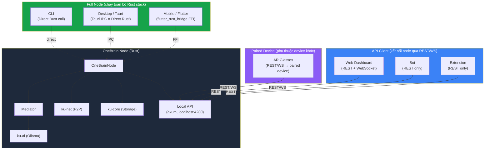
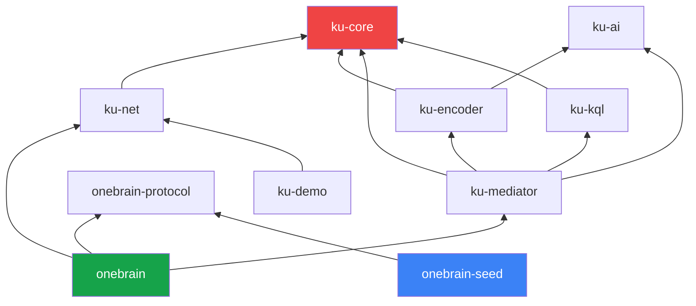
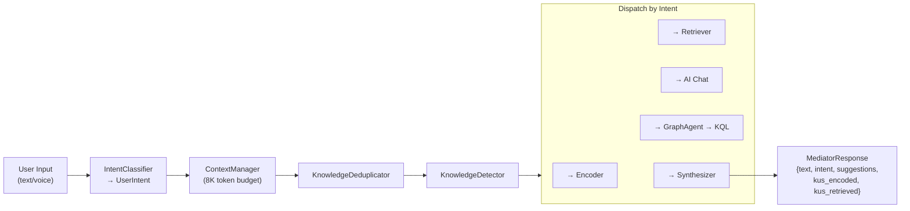
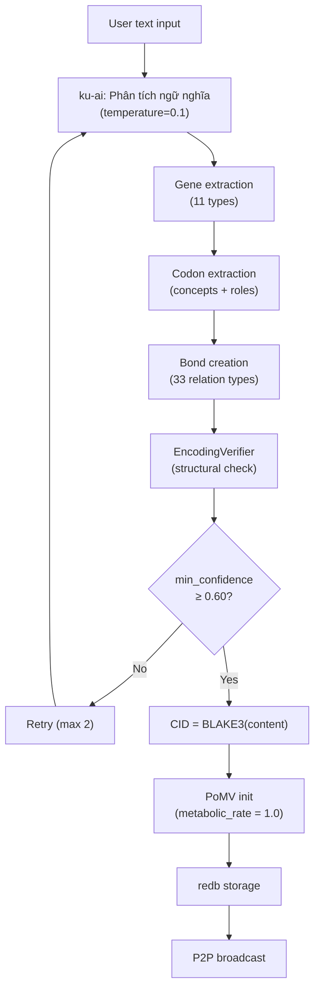

# 🔧 Pillar 10: Technical Guide — Chỉ dẫn kỹ thuật chung cho tất cả nền tảng

> **Tài liệu này là "developer handbook" cho MỌI platform developer (React, Tauri, Flutter, Extension, Bot).**
> Mọi thông tin cần thiết để implement UI: data model, API endpoints, config, error codes, protocol constants.
> Ngày: 07/07/2026

---

## Mục lục

1. [Kiến trúc tổng thể](#1-kiến-trúc-tổng-thể)
2. [Crate Map — Bản đồ mã nguồn](#2-crate-map)
3. [Data Model — Cấu trúc dữ liệu](#3-data-model)
4. [Local API Specification](#4-local-api-specification)
5. [WebSocket Event Protocol](#5-websocket-event-protocol)
6. [Configuration & File Paths](#6-configuration--file-paths)
7. [Mediator Pipeline](#7-mediator-pipeline)
8. [AI Architecture](#8-ai-architecture)
9. [Encoding Pipeline](#9-encoding-pipeline)
10. [P2P Network Protocol](#10-p2p-network-protocol)
11. [OBT Token System](#11-obt-token-system)
12. [OBKG Knowledge Graph](#12-obkg-knowledge-graph)
13. [Anti-Gaming & Security](#13-anti-gaming--security)
14. [Error Handling](#14-error-handling)
15. [Offline Mode](#15-offline-mode)
16. [Wire Protocols](#16-wire-protocols)
17. [Build Configuration](#17-build-configuration)
18. [CLI Command Reference](#18-cli-command-reference)
19. [Protocol Constants Reference](#19-protocol-constants-reference)
20. [Seed Node Architecture](#20-seed-node-architecture)

---

## 1. Kiến trúc tổng thể

### 3 loại platform



### Platform × Backend Connection

| Platform | Connection | Chạy Node? | Chạy AI? | Chạy P2P? |
|----------|-----------|-----------|---------|----------|
| **CLI** | Direct Rust call | ✅ Full node | ✅ Local Ollama | ✅ Direct |
| **Desktop** | Tauri IPC (= Direct Rust) | ✅ Full node embedded | ✅ Local Ollama | ✅ Direct |
| **Mobile** | Flutter Rust FFI (= Direct) | ✅ Full/Light node | 🟡 Tuỳ device | ✅ Direct |
| **Web** | REST/WebSocket → `localhost:4280` | ❌ Kết nối node sẵn | ❌ Node chạy AI | ❌ Node chạy P2P |
| **Bot** | REST → node host | ❌ Kết nối node sẵn | ❌ Node chạy AI | ❌ Node chạy P2P |
| **Extension** | REST → `localhost:4280` | ❌ Kết nối node sẵn | ❌ Node chạy AI | ❌ Node chạy P2P |
| **AR Glasses** | REST/WS → paired device | ❌ Paired device | ❌ Paired device | ❌ Paired device |

---

## 2. Crate Map

### Bản đồ 10 crates

```
src/
├── ku-core/          ← Core types, storage, PoMV, OBT, OBKG, CRDT (59 files, ~800KB)
├── ku-net/           ← P2P networking, DHT, SWIM, transport (40+ files, ~400KB)
├── ku-ai/            ← AI backend, device detection, model registry
├── ku-encoder/       ← Text → KU encoding pipeline
├── ku-mediator/      ← User intent → AI → response pipeline
├── ku-kql/           ← Knowledge Query Language parser & engine
├── onebrain/         ← Main binary (CLI REPL + node runtime)
├── onebrain-protocol/← Shared P2P message types (node ↔ seed)
├── onebrain-seed/    ← Seed node binary (VPS deployment)
└── ku-demo/          ← 3-node simulation demo
```

### Dependency graph



### Chi tiết từng crate

#### ku-core (59 files — crate lớn nhất)

| Subsystem | Files | Mô tả |
|-----------|-------|-------|
| **Types** | `types.rs` (46KB), `varint.rs`, `error.rs` | KU, Gene, Bond, Codon structs |
| **Wire Format** | `core_dna.rs` (90KB!) | CoreDna v6 binary encoding (31 opcodes) |
| **Storage** | `obs_schema.rs`, `obs_cache.rs` (32KB) | redb storage + M-ARC cache |
| **PoMV** | `pomv.rs`, `metabolism.rs`, `metabolism_store.rs` | Metabolic value tracking |
| **OBKG** | `obkg.rs`, `graph_*.rs` (9 files, ~205KB) | Knowledge graph + Dream Mode |
| **OBT Token** | `obt_*.rs` (10 files, ~230KB) | Ledger, minting, penalties, governance |
| **Intelligence** | `epistemic_engine.rs`, `entropy.rs`, `prediction.rs`, `synaptic.rs` | KU analysis |
| **Immune** | `immune.rs` (25KB) | Anomaly detection, quarantine |
| **CRDT** | `crdt.rs` (19KB) | GCounter, PNCounter, LWWRegister, ORSet |
| **Anti-Gaming** | `obt_anti_gaming.rs` | Rate limits, quality gates, pattern detection |
| **Runtime** | `ku_runtime.rs` (48KB), `ku_lifecycle.rs` | Unified 3-layer KU runtime |
| **AI Tools** | `ku_tools.rs`, `ku_tool_executor.rs` (33KB) | Tool calling interface |
| **Text** | `text_parser.rs` (39KB) | ConceptDict bilingual parser |
| **Encoding** | `encoding_consensus.rs` (25KB), `encoding_verifier.rs` | Distributed verification |
| **Tests** | `tests.rs` (86KB), `benchmark.rs` (50KB), `demo.rs` (49KB) | Comprehensive tests |

#### ku-net (40+ files)

| Subsystem | Files | Mô tả |
|-----------|-------|-------|
| **Identity** | `identity.rs` | Ed25519, NodeId, DeviceId, crypto puzzle |
| **Transport** | `transport.rs` (QUIC, feature-gated) | Quinn-based QUIC |
| **Membership** | `membership.rs` (17KB) | SWIM + Lifeguard protocol |
| **DHT** | `dht.rs` (27KB), `dht_store.rs` (20KB) | S/Kademlia routing |
| **Discovery** | `discovery.rs` | 6-layer bootstrap |
| **Messages** | `messages.rs` (16KB) | 81 OBP message types |
| **Content Routing** | `stigmergy.rs`, `vacuum.rs`, `pubsub.rs` | Pheromone + bloom filters |
| **Sync** | `sync.rs` (13KB) | CRDT synchronization |
| **Replication** | `replication.rs` (22KB) | R=7 tier-aware replication |
| **Encoding** | `encoding_job.rs`, `encoding_gossip.rs` | Distributed encoding jobs |
| **OBT** | `obt_transfer.rs` (23KB), `obt_gossip.rs` | Token transfer protocol |
| **Graph** | `graph_gossip.rs` (17KB) | FedR deltas, dream reports |
| **Query** | `query/` (8 files) | Distributed query routing |
| **Constants** | `constants.rs` (210 lines) | ALL protocol constants |

---

## 3. Data Model

> **Mọi platform đều hiển thị cùng data — phần này là "schema reference" để UI biết render gì.**

### 3.1 KnowledgeUnit (KU)

```
File: src/ku-core/src/types.rs (lines 1265-1292)
Wire format: MAGIC(0x4B, 0x44) | VERSION(0x05) | CBOR payload | CRC32
```

```rust
pub struct KnowledgeUnit {
    pub codons: Vec<Codon>,           // Layer 1: Concept Codons
    pub bonds: Vec<Bond>,             // Layer 2: Relation Bonds
    pub gene: Gene,                   // Layer 3: Content Gene (11 types)
    pub flags: HeaderFlags,           // Header flags
    pub epistemic_status: Option<EpistemicStatus>,  // Trust level
    pub evidence_type: Option<EvidenceType>,        // Evidence grade
    pub trust: Option<TrustSection>,       // ★ v4: Full trust & PoMV
    pub epigenetic: Option<EpigeneticSection>, // ★ v4: Embeddings + metadata
}
```

**UI phải hiển thị:**

| Field | UI element | Mô tả |
|-------|-----------|-------|
| `gene` | Badge/icon | Loại kiến thức (Fact, Procedure, Experience...) |
| `codons` | Tag chips | Concepts liên quan |
| `bonds` | Graph edges | Liên kết đến KUs khác |
| `trust.metabolic_rate` | PoMV gauge | "Sức sống" của KU [0.0-1.0] |
| `trust.trust_score` | Trust badge | Độ tin cậy [0.0-1.0] |
| `epistemic_status` | Status label | Rumor → Axiomatic (11 levels) |
| `evidence_type` | Evidence badge | None → Computational (9 types) |
| `epigenetic.language` | Language flag | Ngôn ngữ nội dung |
| `epigenetic.difficulty` | Difficulty indicator | Độ khó |
| CID (BLAKE3 hash) | ID display | Content-addressed identifier |

### 3.2 Gene — 11 loại kiến thức

```rust
// File: src/ku-core/src/types.rs (lines 390-404)
pub enum GeneType {
    Fact            = 0,  // Sự thật khách quan
    Procedure       = 1,  // Quy trình, hướng dẫn
    Experience      = 2,  // Trải nghiệm cá nhân
    Creative        = 3,  // Sáng tạo, nghệ thuật
    MediaExperience = 4,  // Phim, sách, nhạc (★ v4)
    Testimony       = 5,  // Lời chứng (★ v4)
    Formal          = 6,  // Toán học, logic (★ v4)
    Hypothesis      = 7,  // Giả thuyết (★ v4)
    Narrative       = 8,  // Câu chuyện, truyền thuyết (★ v4)
    Sensory         = 9,  // Cảm giác, tri giác (★ v4)
    Composite       = 10, // Tổ hợp nhiều KUs (★ v5)
}
```

**UI icon/color mapping gợi ý:**

| Gene | Icon | Color | Mô tả ngắn |
|------|------|-------|------------|
| Fact | 📊 | Blue | "Einstein phát minh E=mc²" |
| Procedure | 📋 | Green | "Cách nấu phở: bước 1..." |
| Experience | 💭 | Purple | "Lần đầu tôi thấy biển..." |
| Creative | 🎨 | Pink | "Ý tưởng thiết kế mới..." |
| MediaExperience | 🎬 | Orange | "Inception là phim hay..." |
| Testimony | 🗣️ | Amber | "Tôi chứng kiến sự kiện..." |
| Formal | 🔢 | Indigo | "∀x: P(x) → Q(x)" |
| Hypothesis | 🔬 | Teal | "Tôi nghĩ rằng..." |
| Narrative | 📖 | Rose | "Ngày xưa có một..." |
| Sensory | 👁️ | Cyan | "Mùi hương quen thuộc..." |
| Composite | 🧩 | Gray | KU tổ hợp từ nhiều KU |

### 3.3 Bond — Quan hệ giữa KUs

```rust
// File: src/ku-core/src/types.rs (lines 331-380)
pub struct Bond {
    pub target_cid: Vec<u8>,        // CID của KU đích (36 bytes)
    pub relation: RelationType,      // Loại quan hệ (33 types)
    pub weight: u16,                 // [0, 10000] → hiển thị [0.0, 1.0]
    pub creator: Creator,            // Ai tạo: Human/AI/Consensus
    pub created_at: u32,             // Unix timestamp (seconds)
    pub state: EdgeState,            // Active/Weakened/Deprecated
    pub decay: Option<DecayRate>,    // None/Slow/Med/Fast
    pub bidirectional: Option<bool>, // 2 chiều?
    pub context: Vec<ConceptId>,     // Ngữ cảnh
}
```

**33 RelationType — 8 categories:**

| Category | Relations | UI display |
|----------|-----------|-----------|
| **A: Epistemic** | Extends, Supplements, Refutes, Corroborates, Supersedes, Qualifies | Arrow colors: green/red |
| **B: Taxonomic** | PartOf, InstanceOf, Specializes, Generalizes | Hierarchy arrows |
| **C: Causal** | Causes, Enables, Prevents, DependsOn | Directional arrows |
| **D: Pedagogic** | ExampleOf, AnalogyOf, AppliesTo, DerivedFrom | Dashed arrows |
| **E: Equivalence** | Duplicates, Translates, Paraphrases, Inspires | Double arrows |
| **F: Temporal** | Precedes, Cooccurs | Timeline |
| **G: Provenance** | Cites, AuthoredBy, ReviewedBy | Attribution |
| **H: Extended** | ReactionTo, TestimonyAbout, FormallyProves, EvolvesInto, VariantOf, SensoryEvidenceFor, CulturallyContextualizes | Specialized |

**EdgeState cho UI:**

| State | Display | Mô tả |
|-------|---------|-------|
| `Active` | Solid line | Bond đang hoạt động |
| `Weakened` | Dashed line, faded | Bond đang suy yếu (decay) |
| `Deprecated` | Hidden hoặc strikethrough | Bond đã hết hiệu lực |

### 3.4 Codon — Concept Tags

```rust
pub struct Codon {
    pub concept_id: ConceptId,  // u64 — ID khái niệm
    pub role: RoleId,           // Vai trò trong KU (14 roles)
    pub qualifiers: Vec<Qualifier>,
}
```

**14 RoleId:**
`Agent, Patient, Instrument, Location, Time, Cause, Effect, Goal, Source, Result, Manner, Condition, Content, CompoundMod`

**UI hiển thị**: Mỗi Codon = 1 tag chip: `[concept_name] (role)` — ví dụ: `[Vật lý] (Domain)`, `[Einstein] (Agent)`

### 3.5 EpistemicStatus — 11 cấp độ tin cậy

```
Rumor → Anecdote → Claim → Observation → Hypothesis →
Analysis → Established → Verified → Consensus → Law → Axiomatic
```

**UI**: Progress bar hoặc step indicator, mỗi level một màu (đỏ → xanh)

### 3.6 EvidenceType — 9 cấp độ bằng chứng (Cochrane/GRADE)

```
None → Anecdotal → CaseStudy → Observational → QuasiExperimental →
RCT → SystematicReview → MetaAnalysis → Computational
```

### 3.7 TrustSection — PoMV Signals

```rust
pub struct TrustSection {
    pub epistemic_status: Option<EpistemicStatus>,
    pub evidence_type: Option<EvidenceType>,
    pub verification_level: Option<u8>,
    pub trust_score: Option<f32>,           // [0.0-1.0] — UI: trust badge
    pub confidence: Option<u16>,            // [0-10000] → [0.0-1.0]
    // PoMV signals:
    pub metabolic_rate: Option<f32>,        // UI: PoMV gauge
    pub prediction_score: Option<f32>,      // Prediction accuracy
    pub entropy_at_creation: Option<f32>,   // Information novelty
    pub survival_score: Option<f32>,        // Survival over time
    pub synaptic_centrality: Option<f32>,   // Graph centrality
    pub niche_fitness: Option<f32>,         // Domain relevance
}
```

### 3.8 NodeEvent — Events cho UI

```rust
// File: src/onebrain/src/network.rs (lines 97-116)
pub enum NodeEvent {
    PeerConnected(PeerInfo),
    KuReceived { cid_hex: String, wire_bytes: Vec<u8>, source_text: String, from: String },
    VerifyResult { cid_hex: String, agreement_score: f64, verified: bool, from: String },
    Notification(String),
}
```

### 3.9 UserProfile

```rust
// File: src/ku-mediator/src/profile.rs (lines 11-22)
pub struct UserProfile {
    pub display_name: String,
    pub preferred_language: String,        // "vi" | "en"
    pub response_style: ResponseStyle,     // Concise | Balanced | Detailed | Academic
    pub proactive_encoding: bool,          // AI tự encode khi phát hiện knowledge?
    pub total_kus_encoded: u64,
    pub total_queries: u64,
    pub expertise_areas: Vec<ExpertiseArea>,
    pub concept_frequency: HashMap<String, u32>,
    pub created_at: u64,
    pub last_active: u64,
}

pub enum ResponseStyle { Concise, Balanced, Detailed, Academic }
pub struct ExpertiseArea { domain: String, ku_count: u32, last_active: u64 }
```

### 3.10 NodeConfig

```rust
// File: src/onebrain/src/config.rs
pub struct NodeConfig {
    pub name: String,          // default: "OneBrain"
    pub port: u16,             // default: 4242
    pub data_dir: PathBuf,     // default: "./onebrain_data"
    pub ollama_url: String,    // default: "http://localhost:11434"
    pub model: String,         // default: "qwen3:8b"
    pub seeds: Vec<SocketAddr>,
}
```

---

## 4. Local API Specification

> **Đây là API mà Web, Bot, Extension, AR Glasses đều gọi.**
> Bind: `127.0.0.1:4280` (localhost only — KHÔNG expose ra ngoài).
> Auth: `Authorization: Bearer <api_token>` (256-bit random, generated on node start).

### 4.1 Authentication

```
Khi node khởi động:
  1. Generate random API token (256-bit hex)
  2. Lưu vào {data_dir}/api_token
  3. Mọi API call phải có: Authorization: Bearer <token>
  4. CORS: chỉ accept Origin: localhost
```

| Platform | Cách lấy token |
|----------|----------------|
| CLI | Không cần (trực tiếp) |
| Web | User paste token lần đầu → localStorage |
| Desktop (Tauri) | Đọc file trực tiếp |
| Mobile (Flutter) | Đọc qua FFI |
| Bot | Config file |
| Extension | User paste token |
| AR Glasses | Paired device truyền |

### 4.2 REST Endpoints

#### Identity

| Method | Endpoint | Request | Response | Mô tả |
|--------|----------|---------|----------|-------|
| `GET` | `/api/identity` | — | `{ node_id, display_name, tier, device_count }` | Thông tin identity hiện tại |
| `POST` | `/api/identity/create` | `{ display_name, password }` | `{ node_id, recovery_phrase: [24 words] }` | Tạo identity mới (First Run) |
| `POST` | `/api/identity/recover` | `{ recovery_phrase, new_password }` | `{ node_id }` | Khôi phục từ BIP39 |
| `GET` | `/api/identity/devices` | — | `[{ device_id, name, last_seen }]` | Danh sách devices |
| `POST` | `/api/identity/link` | `{ qr_payload }` | `{ device_id, authorization }` | Liên kết device mới |
| `DELETE` | `/api/identity/devices/:id` | — | `{ ok }` | Xóa device |

#### Knowledge Operations

| Method | Endpoint | Request | Response | Mô tả |
|--------|----------|---------|----------|-------|
| `POST` | `/api/encode` | `{ text, preview? }` | `{ cid, ku, encoding_time_ms }` | Encode text → KU |
| `POST` | `/api/encode/batch` | `{ texts: [string] }` | `{ results: [{ cid, ku }] }` | Batch encode |
| `GET` | `/api/kus` | `?page=1&limit=20&gene_type=fact&sort=created` | `{ kus: [KU], total, page }` | Browse KUs |
| `GET` | `/api/kus/:cid` | — | `{ ku, pomv, bonds_count }` | KU detail |
| `DELETE` | `/api/kus/:cid` | — | `{ ok }` | Xóa KU local |
| `POST` | `/api/search` | `{ query, limit?, gene_type? }` | `{ results: [{ ku, score }] }` | Semantic search |
| `POST` | `/api/kql` | `{ query: "FIND..." }` | `{ results: [KU] }` | KQL query |

#### AI Chat

| Method | Endpoint | Request | Response | Mô tả |
|--------|----------|---------|----------|-------|
| `POST` | `/api/chat` | `{ message }` | `{ text, intent, suggestions, kus_encoded, kus_retrieved }` | Chat với Mediator |
| `POST` | `/api/chat/stream` | `{ message }` | SSE stream: `data: { chunk }` | Streaming response |
| `GET` | `/api/chat/history` | `?limit=50` | `[{ role, content, timestamp }]` | Lịch sử chat |

#### Network

| Method | Endpoint | Request | Response | Mô tả |
|--------|----------|---------|----------|-------|
| `GET` | `/api/status` | — | `{ ku_count, peer_count, uptime_s, tier, obt_balance }` | Node status |
| `GET` | `/api/peers` | — | `[{ name, addr, ku_count }]` | Peer list |
| `POST` | `/api/peers/connect` | `{ address }` | `{ peer_info }` | Connect to peer |
| `DELETE` | `/api/peers/:addr` | — | `{ ok }` | Disconnect peer |

#### Graph

| Method | Endpoint | Request | Response | Mô tả |
|--------|----------|---------|----------|-------|
| `GET` | `/api/graph/:cid` | `?depth=2` | `{ nodes: [KU], edges: [Bond] }` | Subgraph around CID |
| `GET` | `/api/graph` | `?limit=100` | `{ nodes, edges }` | Full graph (paginated) |
| `GET` | `/api/graph/:cid/neighbors` | — | `[{ ku, bond }]` | Direct neighbors |

#### OBT Wallet

| Method | Endpoint | Request | Response | Mô tả |
|--------|----------|---------|----------|-------|
| `GET` | `/api/wallet` | — | `{ balance_milli_obt, tier, earned_total }` | Balance |
| `GET` | `/api/wallet/history` | `?limit=50` | `[{ type, amount, timestamp, reason }]` | Transaction history |

#### Profile & Settings

| Method | Endpoint | Request | Response | Mô tả |
|--------|----------|---------|----------|-------|
| `GET` | `/api/profile` | — | `UserProfile` | Get profile |
| `PATCH` | `/api/profile` | `{ display_name?, language?, response_style? }` | `UserProfile` | Update profile |
| `GET` | `/api/settings` | — | `{ theme, language, ollama_url, model, port }` | Device settings |
| `PATCH` | `/api/settings` | `{ ...partial }` | `{ ok }` | Update settings |

#### Data Portability

| Method | Endpoint | Request | Response | Mô tả |
|--------|----------|---------|----------|-------|
| `GET` | `/api/export` | `?format=json` | File download | Export KUs |
| `POST` | `/api/import` | Multipart file upload | `{ imported_count, errors }` | Import file |
| `GET` | `/api/backup` | — | Encrypted `.onebrain` file | Full backup |
| `POST` | `/api/restore` | `{ file, password }` | `{ ok }` | Restore from backup |

#### AI Model

| Method | Endpoint | Request | Response | Mô tả |
|--------|----------|---------|----------|-------|
| `GET` | `/api/ai/status` | — | `{ connected, model, device_tier }` | Ollama status |
| `GET` | `/api/ai/models` | — | `[{ name, size, quantization }]` | Available models |
| `POST` | `/api/ai/model` | `{ model_name }` | `{ ok }` | Switch model |

### 4.3 Response Format

Mọi response đều tuân theo format:

```json
// Success
{ "data": { ... }, "ok": true }

// Error
{ "error": { "code": "RATE_LIMIT_EXCEEDED", "message": "...", "retry_after_s": 3600 }, "ok": false }
```

---

## 5. WebSocket Event Protocol

> **Real-time events cho Web Dashboard, Desktop, Mobile.**
> Endpoint: `ws://localhost:4280/ws/events`
> Auth: Query param `?token=<api_token>`

### Event Format

```json
{
  "type": "peer_connected",
  "timestamp": 1720364400,
  "data": { ... }
}
```

### Event Types

| Type | Data | Khi nào? | UI action |
|------|------|---------|-----------|
| `peer_connected` | `{ name, addr, ku_count }` | Peer mới kết nối | Toast + update peer count |
| `peer_disconnected` | `{ addr }` | Peer ngắt kết nối | Update peer count |
| `ku_received` | `{ cid, source_text, from }` | Nhận KU từ peer | Toast + badge + refresh list |
| `ku_encoded` | `{ cid, encoding_time_ms }` | Encode xong | Toast + navigate to KU |
| `verify_result` | `{ cid, agreement_score, verified, from }` | Verification xong | Update KU trust display |
| `obt_earned` | `{ amount_milli, reason }` | Kiếm OBT | Toast + update balance |
| `pomv_update` | `{ cid, metabolic_rate }` | PoMV thay đổi | Update gauge |
| `encoding_progress` | `{ progress_pct, stage }` | Đang encode | Progress bar |
| `network_status` | `{ peer_count, sync_status }` | Network change | Update status bar |
| `error` | `{ code, message }` | Lỗi async | Error toast |

---

## 6. Configuration & File Paths

### 6.1 Data Directory

| Platform | Default path |
|----------|-------------|
| **CLI** | `./onebrain_data/` (hoặc `--data-dir` flag) |
| **Desktop (Windows)** | `%APPDATA%/OneBrain/data/` |
| **Desktop (macOS)** | `~/Library/Application Support/OneBrain/data/` |
| **Desktop (Linux)** | `~/.local/share/onebrain/data/` |
| **Mobile (Android)** | App sandbox: `/data/data/com.onebrain.app/files/` |
| **Mobile (iOS)** | App sandbox: `Documents/` |

### 6.2 Files trong data directory

| File | Mô tả | Size | Sensitive? |
|------|-------|------|-----------|
| `identity.json` | Ed25519 keypair (encrypted) | ~1KB | ⚠️ **CỰC KỲ NHẠY CẢM** |
| `ku.redb` | KU database (redb) | Grows | Không |
| `retriever_index.json` | Keyword search index | ~100KB+ | Không |
| `user_profile.json` | User profile | ~2KB | Thấp |
| `known_peers.json` | Peer memory (max 100) | ~5KB | Thấp |
| `api_token` | Local API token (256-bit) | 64 bytes | ⚠️ Nhạy cảm |

### 6.3 AI Configuration

| Platform | Config path |
|----------|-------------|
| Windows | `%APPDATA%/OneBrain/ai_config.toml` |
| macOS | `~/Library/Application Support/OneBrain/ai_config.toml` |
| Linux | `~/.config/OneBrain/ai_config.toml` |

```toml
# ai_config.toml mẫu
[ollama]
url = "http://localhost:11434"
model = "qwen3:8b"

[encoding]
temperature = 0.1
max_retries = 2
min_confidence = 0.60

[embedding]
model = "nomic-embed-text"
dimensions = 768
```

---

## 7. Mediator Pipeline

> **Mọi user input đều đi qua Mediator — UI cần hiểu flow này để render đúng.**



### UserIntent enum

```rust
pub enum UserIntent {
    Encode { source: EncodeSource, trigger: EncodeTrigger },
    Retrieve { query: String },
    Connect { source: String, target: Option<String> },
    Synthesize { topic: String },
    GraphQuery { nl_query: String },
    FreeChat,
    Ambiguous,
}
```

### MediatorResponse — UI render guide

```rust
pub struct MediatorResponse {
    pub text: String,                    // → Hiển thị trong chat bubble
    pub intent_detected: Option<String>, // → Intent badge
    pub kus_encoded: Vec<String>,        // → "Đã encode X KUs" + links
    pub kus_retrieved: usize,            // → "Tìm thấy Y KUs liên quan"
    pub suggestions: Vec<String>,        // → Suggestion chips dưới message
}
```

---

## 8. AI Architecture

### 8.1 Device Tier System

```
File: src/ku-ai/src/device/tier.rs
```

| Tier | RAM | VRAM | Recommended Model | Mô tả |
|------|-----|------|-------------------|-------|
| T0 | <4GB | — | ❌ Không đủ | Quá yếu |
| T1 | 4-8GB | — | `qwen2.5:0.5b` | Rất cơ bản |
| T2 | 8-16GB | <4GB | `qwen2.5:1.5b` | Cơ bản |
| T3 | 8-16GB | 4-8GB | `qwen2.5:3b` | Khá |
| T4 | 16-32GB | 8-12GB | `qwen2.5:7b` | Tốt |
| T5 | 32-64GB | 12-24GB | `qwen2.5:14b` | Rất tốt |
| T6 | >64GB | >24GB | `qwen2.5:32b` | Tối ưu |

### 8.2 Model Registry

```
File: src/ku-ai/src/registry.json — 8 models curated
```

| Model | Parameters | Min Tier | Features |
|-------|-----------|---------|----------|
| `qwen2.5:0.5b` | 0.5B | T1 | chat |
| `qwen2.5:1.5b` | 1.5B | T2 | chat, tools |
| `qwen2.5:3b` | 3B | T3 | chat, tools |
| `qwen2.5:7b` | 7B | T4 | chat, tools, structured |
| `qwen2.5:14b` | 14B | T5 | chat, tools, structured |
| `qwen2.5:32b` | 32B | T6 | chat, tools, structured |
| `nomic-embed-text` | — | T2 | embedding (768d) |
| `snowflake-arctic-embed:xs` | — | T1 | embedding (384d) |

### 8.3 GPU Detection

```rust
// File: src/ku-ai/src/device/gpu.rs
pub struct GpuInfo {
    pub name: String,
    pub vram_mb: u64,
    pub backend: GpuBackend,  // Cuda | Rocm | Metal | Vulkan | None
}
```

**UI Settings hiển thị**: GPU info + recommended model + current model + test button

### 8.4 Backend Trait

```rust
// Mọi AI operation đều qua trait này:
pub trait ModelBackend {
    async fn chat(messages, options) -> Result<String>;
    async fn chat_structured(messages, schema, options) -> Result<Value>;
    async fn chat_with_tools(messages, tools, options) -> Result<ToolResponse>;
    async fn health_check() -> Result<ModelInfo>;
    async fn model_info(model) -> Result<ModelInfo>;
}

pub trait EmbeddingProvider {
    async fn embed(text) -> Result<Vec<f32>>;
    async fn embed_batch(texts) -> Result<Vec<Vec<f32>>>;
    fn dimensions() -> usize;
}
```

---

## 9. Encoding Pipeline

### 9.1 Full Flow



### 9.2 Encoding Consensus (Distributed Verification)

```
File: src/ku-core/src/encoding_consensus.rs (25KB)
```

Khi KU được broadcast, peers có thể verify:

| Status | Mô tả | Verifiers needed |
|--------|-------|-----------------|
| `RAW` | Vừa encode, chưa verify | 0 |
| `SELF` | Tự verify (local) | 1 (self) |
| `PARTIAL` | Một số peers đồng ý | 1-2 peers |
| `FULL` | Đạt consensus | ≥3 peers, agreement ≥0.70 |

**UI hiển thị**: Status badge trên KU card (RAW → SELF → PARTIAL → FULL)

### 9.3 Quality Gates (enforce trước khi encode)

```rust
MIN_KU_RAW_BYTES = 256;           // Text phải ≥ 256 bytes
MIN_GENE_COUNT = 2;                // Phải có ≥ 2 genes
MIN_ENCODING_TIME_MS = 100;        // Encoding phải > 100ms (anti-instant-spam)
MIN_BOND_COUNT = 1;                // Phải có ≥ 1 bond
ENCODING_CONSENSUS_MIN_VERIFIERS = 3;  // Full status cần ≥ 3 verifiers
```

**UI xử lý**: Nếu text quá ngắn → hiện warning trước khi gửi. Nếu encoding fail quality gate → hiện lỗi cụ thể.

---

## 10. P2P Network Protocol

### 10.1 OBP Message Catalog — 81 message types

```
File: src/ku-net/src/messages.rs (16KB)
```

| Layer | Range | Messages | Mô tả |
|-------|-------|----------|-------|
| 0-1: Core Transport | `0x01-0x0F` | KuPush, KuPull, Gossip, TrustUpdate, DhtRequest, Ping, Pong, Bundle, BloomFilter, PeerExchange, Relay*, Capability | Cơ bản |
| 2: Membership (SWIM) | `0x10-0x1C` | SwimPing/Ack/PingReq/Nack, SpFitness/Handoff/Redirect, Goodbye, HealthReport | Quản lý membership |
| 3: DHT (S/Kademlia) | `0x20-0x26` | FindNode/Value Req/Resp, Store Req/Ack, HierLookup | Distributed hash table |
| 4: Content Routing | `0x30-0x38` | VacuumFilter/Exchange, PheromoneUpdate, Topic Sub/Unsub/Pub/Deliver, NDN* | Tìm content |
| 5: Query/Trust | `0x40-0x52` | Watch*, TrustGossip/Vaccine, Query Forward/Response/Cancel | Query & trust |
| 6: Sync (CRDT) | `0x60-0x68` | CrdtSync Init/Delta/Ack/Complete, MeshDelta, CacheInvalidate | Data sync |
| 7: Security | `0x80-0x89` | PowChallenge/Response, Backpressure, ProofOf*, Metabolism* | Security |
| 8: Encoding | `0x90-0x95` | EncodingJob Announce/Claim/Submission/Consensus/JobUpdate | Encoding consensus |
| 9: OBT Token | `0xA0-0xA6` | Transfer*/Balance*/MintBroadcast/StorageChallenge/ForkWarrant | Token |

### 10.2 Bootstrap — 6-layer Discovery

```
File: src/ku-net/src/discovery.rs
```

```
Layer 1: DNS seed resolution (n1.onebrain.live, n2.onebrain.live)
Layer 2: Seed node registration + peer list
Layer 3: mDNS LAN discovery (planned)
Layer 4: UPnP port mapping (planned)
Layer 5: DHT bootstrap (Kademlia)
Layer 6: Peer Exchange (PEX, max 32 peers)
```

### 10.3 SWIM Membership — 7-tier Fitness

```
File: src/ku-net/src/membership.rs (17KB)
```

| Weight | Factor | Mô tả |
|--------|--------|-------|
| 0.20 | Uptime | Thời gian online |
| 0.15 | Battery | Năng lượng |
| 0.20 | Bandwidth | Tốc độ mạng |
| 0.15 | Storage | Dung lượng |
| 0.10 | CPU | Sức mạnh tính toán |
| 0.10 | Network | Chất lượng kết nối |
| 0.10 | Reputation | EigenTrust score |

### 10.4 Key Protocol Constants

```
File: src/ku-net/src/constants.rs (210 lines)
```

| Category | Constant | Value | Mô tả |
|----------|----------|-------|-------|
| **Transport** | `OBP_PORT` | 4242 | Default P2P port |
| | `MAX_PAYLOAD_SIZE` | 16MB | Max message size |
| | `QUIC_IDLE_TIMEOUT_S` | 30 | QUIC idle timeout |
| **SWIM** | `T_PERIOD_MS` | 1000 | Probe interval |
| | `K_INDIRECT` | 3 | Indirect probes |
| | `MAX_MEMBERS` | 10000 | Max cluster size |
| **DHT** | `K_BUCKET_SIZE` | 20 | Kademlia k |
| | `ALPHA` | 3 | Parallel lookups |
| | `NUM_BUCKETS` | 256 | Routing table size |
| **Bootstrap** | `BOOTSTRAP_MIN_PEERS` | 3 | Min peers to start |
| | `PEX_MAX_PEERS` | 32 | Max peer exchange |
| **Replication** | `STORAGE_REPLICATION_FACTOR` | 7 | R=7 replicas |
| | `MIN_HEALTHY_REPLICAS` | 4 | Min healthy |
| **Encoding** | `MAX_ENCODING_VERIFIERS` | 3 | Max verifiers |
| | `ENCODING_CONSENSUS_THRESHOLD` | 0.70 | Agreement threshold |
| | `ENCODING_REWARD_BASE_OBT` | 5 | OBT per verification |
| **Seed** | `HEARTBEAT_INTERVAL_SECS` | 60 | Heartbeat to seed |
| | `PEER_TIMEOUT_SECS` | 300 | Peer timeout |
| **Pheromone** | `PHEROMONE_DECAY` | 0.95 | Decay rate |
| | `MAX_PHEROMONE_ENTRIES` | 10000 | Max entries |

---

## 11. OBT Token System

### 11.1 Earning Model

```
File: src/ku-core/src/obt_constants.rs (723 lines, 96 constants)
```

| Stream | Weight | Nguồn thu |
|--------|--------|-----------|
| R1: Owner | 40% | Tạo KU chất lượng |
| R2: Encoder | 25% | Tham gia encoding consensus |
| R3: Verifier | 15% | Verify KU của peers |
| R4: Storage | 20% | Lưu trữ KU cho mạng |

**Emission**: `BASE_EMISSION_PER_EPOCH = 10,000,000 milliOBT/epoch` (1 epoch = 1 hour)

### 11.2 Node Tiers — 7 cấp

```rust
pub enum NodeTier {
    Leaf = 0,             // threshold 0.00 — trust multiplier 0.10x
    Contributor = 1,      // threshold 0.30 — trust multiplier 0.50x
    LocalSP = 2,          // threshold 0.60 — trust multiplier 1.00x
    RegionalSP = 3,       // threshold 0.75 — trust multiplier 1.25x
    CountrySP = 4,        // threshold 0.85 — trust multiplier 1.50x
    ContinentalSP = 5,    // threshold 0.92 — trust multiplier 1.75x
    GlobalBackbone = 6,   // threshold 0.97 — trust multiplier 2.00x
}
```

**UI hiển thị**: Tier badge + progress bar đến tier tiếp theo

### 11.3 Rate Limits theo Tier

| Tier | KU/hour | Encode/hour | Claim cooldown | Max mint/epoch |
|------|---------|------------|----------------|---------------|
| **Leaf** | 1 | 2 | 3600s (1h) | 10,000 mOBT |
| **Contributor** | 5 | 5 | 720s (12min) | 50,000 mOBT |
| **LocalSP+** | 10 | 10 | 360s (6min) | 100,000 mOBT |

### 11.4 Penalty System — 5 cấp

```rust
pub enum PenaltyRecommendation {
    None,                // Score < 0.3
    ElevatedScrutiny,    // Score ≥ 0.3
    Warning,             // Score ≥ 0.4
    TrustReduction,      // Score ≥ 0.5
    Jail,                // Score ≥ 0.7
    Tombstone,           // Extreme cases
}

pub enum GamingPattern {
    IsolationAttack,     // Tấn công cô lập node
    BurstSpam,           // Spam hàng loạt
    WashTrading,         // Giao dịch ảo
    TrustFarming,        // Farm trust giả
}
```

### 11.5 Ledger Architecture

```
File: src/ku-core/src/obt_ledger.rs (59KB — file lớn nhất!)
Kiến trúc: Account-Chain (Nano-style) — mỗi account có chain riêng
```

---

## 12. OBKG Knowledge Graph

### 12.1 Subsystems

| Module | File | Mô tả |
|--------|------|-------|
| **Graph Core** | `obkg.rs` | CRUD operations, neighbor lookup, traversal |
| **Graph Types** | `graph_types.rs` (26KB) | BondMeta, EdgeState, Creator, DecayRate |
| **Graph Events** | `graph_events.rs` | In-memory event accumulator |
| **Graph Decay** | `graph_decay.rs` | Unified decay engine |
| **Graph Embeddings** | `graph_embeddings.rs` | RotatE int8 knowledge graph embeddings |
| **Dream Mode** | `graph_dream.rs` (34KB) | ⭐ Offline restructuring (sleep consolidation) |
| **Bio-Inspired** | `graph_bio.rs` | STDP, Spreading Activation |
| **FedR** | `graph_fedr.rs` | Federated RotatE training |
| **Qualifiers** | `graph_qualifiers.rs` | Temporal, confidence, source, context |
| **Orchestrator** | `obkg_orchestrator.rs` | KuLifecycle wrapper |
| **Rewards** | `obkg_rewards.rs` | Graph↔OBT scoring bridge |

### 12.2 Dream Mode (Sleep Consolidation)

```
File: src/ku-core/src/graph_dream.rs (34KB)
```

**Concept**: Giống não bộ — khi node idle, OBKG "ngủ" và tái cấu trúc graph:
- Weak bonds decay → prune
- Strong bonds reinforce
- Similar KUs merge
- Subgraph consolidation

**UI**: Optional "Dream" indicator khi node idle — "🌙 Knowledge is consolidating..."

---

## 13. Anti-Gaming & Security

### 13.1 4 lớp phòng thủ

| Lớp | Enforce khi | Constant | UI error message |
|-----|-----------|----------|-----------------|
| **L1: Crypto Puzzle** | Node startup | `PUZZLE_C_SMALL=16` | Không hiện (1 lần duy nhất) |
| **L2: Rate Limit** | Mỗi encode | `RATE_LEAF.max_ku_per_hour=1` | "Bạn đã đạt giới hạn. Thử lại sau X phút" |
| **L3: Quality Gate** | Mỗi encode | `MIN_KU_RAW_BYTES=256` | "Nội dung quá ngắn (tối thiểu 256 bytes)" |
| **L4: EigenTrust** | Network-wide | Trust score computation | Không hiện trực tiếp |

### 13.2 Immune System

```
File: src/ku-core/src/immune.rs (25KB)
```

Phát hiện anomaly patterns:
- Cùng IP range, cùng timing → Sybil
- Content similarity quá cao → Spam
- Trust manipulation patterns → Wash trading

---

## 14. Error Handling

### 14.1 Error Code Registry

> **Tất cả platforms phải handle cùng error codes.**

| Code | HTTP | Mô tả | UI message |
|------|------|-------|-----------|
| `AUTH_REQUIRED` | 401 | Token thiếu/sai | "Vui lòng nhập API token" |
| `AUTH_INVALID` | 403 | Token hết hạn | "Token không hợp lệ" |
| `RATE_LIMIT_EXCEEDED` | 429 | Vượt rate limit | "Giới hạn {tier}. Thử lại sau {retry_after}s" |
| `KU_TOO_SHORT` | 400 | Text < 256 bytes | "Nội dung quá ngắn (tối thiểu 256 ký tự)" |
| `KU_LOW_QUALITY` | 400 | Không đủ genes | "Nội dung chưa đủ chất lượng. Hãy thêm chi tiết" |
| `KU_NOT_FOUND` | 404 | CID không tồn tại | "Không tìm thấy Knowledge Unit" |
| `AI_UNAVAILABLE` | 503 | Ollama không chạy | "AI chưa sẵn sàng. Kiểm tra Ollama" |
| `AI_MODEL_NOT_FOUND` | 503 | Model chưa tải | "Model {name} chưa được tải. Chạy: ollama pull {name}" |
| `AI_TIMEOUT` | 504 | AI response chậm | "AI đang xử lý... (máy yếu cần thêm thời gian)" |
| `ENCODING_FAILED` | 500 | Encoding pipeline fail | "Không thể encode. Thử lại" |
| `NETWORK_NO_PEERS` | 503 | Không có peers | "Chưa kết nối mạng OneBrain" |
| `DEVICE_LIMIT` | 400 | Vượt 16 devices | "Đã đạt giới hạn 16 thiết bị" |
| `IDENTITY_EXISTS` | 409 | identity.json đã tồn tại | "Identity đã tồn tại trên thiết bị này" |
| `PASSWORD_WRONG` | 401 | Decrypt fail | "Password không đúng" |
| `RECOVERY_INVALID` | 400 | BIP39 sai | "Recovery phrase không hợp lệ" |

### 14.2 Error Response Format

```json
{
  "ok": false,
  "error": {
    "code": "RATE_LIMIT_EXCEEDED",
    "message": "Leaf tier: tối đa 1 KU/giờ. Thử lại sau 2400 giây.",
    "details": {
      "tier": "Leaf",
      "max_per_hour": 1,
      "retry_after_s": 2400
    }
  }
}
```

---

## 15. Offline Mode

> **OneBrain phải hoạt động khi KHÔNG có internet và KHÔNG có AI.**

### Tính năng khả dụng offline

| Tính năng | Không internet | Không AI | Cả hai đều không |
|-----------|---------------|---------|------------------|
| Browse local KUs | ✅ | ✅ | ✅ |
| View KU detail | ✅ | ✅ | ✅ |
| Search (keyword) | ✅ | ✅ | ✅ |
| Search (semantic) | ✅ | ❌ Cần AI | ❌ |
| Encode text | ❌ Cần publish | ❌ Cần AI | ❌ |
| Chat | ❌ | ❌ Cần AI | ❌ |
| View graph | ✅ | ✅ | ✅ |
| View wallet | ✅ | ✅ | ✅ |
| Edit profile | ✅ | ✅ | ✅ |
| Export/Backup | ✅ | ✅ | ✅ |
| Import | ✅ | ❌ Cần AI | ❌ |

**UI xử lý**: Hiện banner "Offline mode" — disable các nút cần network/AI, hiện tooltip giải thích.

---

## 16. Wire Protocols

> **OneBrain sử dụng 5 wire format khác nhau.**

| # | Format | Dùng ở đâu | Mô tả |
|---|--------|-----------|-------|
| 1 | **Length-prefixed JSON** | Demo TCP (node ↔ node) | `[4-byte BE length][JSON]` |
| 2 | **CBOR** | KU serialization | `MAGIC(KD) \| VER(05) \| CBOR payload \| CRC32` |
| 3 | **CoreDna binary** | KU compact wire format | `0x4B \| VER_META \| INSTRUCTIONS \| END(0x1E) \| CRC-16` |
| 4 | **QUIC** | Production transport (feature-gated) | Quinn + rustls + rcgen |
| 5 | **Seed protocol** | Node ↔ seed server | Length-prefixed JSON (SeedMessage enum) |

**Cho UI developers**: Không cần quan tâm wire format. API trả JSON. Wire format chỉ cho Rust backend developers.

---

## 17. Build Configuration

### 17.1 Feature Flags

| Crate | Flag | Default | Mô tả |
|-------|------|---------|-------|
| `ku-core` | `persist` | ❌ | Enable redb storage |
| `ku-net` | `quic` | ❌ | Enable QUIC transport |
| `ku-net` | `persist` | ❌ | Enable DHT persistence |
| `ku-kql` | `storage` | ❌ | Enable KQL persistent storage |
| `ku-ai` | `ollama` | ✅ | Enable Ollama backend |

### 17.2 Key Dependencies

| Dependency | Version | Dùng cho |
|-----------|---------|---------|
| `tokio` | 1.x | Async runtime |
| `serde` / `serde_json` | 1.x | Serialization |
| `ciborium` | 0.2 | CBOR (wire format) |
| `redb` | 2.x | Embedded database |
| `ed25519-dalek` | 2.x | Cryptography |
| `blake3` | 1.x | Hashing |
| `reqwest` | 0.12 | HTTP client (Ollama) |
| `quinn` | 0.11 | QUIC transport |
| `nom` | 7.x | KQL parser |
| `clap` | 4.x | CLI arguments |
| `sysinfo` | 0.33 | Hardware detection |
| `directories` | 5.x | Cross-platform paths |

### 17.3 Release Profile

```toml
[profile.release]
opt-level = "z"      # Optimize for size
lto = true           # Link-time optimization
strip = true         # Strip debug symbols
codegen-units = 1    # Single codegen unit
```

---

## 18. CLI Command Reference

### 18.1 Implemented (hiện tại)

```
onebrain start [--name NAME] [--port PORT] [--data-dir DIR]
               [--ollama-url URL] [--model MODEL] [--seeds ADDR,ADDR]

# Trong REPL:
encode <text>          # Encode text → KU
remember <text>        # Alias cho encode
search <query>         # Tìm kiếm semantic
find <query>           # Alias cho search
connect <ip:port>      # Kết nối peer
status                 # Trạng thái node
peers                  # Danh sách peers
help                   # Trợ giúp
quit / exit            # Thoát
<free text>            # Chat với AI (Mediator)
```

### 18.2 Planned (chưa implement)

```
# Identity:
recover                # Khôi phục từ BIP39

# Knowledge:
list                   # Browse KUs
kql <query>            # KQL query
graph <cid>            # View graph neighbors

# Profile:
profile                # View/edit profile

# Wallet:
wallet                 # OBT balance + history

# Data:
export [--format json] # Export KUs
import <file>          # Import file
backup                 # Full backup
restore <file>         # Restore from backup
```

---

## 19. Protocol Constants Reference

### 19.1 Identity

| Constant | Value | File |
|----------|-------|------|
| `PUZZLE_C_SMALL` | 16 | `ku-net/identity.rs` |
| `PUZZLE_C_MEDIUM` | 20 | `ku-net/identity.rs` |
| `PUZZLE_C_LARGE` | 24 | `ku-net/identity.rs` |
| `DEVICE_GROUP_MAX` | 16 | `ku-net/identity.rs` |
| `OBP_ALPN` | `"obp/1"` | `ku-net/identity.rs` |
| `OBP_PORT` | 4242 | `ku-net/identity.rs` |

### 19.2 OBT Economics

| Constant | Value | File |
|----------|-------|------|
| `OBT_EPOCH_DURATION_S` | 3600 | `ku-core/obt_constants.rs` |
| `BASE_EMISSION_PER_EPOCH` | 10,000,000 mOBT | `ku-core/obt_constants.rs` |
| `STREAM_WEIGHTS` | [0.40, 0.25, 0.15, 0.20] | `ku-core/obt_constants.rs` |
| `TRUST_MULTIPLIER` | [0.10, 0.50, 1.00, 1.25, 1.50, 1.75, 2.00] | `ku-core/obt_constants.rs` |

### 19.3 Network

| Constant | Value | File |
|----------|-------|------|
| `SEED_DOMAINS` | n1/n2.onebrain.live | `onebrain/config.rs` |
| `HEARTBEAT_INTERVAL_SECS` | 60 | `onebrain-protocol` |
| `PEER_TIMEOUT_SECS` | 300 | `onebrain-protocol` |
| `MAX_MESSAGE_SIZE` | 16MB | `onebrain/network.rs` |
| `K_BUCKET_SIZE` | 20 | `ku-net/constants.rs` |
| `STORAGE_REPLICATION_FACTOR` | 7 | `ku-net/constants.rs` |

---

## 20. Seed Node Architecture

### 20.1 onebrain-seed Binary

```
File: src/onebrain-seed/
Binary riêng biệt — deploy trên VPS, KHÔNG phải node thường.
```

```bash
onebrain-seed --port 4242 --name "Seed-N1" --max-peers 10000
```

### 20.2 Seed Message Types

```rust
pub enum SeedMessage {
    Register { name, port, ku_count },
    Heartbeat { name, ku_count },
    GetPeers,
    RelayToPeer { target_addr, payload },
    Disconnect,
    // Responses:
    Registered { peer_count },
    PeerList { peers: Vec<PeerSummary> },
    RelayedMessage { from_addr, payload },
    HeartbeatAck { peer_count },
    SeedError { message },
}
```

### 20.3 Seed Responsibilities

| Task | Interval | Mô tả |
|------|----------|-------|
| Peer registration | On connect | Lưu peer info |
| Heartbeat check | Every 60s | Stale peer cleanup (>300s) |
| Peer list serve | On request | Trả danh sách peers |
| Message relay | On request | Relay giữa peers (NAT traversal) |
| Stats logging | Every 30s | Log peer count, relay count |

---

## Appendix: CRDT Types

```
File: src/ku-core/src/crdt.rs (584 lines)
```

4 CRDT types cho multi-device sync:

| Type | Operation | Merge | Dùng cho |
|------|-----------|-------|---------|
| **GCounter** | increment(node_id) | per-node max | KU count, query count |
| **PNCounter** | increment/decrement | positive - negative | OBT balance |
| **LWWRegister\<T\>** | set(value, timestamp) | highest timestamp wins | Profile fields |
| **ORSet\<T\>** | add/remove | add-wins | Expertise areas, peer list |

**VectorClock** — Logical timestamp cho causal ordering: `tick()`, `merge()`, `dominates()`, `is_concurrent()`
