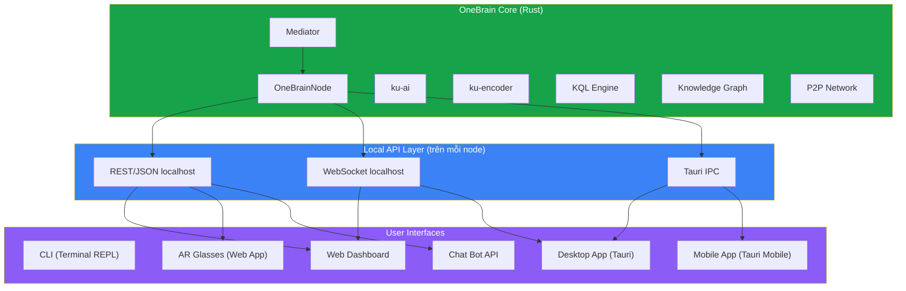

# 🖥️ Pillar 10: User Interface — Phân tích & Chiến lược

> **Nghiên cứu toàn diện cho Pillar 10 (UI) của OneBrain**
> Phân tích: Các interface cần thiết, nền tảng hỗ trợ, công nghệ lựa chọn, kiến trúc phân tầng
> Ngày tạo: 07/07/2026 | Trạng thái: DRAFT — đang phân tích cùng team

---

## 1. Hiện trạng (Baseline)

| Component | Trạng thái | LOC | Ghi chú |
|-----------|-----------|-----|---------|
| **onebrain CLI** (REPL) | ✅ Production | 1,981 | 6 commands: encode, search, connect, status, peers, help + free chat |
| **ku-demo** | ✅ Legacy demo | 953 | 10-step E2E demo |
| **ku-mediator** | ✅ Backend sẵn sàng | 2,719 | 7 intent types, context manager, graph agent — **đây là "brain" cho mọi UI** |
| Web App | ❌ Chưa có | — | |
| Mobile App | ❌ Chưa có | — | |
| AR/Glasses | ❌ Chưa có | — | |

### Điểm mạnh hiện tại cho UI development
- **ku-mediator** đã tách biệt logic: `UserInput → Mediator → MediatorResponse` — bất kỳ frontend nào cũng có thể plug vào
- **MediatorResponse** trả về structured data: `text`, `intent_detected`, `kus_encoded`, `kus_retrieved`, `suggestions`
- **UserInput** đã thiết kế extensible: hiện là `Text(String)`, comment sẵn `Voice(Vec<u8>)`, `Image(Vec<u8>)`, `Document(PathBuf)`
- **OneBrainNode** expose clean API: `encode_and_store()`, `process_input()`, `peer_count()`, `ku_count()`, `peer_list_snapshot()`

---

## 2. Kiến trúc UI tổng thể (Đề xuất)



### Nguyên tắc thiết kế

1. **Local API-First**: Mọi UI đều giao tiếp qua local API layer (chạy trên `localhost` của mỗi node) — **không** couple trực tiếp vào Rust internals, **không** server tập trung
2. **Mediator-Centric**: Mọi user interaction đi qua `Mediator` — đảm bảo nhất quán behavior
3. **Progressive Enhancement**: CLI → Web → Desktop → Mobile → AR (mỗi tầng build trên tầng trước)
4. **Adapter Pattern**: Giống cách OBKG adapt to P1-P5, UI adapts to existing pillars mà không sửa foundation

---

## 3. Các Interface cần xây dựng

### 3.1. 🔷 Local API Interface (Foundation cho mọi UI)

> **Ưu tiên: 🔴 Critical — Phải build trước mọi UI đồ họa**

> [!IMPORTANT]
> **Đây KHÔNG phải server tập trung.** Local API Interface chạy trên `localhost` của mỗi node — giống cách Bitcoin Core expose JSON-RPC trên `localhost:8332`, hoặc Ollama chạy trên `localhost:11434`. Mỗi user chạy node riêng, API riêng, Web Dashboard riêng. Giữa các node vẫn giao tiếp P2P qua TCP/QUIC.

```
User A (máy A):  Browser → localhost:4280 → OneBrainNode_A ──┐
                                                              ├── P2P (TCP/QUIC)
User B (máy B):  Browser → localhost:4280 → OneBrainNode_B ──┘
```

Cần thêm một HTTP/WebSocket interface vào `onebrain` crate, expose OneBrainNode functionality cho UI local trên cùng máy.

| Endpoint | Method | Mô tả |
|----------|--------|-------|
| `POST /api/encode` | REST | Encode text → KU |
| `GET /api/search?q=...` | REST | Search knowledge |
| `GET /api/status` | REST | Node status (KU count, peers, etc.) |
| `GET /api/peers` | REST | Peer list |
| `POST /api/chat` | REST | Free chat via Mediator |
| `GET /api/kus` | REST | List stored KUs |
| `GET /api/kus/:cid` | REST | Get KU by CID |
| `GET /api/graph/neighbors/:cid` | REST | Graph neighbors |
| `WS /ws/events` | WebSocket | Real-time events stream (peer connect, KU received, verify results) |
| `WS /ws/chat` | WebSocket | Streaming chat interface |

**Công nghệ**: `axum` (Rust web framework, cùng tokio ecosystem hiện có) — bind `127.0.0.1` only (không expose ra internet)

---

### 3.2. 🟢 CLI (Đã có — Cần nâng cấp)

Hiện tại: 6 commands cơ bản trong `cli.rs`

| Cần thêm | Mô tả |
|----------|-------|
| `graph <cid>` | Xem graph neighbors của 1 KU |
| `wallet` | Xem OBT balance |
| `kql <query>` | Chạy trực tiếp KQL query |
| `export` | Export knowledge base |
| `import <file>` | Import từ file |
| Rich output | Color, Unicode tables, progress bars (sử dụng `colored`, `indicatif`) |

---

### 3.3. 🔵 Web Dashboard (Priority #1 GUI)

> **Ưu tiên: 🟠 High — Cần cho demo stakeholders & community**

**Mục đích**: Visualize knowledge graph, browse KUs, demo PoMV lifecycle, attract investors

**Các screens chính** (thứ tự build từ nền tảng → nâng cao):

| # | Screen | Mô tả | Tính năng chính | Nền tảng cho |
|---|--------|-------|----------------|-------------|
| 0 | **Design System + Shell** | Layout, navigation, theme | Sidebar, header, routing, dark mode, design tokens | Tất cả screens |
| 1 | **Dashboard** | Tổng quan node | KU count, peer count, encoding rate, OBT balance, network health | PoMV Monitor, Wallet, Network |
| 2 | **Knowledge Explorer** | Browse & search KUs | Card view, filter by gene type / trust level / encoding status, full-text search | Graph Viz, Encode |
| 3 | **Encode** | Contribute knowledge | Text input → real-time encoding → KU preview → publish | — |
| 4 | **Chat / Mediator** | Conversational AI interface | Chat UI with Mediator, suggestions, intent indicators | — |
| 5 | **Graph Visualization** | Interactive knowledge graph | 2D (Cytoscape.js) + 3D (3d-force-graph) toggle, zoom/pan, click to expand neighbors, color by gene type, edge thickness = bond weight | — |
| 6 | **PoMV Monitor** | Metabolism lifecycle | Real-time PoMV signals, epistemic ladder progression, immune events | — |
| 7 | **Network** | P2P network status | Peer map, connection status, stigmergy trails visualization | — |
| 8 | **Wallet** | OBT token dashboard | Balance, rewards history, encoding earnings | — |

> [!NOTE]
> **Nguyên tắc**: Build từ nền tảng lên. Design System + Shell tạo khung cho mọi screen. Dashboard thiết lập pattern hiển thị dữ liệu. Knowledge Explorer tạo KU card/list components dùng lại ở Graph Viz và Encode. Các screen sau có thể phát sinh thêm tùy nhu cầu.

**Công nghệ lựa chọn**:

| Lớp | Công nghệ | Lý do |
|-----|-----------|-------|
| Framework | **React + TypeScript** | Ecosystem mạnh, nhiều graph viz libraries hỗ trợ |
| Build tool | **Vite** | Fast HMR, modern |
| Graph Viz | **Cytoscape.js** (2D) + **3d-force-graph** (3D) | 2D cho phân tích, 3D cho immersive — toggle chuyển đổi |
| Charts | **Recharts** hoặc **Chart.js** | Dashboard metrics |
| Styling | **CSS Modules** + design system | Premium, glassmorphism aesthetic |
| Real-time | **WebSocket** → `EventSource` | Live event stream từ node |

---

### 3.4. 🟣 Desktop App

> **Ưu tiên: 🟡 Medium — Phase sau Web Dashboard**

**Công nghệ**: **Tauri 2.x** (Rust backend + WebView frontend)

| Lý do chọn Tauri | Chi tiết |
|-------------------|----------|
| Cùng ngôn ngữ Rust | OneBrain backend là Rust — Tauri native Rust, không cần bridge |
| Bundle size nhỏ | ~10MB vs Electron ~150MB+ |
| Bảo mật | Permission-based API, Trust Boundary model |
| Cross-platform | Windows, macOS, Linux từ cùng codebase |
| Mobile support | Tauri 2.x hỗ trợ iOS + Android |
| Reuse Web UI | Frontend là React app, reuse 100% từ Web Dashboard |

**Kiến trúc Tauri cho OneBrain**:
```
tauri-app/
├── src-tauri/          # Rust backend
│   ├── src/
│   │   ├── main.rs     # Tauri entry
│   │   ├── commands.rs # Tauri IPC commands (gọi OneBrainNode)
│   │   └── state.rs    # Shared state (OneBrainNode instance)
│   └── Cargo.toml      # Depends on: onebrain, ku-core, ku-mediator
├── src/                # React frontend (shared with Web Dashboard)
│   ├── components/
│   ├── pages/
│   └── ...
└── tauri.conf.json
```

**Tính năng Desktop-exclusive**:
- System tray icon + background node operation
- Native file drag & drop → auto-encode
- Local AI model management (Ollama)
- Auto-start on boot
- OS-level notifications

---

### 3.5. 📱 Mobile App (Flutter + Rust FFI)

> **Ưu tiên: 🟡 Medium — Cùng phase với Desktop**

**Công nghệ: Flutter + `flutter_rust_bridge`** — Dart UI + Rust backend qua FFI

> [!NOTE]
> Chọn Flutter thay Tauri Mobile vì: Flutter mature hơn (~6 năm), native widgets mượt 60fps, ecosystem mobile phong phú (camera, voice, biometric, push notification). Rust integration qua `flutter_rust_bridge` (FFI) rất ổn định — tự generate Dart bindings từ Rust code.

**Kiến trúc**:
```
onebrain-mobile/
├── lib/                          # Flutter/Dart UI
│   ├── screens/
│   │   ├── dashboard.dart        # Tổng quan node
│   │   ├── knowledge_explorer.dart
│   │   ├── graph_view.dart       # graphview_flutter
│   │   ├── encode_screen.dart
│   │   └── chat_screen.dart      # Mediator chat
│   ├── widgets/                  # Reusable components
│   └── main.dart
├── rust/                         # Rust backend (compiled as library)
│   ├── src/
│   │   └── api.rs                # Public API cho flutter_rust_bridge
│   └── Cargo.toml                # Depends on: ku-core, ku-mediator, ku-ai...
├── pubspec.yaml                  # Flutter dependencies
└── flutter_rust_bridge.yaml      # FFI code generation config
```

**Tại sao Flutter + Rust FFI phù hợp OneBrain**:
1. **Node chạy native trên device** — Rust compiled thành `.so` (Android) / `.dylib` (iOS), không qua WebView
2. **Phi tập trung** — mỗi phone là 1 OneBrain node độc lập
3. **Performance** — FFI gọi trực tiếp Rust, không qua HTTP localhost
4. **OS không kill** — Rust code chạy trong app process, không bị suspend như WebView

**Mobile-specific features**:
- Quick capture: voice/photo → encode
- Push notifications khi nhận KU mới
- Share extension: share từ any app → OneBrain
- Offline-first: local node + sync khi có mạng
- Light node mode: chỉ store relevant KUs, relay qua seed
- Biometric lock (fingerprint/face) cho private knowledge

---

### 3.6. 🕶️ AR / Smart Glasses

> **Ưu tiên: 🔵 Low (Phase 4) — Tầm nhìn dài hạn, phù hợp BCI roadmap**

**Phân tích nền tảng AR hiện tại (2026)**:

| Platform | Phù hợp OneBrain? | Approach | Dev Tools |
|----------|-------------------|----------|-----------|
| **Meta Ray-Ban** | ⭐⭐⭐ Phù hợp nhất | Web App (HTML/CSS/JS) chạy trên glasses | Standard web tech, Neural Band input |
| **XREAL** | ⭐⭐ Spatial AR | Unity + XREAL SDK | C#, Android XR |
| **Vuzix** | ⭐ Enterprise | Android Studio | Java/Kotlin |
| **Apple Vision Pro** | ⭐⭐ Spatial computing | SwiftUI + RealityKit | Swift |

**Khuyến nghị: Target Meta Ray-Ban Display glasses** — vì:
1. Support **Web App** (HTML/CSS/JS) — có thể reuse React code
2. **Lightweight interface** phù hợp cho knowledge retrieval & encoding
3. **Neural Band** (EMG wristband) cho hands-free control
4. Không cần complex spatial computing

**AR Interface concept**:

| Feature | Mô tả |
|---------|-------|
| **Glanceable Knowledge** | Hiển thị related KUs khi đang đọc/nói chuyện |
| **Voice Encode** | "Hey OneBrain, remember that..." → encode qua voice |
| **Quick Lookup** | Nhìn vào object → contextual knowledge overlay |
| **Notification** | Badge khi nhận verified KU mới |
| **Minimal UI** | 2-3 dòng text max, no complex interactions |

---

### 3.7. 🤖 Bot / API Integration

> **Ưu tiên: 🟡 Medium — Easy win, broad reach**

| Platform | Integration |
|----------|-------------|
| **Telegram Bot** | Chat interface qua Mediator API |
| **Discord Bot** | Community knowledge sharing |
| **Slack App** | Enterprise knowledge capture |
| **Browser Extension** | Highlight text → encode → OneBrain |

---

## 4. Nền tảng hỗ trợ — Tổng hợp

| Platform | Interface | Công nghệ | Độ ưu tiên | Timeline |
|----------|-----------|-----------|-----------|----------|
| **Terminal** | CLI REPL | Rust (đã có) | ✅ Done | Now |
| **Web (Browser)** | Web Dashboard | React + Vite + Cytoscape | 🔴 Phase 1 | Q3 2026 |
| **Windows** | Desktop App | Tauri 2.x | 🟠 Phase 2 | Q4 2026 |
| **macOS** | Desktop App | Tauri 2.x | 🟠 Phase 2 | Q4 2026 |
| **Linux** | Desktop App | Tauri 2.x | 🟠 Phase 2 | Q4 2026 |
| **Android** | Mobile App | Flutter + Rust FFI | 🟡 Phase 3 | Q1 2027 |
| **iOS** | Mobile App | Flutter + Rust FFI | 🟡 Phase 3 | Q1 2027 |
| **Meta Ray-Ban** | AR Glasses | Web App (JS) | 🔵 Phase 4 | Q2-Q3 2027 |
| **Apple Vision Pro** | AR Glasses | Web App (JS) / visionOS | 🔵 Phase 4 | Q2-Q3 2027 |
| **Telegram/Discord** | Bot | REST API client | 🟡 Phase 2 | Q4 2026 |
| **Browser** | Extension | WebExtension API | 🟡 Phase 3 | Q1 2027 |

---

## 5. Phased Implementation Plan

### Phase 1: Local API + Web Dashboard (Q3 2026)

**Deliverables**:
- [ ] `onebrain-api` module: axum REST + WebSocket trên `localhost` (không tập trung)
- [ ] Web Dashboard screens theo thứ tự:
  - [ ] #0 Design System + Shell (layout, nav, theme, routing)
  - [ ] #1 Dashboard (tổng quan node)
  - [ ] #2 Knowledge Explorer (browse/search KUs)
  - [ ] #3 Encode (contribute knowledge)
  - [ ] #4 Chat / Mediator
  - [ ] #5 Graph Visualization (2D + 3D toggle)
  - [ ] #6 PoMV Monitor
  - [ ] #7 Network
  - [ ] #8 Wallet
- [ ] CLI nâng cấp: rich output, thêm commands

### Phase 2: Desktop + Bots (Q4 2026)
- [ ] Tauri wrapper cho Web Dashboard
- [ ] System tray, native drag-drop, auto-start
- [ ] Telegram Bot (ưu tiên thấp)
- [ ] Discord Bot (ưu tiên thấp)

### Phase 3: Mobile + Browser Extension (Q1 2027)
- [ ] Flutter app (Android + iOS) với `flutter_rust_bridge` → Rust backend
- [ ] Voice input support (Flutter speech-to-text)
- [ ] Browser extension (Chrome/Firefox)
- [ ] Share extension (Android Intent / iOS Share Sheet)

### Phase 4: AR Glasses + Advanced (Q2-Q3 2027)
- [ ] Meta Ray-Ban Web App
- [ ] Apple Vision Pro Web App / visionOS native
- [ ] Voice-first interface
- [ ] Contextual knowledge overlay

---

## 6. Open Questions — ✅ Tất cả đã quyết định

1. ~~**Web Dashboard priority screens**~~ → ✅ Build từ nền tảng lên: Design System → Dashboard → Knowledge Explorer → Encode → Chat → Graph Viz → PoMV → Network → Wallet. Có thể phát sinh thêm screens.
2. ~~**API deployment**~~ → ✅ **Local-only** — API chạy embedded trong mỗi `onebrain` node trên `localhost`, không server tập trung.
3. ~~**Graph visualization style**~~ → ✅ **Cả hai**: 2D (Cytoscape.js) + 3D (3d-force-graph) với toggle chuyển đổi.
4. ~~**Mobile strategy**~~ → ✅ **Flutter + `flutter_rust_bridge`** — mature, native UX, Rust FFI trực tiếp.
5. ~~**Bots**~~ → ✅ **Ưu tiên thấp** — sẽ làm nhưng không ưu tiên. Chưa có community Discord/Telegram.

---

> **Trạng thái**: DRAFT — Các quyết định chính đã thống nhất. Sẵn sàng chuyển sang implementation.
