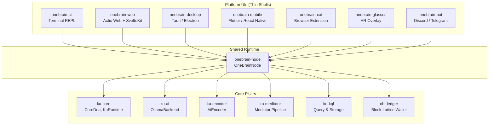

# OneBrain Platform Developer Guide

> **Version:** KU v7 · **Updated:** 2026-07-13
>
> This document is the single reference for developers building new OneBrain platform
> interfaces (Desktop, Mobile, Extension, Glasses, Bot, etc.). It ensures consistency
> across all platforms without re-researching internal APIs.

---

## Table of Contents

1. [Architecture Overview](#1-architecture-overview)
2. [Shared Display Module](#2-shared-display-module)
3. [Gene Types (v7)](#3-gene-types-v7)
4. [View Types](#4-view-types)
5. [Node API Surface](#5-node-api-surface)
6. [Event Types](#6-event-types)
7. [Error Codes](#7-error-codes)
8. [Color Palette](#8-color-palette)
9. [Formatting Conventions](#9-formatting-conventions)
10. [New Platform Checklist](#10-new-platform-checklist)

---

## 1. Architecture Overview

All OneBrain platforms share a single **runtime layer** provided by the `onebrain-node` crate. This crate owns every subsystem — AI encoding, storage, networking, wallet, identity — and exposes a uniform Rust API. Platform-specific projects (CLI, Web, Desktop, Mobile, etc.) are thin UI shells that call into `onebrain-node`.



### Key Principles

| Principle | Rule |
|-----------|------|
| **Single source of truth** | All data types, colors, names, and formatting live in `onebrain-node`. Platforms never define their own gene type lists. |
| **View model pattern** | `onebrain-node` returns `*View` / `*Info` structs — lightweight DTOs ready for display. Platforms should not access internal `KuRuntime` fields directly. |
| **Event-driven updates** | Real-time notifications flow through `NodeEvent`. Platforms subscribe to the event channel for peer connections, KU arrivals, and encode progress. |
| **Error mapping** | `NodeError` is the unified error type. Platforms map it to their native error representation (HTTP status, toast notification, dialog, etc.). |

### Dependency Graph

```toml
# In your platform's Cargo.toml:
[dependencies]
onebrain-node = { path = "../onebrain-node" }
```

For TypeScript/web platforms, the Rust node runs as a backend server (Actix-Web) and exposes a REST + WebSocket API. TypeScript types mirror the Rust view types exactly — see `onebrain-web/src/api/types.ts`.

---

## 2. Shared Display Module

**Module path:** `onebrain_node::display`

This module provides **all** display constants, gene type mappings, and formatting utilities. Every platform must use these instead of maintaining local copies.

### 2.1 Constants

| Constant | Type | Description |
|----------|------|-------------|
| `GENE_TYPE_COUNT` | `usize` (`13`) | Total gene types in KU v7 |
| `GENE_TYPE_NAMES` | `[&str; 13]` | Display names indexed by `u8` discriminant |
| `GENE_TYPE_COLORS` | `[&str; 13]` | Hex colors (dark-theme friendly) indexed by `u8` |
| `GENE_TYPE_SHORT` | `[&str; 13]` | Short abbreviations for space-constrained UIs |
| `POMV_SIGNAL_NAMES` | `[&str; 6]` | PoMV dimension names in canonical order |

### 2.2 Functions

| Function | Signature | Description |
|----------|-----------|-------------|
| `gene_type_name()` | `fn(u8) -> &'static str` | Gene type `u8` → display name. Returns `"Unknown"` for values > 12. |
| `gene_type_color()` | `fn(u8) -> &'static str` | Gene type `u8` → hex color. Returns `"#64748b"` (slate) for unknown. |
| `gene_type_short()` | `fn(u8) -> &'static str` | Gene type `u8` → short abbreviation. Returns `"Unk"` for unknown. |
| `short_cid()` | `fn(&str) -> &str` | Truncate hex CID to first 8 chars. |
| `format_size()` | `fn(u64) -> String` | Bytes → human-readable (`"1.5 KB"`, `"2.0 MB"`). |
| `format_obt()` | `fn(u64) -> String` | milliOBT → `"X,XXX.XXX OBT"` (full format with thousands separator). |
| `format_obt_short()` | `fn(u64) -> String` | milliOBT → `"X.XXX OBT"` (compact, no thousands separator). |
| `format_obt_signed()` | `fn(i64) -> String` | milliOBT → `"+X.XXX OBT"` or `"-X.XXX OBT"` (signed, for transactions). |

### 2.3 Usage Examples

#### Rust

```rust
use onebrain_node::display;

// Gene type display
let gt: u8 = ku.dna.header.gene_type;
let name  = display::gene_type_name(gt);   // "Fact"
let color = display::gene_type_color(gt);   // "#06b6d4"
let short = display::gene_type_short(gt);   // "Fact"

// CID truncation
let label = display::short_cid(&cid_hex);   // "a1b2c3d4"

// Size formatting
let size = display::format_size(wire_bytes.len() as u64);  // "2.3 KB"

// OBT formatting
let balance = display::format_obt(1_250_000);         // "1,250.000 OBT"
let compact = display::format_obt_short(5000);         // "5.000 OBT"
let delta   = display::format_obt_signed(-1500);       // "-1.500 OBT"

// PoMV signal names (for radar charts, breakdowns)
for (i, name) in display::POMV_SIGNAL_NAMES.iter().enumerate() {
    println!("{}: {:.2}", name, pomv_values[i]);
}
```

#### TypeScript

TypeScript platforms import equivalent constants from the shared types module:

```typescript
import {
  ALL_GENE_TYPES,
  GENE_TYPE_COLORS,
  type GeneType,
} from '@/api/types';

// Gene type color lookup
const color = GENE_TYPE_COLORS[ku.gene_type]; // "#06b6d4"

// CID truncation
const shortCid = (hex: string) => hex.slice(0, 8);

// OBT formatting (milliOBT → display)
const formatObt = (milli: number) => {
  const whole = Math.floor(milli / 1000);
  const frac = milli % 1000;
  return `${whole.toLocaleString()}.${frac.toString().padStart(3, '0')} OBT`;
};

// Size formatting
const formatSize = (bytes: number) => {
  if (bytes < 1024) return `${bytes} B`;
  if (bytes < 1024 * 1024) return `${(bytes / 1024).toFixed(1)} KB`;
  if (bytes < 1024 * 1024 * 1024) return `${(bytes / (1024 * 1024)).toFixed(1)} MB`;
  return `${(bytes / (1024 * 1024 * 1024)).toFixed(2)} GB`;
};
```

---

## 3. Gene Types (v7)

KU v7 defines **13 gene types**. The `u8` discriminant matches the `ku_core::types::GeneType` enum order exactly.

| u8 | Enum Variant | Display Name | Short | Color (Hex) | Color Name | Category |
|----|-------------|--------------|-------|-------------|------------|----------|
| 0 | `Fact` | Fact | Fact | `#06b6d4` | Cyan | Knowledge |
| 1 | `Procedure` | Procedure | Proc | `#8b5cf6` | Violet | Knowledge |
| 2 | `Experience` | Experience | Exp | `#f59e0b` | Amber | Personal |
| 3 | `Creative` | Creative | Crea | `#10b981` | Green | Personal |
| 4 | `MediaExperience` | MediaExperience | Media | `#ec4899` | Pink | Personal |
| 5 | `Testimony` | Testimony | Test | `#f97316` | Orange | Social |
| 6 | `Formal` | Formal | Form | `#6366f1` | Indigo | Academic |
| 7 | `Hypothesis` | Hypothesis | Hypo | `#14b8a6` | Teal | Academic |
| 8 | `Narrative` | Narrative | Narr | `#a855f7` | Purple | Personal |
| 9 | `Sensory` | Sensory | Sens | `#eab308` | Yellow | Personal |
| 10 | `Composite` | Composite | Comp | `#64748b` | Slate | Structure |
| 11 | `Normative` | Normative | Norm | `#ef4444` | Red | Social *(v7 NEW)* |
| 12 | `Definition` | Definition | Defn | `#0ea5e9` | Sky | Knowledge *(v7 NEW)* |

> [!IMPORTANT]
> Types 11 (`Normative`) and 12 (`Definition`) are **new in v7**. If migrating from v6, platforms
> must handle these gracefully — they may appear in storage after a v7 encoder upgrade.

### Category Groupings

| Category | Gene Types | Use Case |
|----------|-----------|----------|
| **Knowledge** | Fact, Procedure, Definition | Objective, verifiable knowledge |
| **Personal** | Experience, Creative, MediaExperience, Narrative, Sensory | Subjective, personal knowledge |
| **Social** | Testimony, Normative | Socially-sourced or normative knowledge |
| **Academic** | Formal, Hypothesis | Academic and research knowledge |
| **Structure** | Composite | Container/aggregation KUs |

---

## 4. View Types

All DTOs live in `onebrain_node::types`. Platforms consume these structs directly (Rust) or their JSON-serialized equivalents (TypeScript, REST). Every field is `Serialize + Deserialize`.

### 4.1 Knowledge Views

#### `KuListItem`

Summary of a KU for list/table views.

| Field | Type | Description |
|-------|------|-------------|
| `cid_hex` | `String` | Hex-encoded 32-byte BLAKE3 CID |
| `gene_type` | `String` | Human-readable gene type name |
| `preview` | `String` | First ~80 characters of content |
| `pomv` | `f64` | Composite PoMV score (0.0–1.0) |
| `trust` | `f64` | Trust score (0.0–1.0) |
| `created` | `u64` | Creation timestamp (Unix epoch seconds) |
| `wire_size` | `usize` | Wire-encoded size in bytes |

#### `KuDetail`

Full detail view of a single KU.

| Field | Type | Description |
|-------|------|-------------|
| `cid_hex` | `String` | Hex-encoded CID |
| `gene_type` | `String` | Gene type name |
| `content` | `String` | Full source text |
| `codons` | `Vec<CodonView>` | Extracted concepts/codons |
| `bonds` | `Vec<BondView>` | Bonds (outgoing + incoming) |
| `trust` | `f64` | Trust score |
| `pomv` | `f64` | Composite PoMV score |
| `pomv_breakdown` | `PomvBreakdown` | 6-dimensional PoMV breakdown |
| `epistemic` | `String` | Epistemic status (e.g., `"Observation"`) |
| `evidence` | `String` | Evidence type (e.g., `"Empirical"`) |
| `wire_size` | `usize` | Wire-encoded size in bytes |
| `instruction_count` | `usize` | Number of Core DNA instructions |
| `confidence` | `f32` | Encoding confidence (0.0–1.0) |
| `created` | `u64` | Creation timestamp |
| `verification_status` | `String` | Verification state |
| `outgoing_bond_count` | `usize` | Number of outgoing bonds |
| `incoming_bond_count` | `usize` | Number of incoming bonds |
| `decoded_instructions` | `Vec<InstructionView>` | Human-readable decoded instructions |

#### `CodonView`

An extracted concept/codon from a KU.

| Field | Type | Description |
|-------|------|-------------|
| `name` | `String` | Concept name |
| `role` | `String` | Role: `"Domain"`, `"Agent"`, `"Content"`, `"Time"`, `"Result"`, etc. |

#### `InstructionView`

Human-readable decoded Core DNA instruction.

| Field | Type | Description |
|-------|------|-------------|
| `op` | `String` | Instruction type: `"Triple"`, `"Quality"`, `"Quantity"`, `"Step"`, `"PartOf"`, `"Causal"`, `"Located"`, `"Temporal"`, `"Simulates"`, `"Condition"`, `"Agent"`, `"Tool"`, `"Range"`, `"Tolerance"`, `"Constraint"`, `"Certainty"`, `"Difficulty"`, `"Sequence"`, `"EnumVal"`, `"CidRef"`, `"Precond"`, `"Effect"`, `"Affect"`, `"Label"`, `"Witness"`, `"End"` |
| `description` | `String` | Human-readable description (e.g., `"Rust —[is_a]→ ProgrammingLanguage"`) |
| `concept_ids` | `Vec<u64>` | Raw concept IDs involved |

#### `BondView`

A bond (relationship) to/from a KU.

| Field | Type | Description |
|-------|------|-------------|
| `direction` | `String` | `"OUT"` or `"IN"` |
| `relation` | `String` | Relation type: `"Extends"`, `"Cites"`, `"Refutes"`, `"PartOf"`, etc. |
| `other_cid` | `String` | Hex CID of the related KU |
| `other_preview` | `String` | Preview text of the related KU (if available) |
| `weight` | `f64` | Bond weight (0.0–1.0) |

#### `PomvBreakdown`

PoMV score breakdown into 6 dimensions.

| Field | Type | Description | Signal Name |
|-------|------|-------------|-------------|
| `metabolic` | `f64` | Metabolic rate (access frequency) | Metabolic |
| `prediction` | `f64` | Prediction accuracy / usefulness | Prediction |
| `entropy` | `f64` | Information entropy at creation | Entropy |
| `survival` | `f64` | Long-term survival score | Survival |
| `centrality` | `f64` | Graph centrality (bond connectivity) | Centrality |
| `niche` | `f64` | Niche fitness (domain specialization) | Niche |

All values range from `0.0` to `1.0`. The composite PoMV score is derived from these signals.

#### `NeighborInfo`

Graph neighbor info for tree/graph visualizations.

| Field | Type | Description |
|-------|------|-------------|
| `cid_hex` | `String` | CID of neighbor |
| `relation` | `String` | Relation type |
| `direction` | `String` | `"OUT"` or `"IN"` |
| `preview` | `String` | Preview text |
| `weight` | `f64` | Bond weight |
| `gene_type` | `String` | Gene type of the neighbor KU |
| `pomv` | `f64` | PoMV score of neighbor |
| `is_local` | `bool` | Whether the KU exists in local storage |
| `children` | `Vec<NeighborInfo>` | Children (recursive, for tree display at depth > 1) |

### 4.2 Identity & Profile Views

#### `IdentityInfo`

| Field | Type | Description |
|-------|------|-------------|
| `node_id` | `String` | Node ID (hex-encoded public key) |
| `name` | `String` | Display name |
| `created` | `u64` | Creation timestamp |
| `tier` | `String` | Trust tier name (e.g., `"Contributor"`) |
| `trust_score` | `f64` | Trust score (0.0–1.0) |
| `device_count` | `u32` | Number of devices in identity group |
| `max_devices` | `u32` | Maximum devices allowed |
| `kus_encoded` | `u64` | Total KUs encoded |
| `kus_received` | `u64` | Total KUs received from peers |
| `total_queries` | `u64` | Total queries made |

#### `UserProfileView`

| Field | Type | Description |
|-------|------|-------------|
| `name` | `String` | Display name |
| `language` | `String` | Preferred language |
| `style` | `String` | Response style: `"Concise"`, `"Balanced"`, `"Detailed"`, `"Academic"` |
| `expertise` | `Vec<ExpertiseView>` | Top expertise areas |
| `total_kus` | `u64` | Total KU count |
| `total_queries` | `u64` | Total query count |
| `member_since` | `u64` | Membership start timestamp |

#### `ExpertiseView`

| Field | Type | Description |
|-------|------|-------------|
| `domain` | `String` | Domain name |
| `ku_count` | `u64` | Number of KUs in this domain |
| `last_active` | `u64` | Last activity timestamp |

### 4.3 AI Views

#### `ModelInfo`

| Field | Type | Description |
|-------|------|-------------|
| `name` | `String` | Model name (e.g., `"qwen3:8b"`) |
| `params` | `String` | Parameter count description (e.g., `"8B params"`) |
| `is_current` | `bool` | Whether this is the active model |
| `is_installed` | `bool` | Whether it's installed in Ollama |

#### `AiHealthInfo`

| Field | Type | Description |
|-------|------|-------------|
| `connected` | `bool` | Whether Ollama is reachable |
| `model` | `String` | Current model name |
| `ollama_url` | `String` | Ollama endpoint URL |
| `latency_ms` | `u64` | Connection latency in milliseconds (0 if disconnected) |
| `status_message` | `String` | Human-readable status message |

### 4.4 Wallet Views

#### `WalletInfo`

OBT wallet state. Uses Nano-style block-lattice — each node has its own chain.

| Field | Type | Description |
|-------|------|-------------|
| `balance` | `u64` | Current spendable balance (milliOBT) |
| `chain_length` | `u64` | Number of blocks in local chain |
| `tier` | `String` | Current trust tier |
| `multiplier` | `f64` | Tier reward multiplier |
| `total_earned` | `u64` | Total earned (milliOBT, informational) |
| `total_spent` | `u64` | Total spent (milliOBT, informational) |
| `streams` | `EarningsStreams` | Earnings breakdown by stream |
| `rate_used` | `u32` | Rate limit tokens consumed |
| `rate_max` | `u32` | Rate limit maximum |

#### `EarningsStreams`

| Field | Type | Description | Share |
|-------|------|-------------|-------|
| `owner` | `u64` | R1: Owner (PoMV-based) rewards (milliOBT) | 40% |
| `encoder` | `u64` | R2: Encoder rewards (milliOBT) | 25% |
| `verifier` | `u64` | R3: Verifier rewards (milliOBT) | 15% |
| `storage` | `u64` | R4: Storage node rewards (milliOBT) | 20% |

#### `WalletTransaction`

| Field | Type | Description |
|-------|------|-------------|
| `block_type` | `String` | `"Mint"`, `"Send"`, `"Receive"`, `"Refund"`, `"Open"` |
| `amount` | `i64` | Amount in milliOBT (positive = credit, negative = debit) |
| `detail` | `String` | Description (e.g., `"R1:Owner — KU a1b2c3..."`) |
| `timestamp` | `u64` | Timestamp (epoch seconds) |
| `confirmation` | `String` | `"Pending"`, `"Tentative"`, `"Confirmed"`, `"Settled"` |

### 4.5 Config & System Views

#### `ConfigView`

| Field | Type | Description |
|-------|------|-------------|
| `name` | `String` | Node display name |
| `port` | `u16` | TCP listen port |
| `data_dir` | `String` | Data directory path |
| `ollama_url` | `String` | Ollama API URL |
| `model` | `String` | Current AI model name |
| `seeds` | `Vec<String>` | Seed peer addresses |
| `identity_path` | `String` | Identity file path |
| `storage_path` | `String` | KU storage path |
| `profile_path` | `String` | Profile file path |
| `peers_path` | `String` | Peer memory file path |

#### `BackupInfo`

| Field | Type | Description |
|-------|------|-------------|
| `path` | `String` | Output backup file path |
| `size` | `u64` | Backup file size in bytes |
| `ku_count` | `usize` | Number of KUs backed up |
| `timestamp` | `u64` | Backup creation timestamp |

#### `ImportResult`

| Field | Type | Description |
|-------|------|-------------|
| `imported` | `usize` | Number of KUs successfully imported |
| `skipped` | `usize` | Number of duplicates/rate-limited skipped |
| `errors` | `usize` | Number of import errors |

#### `BlobStatsView`

| Field | Type | Description |
|-------|------|-------------|
| `count` | `usize` | Total blob count |
| `total_size` | `u64` | Total size in bytes |
| `quota` | `u64` | Storage quota in bytes |
| `usage_pct` | `f64` | Usage percentage (0.0–100.0) |

---

## 5. Node API Surface

All public methods on `OneBrainNode`. Grouped by functional category.

### 5.1 Init & Lifecycle

| Method | Signature | Returns | Description |
|--------|-----------|---------|-------------|
| `new()` | `async fn(NodeConfig)` | `Result<Self, NodeError>` | Create and initialize a node. Sets up AI backends, mediator, storage, retriever, and anti-gaming guard. |
| `start_network()` | `async fn(&mut self)` | `Result<SocketAddr, NodeError>` | Bind TCP listener and spawn background accept loop. Returns local address. |
| `connect_to_seed()` | `async fn(&self, SocketAddr)` | `Result<(), NodeError>` | Connect to a seed peer and exchange handshake. |

### 5.2 Network

| Method | Signature | Returns | Description |
|--------|-----------|---------|-------------|
| `broadcast_ku()` | `async fn(&self, &str, &[u8], &str)` | `()` | Push a KU to all connected peers (fire-and-forget). |
| `request_verification()` | `async fn(&self, &str, &str)` | `()` | Request verification of a KU from all peers. |
| `peer_count()` | `fn(&self)` | `usize` | Get current connected peer count (non-blocking). |
| `peer_list_snapshot()` | `fn(&self)` | `Vec<PeerInfo>` | Get a snapshot of all connected peers. |
| `listener_addr()` | `fn(&self)` | `Option<SocketAddr>` | Get the bound listener address (if network started). |
| `drain_events()` | `fn(&mut self)` | `Vec<NodeEvent>` | Drain all pending events from the event channel (non-blocking). |

### 5.3 Encoding

| Method | Signature | Returns | Description |
|--------|-----------|---------|-------------|
| `encode_and_store()` | `async fn(&mut self, &str)` | `Result<EncodeStoreResult, NodeError>` | Full encode-store pipeline: rate check → AI encode → quality gate → store → index → broadcast → verify. |
| `encode_and_store_with_progress()` | `async fn(&mut self, &str, Option<&Sender<String>>)` | `Result<EncodeStoreResult, NodeError>` | Same as above, with optional broadcast progress sender for WebSocket streaming. |

### 5.4 Mediator

| Method | Signature | Returns | Description |
|--------|-----------|---------|-------------|
| `process_input()` | `async fn(&mut self, &str)` | `Result<String, NodeError>` | Process user input through the AI mediator pipeline (chat + intent detection). |

### 5.5 Query

| Method | Signature | Returns | Description |
|--------|-----------|---------|-------------|
| `list_kus()` | `fn(&self, usize, usize, Option<&str>, &str)` | `Result<(Vec<KuListItem>, usize), NodeError>` | List KUs with pagination, type filter, and sort (`"pomv"`, `"trust"`, `"created"`). Returns (items, total_filtered). |
| `get_ku()` | `fn(&self, &str)` | `Result<KuDetail, NodeError>` | Get full detail of a single KU by CID hex. |
| `delete_ku()` | `fn(&self, &str)` | `Result<bool, NodeError>` | Delete a KU from local storage by CID hex. |
| `execute_kql()` | `fn(&self, &str)` | `Result<Vec<KuListItem>, NodeError>` | Execute a KQL query string. Returns matching KUs. |
| `get_neighbors()` | `fn(&self, &str, u32)` | `Result<Vec<NeighborInfo>, NodeError>` | Get graph neighbors of a KU at specified depth. |
| `ku_count()` | `fn(&self)` | `Result<usize, NodeError>` | Get total KU count in storage (non-blocking). |

### 5.6 Identity

| Method | Signature | Returns | Description |
|--------|-----------|---------|-------------|
| `get_identity_info()` | `fn(&self)` | `Result<IdentityInfo, NodeError>` | Get identity information for the current node. |
| `recover_identity()` | `fn(&mut self, &[String], &str)` | `Result<IdentityInfo, NodeError>` | Recover identity from a 24-word BIP39 phrase. |

### 5.7 Profile

| Method | Signature | Returns | Description |
|--------|-----------|---------|-------------|
| `get_profile()` | `fn(&self)` | `Result<UserProfileView, NodeError>` | Get user profile with expertise areas. |
| `update_profile()` | `fn(&mut self, &str, &str)` | `Result<(), NodeError>` | Update a profile field. Fields: `"name"`, `"language"`, `"style"`. Styles: `"concise"`, `"balanced"`, `"detailed"`, `"academic"`. |

### 5.8 AI

| Method | Signature | Returns | Description |
|--------|-----------|---------|-------------|
| `list_ai_models()` | `fn(&self)` | `Result<Vec<ModelInfo>, NodeError>` | List available AI models. |
| `switch_model()` | `fn(&mut self, &str)` | `Result<(), NodeError>` | Switch the active AI model by name. |
| `test_ai_connection()` | `async fn(&self)` | `Result<AiHealthInfo, NodeError>` | Test connectivity to the Ollama backend. |

### 5.9 Config

| Method | Signature | Returns | Description |
|--------|-----------|---------|-------------|
| `get_config_view()` | `fn(&self)` | `ConfigView` | Get current node configuration as a view DTO. |
| `update_config()` | `fn(&mut self, &str, &str)` | `Result<(), NodeError>` | Update a config key. Keys: `"name"`, `"port"`, `"ollama_url"`, `"model"`. |
| `node_name()` | `fn(&self)` | `&str` | Get the node display name. |
| `config()` | `fn(&self)` | `&NodeConfig` | Get direct reference to the configuration struct. |

### 5.10 Wallet

| Method | Signature | Returns | Description |
|--------|-----------|---------|-------------|
| `get_balance()` | `fn(&self)` | `Result<WalletInfo, NodeError>` | Get OBT wallet info. Balance is authoritative from local block-lattice chain. |
| `get_wallet_history()` | `fn(&self, usize)` | `Result<Vec<WalletTransaction>, NodeError>` | Get wallet transaction history with limit. |

### 5.11 Export & Backup

| Method | Signature | Returns | Description |
|--------|-----------|---------|-------------|
| `export_kus()` | `fn(&self, &str, &Path)` | `Result<usize, NodeError>` | Export KUs to file. Formats: `"json"`, `"csv"`. Returns export count. |
| `import_file()` | `async fn(&mut self, &Path)` | `Result<ImportResult, NodeError>` | Import KUs from a text file (one paragraph per KU, min 50 chars). |
| `create_backup()` | `fn(&self, &Path, &str)` | `Result<BackupInfo, NodeError>` | Create a full backup of node data (identity, profile, peers). |
| `restore_backup()` | `fn(&mut self, &Path, &str)` | `Result<(), NodeError>` | Restore node data from a backup file. |

### 5.12 Blob Storage

| Method | Signature | Returns | Description |
|--------|-----------|---------|-------------|
| `store_blob()` | `fn(&self, &Path)` | `Result<BlobMeta, NodeError>` | Store a file as a content-addressed blob. |
| `get_blob_meta()` | `fn(&self, &str)` | `Result<BlobMeta, NodeError>` | Get blob metadata by hex CID. |
| `list_blobs()` | `fn(&self)` | `Result<Vec<BlobMeta>, NodeError>` | List all blobs in storage. |
| `export_blob()` | `fn(&self, &str, &Path)` | `Result<u64, NodeError>` | Export a blob to a file. Returns size. |
| `delete_blob_file()` | `fn(&self, &str)` | `Result<bool, NodeError>` | Delete a blob by CID hex. |
| `blob_stats()` | `fn(&self)` | `Result<(usize, u64), NodeError>` | Get blob storage stats: (count, total_size_bytes). |
| `blob_gc()` | `fn(&self)` | `Result<(usize, u64), NodeError>` | Garbage collect orphaned blobs. Returns (removed_count, freed_bytes). |
| `blob_add_ku_ref()` | `fn(&self, &str, &str)` | `Result<(), NodeError>` | Add a KU reference to a blob (prevents GC). |

---

## 6. Event Types

Events are emitted through `mpsc::Receiver<NodeEvent>` from background tasks. Platforms must poll/drain events to stay up to date.

```rust
pub enum NodeEvent {
    PeerConnected(PeerInfo),
    KuReceived { cid_hex, wire_bytes, source_text, from },
    VerifyResult { cid_hex, agreement_score, verified, from },
    Notification(String),
    EncodeProgress { step, total_steps, message },
}
```

| Variant | Fields | Description | UI Action |
|---------|--------|-------------|-----------|
| `PeerConnected` | `PeerInfo { name, addr, ku_count }` | A new peer completed handshake | Show toast/badge, update peer count |
| `KuReceived` | `cid_hex: String`, `wire_bytes: Vec<u8>`, `source_text: String`, `from: String` | A KU was received from a peer and stored locally | Refresh KU list, show notification |
| `VerifyResult` | `cid_hex: String`, `agreement_score: f64`, `verified: bool`, `from: String` | A peer returned a verification result | Update KU verification badge |
| `Notification` | `String` | Generic notification message for display | Show in notification area / log |
| `EncodeProgress` | `step: u8`, `total_steps: u8`, `message: String` | Encode pipeline progress (1–6 steps) | Show progress bar / stepper |

### Encode Pipeline Steps

| Step | Message | Description |
|------|---------|-------------|
| 1/6 | `"Rate limit check..."` | Anti-gaming rate limit validation |
| 2/6 | `"Creating AI encoder (model: ...)..."` | Backend initialization |
| 3/6 | `"AI generating tool calls (this may take a while)..."` | The slow AI encoding step |
| 4/6 | `"Processing KU (N bytes wire data)..."` | Decoding, quality gates |
| 5/6 | `"Storing KU and indexing..."` | Persist to storage, index keywords |
| 6/6 | `"Broadcasting to peers..."` | Network broadcast + verification request |

### WebSocket Event Format (for TypeScript)

```typescript
interface WsEvent {
  event_type: string;   // "peer_connected", "ku_received", "encode_progress", etc.
  timestamp: number;    // Unix epoch seconds
  data: Record<string, unknown>;
}
```

---

## 7. Error Codes

All node operations return `Result<T, NodeError>`. Platforms should map these to appropriate user-facing messages.

| Variant | Error Format | Suggested HTTP Status | Description | User-Facing Message |
|---------|-------------|----------------------|-------------|---------------------|
| `Ai(AiError)` | `"AI error: {0}"` | 502 Bad Gateway | AI backend error (Ollama communication failure) | "AI service error. Please check your Ollama connection." |
| `Encoder(EncoderError)` | `"Encoder error: {0}"` | 422 Unprocessable | KU encoding failed | "Failed to encode your knowledge. Try rephrasing." |
| `Mediator(MediatorError)` | `"Mediator error: {0}"` | 500 Internal | Mediator orchestration error | "Processing error. Please try again." |
| `Storage(String)` | `"Storage error: {0}"` | 500 Internal | Persistent storage read/write failure | "Storage error. Check disk space and permissions." |
| `Network(String)` | `"Network error: {0}"` | 503 Service Unavailable | Network / P2P error | "Network error. Check your connection." |
| `Config(String)` | `"Config error: {0}"` | 400 Bad Request | Configuration error | "Invalid configuration. Please check settings." |
| `Io(io::Error)` | `"IO error: {0}"` | 500 Internal | File system I/O error | "File system error. Check permissions." |
| `Pipeline(String)` | `"Pipeline error: {0}"` | 500 Internal | Catch-all for composed pipeline failures | "Processing pipeline error." |
| `KuNotFound(String)` | `"KU not found: {0}"` | 404 Not Found | KU not in local storage | "Knowledge unit not found." |
| `Kql(String)` | `"KQL error: {0}"` | 400 Bad Request | KQL syntax or execution error | "Invalid query. Check your KQL syntax." |
| `AiUnavailable(String)` | `"AI unavailable: {0}"` | 503 Service Unavailable | AI service is not running | "AI service is unavailable. Is Ollama running?" |
| `IdentityExists(String)` | `"Identity already exists: {0}"` | 409 Conflict | Identity file already exists | "Identity already exists on this device." |
| `InvalidPhrase(String)` | `"Invalid recovery phrase: {0}"` | 400 Bad Request | Invalid BIP39 recovery phrase | "Invalid recovery phrase. Must be 24 words." |
| `Backup(String)` | `"Backup error: {0}"` | 500 Internal | Backup/restore error | "Backup operation failed." |
| `RateLimit(String)` | `"Rate limit exceeded: {0}"` | 429 Too Many Requests | Rate limit exceeded | "Too many requests. Please wait before encoding again." |
| `QualityGate(String)` | `"Quality gate failed: {0}"` | 422 Unprocessable | Content quality too low to store | "Content quality too low. Add more detail." |
| `InvalidArgument(String)` | `"Invalid argument: {0}"` | 400 Bad Request | Invalid function argument | "Invalid input. Please check your parameters." |
| `Timeout(String)` | `"Timeout: {0}"` | 504 Gateway Timeout | Operation timed out | "Operation timed out. Please try again." |

### Error Mapping Example (Rust → HTTP)

```rust
fn status_for_error(e: &NodeError) -> u16 {
    match e {
        NodeError::KuNotFound(_) => 404,
        NodeError::RateLimit(_) => 429,
        NodeError::InvalidArgument(_) | NodeError::InvalidPhrase(_)
            | NodeError::Kql(_) | NodeError::Config(_) => 400,
        NodeError::IdentityExists(_) => 409,
        NodeError::Ai(_) => 502,
        NodeError::AiUnavailable(_) | NodeError::Network(_) => 503,
        NodeError::Timeout(_) => 504,
        NodeError::Encoder(_) | NodeError::QualityGate(_) => 422,
        _ => 500,
    }
}
```

---

## 8. Color Palette

### 8.1 Gene Type Colors

Standard colors for all platforms. Designed for dark glassmorphism themes.

| Gene Type | Hex | RGB | CSS Variable Suggestion |
|-----------|-----|-----|-------------------------|
| Fact | `#06b6d4` | `rgb(6, 182, 212)` | `--gene-fact` |
| Procedure | `#8b5cf6` | `rgb(139, 92, 246)` | `--gene-procedure` |
| Experience | `#f59e0b` | `rgb(245, 158, 11)` | `--gene-experience` |
| Creative | `#10b981` | `rgb(16, 185, 129)` | `--gene-creative` |
| MediaExperience | `#ec4899` | `rgb(236, 72, 153)` | `--gene-media` |
| Testimony | `#f97316` | `rgb(249, 115, 22)` | `--gene-testimony` |
| Formal | `#6366f1` | `rgb(99, 102, 241)` | `--gene-formal` |
| Hypothesis | `#14b8a6` | `rgb(20, 184, 166)` | `--gene-hypothesis` |
| Narrative | `#a855f7` | `rgb(168, 85, 247)` | `--gene-narrative` |
| Sensory | `#eab308` | `rgb(234, 179, 8)` | `--gene-sensory` |
| Composite | `#64748b` | `rgb(100, 116, 139)` | `--gene-composite` |
| Normative | `#ef4444` | `rgb(239, 68, 68)` | `--gene-normative` |
| Definition | `#0ea5e9` | `rgb(14, 165, 233)` | `--gene-definition` |
| *Unknown (fallback)* | `#64748b` | `rgb(100, 116, 139)` | `--gene-unknown` |

### 8.2 PoMV Signal Colors

Suggested colors for PoMV radar charts and breakdowns.

| Signal | Suggested Hex | Purpose |
|--------|--------------|---------|
| Metabolic | `#ef4444` | Red — energy/activity |
| Prediction | `#3b82f6` | Blue — accuracy |
| Entropy | `#a855f7` | Purple — information |
| Survival | `#10b981` | Green — longevity |
| Centrality | `#f59e0b` | Amber — connectivity |
| Niche | `#06b6d4` | Cyan — specialization |

### 8.3 UI Badge Colors

| Badge | Hex | Use |
|-------|-----|-----|
| Trust High (≥ 0.8) | `#10b981` | Green badge |
| Trust Medium (0.4–0.8) | `#f59e0b` | Amber badge |
| Trust Low (< 0.4) | `#ef4444` | Red badge |
| Verified | `#10b981` | Green check |
| Pending | `#f59e0b` | Amber spinner |
| Failed | `#ef4444` | Red cross |
| Confirmed (wallet) | `#10b981` | Green |
| Tentative (wallet) | `#f59e0b` | Amber |
| Settled (wallet) | `#3b82f6` | Blue |

### 8.4 CSS Custom Properties Template

```css
:root {
  /* Gene types */
  --gene-fact: #06b6d4;
  --gene-procedure: #8b5cf6;
  --gene-experience: #f59e0b;
  --gene-creative: #10b981;
  --gene-media: #ec4899;
  --gene-testimony: #f97316;
  --gene-formal: #6366f1;
  --gene-hypothesis: #14b8a6;
  --gene-narrative: #a855f7;
  --gene-sensory: #eab308;
  --gene-composite: #64748b;
  --gene-normative: #ef4444;
  --gene-definition: #0ea5e9;
  --gene-unknown: #64748b;

  /* PoMV signals */
  --pomv-metabolic: #ef4444;
  --pomv-prediction: #3b82f6;
  --pomv-entropy: #a855f7;
  --pomv-survival: #10b981;
  --pomv-centrality: #f59e0b;
  --pomv-niche: #06b6d4;

  /* Trust badges */
  --trust-high: #10b981;
  --trust-medium: #f59e0b;
  --trust-low: #ef4444;
}
```

---

## 9. Formatting Conventions

### 9.1 OBT Currency Display

OBT values are stored internally as **milliOBT** (`u64` for unsigned, `i64` for signed).

| Context | Format | Example | Function |
|---------|--------|---------|----------|
| Full balance | `"X,XXX.XXX OBT"` | `"1,250.000 OBT"` | `display::format_obt()` |
| Compact | `"X.XXX OBT"` | `"5.000 OBT"` | `display::format_obt_short()` |
| Transaction delta | `"+X.XXX OBT"` / `"-X.XXX OBT"` | `"+25.000 OBT"` | `display::format_obt_signed()` |

> **Note:** `1 OBT = 1000 milliOBT`. Always display 3 decimal places.

### 9.2 CID Display

Content IDs are 32-byte BLAKE3 hashes, hex-encoded as 64-character strings.

| Context | Format | Example |
|---------|--------|---------|
| Full CID | `64 hex chars` | `a1b2c3d4e5f6789012345678...` |
| Short CID (UI) | First `8 chars` | `a1b2c3d4` |
| API/URLs | Full hex string | Used in `GET /api/v1/ku/{cid}` |

Use `display::short_cid()` for display; always transmit the full CID in APIs.

### 9.3 Timestamps

All timestamps are **Unix epoch seconds** (`u64`).

| Context | Recommended Display |
|---------|---------------------|
| Recent (< 24h) | Relative: `"2 hours ago"` |
| This week | Day + time: `"Wed 14:30"` |
| Older | Full date: `"2026-07-13 14:30"` |
| API responses | Raw epoch seconds (let client format) |

### 9.4 File Sizes

Use `display::format_size()` which follows binary units:

| Range | Unit | Precision |
|-------|------|-----------|
| < 1 KB | `B` | Integer (`"512 B"`) |
| < 1 MB | `KB` | 1 decimal (`"1.5 KB"`) |
| < 1 GB | `MB` | 1 decimal (`"2.3 MB"`) |
| ≥ 1 GB | `GB` | 2 decimals (`"1.50 GB"`) |

### 9.5 Scores and Percentages

| Value Type | Range | Display |
|------------|-------|---------|
| Trust | 0.0–1.0 | Percentage: `"85%"` or progress bar |
| PoMV | 0.0–1.0 | Percentage or radar chart |
| Confidence | 0.0–1.0 | Percentage: `"92%"` |
| Bond weight | 0.0–1.0 | Percentage or opacity |

---

## 10. New Platform Checklist

Follow this step-by-step guide when creating a new platform interface for OneBrain.

### Phase 1: Project Setup

- [ ] **Create project directory** under `src/onebrain-<platform>/`
- [ ] **Add `Cargo.toml`** dependency:
  ```toml
  [dependencies]
  onebrain-node = { path = "../onebrain-node" }
  tokio = { version = "1", features = ["full"] }
  serde = { version = "1", features = ["derive"] }
  serde_json = "1"
  ```
- [ ] **Import the display module** — never hard-code gene type names or colors:
  ```rust
  use onebrain_node::display;
  ```
- [ ] **Import view types** — use these as your DTOs:
  ```rust
  use onebrain_node::types::*;
  ```
- [ ] **Import error and event types**:
  ```rust
  use onebrain_node::{NodeError, NodeEvent, OneBrainNode, NodeConfig};
  ```

### Phase 2: Node Initialization

- [ ] **Create a `NodeConfig`** from user settings or config file
- [ ] **Instantiate `OneBrainNode::new(config).await`** — this sets up all subsystems
- [ ] **Call `node.start_network().await`** — binds TCP and starts background listener
- [ ] **Connect to seed peers** with `node.connect_to_seed(addr).await`

### Phase 3: Core Features

Implement these features using the Node API:

- [ ] **Knowledge List** — `node.list_kus(page, limit, type_filter, sort_by)`
- [ ] **Knowledge Detail** — `node.get_ku(cid_hex)`
- [ ] **Encode (Create KU)** — `node.encode_and_store(text).await`
- [ ] **Chat / Mediator** — `node.process_input(text).await`
- [ ] **Search / KQL** — `node.execute_kql(query_str)`
- [ ] **Graph View** — `node.get_neighbors(cid_hex, depth)`

### Phase 4: Identity & Profile

- [ ] **Show Identity** — `node.get_identity_info()`
- [ ] **Recovery** — `node.recover_identity(phrase, password)`
- [ ] **Profile Display** — `node.get_profile()`
- [ ] **Profile Edit** — `node.update_profile(field, value)`

### Phase 5: AI Integration

- [ ] **Health Check** — `node.test_ai_connection().await`
- [ ] **Model List** — `node.list_ai_models()`
- [ ] **Model Switch** — `node.switch_model(model_name)`

### Phase 6: Wallet

- [ ] **Balance Display** — `node.get_balance()` — format with `display::format_obt()`
- [ ] **Transaction History** — `node.get_wallet_history(limit)`
- [ ] **Earnings Breakdown** — use `EarningsStreams` for chart/breakdown

### Phase 7: Event Handling

- [ ] **Poll events** — call `node.drain_events()` in your main loop or spawn a dedicated task
- [ ] **Handle `PeerConnected`** — update peer count, show notification
- [ ] **Handle `KuReceived`** — refresh knowledge list, show toast
- [ ] **Handle `VerifyResult`** — update verification badge on KU
- [ ] **Handle `Notification`** — display in notification area
- [ ] **Handle `EncodeProgress`** — show progress bar/stepper (6 steps)

### Phase 8: Error Handling

- [ ] **Map `NodeError` to platform errors** — use the error table in [Section 7](#7-error-codes)
- [ ] **Show user-facing messages** — never expose raw error strings to end users
- [ ] **Handle `RateLimit`** — show cooldown timer
- [ ] **Handle `AiUnavailable`** — show setup instructions for Ollama
- [ ] **Handle `KuNotFound`** — show 404-style message

### Phase 9: Display Consistency

- [ ] **Use standard gene type colors** — from `display::GENE_TYPE_COLORS` or the CSS template
- [ ] **Use `display::short_cid()`** — for all CID display in UI
- [ ] **Use `display::format_size()`** — for all byte sizes
- [ ] **Use `display::format_obt*()`** — for all OBT amounts
- [ ] **Use PoMV signal names** — from `display::POMV_SIGNAL_NAMES`
- [ ] **Apply trust badge colors** — green/amber/red based on thresholds

### Phase 10: Data Portability

- [ ] **Export** — `node.export_kus(format, path)` — JSON and CSV
- [ ] **Import** — `node.import_file(path).await`
- [ ] **Backup** — `node.create_backup(path, password)`
- [ ] **Restore** — `node.restore_backup(path, password)`

### Phase 11: Blob Storage

- [ ] **Upload** — `node.store_blob(file_path)`
- [ ] **List** — `node.list_blobs()`
- [ ] **Download** — `node.export_blob(blob_cid_hex, output_path)`
- [ ] **Delete** — `node.delete_blob_file(blob_cid_hex)`
- [ ] **Stats** — `node.blob_stats()`
- [ ] **GC** — `node.blob_gc()`

### Phase 12: Testing & Polish

- [ ] **Test all 13 gene types** — verify colors, names, and short names render correctly
- [ ] **Test error paths** — disconnect Ollama, fill storage, trigger rate limits
- [ ] **Test with multiple peers** — verify event handling for P2P scenarios
- [ ] **Test large data** — import many KUs, verify pagination and performance
- [ ] **Verify OBT formatting** — especially edge cases (0, very large values)
- [ ] **Verify CID truncation** — short CIDs in lists, full CIDs in detail views
- [ ] **Accessibility** — ensure gene type colors have sufficient contrast ratios

---

## Appendix A: `EncodeStoreResult`

Returned from `encode_and_store()` on success:

| Field | Type | Description |
|-------|------|-------------|
| `cid` | `[u8; 32]` | 32-byte BLAKE3 CID |
| `wire_size` | `usize` | Wire-encoded size in bytes |
| `instruction_count` | `usize` | Number of Core DNA instructions |
| `gene_type` | `Option<String>` | Gene type detected by AI (may be `None`) |
| `confidence` | `f32` | Encoding confidence (0.0–1.0) |
| `source_text` | `String` | Original source text |
| `wire_bytes` | `Vec<u8>` | Wire bytes of the primary KU |

## Appendix B: `PeerInfo`

| Field | Type | Description |
|-------|------|-------------|
| `name` | `String` | Peer's display name |
| `addr` | `SocketAddr` | Peer's network address |
| `ku_count` | `u64` | KU count reported at handshake |

## Appendix C: REST API Envelope (for Web Platforms)

All REST responses use a consistent envelope:

```typescript
// Success
{ "ok": true, "data": T }

// Error
{ "ok": false, "error": { "code": string, "message": string, "details?": unknown } }
```

Error `code` values should match `NodeError` variant names in `snake_case`:
`"ku_not_found"`, `"rate_limit"`, `"ai_unavailable"`, `"invalid_argument"`, etc.

## Appendix D: Module Map

```
onebrain-node/src/
├── lib.rs              — Module declarations & re-exports
├── node.rs             — OneBrainNode (main runtime)
├── config.rs           — NodeConfig
├── error.rs            — NodeError
├── types.rs            — View types (DTOs)
├── display.rs          — Shared display utilities ★
├── network.rs          — NodeEvent, PeerInfo, NetMessage, wire protocol
├── peer_manager.rs     — Peer connection tracking
├── peer_memory.rs      — Persistent peer memory
├── seed_client.rs      — Seed node discovery
├── anti_gaming_guard.rs — Rate limiting + quality gates
├── verifier_service.rs — Peer verification
├── upnp.rs             — UPnP port mapping
└── mdns_discovery.rs   — mDNS local peer discovery
```

---

> **Questions?** Check the source files directly:
> - Display: `onebrain-node/src/display.rs`
> - Types: `onebrain-node/src/types.rs`
> - Node API: `onebrain-node/src/node.rs`
> - Errors: `onebrain-node/src/error.rs`
> - Events: `onebrain-node/src/network.rs`
> - TS Types: `onebrain-web/src/api/types.ts`
