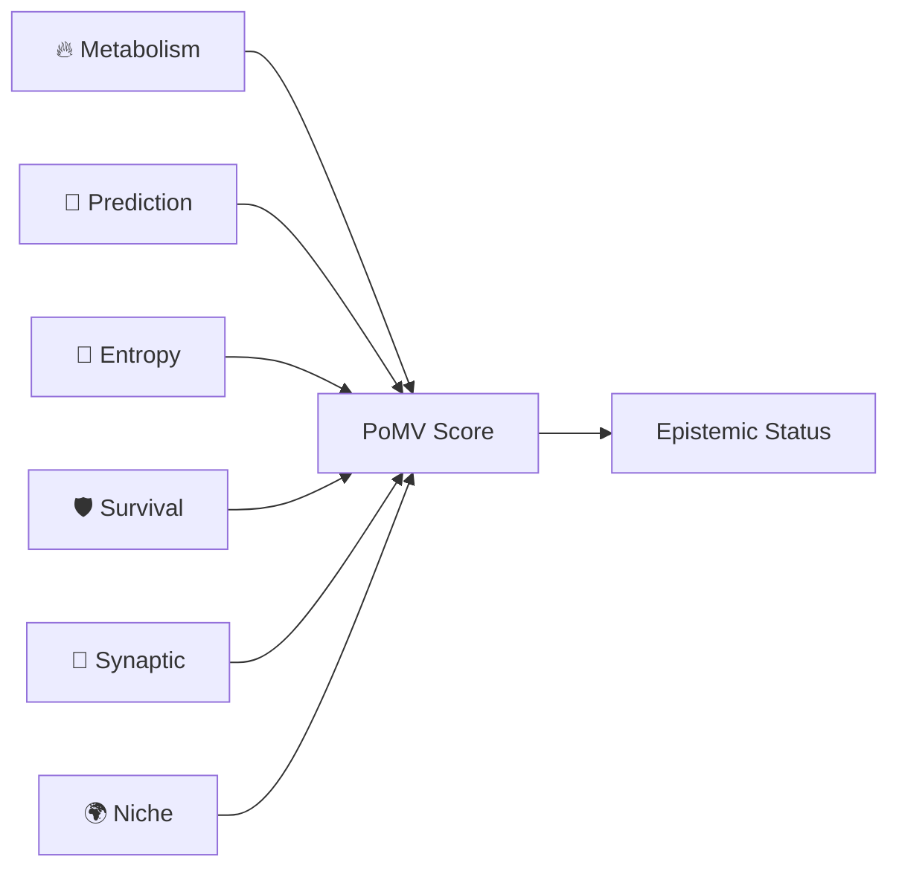
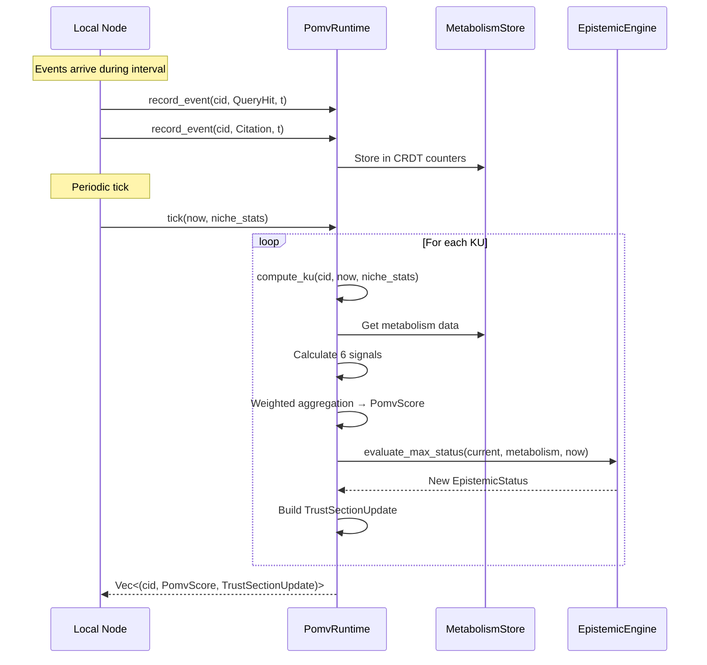

# PoK v2 Design — Proof of Metabolic Value (PoMV)

> **Tri thức không đúng hay sai — nó chỉ được thay thế bởi tri thức tốt hơn.**
> — OneBrain Philosophy

## §1 Overview

Proof of Knowledge v2 (PoK v2) uses **Proof of Metabolic Value (PoMV)** — a bio-inspired, observation-based mechanism to evaluate knowledge quality without voting, reputation systems, or blockchain.

### Core Principle: Observe, Don't Judge

Unlike PoK v1 (vote-based), PoMV **observes natural usage patterns** to determine knowledge value:

| PoK v1 (Obsolete) | PoMV v2 (Current) |
|---|---|
| Upvote/Downvote voting | Observable metabolism events |
| Community review panels | Automated epistemic transitions |
| Subjective quality scores | 6 objective signals |
| Token rewards | No cryptocurrency/blockchain |
| Central coordination | Fully decentralized (local computation) |

### Design Goals

1. **Observable**: Only measurable events count (queries, citations, retrievals)
2. **Decentralized**: Each node computes locally, no central authority
3. **Anti-fragile**: Challenges/refutations INCREASE engagement score
4. **CRDT-native**: All counters use grow-only CRDTs for conflict-free merging
5. **No subjectivity**: No votes, no reviews, no expert panels

---

## §2 The 6 PoMV Signals

PoMV aggregates 6 biological signals into a single score:



### Signal 1: Metabolism (Weight: 0.35)

**Source**: `metabolism.rs`, `metabolism_store.rs`

Measures real-world usage via CRDT-based counters:

| Event | Description | Counter |
|-------|-------------|---------|
| `QueryHit` | KU appeared in search results | `query_hits: GCounter` |
| `Retrieval { dwell_ms }` | KU was read (with dwell time) | `retrieval_count + dwell_time_ms` |
| `Citation` | Another KU cited this one | `citation_count` |
| `Derivative` | New KU derived from this one | `derivative_count` |
| `DownstreamUsage` | Citation chain is also used | `downstream_usage` |
| `Corroboration` | Explicit confirmation signal | `corroboration_count` |
| `Refutation` | Challenge/refutation (POSITIVE!) | `refutation_count` |

**Metabolic Rate** = weighted sum of all counters with exponential half-life decay:

$$M(t) = \sum_{i} w_i \cdot c_i \cdot 2^{-(t - t_{last}) / t_{half}}$$

Default half-life: 30 days (`DEFAULT_HALF_LIFE_SECS = 2,592,000`).

### Signal 2: Prediction (Weight: 0.15)

**Source**: `prediction.rs`

Measures whether the KU's predictions come true:

- KU can register predictions with timestamps
- When outcomes are confirmed/denied, prediction_score updates
- Correct predictions → higher score
- Failed predictions → lower score (but refutable ≠ worthless)

### Signal 3: Entropy (Weight: 0.10)

**Source**: `entropy.rs`

Measures information novelty at creation time:

$$E = novelty \cdot (1 + bridge\_bonus) \cdot decay(age)$$

- **Novelty**: How new/unique was this KU when created?
- **Bridge bonus**: Cross-domain connections increase entropy
- **Decay**: Novelty diminishes over time (entropy decay period: configurable)

### Signal 4: Survival (Weight: 0.10)

**Source**: `immune.rs`

Anti-fragility score — KUs that survive challenges are stronger:

- Tracks `attacks_survived` count
- Combined with `is_alive` (metabolic rate > 0)
- More attacks survived → higher survival score
- Dead KUs (zero metabolism) → survival = 0

### Signal 5: Synaptic Centrality (Weight: 0.15)

**Source**: `synaptic.rs`

Network importance via citation/reference bonds:

$$S = \frac{\sum strength_i}{\sqrt{bond\_count + 1}}$$

- Synaptic bonds form when KUs cite each other
- Bond strength increases with repeated interaction
- Bonds evaporate over time (periodic `evaporate()` call)
- Normalized to [0, 1]

### Signal 6: Niche Fitness (Weight: 0.15)

**Source**: `ecosystem.rs`

Ecological competition within knowledge domains (niches):

- Each KU belongs to one or more niches
- `NicheStats { population, total_metabolic_rate, avg_metabolic_rate, source_diversity }`
- KUs that perform above niche average → higher fitness
- Cross-niche KUs get bonus (knowledge diversity)

### Weighted Aggregation

```rust
pub struct PomvWeights {
    pub metabolism: f32,    // 0.35
    pub prediction: f32,   // 0.15
    pub entropy: f32,      // 0.10
    pub survival: f32,     // 0.10
    pub synaptic: f32,     // 0.15
    pub niche: f32,        // 0.15
}

// Final score
pomv_total = Σ(signal_i × weight_i)
```

---

## §3 Epistemic Status Ladder

PoMV score + metabolic activity drive epistemic transitions:

| Level | Status | Hex | Transition Condition |
|-------|--------|-----|---------------------|
| 0 | Rumor | 0x00 | Initial state |
| 1 | Hearsay | 0x01 | Minimum metabolic activity |
| 2 | Testimony | 0x02 | Sustained retrieval pattern |
| 3 | Observation | 0x03 | Multiple independent retrievals |
| 4 | Hypothesis | 0x04 | Citations from other KUs |
| 5 | Evidence | 0x05 | Cross-source corroboration |
| 6 | Corroborated | 0x06 | Multiple corroboration events |
| 7 | PeerReviewed | 0x07 | High synaptic centrality |
| 8 | Consensus | 0x08 | Niche-dominant + high PoMV |
| 9 | FormallyProven | 0x09 | Formal proof chain verified |
| 10 | Axiomatic | 0x0A | Foundational axiom (manual) |

**Transition Engine**: `epistemic_engine.rs`
- `evaluate_transition()`: Check if a single transition is possible
- `evaluate_max_status()`: Multi-jump — advance as far as thresholds allow in one tick

---

## §4 PomvRuntime — The Orchestrator

**Source**: `pomv_runtime.rs`

```rust
pub struct PomvRuntime {
    pub metabolism_store: MetabolismStore,
    pub ku_states: HashMap<[u8; 32], KUPomvState>,
    pub config: PomvConfig,
}
```

### Tick Cycle



### Key Methods

| Method | Description |
|--------|-------------|
| `register_ku(cid, created_at, niches, novelty, bridge)` | Register new KU |
| `record_event(cid, event, timestamp)` | Record metabolism event |
| `merge_remote_metabolism(cid, remote)` | CRDT merge from gossip |
| `compute_ku(cid, now, niche_stats)` | Compute single KU's PoMV |
| `tick(now, niche_stats)` | Full tick: compute all KUs |
| `gc(now)` | Remove dead KUs |
| `evaporate_bonds()` | Decay synaptic bonds |

### TrustSectionUpdate

Bridge struct from PomvRuntime → KuRuntime:

```rust
pub struct TrustSectionUpdate {
    pub epistemic_status: EpistemicStatus,
    pub metabolic_rate: u16,
    pub prediction_score: u16,
    pub entropy_at_creation: u16,
    pub survival_score: u16,
    pub synaptic_centrality: u16,
    pub niche_fitness: u16,
    pub pomv_total: f32,
}
```

Applied via `KuRuntime::apply_pomv_update(&mut self, update: &TrustSectionUpdate)`.

---

## §5 KuLifecycle — Full Integration

**Source**: `ku_lifecycle.rs`

`KuLifecycle` ties KuRuntime + PomvRuntime into a unified lifecycle:

```rust
pub struct KuLifecycle {
    pub kus: HashMap<[u8; 32], KuRuntime>,
    pub pomv: PomvRuntime,
}
```

| Method | Description |
|--------|-------------|
| `ingest(ku, niches, novelty, bridge, now)` | Register in both stores |
| `record_event(cid, event, now)` | Track metabolism |
| `tick(now, niche_stats)` | PoMV tick + apply updates to all KuRuntimes |
| `gc(now)` | GC dead KUs from both stores |

---

## §6 CRDT Design

All metabolism counters use **Grow-Only Counters (GCounter)**:

```rust
pub struct GCounter {
    counts: HashMap<u64, u64>,  // node_id → count
}
```

Properties:
- **Commutative**: merge(A, B) = merge(B, A)
- **Associative**: merge(merge(A, B), C) = merge(A, merge(B, C))
- **Idempotent**: merge(A, A) = A
- **Monotonic**: counter value can only increase
- **Conflict-free**: no coordination needed between nodes

Merge strategy: `merged[node] = max(local[node], remote[node])`

---

## §7 Module Map

| Module | Role |
|--------|------|
| `metabolism.rs` | MetabolismEvent, KUMetabolism, GCounter |
| `metabolism_store.rs` | MetabolismStore (multi-KU management) |
| `pomv.rs` | PomvCalculator, PomvSignals, PomvScore, PomvWeights |
| `pomv_runtime.rs` | PomvRuntime orchestrator |
| `epistemic_engine.rs` | Epistemic status transitions |
| `entropy.rs` | EntropyCalculator |
| `prediction.rs` | PredictionRegistry |
| `synaptic.rs` | SynapticMap, CentralityCalculator |
| `immune.rs` | ImmuneEngine (survival scoring) |
| `ecosystem.rs` | EcosystemAnalyzer, NicheStats |
| `eigentrust.rs` | EigenTrust computation |
| `spread_analysis.rs` | SpreadAnalysis |
| `ku_lifecycle.rs` | KuLifecycle (KuRuntime ↔ PomvRuntime) |
| `obt_integration.rs` | KU↔OBT bridge: builds FormulaInputs from PoMV scores |
| `obt_minting.rs` | Uses pomv_score for R1 owner reward calculation |

---

## §8 Design Decisions

| Decision | Choice | Rationale |
|----------|--------|-----------|
| No voting | PoMV observes usage | Voting is subjective and gameable |
| No blockchain | CRDT counters | Blockchain is heavy, slow, and centralizing |
| OBT utility token | Value = knowledge utility, not speculation | PoMV scores feed into OBT reward formula (R1). OBT token is a full utility token with Account-Chain ledger — see docs/specs/obt/ for complete specification |
| Anti-fragile | Refutation = positive | Challenged knowledge that survives is stronger |
| Local computation | Each node runs tick() | No central server, fully distributed |
| Half-life decay | 30 days default | Knowledge that stops being used naturally fades |

