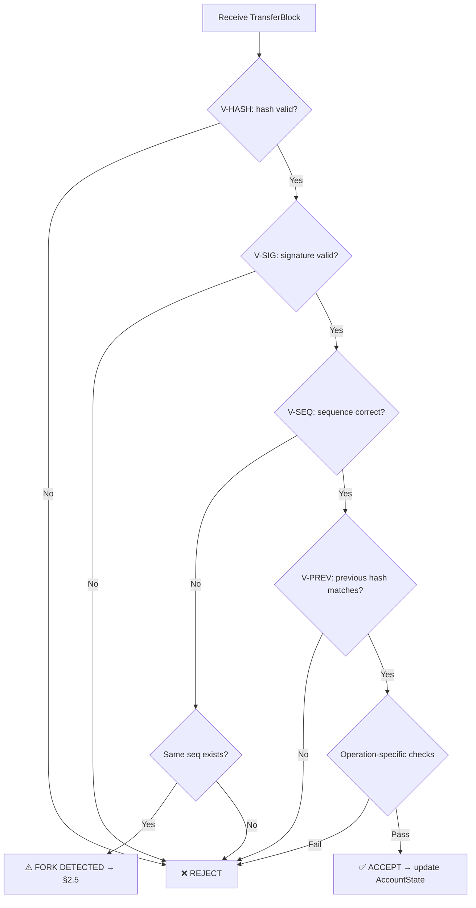

# §2 Account-Chain Ledger Architecture

> **OBT_SPEC §2** — Specification version: 1.0 | Last updated: 2026-06-30
>
> **Cross-references**: [§1 Token Economics](./01_TOKEN.md) · [§3 Minting & Rewards](./03_MINTING.md) · [§4 Anti-Gaming](./04_ANTI_GAMING.md) · [OBP_SPEC §5 Message Format](../OBP_SPEC.md)

---

## 2.1 Tại Sao Không Dùng CRDT Cho Balance — Why Not CRDTs

OBT balance represents **spendable value**. Any correct ledger must enforce the invariant
`balance ≥ 0` at all times, even under concurrent operations from partitioned replicas.
Four candidate CRDT families were evaluated and **all rejected** for authoritative balance:

### 2.1.1 G-Counter (Grow-only Counter)

```
merge(a, b) = max(a[i], b[i])  ∀ replica i
value = Σ counters[i]
```

- ✅ Monotonically increasing — perfect for analytics (total_earned, total_spent).
- ❌ **Cannot decrement.** A spend operation requires *reducing* the balance.
  G-Counter literally cannot represent spending.

### 2.1.2 PN-Counter (Positive-Negative Counter)

```
value = Σ P[i] - Σ N[i]
```

- ❌ **Allows overdraft under concurrency.** Two replicas may independently decrement
  below the intended floor:

```
Example — PNCounter overdraft:
  Replica A sees balance = 100, spends 80  →  A.local = 20
  Replica B sees balance = 100, spends 80  →  B.local = 20
  After CRDT merge:  P = 100, N = 80 + 80 = 160
  Effective balance = 100 - 160 = -60  ← INVALID (overdraft)
```

### 2.1.3 Bounded Counter (Baquero et al., 2014)

- Partitions a global budget across replicas; each replica may decrement only its local share.
- ❌ **Reintroduces coordination.** Replicas must transfer quota via explicit messages,
  which requires synchronous rounds — defeating the purpose of CRDTs.
- ❌ **Complexity.** Requires escrow protocol, transfer-of-rights messages, and recovery
  after crashes. Fundamentally incompatible with OBP's gossip-only model.

### 2.1.4 Conclusion — Account-Chain Model

| Approach | Spend? | Overdraft-safe? | Coordination-free? | Chosen? |
|----------|--------|-----------------|---------------------|---------|
| G-Counter | ❌ No | N/A | ✅ Yes | ❌ |
| PN-Counter | ✅ Yes | ❌ No | ✅ Yes | ❌ |
| Bounded Counter | ✅ Yes | ✅ Yes | ❌ No | ❌ |
| **Account-Chain** | ✅ Yes | ✅ Yes | ✅ Yes | ✅ |

**Solution**: Each account maintains its own **append-only chain** of `TransferBlock`s.
The account owner is the single writer; the chain is validated by DHT neighbors.
Inspired by the Nano block-lattice model, adapted for OBP's trust and CRDT infrastructure.

---

## 2.2 TransferBlock — Cấu Trúc Dữ Liệu Chính

Every mutation to an account's balance produces exactly one `TransferBlock`, appended to
that account's chain. The block is self-contained: it carries the *resulting* balance, a
back-link to the previous block, and an Ed25519 signature from the account owner.

```rust
/// A single entry in an account's append-only chain.
/// Wire size: 32+32+8+8+var+var+8+64+32 ≈ 240–320 bytes depending on operation.
pub struct TransferBlock {
    /// BLAKE3 hash of the previous block in this account's chain.
    /// [0u8; 32] for the genesis (Open) block.
    pub previous: [u8; 32],

    /// Ed25519 public key of the account owner.
    pub account: [u8; 32],

    /// Monotonically increasing sequence number. Open block = 0.
    /// MUST equal previous_block.sequence + 1.
    pub sequence: u64,

    /// Account balance AFTER this operation has been applied.
    /// Stored as an unsigned integer — overdraft is structurally impossible.
    pub balance: u64,

    /// The operation that produced this block.
    pub operation: TransferOp,

    /// Lamport-style vector clock for causal ordering across accounts.
    /// Merged on receive using component-wise max.
    pub clock: VectorClock,

    /// Wall-clock timestamp (Unix millis, UTC). Advisory — not used for ordering.
    pub timestamp: u64,

    /// Ed25519 signature over BLAKE3(previous ‖ account ‖ sequence ‖ balance
    ///   ‖ operation ‖ clock ‖ timestamp).
    pub signature: [u8; 64],

    /// BLAKE3 hash of all fields above (including signature).
    /// This is the block's unique identifier.
    pub block_hash: [u8; 32],
}
```

### 2.2.1 TransferOp Enum

```rust
pub enum TransferOp {
    /// Genesis block — opens the account. balance MUST be 0.
    Open,

    /// Credit OBT from a verified reward source.
    Mint {
        source: MintSource,
        amount: u64,
    },

    /// Debit OBT — creates a pending credit for `receiver`.
    Send {
        receiver: [u8; 32],  // Ed25519 pubkey of recipient
        amount: u64,
    },

    /// Claim a pending credit by referencing the sender's Send block.
    Receive {
        send_block_hash: [u8; 32],  // hash of the Send block being claimed
        amount: u64,
    },
}
```

### 2.2.2 MintSource Enum

Each `Mint` operation must declare its provenance. DHT validators use this to look up the
corresponding proof (see [§3 Minting & Rewards](./03_MINTING.md)).

```rust
pub enum MintSource {
    /// Reward for participating in Encoding Consensus as a verifier.
    /// See OBP_SPEC §4.5 and ENCODING_CONSENSUS_SPEC.
    EncodingReward {
        raw_hash: [u8; 32],       // BLAKE3 hash of the raw KU content
        role: VerifierRole,       // Primary | Secondary | Tiebreaker
    },

    /// Reward for KU value via Proof-of-Metabolism-Value.
    /// See §3.2 PoMV Reward.
    PomvReward {
        ku_cid: [u8; 32],        // Content ID of the rewarded KU
        epoch: u64,              // Epoch in which the reward was earned
    },

    /// Reward for provably storing KUs via PoS-KU challenge.
    /// See §3.3 Storage Reward.
    StorageReward {
        epoch: u64,
        challenge_hash: [u8; 32], // BLAKE3 hash of the challenge response
    },
}

pub enum VerifierRole {
    Primary,     // First claimer
    Secondary,   // Second claimer
    Tiebreaker,  // Third claimer (if needed)
}
```

### 2.2.3 Block Hash Computation

```
block_hash = BLAKE3(
    previous ‖ account ‖ sequence.to_le_bytes() ‖ balance.to_le_bytes()
    ‖ operation.canonical_bytes() ‖ clock.canonical_bytes()
    ‖ timestamp.to_le_bytes() ‖ signature
)
```

All multi-byte integers are encoded **little-endian**. The `canonical_bytes()` methods
produce deterministic serializations (field order fixed, no padding).

---

## 2.3 AccountState — Trạng Thái Tài Khoản (DHT-Cached)

To avoid replaying an entire account chain for every balance check, a compact
`AccountState` snapshot is cached on the DHT at the k=20 closest nodes to the
account's public key hash.

```rust
/// Compact account summary — cached on DHT, updated on every new block.
/// Wire size: 32+8+32+8+var+var ≈ 120–200 bytes.
pub struct AccountState {
    /// Ed25519 public key (also the DHT lookup key).
    pub pubkey: [u8; 32],

    /// Current spendable balance (from latest TransferBlock).
    pub balance: u64,

    /// BLAKE3 hash of the most recent TransferBlock in this account's chain.
    pub head: [u8; 32],

    /// Sequence number of the head block.
    pub sequence: u64,

    /// Cumulative OBT ever earned (G-Counter — analytics only, never authoritative).
    pub total_earned: GCounter,

    /// Cumulative OBT ever spent (G-Counter — analytics only, never authoritative).
    pub total_spent: GCounter,
}
```

> [!IMPORTANT]
> `total_earned` and `total_spent` are **informational G-Counters** used for analytics
> dashboards and protocol-level statistics. They are **not** used for balance enforcement.
> The authoritative balance is always `head_block.balance`.

### 2.3.1 AccountState Invariants

```
INVARIANT-AS1: balance == head_block.balance
INVARIANT-AS2: sequence == head_block.sequence
INVARIANT-AS3: head == head_block.block_hash
INVARIANT-AS4: total_earned.value() == Σ(amount) for all Mint + Receive blocks
INVARIANT-AS5: total_spent.value() == Σ(amount) for all Send blocks
```

---

## 2.4 Block Validation Rules — Quy Tắc Xác Thực

Every `TransferBlock` received via DHT gossip must pass **all** of the following checks
before a validating node accepts it into its local view of the account chain.

### 2.4.1 Universal Rules (all block types)

| Rule ID | Check | Failure Action |
|---------|-------|----------------|
| **V-SIG** | `Ed25519::verify(account, signing_payload, signature)` must succeed | Reject block |
| **V-SEQ** | `sequence == previous_block.sequence + 1` (or `0` for Open) | Reject block |
| **V-PREV** | `previous == previous_block.block_hash` (or `[0; 32]` for Open) | Reject block |
| **V-HASH** | Recomputed `BLAKE3(fields)` must equal `block_hash` | Reject block |
| **V-BAL** | `balance >= 0` (structurally guaranteed by `u64`, but checked on arithmetic) | Reject block |
| **V-TIME** | `timestamp` within `±300s` of validator's wall clock | Warn (soft) |
| **V-CLOCK** | `clock` must dominate or be concurrent with previous block's clock | Reject block |

### 2.4.2 Operation-Specific Rules

| Operation | Rule ID | Check |
|-----------|---------|-------|
| **Open** | **V-OPEN-BAL** | `balance == 0` and `sequence == 0` and `previous == [0; 32]` |
| **Open** | **V-OPEN-UNIQUE** | No existing chain for this `account` pubkey |
| **Mint** | **V-MINT-BAL** | `balance == previous.balance + amount` |
| **Mint** | **V-MINT-PROOF** | Valid `MintProof` exists on DHT with `K/N` witness signatures (K ≥ 2, N = 3) |
| **Mint** | **V-MINT-SOURCE** | `MintSource` variant matches the proof type (Encoding, PoMV, Storage) |
| **Send** | **V-SEND-BAL** | `balance == previous.balance - amount` and `amount > 0` |
| **Send** | **V-SEND-SELF** | `receiver != account` (no self-sends) |
| **Receive** | **V-RECV-BAL** | `balance == previous.balance + amount` |
| **Receive** | **V-RECV-EXISTS** | Referenced `send_block_hash` exists and is a valid `Send` block |
| **Receive** | **V-RECV-MATCH** | `amount` in Receive == `amount` in referenced Send |
| **Receive** | **V-RECV-DEST** | Referenced Send's `receiver` == this block's `account` |
| **Receive** | **V-RECV-ONCE** | No prior Receive block references the same `send_block_hash` |

### 2.4.3 Validation Flowchart



---

## 2.5 Fork Detection & Double-Spend Prevention — Phát Hiện Fork

### 2.5.1 Fork Definition

A **fork** occurs when two or more `TransferBlock`s share the same `(account, sequence)`
pair but have different `block_hash` values. This is the **only** mechanism by which a
malicious account owner can attempt a double-spend.

```
FORK ≡ ∃ B₁, B₂ :
    B₁.account == B₂.account
    ∧ B₁.sequence == B₂.sequence
    ∧ B₁.block_hash ≠ B₂.block_hash
```

### 2.5.2 Detection Mechanism

DHT neighbors (k=20 closest to the account's pubkey hash) store all blocks they observe.
When a neighbor receives block `B₂` and already holds `B₁` with the same
`(account, sequence)`:

1. **Flag fork** — both blocks are retained as evidence.
2. **Broadcast warrant** — a `ForkWarrant` is gossiped to the network.

### 2.5.3 Resolution: First-Seen + Deterministic Tiebreak

| Priority | Rule | Rationale |
|----------|------|-----------|
| 1st | **First-seen wins** | The block observed first by a supermajority of DHT neighbors is canonical. |
| 2nd | **Lower `block_hash` wins** | Deterministic tiebreak when no clear first-seen exists (e.g., simultaneous arrival). Byte-wise lexicographic comparison. |

```rust
fn canonical_block(b1: &TransferBlock, b2: &TransferBlock) -> &TransferBlock {
    // Assumes both have same (account, sequence)
    if b1.block_hash < b2.block_hash { b1 } else { b2 }
}
```

### 2.5.4 ForkWarrant — Bằng Chứng Gian Lận

```rust
/// Cryptographic proof that an account produced conflicting blocks.
/// Unforgeable: contains both signed blocks.
pub struct ForkWarrant {
    pub account: [u8; 32],
    pub block_a: TransferBlock,    // first conflicting block
    pub block_b: TransferBlock,    // second conflicting block
    pub issued_by: [u8; 32],      // pubkey of the detecting node
    pub issued_at: u64,           // timestamp
    pub warrant_sig: [u8; 64],    // detector's Ed25519 signature
}
```

### 2.5.5 Consequences of a Fork

| Action | Detail |
|--------|--------|
| **Non-canonical block rejected** | All Receive blocks referencing the rejected Send are also invalidated |
| **Trust slash** | Account's EigenTrust score reduced: `trust × 0.2` (80% slash, Tier 3 — see [§4 Anti-Gaming](./04_ANTI_GAMING.md)) |
| **Warrant persisted** | ForkWarrant stored on DHT with 180-day TTL for historical audit |
| **OBT NOT clawed back** | Previously confirmed blocks remain valid — OBT is non-punitive per OBT philosophy |

> [!CAUTION]
> A fork is **conclusive proof of malicious intent** — no honest node accidentally creates
> two blocks at the same sequence. The Ed25519 signature on each block proves the account
> owner authored both. There is no appeal for fork warrants.

---

## 2.6 Vẫn Dùng CRDT Ở Đâu — Where CRDTs Still Apply

While CRDTs are unsuitable for authoritative balance, they remain essential for
supporting infrastructure within the ledger subsystem:

| CRDT Type | Used For | Merge Semantics | Reference |
|-----------|----------|-----------------|-----------|
| **G-Counter** | `total_earned` per account | `max(a[i], b[i])` per replica | §2.3 |
| **G-Counter** | `total_spent` per account | `max(a[i], b[i])` per replica | §2.3 |
| **G-Counter** | Global OBT supply counter | Sum of all mint block amounts | [§3](./03_MINTING.md) |
| **ORSet** | Pending unreceived Send blocks | Add-wins semantics | §2.6.1 |
| **VectorClock** | Causal ordering between accounts | Component-wise max | §2.6.2 |
| **LWWRegister** | Account metadata (display name, avatar CID) | Last-writer-wins by timestamp | §2.6.3 |

### 2.6.1 Pending Sends (ORSet)

When a `Send` block is confirmed, its `block_hash` is added to the receiver's
`pending_receives: ORSet<[u8; 32]>`. When the receiver creates a corresponding `Receive`
block, the entry is removed. ORSet add-wins semantics ensure that concurrent gossip
from multiple DHT neighbors converges correctly.

### 2.6.2 Cross-Account Causal Ordering (VectorClock)

Each `TransferBlock` carries a `VectorClock`. When Alice sends to Bob:

```
Alice's Send block:  clock = { Alice: 5, Bob: 3 }
Bob's Receive block: clock = merge(Bob_prev.clock, Alice_send.clock) + {Bob: +1}
                           = { Alice: 5, Bob: 7 }
```

This establishes a **happens-before** relationship: Bob's Receive causally depends on
Alice's Send. Used for consistency checks and debugging, not for consensus.

### 2.6.3 Account Metadata (LWWRegister)

Non-financial account metadata (display name, avatar CID, preferred language) is stored
as `LWWRegister<AccountMeta>` on the DHT. Timestamp-based last-writer-wins is acceptable
here because metadata conflicts are non-critical and the account owner is the sole writer.

---

## 2.7 Balance Storage — Lưu Trữ Hybrid

OBT employs a three-layer storage architecture for account data:

| Layer | Storage Engine | Data Stored | Purpose |
|-------|---------------|-------------|---------|
| **L1 — Local** | redb (embedded) | Full account chain (all `TransferBlock`s) | Fast reads, offline operation |
| **L2 — DHT** | Kademlia (k=20) | `AccountState` snapshot | Remote verification, balance queries |
| **L3 — Merkle** | In-memory + persisted | State root hash | Global state summary, light clients |

### 2.7.1 L1 — Local Storage (redb)

Each node stores the **complete chain** for its own account(s) and a **cache** of recently
interacted accounts. redb provides ACID transactions, crash-safe writes, and zero-copy
reads.

```
Table: account_chains
  Key:   (account_pubkey: [u8;32], sequence: u64)
  Value: TransferBlock (serialized)

Table: account_states
  Key:   account_pubkey: [u8;32]
  Value: AccountState (serialized)
```

### 2.7.2 L2 — DHT Replication

`AccountState` is stored on the k=20 nodes closest (XOR distance) to
`BLAKE3(account_pubkey)`. Updated by the account owner after every new block.
DHT neighbors validate the new `AccountState` against the corresponding `TransferBlock`
before accepting the update.

### 2.7.3 L3 — Merkle State Root

A periodic (per-epoch) **Merkle root** is computed over all known `AccountState` entries,
sorted by `pubkey`:

```
state_root = MerkleRoot(
    sort_by_pubkey(all_account_states)
        .map(|as| BLAKE3(as.pubkey ‖ as.balance.to_le_bytes() ‖ as.head ‖ as.sequence.to_le_bytes()))
)
```

This root is gossiped for lightweight consistency checks. Two nodes can compare state
roots to detect divergence without exchanging full account data.

---

## 2.8 So Sánh Với Nano — Comparison with Nano Block-Lattice

| Aspect | OBT Account-Chain | Nano Block-Lattice |
|--------|-------------------|--------------------|
| **Structure** | Per-account append-only chain | Per-account chain (block-lattice) |
| **Consensus** | DHT neighbor validation (k=20) | Open Representative Voting (ORV), >66% weight quorum |
| **Double-spend** | Fork detection → first-seen + tiebreak → warrant → trust slash | Fork detection → ORV vote → cement |
| **Finality** | Probabilistic (DHT propagation, ~1–5s) | Deterministic (~0.2–1s, ORV quorum) |
| **Fees** | Zero (minting via proof-of-work analog: PoMV, PoS-KU) | Zero (proof-of-work for anti-spam) |
| **Supply** | Near-infinite (flow-controlled per epoch, no hard cap) | Fixed (133,248,297 XNO) |
| **Block types** | Open, Mint, Send, Receive | Send, Receive, Open, Change, Epoch (unified as State block) |
| **Cryptography** | Ed25519 + BLAKE3 | Ed25519 + BLAKE2b |
| **Minting** | Three sources (Encoding, PoMV, Storage) — continuous | Pre-mined, distributed via faucet (historical) |
| **Trust system** | Integrated EigenTrust — slash on fork | No built-in trust; relies on representative weight |
| **Storage backend** | redb (embedded) + DHT | LMDB (embedded) |
| **Global state** | Merkle root over AccountStates | Block-lattice DAG (each account's frontier) |
| **Causal ordering** | VectorClock in every block | Implicit (send → receive dependency) |
| **Anti-spam** | Trust-gated rate limits (see [§4](./04_ANTI_GAMING.md)) | Proof-of-work per transaction |
| **Account identity** | Ed25519 pubkey = account address | Ed25519 pubkey → nano_ address (Base32) |

> [!NOTE]
> OBT intentionally trades Nano's fast deterministic finality for a coordination-free
> design. OBP has no global consensus layer and no representatives — validation is
> purely local (DHT neighbors). This fits OBP's philosophy of **no central authority**,
> at the cost of slightly longer finality windows.

---

## 2.9 Hằng Số — Constants

| Constant | Value | Rationale |
|----------|-------|-----------|
| `ACCOUNT_CHAIN_DHT_K` | `20` | Replication factor for AccountState on DHT; balances availability vs. bandwidth |
| `MAX_TIMESTAMP_DRIFT_S` | `300` | 5-minute tolerance for wall-clock timestamps (V-TIME soft check) |
| `FORK_WARRANT_TTL_DAYS` | `180` | How long fork evidence is retained on DHT |
| `MINT_PROOF_WITNESS_K` | `2` | Minimum witnesses required for a MintProof (out of N=3) |
| `PENDING_SEND_TTL_DAYS` | `30` | Unreceived Send blocks expire from ORSet after 30 days |
| `MERKLE_ROOT_EPOCH_INTERVAL` | `1 epoch` | State root recomputed every epoch |
| `BLOCK_HASH_ALGO` | `BLAKE3` | Collision-resistant, fast (SIMD-accelerated), 256-bit output |
| `SIGNATURE_ALGO` | `Ed25519` | Deterministic, fast verification, 32-byte pubkey, 64-byte signature |

---

> **End of §2 — Account-Chain Ledger Architecture**
>
> Next: [§3 Minting & Rewards](./03_MINTING.md) — Emission formula, Encoding/PoMV/Storage reward sources, MintProof structure.
