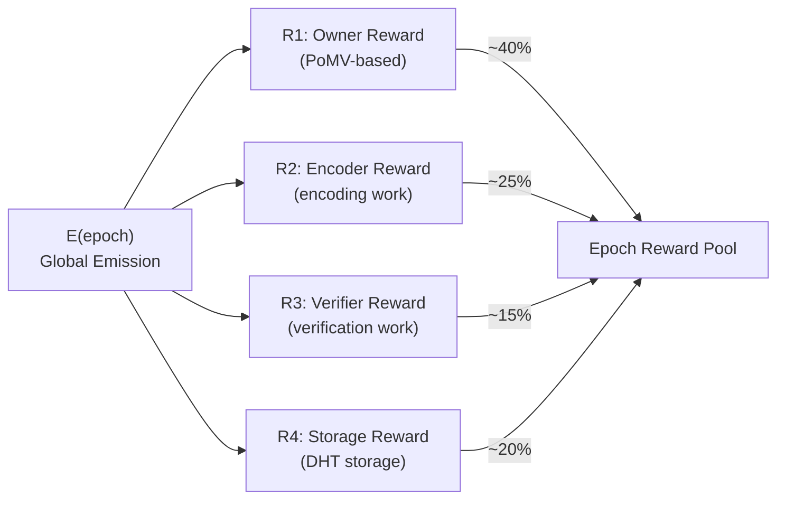
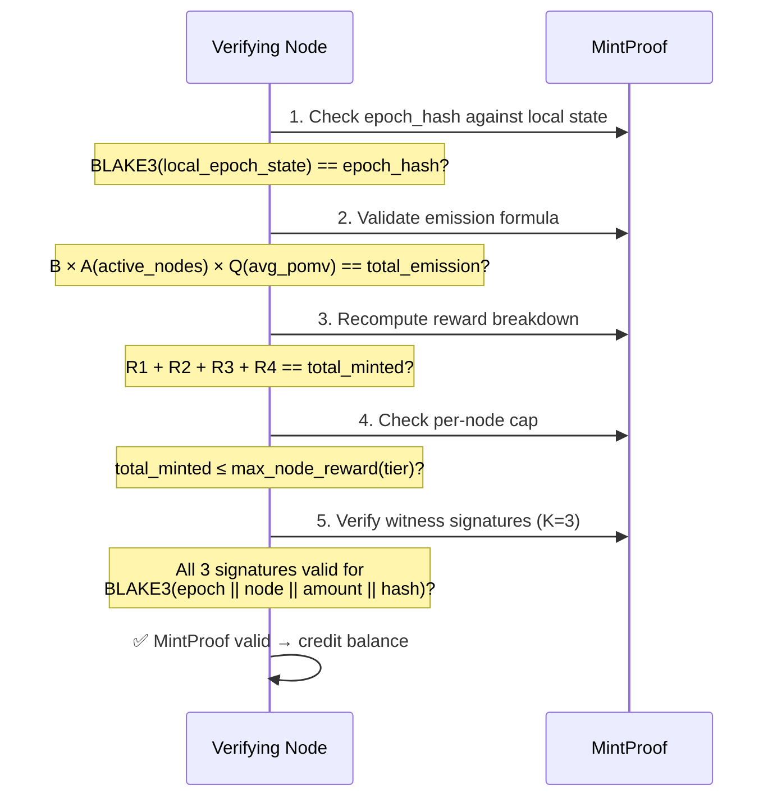
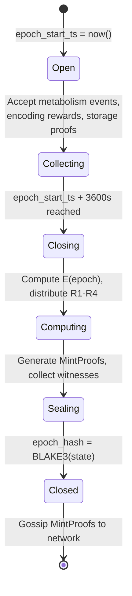

# §3 — Minting Model (Mô hình Đúc OBT)

> **OBT Specification v0.1** — OneBrain Protocol  
> **Status**: Draft  
> **Authors**: OneBrain Core Team  
> **Last Updated**: 2026-06-30  
> **Cross-references**: [`02_TOKEN.md`](./02_TOKEN.md), [`04_STORAGE_REWARD.md`](./04_STORAGE_REWARD.md), [`POK_V2_SPECIFICATION.md`](../POK_V2_SPECIFICATION.md)  
> **Source files**: [`pomv.rs`](../../../src/ku-core/src/pomv.rs), [`encoding_reward.rs`](../../../src/ku-core/src/encoding_reward.rs), [`eigentrust.rs`](../../../src/ku-core/src/eigentrust.rs), [`membership.rs`](../../../src/ku-net/src/membership.rs)

---

## Table of Contents

1. [Fundamental Principle — Minting as Output](#31-fundamental-principle--minting-as-output)
2. [Global Emission Formula](#32-global-emission-formula)
3. [Four Reward Streams (R1–R4)](#33-four-reward-streams-r1r4)
4. [Per-Node Reward Cap](#34-per-node-reward-cap)
5. [MintProof Structure](#35-mintproof-structure)
6. [Epoch Definition](#36-epoch-definition)
7. [Reconciliation with Near-Infinite Supply](#37-reconciliation-with-near-infinite-supply)

---

## 3.1 Fundamental Principle — Minting as Output

> **OBT minting is the OUTPUT of consensus, never the INPUT.**

No participant "requests" minting. No transaction says "mint me X tokens." Instead, minting occurs as a deterministic consequence of verified work observed by the network during an epoch. The causal chain is:

```
Knowledge contributed → Encoded → Verified → Used → PoMV scored → Epoch closes → Mint
```

This is philosophically and mechanically opposite to both:

| Model | Who decides? | OBT difference |
|---|---|---|
| **Bitcoin PoW** | Miner finds nonce → requests block reward | OBT: network observes value, no request needed |
| **Ethereum PoS** | Validator proposes block → earns fee + tip | OBT: no block proposal, reward from KU lifecycle |
| **Filecoin** | Miner submits storage proof → requests reward | OBT: storage proof is ONE of FOUR streams |

### Nguyên tắc bất biến (Invariants)

1. **No self-minting**: A node cannot mint tokens for itself by unilateral action.
2. **Deterministic**: Given identical epoch state, all honest nodes compute identical mint amounts.
3. **Verifiable**: Every minted OBT is accompanied by a `MintProof` (§3.5) that any node can validate independently.
4. **Bounded**: Per-epoch emission is capped by a global formula (§3.2) AND per-node caps (§3.4).

---

## 3.2 Global Emission Formula

### Công thức phát hành toàn cục

The total OBT emitted per epoch is governed by three factors:

```
E(epoch) = B × A(epoch) × Q(epoch)
```

Where:

| Symbol | Name | Formula | Unit |
|---|---|---|---|
| `B` | Base emission rate | `10,000` (governance-adjustable) | OBT/epoch |
| `A` | Network activity scale | `min(active_nodes / 1000, 10.0)` | dimensionless [0.0, 10.0] |
| `Q` | Average knowledge quality | `Σ PoMV(ku) / \|KU_set\|` | dimensionless [0.0, 1.0] |

### Constants

```rust
/// Base emission per epoch (governance-adjustable via supermajority vote).
/// Rationale: 10,000 OBT/epoch ≈ 240K OBT/day at 24 epochs/day.
/// Comparable to early-stage token emissions in Filecoin/Arweave.
pub const BASE_EMISSION_PER_EPOCH: u64 = 10_000;

/// Denominator for network activity scale.
/// 1,000 nodes = A(epoch) = 1.0 → full base emission.
/// Below 1,000 nodes: emission scales down linearly (bootstrapping protection).
/// Above 10,000 nodes: A is capped at 10.0 (prevents runaway emission).
pub const ACTIVITY_SCALE_DENOMINATOR: u64 = 1_000;

/// Maximum activity scale factor.
pub const ACTIVITY_SCALE_MAX: f64 = 10.0;
```

### Worked Examples

| Scenario | `active_nodes` | `avg_PoMV` | `A(epoch)` | `Q(epoch)` | `E(epoch)` |
|---|---|---|---|---|---|
| **Early network** | 100 | 0.50 | 0.10 | 0.50 | **500 OBT** |
| **Growing** | 500 | 0.60 | 0.50 | 0.60 | **3,000 OBT** |
| **Baseline** | 1,000 | 0.70 | 1.00 | 0.70 | **7,000 OBT** |
| **Mature** | 5,000 | 0.80 | 5.00 | 0.80 | **40,000 OBT** |
| **At scale** | 10,000 | 0.90 | 10.00 | 0.90 | **90,000 OBT** |
| **Capped scale** | 50,000 | 0.95 | 10.00 | 0.95 | **95,000 OBT** |

> [!NOTE]
> The `A(epoch)` cap at 10.0 means that beyond 10,000 active nodes, emission grows only through quality improvement (`Q`), not participant count. This is intentional — it rewards depth of knowledge value over breadth of participation.

### Pseudocode

```rust
fn global_emission(active_nodes: u64, ku_pomv_scores: &[f32]) -> f64 {
    let a = (active_nodes as f64 / ACTIVITY_SCALE_DENOMINATOR as f64)
        .min(ACTIVITY_SCALE_MAX);

    let q = if ku_pomv_scores.is_empty() {
        0.0
    } else {
        ku_pomv_scores.iter().map(|&s| s as f64).sum::<f64>()
            / ku_pomv_scores.len() as f64
    };

    BASE_EMISSION_PER_EPOCH as f64 * a * q
}
```

---

## 3.3 Four Reward Streams (R1–R4)

The global emission `E(epoch)` is distributed across **four independent reward streams**. Each stream rewards a different type of contribution to the network.



> [!IMPORTANT]
> The percentage split is a **soft target** controlled by governance. The actual split varies epoch-to-epoch based on relative activity in each stream. The ratios above are the initial default weights.

### Stream allocation formula

```rust
/// Default stream weights (governance-adjustable, must sum to 1.0).
pub const STREAM_WEIGHTS: [f64; 4] = [
    0.40,  // R1: Owner (PoMV-based)
    0.25,  // R2: Encoder
    0.15,  // R3: Verifier
    0.20,  // R4: Storage
];

fn stream_budget(epoch_emission: f64, stream_idx: usize) -> f64 {
    epoch_emission * STREAM_WEIGHTS[stream_idx]
}
```

---

### 3.3.1 R1 — Owner Reward (PoMV-based)

**Purpose**: Reward knowledge owners whose KUs demonstrate genuine metabolic value.

**Source**: [`pomv.rs`](../../../src/ku-core/src/pomv.rs) — `PomvCalculator::to_reward()`

#### Formula

```
R1(owner, epoch) = pomv_score × max_reward_per_epoch
```

Where:
- `pomv_score` ∈ [0.0, 1.0] — the composite PoMV score for the KU, computed from 6 weighted signals (see [`POK_V2_SPECIFICATION.md`](../POK_V2_SPECIFICATION.md))
- `max_reward_per_epoch` = `R1_budget / active_ku_count`

#### PoMV Signal Weights

From `pomv.rs` — `DEFAULT_WEIGHTS`:

| Signal | Weight | Source Module |
|---|---|---|
| Metabolism (usage rate) | **0.35** | `metabolism.rs` |
| Prediction accuracy | **0.15** | `prediction.rs` |
| Entropy / novelty | **0.10** | `entropy.rs` |
| Survival (anti-fragile) | **0.10** | `immune.rs` |
| Synaptic centrality | **0.15** | `synaptic.rs` |
| Niche fitness | **0.15** | `ecosystem.rs` |

#### Key Properties

- **Proportional to actual usage**: A KU that nobody reads earns 0 OBT. A KU cited 100 times earns proportionally more.
- **Self-balancing**: The `metabolism` signal decays with half-life (`DEFAULT_HALF_LIFE_SECS`), so stale knowledge naturally earns less.
- **Multi-dimensional**: A KU cannot game R1 by inflating only one signal — all 6 contribute.

#### Implementation Reference

```rust
// From pomv.rs line 162-166:
pub fn to_reward(pomv_score: f32, max_reward_per_epoch: f64) -> f64 {
    pomv_score as f64 * max_reward_per_epoch
}
```

---

### 3.3.2 R2 — Encoder Reward

**Purpose**: Reward AI nodes that perform the computational work of encoding raw knowledge into structured KU format.

**Source**: [`encoding_reward.rs`](../../../src/ku-core/src/encoding_reward.rs)

#### Constants

```rust
// From encoding_reward.rs:
pub const BASE_OBT_PER_KB: u64 = 1;         // 1 OBT per KB of raw text
pub const FIRST_ENCODER_BONUS: u64 = 5;      // Bonus for encoding first
pub const PRO_BONO_BONUS: u64 = 10;          // Bonus for helping AI-less users
pub const CORRECTOR_MULTIPLIER: u64 = 3;     // 3× for finding & fixing errors
```

#### Role Multipliers

| Role | Formula | Rationale |
|---|---|---|
| **Contributor** | `0` (rewarded via R1/PoMV) | Knowledge owner is paid through value lifecycle, not encoding |
| **FirstEncoder** | `base × 2 + FIRST_ENCODER_BONUS + (base if selected)` | Incentivizes fast encoding, extra if their version wins consensus |
| **Verifier** | `base + (base/2 if selected)` | Lower rate — verification is cheaper than initial encoding |
| **Corrector** | `base × CORRECTOR_MULTIPLIER` | Highest rate — error detection is the most valuable encoding work |
| **ProBono** | `base × 2 + PRO_BONO_BONUS` | Community service bonus for helping users without local AI |

#### Worked Example: 2 KB raw text (`base = 2 OBT`)

| Role | Selected? | Reward | Breakdown |
|---|---|---|---|
| Contributor | — | **0 OBT** | Paid via PoMV |
| FirstEncoder | No | **9 OBT** | 2×2 + 5 |
| FirstEncoder | Yes | **11 OBT** | 2×2 + 5 + 2 |
| Verifier | No | **2 OBT** | 2 |
| Verifier | Yes | **3 OBT** | 2 + 1 |
| Corrector | — | **6 OBT** | 2×3 |
| ProBono | — | **14 OBT** | 2×2 + 10 |

---

### 3.3.3 R3 — Verifier Reward

**Purpose**: Reward nodes that participate in encoding consensus verification.

> [!NOTE]
> In the current implementation, R3 is **merged with R2** in `encoding_reward.rs`. The `VerifierRole::Verifier` variant handles verification rewards using the same formula engine. This section documents the logical separation for future unbundling.

#### Formula

```
R3(verifier, ku) = base_reward + selection_bonus

base_reward = max(raw_size_bytes / 1024, 1) × BASE_OBT_PER_KB
selection_bonus = base_reward / 2   (only if this verifier's encoding was selected)
```

#### Verification Requirements

For a verifier reward to be valid:
1. The verifier must have submitted an independent encoding or confirmation within the consensus window.
2. The verifier's encoding must have been compared against at least one other encoding (no self-verification).
3. The verifier's node must have `eigentrust_score ≥ MIN_TRUST` (from [`eigentrust.rs`](../../../src/ku-core/src/eigentrust.rs): `MIN_TRUST = 0.001`).

---

### 3.3.4 R4 — Storage Reward

**Purpose**: Reward nodes that reliably store KU objects on the DHT and pass Proof-of-Storage challenges.

> [!IMPORTANT]
> R4 is a new reward stream with a dedicated specification. Full protocol details — including the PoS-KU challenge protocol, anti-gaming layers, and comparison with Filecoin/Arweave — are documented in [`04_STORAGE_REWARD.md`](./04_STORAGE_REWARD.md).

#### Brief Overview

```
storage_reward(node, epoch) = Σ per stored KU:
    STORAGE_BASE_RATE × size_w × rarity_w × demand_w × duration_f × trust_f
```

| Factor | Range | Purpose |
|---|---|---|
| `STORAGE_BASE_RATE` | 0.001 OBT/KU/epoch | Base payment per KU stored |
| `size_w` | [0.1, 10.0] | Larger KUs cost more to store |
| `rarity_w` | [0.5, 3.0] | Under-replicated KUs earn more |
| `demand_w` | [0.1, 5.0] | Frequently accessed KUs earn more |
| `duration_f` | [0.0, 2.0] | Long-term storage earns loyalty bonus |
| `trust_f` | [0.0, 1.0] | Higher EigenTrust = higher multiplier |

→ **Full specification**: [`04_STORAGE_REWARD.md`](./04_STORAGE_REWARD.md)

---

## 3.4 Per-Node Reward Cap

### Giới hạn phần thưởng mỗi node

To prevent any single node from capturing a disproportionate share of epoch emission, a **per-node reward cap** is enforced:

```
max_node_reward(epoch) = E(epoch) / active_nodes × TrustMultiplier(tier)
```

#### Trust Multiplier by Node Tier

From [`membership.rs`](../../../src/ku-net/src/membership.rs) — `NodeTier` enum:

| NodeTier | `repr(u8)` | Promotion Threshold | Trust Multiplier | Max Share of `E(epoch)` |
|---|---|---|---|---|
| `Leaf` | 0 | 0.00 | **0.10** | 10% of fair share |
| `Contributor` | 1 | 0.30 | **0.50** | 50% of fair share |
| `LocalSP` | 2 | 0.60 | **1.00** | 100% of fair share |
| `RegionalSP` | 3 | 0.75 | **1.20** | 120% of fair share |
| `CountrySP` | 4 | 0.85 | **1.50** | 150% of fair share |
| `ContinentalSP` | 5 | 0.92 | **1.80** | 180% of fair share |
| `GlobalBackbone` | 6 | 0.97 | **2.00** | 200% of fair share |

#### Rationale

- **Leaf nodes** (new, unproven) can earn at most 10% of the "fair share" — this prevents Sybil attacks where an attacker spins up thousands of Leaf nodes.
- **LocalSP+ nodes** earn full fair share or more — these nodes have demonstrated long-term value through the EigenTrust/promotion system.
- **GlobalBackbone nodes** can earn up to 2× fair share — these are the most trusted, highest-uptime nodes and deserve premium compensation.

#### Pseudocode

```rust
fn trust_multiplier(tier: NodeTier) -> f64 {
    match tier {
        NodeTier::Leaf           => 0.10,
        NodeTier::Contributor    => 0.50,
        NodeTier::LocalSP        => 1.00,
        NodeTier::RegionalSP     => 1.20,
        NodeTier::CountrySP      => 1.50,
        NodeTier::ContinentalSP  => 1.80,
        NodeTier::GlobalBackbone => 2.00,
    }
}

fn max_node_reward(epoch_emission: f64, active_nodes: u64, tier: NodeTier) -> f64 {
    let fair_share = epoch_emission / active_nodes as f64;
    fair_share * trust_multiplier(tier)
}
```

#### Overflow Handling

If a node's computed rewards (R1 + R2 + R3 + R4) exceed `max_node_reward`, the excess is **redistributed** to other eligible nodes in the same epoch, proportional to their uncapped rewards. No OBT is burned or lost.

---

## 3.5 MintProof Structure

### Cấu trúc bằng chứng đúc token

Every minted OBT batch is accompanied by a `MintProof` — a self-contained, independently verifiable proof that the minting was legitimate.

```rust
/// Proof that a specific OBT minting is legitimate.
///
/// Any node can verify a MintProof by:
/// 1. Checking the epoch_hash matches the local epoch state
/// 2. Recomputing rewards from the referenced KU CIDs and PoMV scores
/// 3. Verifying the witness signatures (K=3 random witnesses)
/// 4. Confirming total_minted ≤ E(epoch) for that epoch
#[derive(Debug, Clone, Serialize, Deserialize)]
pub struct MintProof {
    // ── Epoch Context ────────────────────────────────────────────────
    /// Epoch number (monotonically increasing, starting from 0).
    pub epoch_number: u64,

    /// BLAKE3 hash of the epoch state snapshot at close.
    /// Includes: active_nodes, KU set, PoMV scores, membership table.
    pub epoch_hash: [u8; 32],

    /// Unix timestamp when the epoch opened (seconds).
    pub epoch_start_ts: u64,

    /// Unix timestamp when the epoch closed (seconds).
    pub epoch_end_ts: u64,

    // ── Emission Parameters ──────────────────────────────────────────
    /// Global emission for this epoch: E(epoch) = B × A × Q.
    pub total_emission: u64,

    /// Active node count used in A(epoch) computation.
    pub active_nodes: u64,

    /// Average PoMV score used in Q(epoch) computation.
    pub avg_pomv: f32,

    // ── Recipient ────────────────────────────────────────────────────
    /// Node ID receiving this mint.
    pub recipient_node_id: u64,

    /// Ed25519 public key of the recipient node.
    pub recipient_pubkey: [u8; 32],

    /// NodeTier of the recipient at epoch close.
    pub recipient_tier: u8,

    // ── Reward Breakdown ─────────────────────────────────────────────
    /// Total OBT minted for this recipient in this epoch.
    pub total_minted: u64,

    /// R1 (Owner/PoMV) reward amount.
    pub r1_owner_reward: u64,

    /// R2 (Encoder) reward amount.
    pub r2_encoder_reward: u64,

    /// R3 (Verifier) reward amount.
    pub r3_verifier_reward: u64,

    /// R4 (Storage) reward amount.
    pub r4_storage_reward: u64,

    // ── Evidence ─────────────────────────────────────────────────────
    /// CIDs of KUs that contributed to R1 (PoMV rewards).
    pub r1_ku_cids: Vec<[u8; 32]>,

    /// CIDs of KUs that contributed to R2 (encoding work).
    pub r2_ku_cids: Vec<[u8; 32]>,

    /// CIDs of KUs stored for R4 (storage rewards).
    pub r4_ku_cids: Vec<[u8; 32]>,

    /// Number of PoS-KU challenges passed this epoch (for R4).
    pub storage_challenges_passed: u32,

    // ── Witness Attestation ──────────────────────────────────────────
    /// K=3 random witness nodes who independently verified this mint.
    /// Selected via: BLAKE3(epoch_hash || recipient_node_id) mod active_nodes.
    pub witness_node_ids: [u64; 3],

    /// Ed25519 signatures from each witness over:
    /// BLAKE3(epoch_number || recipient_node_id || total_minted || epoch_hash)
    pub witness_signatures: [[u8; 64]; 3],
}
```

### Verification Algorithm



---

## 3.6 Epoch Definition

### Định nghĩa Epoch

```rust
/// Duration of one OBT epoch in seconds.
///
/// Rationale:
/// - 1 hour balances reward responsiveness vs. computation overhead.
/// - Too short (e.g., 10 min): excessive MintProof generation, gossip overhead.
/// - Too long (e.g., 24 hr): delayed reward feedback, poor UX.
/// - 1 hour ≈ typical knowledge creation/consumption cycle.
///
/// Governance-adjustable with 72-hour delay (anti-shock).
pub const OBT_EPOCH_DURATION_S: u64 = 3_600; // 1 hour
```

#### Derived Constants

| Constant | Value | Derivation |
|---|---|---|
| `EPOCHS_PER_DAY` | 24 | 86,400 / 3,600 |
| `EPOCHS_PER_WEEK` | 168 | 24 × 7 |
| `EPOCHS_PER_YEAR` | 8,760 | 24 × 365 |
| `MAX_DAILY_EMISSION` | 2,280,000 OBT | 95,000 × 24 (at-scale ceiling) |
| `MAX_YEARLY_EMISSION` | ~832M OBT | 95,000 × 8,760 (theoretical maximum) |

#### Epoch Lifecycle



#### Epoch Boundary Rules

1. **Strict timing**: Epoch boundaries are at exact multiples of `OBT_EPOCH_DURATION_S` from the genesis timestamp. No drift.
2. **Event attribution**: A metabolism event at timestamp `t` belongs to epoch `floor((t - genesis_ts) / OBT_EPOCH_DURATION_S)`.
3. **Grace period**: Events arriving up to 30 seconds after epoch close are attributed to the closing epoch (network delay tolerance).
4. **No retroactive minting**: Once an epoch is sealed (epoch_hash computed), its MintProofs are final.

---

## 3.7 Reconciliation with Near-Infinite Supply

### Hòa giải với nguồn cung "gần vô hạn"

OBT has **no hard cap on total supply**. This is a deliberate, fundamental design choice.

#### Why No Hard Cap?

| Property | Bitcoin (21M cap) | OBT (no cap) |
|---|---|---|
| **Supply model** | Deflationary, asymptotic | Inflationary, controlled flow |
| **Scarcity source** | Artificial numerical limit | Natural — knowledge usage determines value |
| **Long-term incentive** | Transaction fees must replace block rewards | Minting always rewards contribution |
| **Failure mode** | Fee market may not sustain security | Over-emission → governance reduces `B` |

#### The River Analogy (Phép ẩn dụ dòng sông)

OBT supply is like a **river**, not a **lake**:

- **Lake** (Bitcoin): Fixed volume of water. As people take water, less remains. Scarcity drives value.
- **River** (OBT): No total water limit, but the **flow rate** is controlled. The dam (emission formula) ensures the river never floods (hyperinflation) and never dries up (deflation spiral).

```
┌─────────────────────────────────────────────────┐
│                    RIVER (OBT)                  │
│                                                 │
│  Source: Knowledge value creation (unlimited)   │
│     ↓                                           │
│  Dam: E(epoch) = B × A × Q  (flow control)     │
│     ↓                                           │
│  River: Circulating supply (grows steadily)     │
│     ↓                                           │
│  Delta: Token usage, burn, governance           │
│                                                 │
│  Key: No total limit, but RATE is bounded.      │
│  At max scale: ≤ 95,000 OBT/epoch             │
│  That's the width of the dam gate.              │
└─────────────────────────────────────────────────┘
```

#### Flow Rate Controls

1. **Per-epoch cap**: `E(epoch)` is bounded by `B × 10.0 × 1.0 = 100,000 OBT/epoch` maximum.
2. **Per-node cap**: No single node can earn more than `2× fair_share` (§3.4).
3. **Quality gate**: `Q(epoch)` naturally suppresses emission when knowledge quality is low.
4. **Governance override**: The community can vote to adjust `B` up or down with 72-hour delay.
5. **Natural decay**: As knowledge becomes stale (metabolism decays), its contribution to `Q` drops, reducing emission.

#### Supply Projection

| Year | Assumed Scenario | Approx. Annual Emission | Cumulative Supply |
|---|---|---|---|
| 1 | 500 nodes, Q=0.5 | ~21.9M OBT | ~21.9M |
| 2 | 2,000 nodes, Q=0.6 | ~105.1M OBT | ~127M |
| 3 | 5,000 nodes, Q=0.7 | ~306.6M OBT | ~434M |
| 5 | 10,000 nodes, Q=0.8 | ~700.8M OBT | ~1.8B |
| 10 | 10,000+ nodes, Q=0.85 | ~744.6M OBT | ~5.5B |

> [!WARNING]
> These projections are illustrative only. Actual emission depends on real network participation and knowledge quality. Governance can adjust `B` at any time.

#### Inflation Rate Behavior

The **inflation rate** (new supply / existing supply) naturally decreases over time even without a hard cap:

```
Year 1: 21.9M / 21.9M     = 100%   (bootstrapping)
Year 2: 105M / 127M        = 82.7%  (growing)
Year 3: 307M / 434M        = 70.7%  (maturing)
Year 5: 701M / 1,800M      = 38.9%  (stable)
Year 10: 745M / 5,500M     = 13.5%  (asymptotically declining)
```

This mirrors real economic systems where monetary base grows, but the growth rate stabilizes. The key insight: **value is determined by knowledge utility, not by artificial scarcity**.

---

> **Next**: [`04_STORAGE_REWARD.md`](./04_STORAGE_REWARD.md) — Full specification of the R4 Storage Reward Protocol, including PoS-KU challenges and anti-gaming mechanisms.
