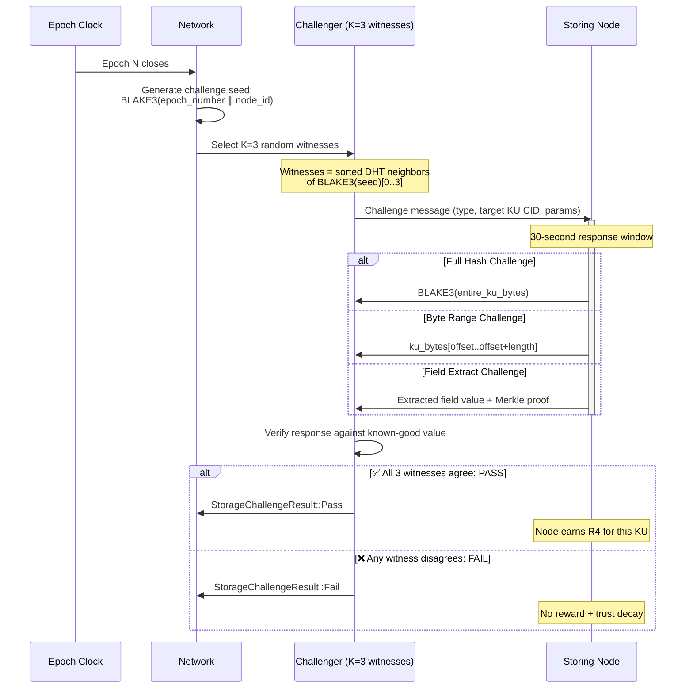
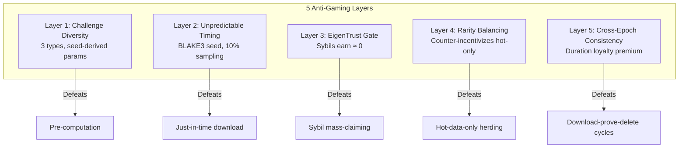

# §4 — Storage Reward Protocol (Giao thức Phần thưởng Lưu trữ)

> **OBT Specification v0.1** — OneBrain Protocol  
> **Status**: Draft  
> **Authors**: OneBrain Core Team  
> **Last Updated**: 2026-06-30  
> **Cross-references**: [`03_MINTING.md`](./03_MINTING.md) §3.3.4, [`POK_V2_SPECIFICATION.md`](../POK_V2_SPECIFICATION.md)  
> **Source files**: [`eigentrust.rs`](../../../src/ku-core/src/eigentrust.rs), [`membership.rs`](../../../src/ku-net/src/membership.rs)  
> **Inspiration**: Sia Merkle proofs, Arweave random recall, Filecoin WindowPoSt

---

## Table of Contents

1. [Overview](#41-overview)
2. [Storage Factor Formula](#42-storage-factor-formula)
3. [PoS-KU Challenge Protocol](#43-pos-ku-challenge-protocol)
4. [Anti-Gaming Storage (5 Layers)](#44-anti-gaming-storage-5-layers)
5. [Comparison: Why Not Filecoin/Arweave](#45-comparison-why-not-filecoinarweave)

---

## 4.1 Overview

### Tổng quan

**R4 (Storage Reward)** compensates nodes that reliably store Knowledge Unit (KU) objects on the OneBrain DHT. Unlike R1–R3 which reward knowledge *creation* and *encoding*, R4 rewards knowledge *persistence* — the ongoing cost of keeping data available for retrieval.

#### Design Principles

1. **Verifiable**: Every storage claim must be proven via cryptographic challenge-response (PoS-KU), not merely declared.
2. **Proportional**: Larger, rarer, more-demanded KUs earn more reward — reflecting their true storage cost and value.
3. **Loyalty-rewarding**: Nodes that store KUs for long periods earn a duration bonus — this discourages churn.
4. **Trust-gated**: Only nodes with positive EigenTrust scores earn meaningful storage rewards — Sybils earn almost nothing.
5. **Challenge-driven**: Inspired by Sia's Merkle proofs and Arweave's Succinct Proofs of Random Access (SPoRA).

#### Position in Reward Architecture

```
E(epoch) × STREAM_WEIGHTS[3]  →  R4 budget
                                    ↓
                            Distributed to nodes that:
                            ✅ Store KU objects on DHT
                            ✅ Pass PoS-KU challenges
                            ✅ Have EigenTrust > MIN_TRUST
```

---

## 4.2 Storage Factor Formula

### Công thức hệ số lưu trữ

The storage reward for a single node in a single epoch is the sum of rewards across all KUs that node stores:

```
storage_reward(node, epoch) = Σ for each stored KU:
    STORAGE_BASE_RATE × size_w × rarity_w × demand_w × duration_f × trust_f
```

### Constants

```rust
/// Base reward rate per KU per epoch.
///
/// Rationale: At 0.001 OBT/KU/epoch, a node storing 1,000 KUs earns
/// ~1 OBT/epoch baseline before multipliers. This is intentionally low
/// to prevent storage-farming from dominating knowledge-creation rewards.
pub const STORAGE_BASE_RATE: f64 = 0.001; // OBT/KU/epoch

/// Replication target: desired number of replicas per KU on the DHT.
/// Used as the numerator in rarity_w computation.
pub const K_TARGET: u32 = 20;

/// Maximum size weight (prevents single huge KU from dominating).
pub const SIZE_WEIGHT_MAX: f64 = 10.0;

/// Minimum size weight (even tiny KUs have some storage cost).
pub const SIZE_WEIGHT_MIN: f64 = 0.1;

/// Maximum rarity weight (prevents over-rewarding extremely rare KUs
/// that may be rare simply because they are worthless).
pub const RARITY_WEIGHT_MAX: f64 = 3.0;

/// Minimum rarity weight (common KUs still earn something).
pub const RARITY_WEIGHT_MIN: f64 = 0.5;

/// Maximum demand weight (prevents metabolism-bombing from inflating storage rewards).
pub const DEMAND_WEIGHT_MAX: f64 = 5.0;

/// Minimum demand weight (unused KUs still earn minimal storage reward).
pub const DEMAND_WEIGHT_MIN: f64 = 0.1;

/// Maximum duration factor (loyalty cap at 2× after 100 epochs ≈ 4.2 days).
pub const DURATION_FACTOR_MAX: f64 = 2.0;

/// Number of epochs to reach maximum duration factor.
pub const DURATION_MATURITY_EPOCHS: u64 = 100;
```

### Factor Breakdown

#### `size_w` — Size Weight

```rust
/// Proportional to wire-encoded size in KB.
/// Larger KUs cost more disk/bandwidth to store.
fn size_weight(wire_bytes: u64) -> f64 {
    let kb = wire_bytes as f64 / 1024.0;
    kb.clamp(SIZE_WEIGHT_MIN, SIZE_WEIGHT_MAX)
}
```

#### `rarity_w` — Rarity Weight

```rust
/// Inversely proportional to replica count.
/// Under-replicated KUs are more valuable to store.
/// K_TARGET = 20: a KU with 10 replicas has rarity_w = 2.0.
fn rarity_weight(actual_replicas: u32) -> f64 {
    if actual_replicas == 0 {
        return RARITY_WEIGHT_MAX; // Edge case: we ARE the only copy
    }
    let ratio = K_TARGET as f64 / actual_replicas as f64;
    ratio.clamp(RARITY_WEIGHT_MIN, RARITY_WEIGHT_MAX)
}
```

#### `demand_w` — Demand Weight

```rust
/// Proportional to relative metabolism (usage rate).
/// Frequently accessed KUs are more valuable to keep stored.
fn demand_weight(ku_metabolism: f64, median_metabolism: f64) -> f64 {
    if median_metabolism <= 0.0 {
        return 1.0; // No network activity → neutral
    }
    let ratio = ku_metabolism / median_metabolism;
    ratio.clamp(DEMAND_WEIGHT_MIN, DEMAND_WEIGHT_MAX)
}
```

#### `duration_f` — Duration Factor

```rust
/// Loyalty bonus: nodes that store KUs longer earn more.
/// Linear ramp from 0.0 to DURATION_FACTOR_MAX over DURATION_MATURITY_EPOCHS.
fn duration_factor(epochs_stored: u64) -> f64 {
    let ratio = epochs_stored as f64 / DURATION_MATURITY_EPOCHS as f64;
    ratio.min(DURATION_FACTOR_MAX)
}
```

#### `trust_f` — Trust Factor

```rust
/// Directly uses the node's EigenTrust score.
/// Sybil nodes with near-zero trust earn near-zero storage rewards.
///
/// From eigentrust.rs: MIN_TRUST = 0.001, scores normalized to sum = 1.0.
fn trust_factor(eigentrust_score: f64) -> f64 {
    eigentrust_score.clamp(0.0, 1.0)
}
```

### Complete Function

```rust
/// Compute total storage reward for a node in an epoch.
///
/// `stored_kus` contains metadata for each KU this node stores.
/// `median_metabolism` is the network-wide median KU metabolism for this epoch.
/// `eigentrust_score` is this node's EigenTrust score.
pub fn compute_storage_reward(
    stored_kus: &[StoredKUMeta],
    median_metabolism: f64,
    eigentrust_score: f64,
    current_epoch: u64,
) -> f64 {
    let trust_f = trust_factor(eigentrust_score);

    stored_kus.iter().map(|ku| {
        let size_w = size_weight(ku.wire_bytes);
        let rarity_w = rarity_weight(ku.replica_count);
        let demand_w = demand_weight(ku.metabolism, median_metabolism);
        let epochs_stored = current_epoch.saturating_sub(ku.stored_since_epoch);
        let duration_f = duration_factor(epochs_stored);

        STORAGE_BASE_RATE * size_w * rarity_w * demand_w * duration_f * trust_f
    }).sum()
}

/// Metadata for a KU stored by this node.
#[derive(Debug, Clone)]
pub struct StoredKUMeta {
    /// CID of the stored KU.
    pub cid: [u8; 32],
    /// Wire-encoded size in bytes.
    pub wire_bytes: u64,
    /// Current replica count on the DHT.
    pub replica_count: u32,
    /// Current metabolic rate of this KU.
    pub metabolism: f64,
    /// Epoch when this node first stored this KU.
    pub stored_since_epoch: u64,
}
```

### Worked Examples

> All examples assume `eigentrust_score = 0.5` (moderate trust) and `median_metabolism = 1.0`.

| Scenario | KU Size | Replicas | Metabolism | Epochs Stored | `size_w` | `rarity_w` | `demand_w` | `duration_f` | `trust_f` | **Reward** |
|---|---|---|---|---|---|---|---|---|---|---|
| **Small, common, quiet** | 512 B | 10 | 0.1 | 5 | 0.50 | 0.80 | 0.10 | 0.05 | 0.50 | **0.000001** |
| **1 KB, under-replicated, moderate** | 1 KB | 3 | 1.0 | 50 | 1.00 | 2.67 | 1.00 | 0.50 | 0.50 | **0.000668** |
| **5 KB, rare, hot** | 5 KB | 2 | 4.0 | 100 | 5.00 | 3.00 | 4.00 | 1.00 | 0.50 | **0.030000** |
| **10 KB, critical, loyal** | 10 KB | 1 | 5.0 | 200 | 10.00 | 3.00 | 5.00 | 2.00 | 0.50 | **0.150000** |
| **2 KB, well-replicated, stale** | 2 KB | 12 | 0.05 | 300 | 2.00 | 0.67 | 0.10 | 2.00 | 0.50 | **0.000134** |
| **4 KB, average, high trust** | 4 KB | 8 | 1.0 | 80 | 4.00 | 1.00 | 1.00 | 0.80 | **0.90** | **0.002880** |

> [!TIP]
> The most lucrative storage scenario is: large KU + under-replicated + high demand + long duration + high trust. This naturally incentivizes nodes to store *important, at-risk* data — exactly the KUs the network most needs preserved.

---

## 4.3 PoS-KU Challenge Protocol

### Giao thức Proof-of-Storage-KU

Nodes claim storage rewards by passing **PoS-KU challenges** — cryptographic proofs that they actually possess the KU data they claim to store. The protocol combines Sia's Merkle proof approach with Arweave's random-recall strategy.

### Challenge Flow



### Challenge Seed Generation

```rust
/// Deterministic challenge seed generation.
/// Every node can independently compute the same seed for any (epoch, node) pair.
///
/// The seed determines:
/// 1. Which KUs are challenged (not all — random subset)
/// 2. What type of challenge is issued
/// 3. The specific parameters (byte offset, field path, etc.)
pub fn challenge_seed(epoch_number: u64, node_id: u64) -> [u8; 32] {
    let mut hasher = blake3::Hasher::new();
    hasher.update(&epoch_number.to_le_bytes());
    hasher.update(&node_id.to_le_bytes());
    *hasher.finalize().as_bytes()
}

/// Select which KUs to challenge from a node's storage manifest.
/// Challenges ~10% of stored KUs per epoch (probabilistic, seed-derived).
pub fn select_challenge_targets(
    seed: &[u8; 32],
    stored_cids: &[[u8; 32]],
) -> Vec<[u8; 32]> {
    let challenge_rate = 0.10; // 10% per epoch
    stored_cids.iter()
        .filter(|cid| {
            let mut h = blake3::Hasher::new();
            h.update(seed);
            h.update(*cid);
            let hash = h.finalize();
            // Use first 8 bytes as u64, challenge if < threshold
            let val = u64::from_le_bytes(hash.as_bytes()[..8].try_into().unwrap());
            (val as f64 / u64::MAX as f64) < challenge_rate
        })
        .copied()
        .collect()
}
```

### Three Challenge Types

```rust
/// Type of PoS-KU challenge issued to a storing node.
#[derive(Debug, Clone, Serialize, Deserialize)]
pub enum StorageChallenge {
    /// Type 1: Full Hash
    /// Node must return BLAKE3 hash of the entire KU wire bytes.
    /// Proves possession of complete data.
    /// Cost: O(n) — must read entire KU.
    FullHash {
        ku_cid: [u8; 32],
    },

    /// Type 2: Byte Range
    /// Node must return a specific byte range from the KU wire encoding.
    /// Proves possession without transmitting entire KU.
    /// Cost: O(1) — random seek + small read.
    ByteRange {
        ku_cid: [u8; 32],
        /// Byte offset into wire-encoded KU (seed-derived).
        offset: u32,
        /// Number of bytes to return (max 256).
        length: u16,
    },

    /// Type 3: Field Extract
    /// Node must extract a specific field value from the decoded KU
    /// and provide a Merkle proof of its position in the KU structure.
    /// Proves both possession AND ability to decode/serve the KU.
    /// Cost: O(log n) — decode + Merkle path.
    FieldExtract {
        ku_cid: [u8; 32],
        /// Field path in KU structure (e.g., "trust.metabolic_rate").
        field_path: String,
    },
}
```

### Challenge Type Selection

```rust
/// Deterministically select challenge type from seed.
/// Distribution: 20% FullHash, 50% ByteRange, 30% FieldExtract.
///
/// Rationale:
/// - ByteRange is most common: cheap, fast, hard to fake
/// - FieldExtract ensures nodes can actually DECODE, not just store blobs
/// - FullHash is rare but provides strongest guarantee
fn select_challenge_type(seed: &[u8; 32], ku_cid: &[u8; 32]) -> StorageChallenge {
    let mut h = blake3::Hasher::new();
    h.update(seed);
    h.update(ku_cid);
    h.update(b"challenge_type");
    let hash = h.finalize();
    let selector = hash.as_bytes()[0]; // 0-255

    match selector {
        0..=50   => StorageChallenge::FullHash { ku_cid: *ku_cid },
        51..=178 => StorageChallenge::ByteRange { /* seed-derived params */ },
        179..=255 => StorageChallenge::FieldExtract { /* seed-derived params */ },
    }
}
```

### Response Window & Verification

```rust
/// Maximum time a node has to respond to a storage challenge.
///
/// Rationale:
/// - 30 seconds is generous for disk read + network RTT.
/// - Nodes that proxy to remote storage will likely time out.
/// - Honest nodes with local SSD storage respond in < 1 second.
pub const CHALLENGE_RESPONSE_WINDOW_S: u64 = 30;

/// Number of random witnesses that must independently verify each challenge.
///
/// Rationale: K=3 provides Byzantine fault tolerance up to 1 malicious witness.
/// Witnesses are selected deterministically from the seed, so all nodes
/// can verify the witness selection was correct.
pub const CHALLENGE_WITNESS_COUNT: usize = 3;
```

### Failure Handling

When a node **fails** a PoS-KU challenge:

| Consequence | Detail |
|---|---|
| **No reward** | The failing KU is excluded from that epoch's R4 calculation |
| **Trust decay** | Node's EigenTrust local_trust is penalized by `QUARANTINE_PENALTY = 0.5` (from `eigentrust.rs`) |
| **Strike counter** | Consecutive failures increment a strike counter |
| **3-strike eviction** | After 3 consecutive failed challenges for the same KU, the node is removed from that KU's replica set |
| **Tier demotion risk** | Accumulated trust decay may push the node below its tier's `demotion_threshold` (from `membership.rs`) |

```rust
/// Handle a failed storage challenge.
pub fn handle_challenge_failure(
    node: &mut NodeState,
    ku_cid: &[u8; 32],
    epoch: u64,
) {
    // 1. No R4 reward for this KU this epoch
    node.r4_exclusions.insert(*ku_cid, epoch);

    // 2. Trust decay
    node.eigentrust_profile.quarantined_count += 1;

    // 3. Strike tracking
    let strikes = node.challenge_strikes.entry(*ku_cid).or_insert(0);
    *strikes += 1;

    // 4. Eviction after 3 strikes
    if *strikes >= 3 {
        node.storage_manifest.remove(ku_cid);
        node.challenge_strikes.remove(ku_cid);
        // Trigger DHT re-replication for this KU
        emit_event(Event::ReplicaEvicted {
            node_id: node.id,
            ku_cid: *ku_cid,
        });
    }
}
```

---

## 4.4 Anti-Gaming Storage (5 Layers)

### Chống gian lận lưu trữ — 5 lớp bảo vệ

Storage rewards create an economic incentive to *claim* storage without actually storing data. The R4 protocol defends against this with five interlocking layers:

### Layer 1: Cryptographic Challenge Diversity

**Threat**: A node pre-computes hashes for KUs it doesn't actually store.

**Defense**: Three different challenge types (§4.3) with seed-derived parameters make pre-computation infeasible.

| Challenge Type | What it proves | Pre-computation cost |
|---|---|---|
| FullHash | Possession of complete bytes | Must store complete KU anyway |
| ByteRange | Random-access possession | Must store complete KU (random offset) |
| FieldExtract | Decode + Merkle proof | Must store AND parse KU structure |

- **ByteRange** with random offsets is particularly effective: the node cannot predict *which* 256 bytes will be requested, so it must store the entire KU.
- **FieldExtract** goes further: even if a node stores raw bytes, it must be able to *decode* the KU structure, proving it's not storing garbage.

### Layer 2: Unpredictable Challenge Timing

**Threat**: A node downloads KUs just before challenges and deletes them after.

**Defense**: Challenge seeds are derived from `BLAKE3(epoch_number || node_id)`. Since `epoch_number` advances every hour and the hash is unpredictable, nodes cannot know *which* KUs will be challenged until the epoch closes.

```
Challenge seed → deterministic but unpredictable
    ↓
10% of stored KUs challenged per epoch
    ↓
After 10 epochs: ~65% of KUs have been challenged at least once
After 50 epochs: ~99.5% of KUs have been challenged at least once
```

**Statistical coverage**: With 10% sampling per epoch, the probability of a KU being challenged at least once in `N` epochs is:

```
P(challenged, N) = 1 - (0.9)^N

N=1:  10.0%    N=10: 65.1%    N=20: 87.8%
N=30: 95.8%    N=50: 99.5%    N=100: 99.997%
```

### Layer 3: EigenTrust-Gated Rewards

**Threat**: An attacker creates 10,000 Sybil nodes, each claiming to store every KU.

**Defense**: The `trust_f` factor directly multiplies storage rewards by the node's EigenTrust score:

```
Sybil node:
    eigentrust_score ≈ MIN_TRUST = 0.001
    trust_f = 0.001
    reward ≈ 0.001 × (normal reward) → economically worthless

Established node:
    eigentrust_score ≈ 0.7
    trust_f = 0.7
    reward ≈ 0.7 × (normal reward) → meaningful
```

From `eigentrust.rs`: New nodes start with `PRE_TRUST = 0.01`. Even after some activity, Sybil nodes stay near minimum because:
- They have no real KU production history (`avg_pomv ≈ 0`)
- They have no niche diversity (`niche_diversity = 0`)
- Any quarantined behavior reduces trust further (`QUARANTINE_PENALTY = 0.5`)

### Layer 4: Rarity-Aware Reward Balancing

**Threat**: Every node stores only the most popular KUs (hot data) to maximize `demand_w`, ignoring rare/cold KUs.

**Defense**: The `rarity_w` factor counter-balances demand concentration:

```
Popular KU (25 replicas): rarity_w = 20/25 = 0.80 → penalized
Rare KU (5 replicas):     rarity_w = 20/5  = 3.00 → maximum bonus (clamped)

Combined: demand_w × rarity_w

Popular (metabolism=5.0, 12 replicas): 5.0 × 0.67 = 3.35
Rare    (metabolism=0.5, 2 replicas):  0.5 × 3.00 = 1.50
```

The system creates an equilibrium where:
- **Hot data** has high demand but low rarity → moderate reward
- **Cold but rare data** has low demand but high rarity → moderate reward
- **Hot AND rare data** earns premium → incentivizes storing at-risk popular KUs

### Layer 5: Cross-Epoch Consistency Verification

**Threat**: A node passes this epoch's challenges but deletes data before next epoch.

**Defense**: The `duration_f` factor creates a **loyalty premium** that makes consistent storage more profitable than churn:

```
Epoch 1:   duration_f = 0.01 → almost nothing
Epoch 10:  duration_f = 0.10 → building
Epoch 50:  duration_f = 0.50 → significant
Epoch 100: duration_f = 1.00 → full
Epoch 200: duration_f = 2.00 → maximum (2× loyalty bonus)
```

**Key insight**: If a node deletes and re-stores a KU, `stored_since_epoch` resets to the current epoch, and `duration_f` drops back to near-zero. This makes the "download-prove-delete" attack economically irrational — the node would earn almost nothing due to the perpetually-reset duration factor.

Additionally, the network tracks **storage continuity**: if a node's storage manifest shows a KU appearing, disappearing, and reappearing, the `challenge_strikes` counter does NOT reset — providing a permanent record of unreliability.

### Layer Summary



---

## 4.5 Comparison: Why Not Filecoin/Arweave

### So sánh: Tại sao không dùng Filecoin/Arweave?

OneBrain's R4 storage reward is purpose-built for **knowledge objects** (KUs), not generic files. This section explains why existing decentralized storage solutions were not adopted.

| Dimension | **Filecoin** | **Arweave** | **OneBrain R4** |
|---|---|---|---|
| **Data model** | Arbitrary files in sectors | Arbitrary data in blocks | Structured KU objects with semantic fields |
| **Proof mechanism** | Proof-of-Replication (PoRep) + Proof-of-Spacetime (PoSt) | Succinct Proofs of Random Access (SPoRA) | PoS-KU: 3 challenge types including **field-level semantic proofs** |
| **Hardware requirement** | GPU for SNARKs, 128+ GB RAM | CPU + fast SSD | Commodity hardware, no GPU |
| **Proof cost** | Very expensive (SNARK generation) | Moderate (RandomX + SPoRA) | Cheap (BLAKE3 + byte range + Merkle) |
| **Reward driver** | Storage deal market (supply/demand) | Endowment fund + inflation | KU metabolism (actual knowledge usage) |
| **Understands content?** | No — stores opaque sectors | No — stores opaque chunks | **Yes** — FieldExtract challenges verify semantic structure |
| **Replication model** | Miner chooses replication factor | Permanent storage, miners incentivized to replicate | DHT-native, `K_TARGET=8` replicas, rarity-aware rewards |
| **Anti-Sybil** | FIL collateral requirement | Token staking | EigenTrust (no collateral needed — reputation-based) |
| **Min storage duration** | Deal-dependent (months–years) | Permanent (200+ years target) | Epoch-based (continuous, no commitment) |
| **Token link** | FIL — dedicated storage token | AR — dedicated storage token | OBT — **unified** knowledge token (storage is one of four streams) |

### Why Not Use Filecoin Directly?

1. **SNARKs are overkill**: Filecoin's PoRep generates zk-SNARKs to prove unique copies. OBT doesn't need unique copies — `K_TARGET=8` replicas are desired. PoRep is wasted computation.
2. **No semantic awareness**: Filecoin stores opaque 32 GiB sectors. It cannot verify that stored data is a valid KU, let alone challenge individual fields. OBT's FieldExtract challenge is impossible on Filecoin.
3. **Hardware barrier**: Filecoin mining requires GPUs for SNARK generation. OBT targets commodity laptops and phones.
4. **Economic model mismatch**: Filecoin has a deal market where clients pay miners. OBT's model is protocol-funded — the network itself rewards storage from emission.

### Why Not Use Arweave Directly?

1. **Permanence is wrong**: Arweave targets 200+ year permanent storage. Knowledge degrades — stale KUs should eventually be garbage-collected when metabolism drops to zero. Permanent storage for ephemeral knowledge wastes resources.
2. **No field-level proofs**: Arweave's SPoRA proves possession of random chunks. OBT needs proofs that the *structured KU* is intact and decodable (FieldExtract).
3. **Mining-oriented**: Arweave uses RandomX (CPU mining) with block rewards. OBT has no mining — rewards are deterministic from observed behavior.
4. **Separate token**: Using AR for storage and OBT for knowledge creates a two-token friction. OBT's unified model is simpler.

### What We Borrowed

| From | Concept | Adaptation |
|---|---|---|
| **Sia** | Merkle proof of storage | Our FieldExtract challenge uses Merkle paths over KU structure |
| **Arweave** | Random recall (SPoRA) | Our ByteRange challenge is a simplified random recall |
| **Filecoin** | WindowPoSt (periodic proofs) | Our epoch-based challenge cycle mirrors WindowPoSt timing |
| **EigenTrust** | Reputation-based Sybil resistance | Used as `trust_f` instead of Filecoin's collateral model |

> [!NOTE]
> The R4 protocol is specifically designed for OneBrain's knowledge graph DHT. It is NOT a general-purpose decentralized storage solution. KUs are typically 1–100 KB (not GB), have rich internal structure, and have measurable metabolic value. These properties enable challenge types (FieldExtract) that are impossible on file-oriented systems.

---

> **Previous**: [`03_MINTING.md`](./03_MINTING.md) — Global emission formula and all four reward streams  
> **Next**: [`05_GOVERNANCE.md`](./05_GOVERNANCE.md) — On-chain governance for parameter adjustment
