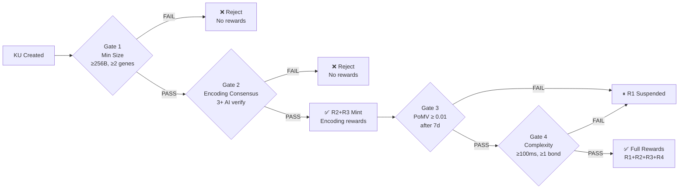
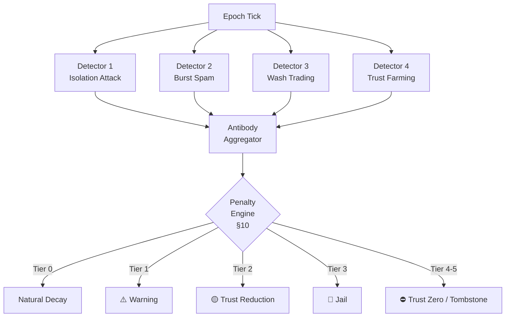

# §5 Anti-Gaming Rules — Quy Tắc Chống Gian Lận

> OBT Specification · Module 5 · Version 1.0 · 30/06/2026
>
> **Cross-references**:
> [§4 Ledger & Balance](./04_LEDGER.md) ·
> [OBT_DESIGN.md §D3](../OBT_DESIGN.md) ·
> [04_anti_gaming_research.md](../../research/obt/04_anti_gaming_research.md) ·
> [02_penalty_slashing_research.md](../../research/obt/02_penalty_slashing_research.md)
>
> **Source code**:
> [membership.rs](../../../src/ku-net/src/membership.rs) ·
> [eigentrust.rs](../../../src/ku-core/src/eigentrust.rs)

---

## 5.1 Resource Proxy: Trust — Tài Nguyên Thay Thế Phí Giao Dịch

### 5.1.1 Design Philosophy

Fee-less networks require a **resource proxy** to prevent abuse without imposing transaction fees.
OBT adopts the same principle used by proven fee-less protocols:

| Protocol | Resource Proxy | How It Works |
|----------|---------------|--------------|
| Nano (XNO) | Account balance | 63 balance-buckets, round-robin priority |
| IOTA 2.0 | Mana | Deficit Round Robin scheduler, throughput ∝ mana |
| Helium | Hardware investment | ECC/RSA hardware attestation ($300-500) |
| **OBT** | **Trust** | `EigenTrust score × NodeTier weight` |

> [!IMPORTANT]
> **OBT's resource proxy is already implemented.** EigenTrust
> ([eigentrust.rs](../../../src/ku-core/src/eigentrust.rs)) computes transitive
> trust. The 7-tier NodeTier hierarchy
> ([membership.rs](../../../src/ku-net/src/membership.rs)) gates privilege.
> No new primitives are needed — only **policy enforcement**.

### 5.1.2 Effective Trust Computation

A node's **Effective Trust** determines its rate-limit bucket and reward multiplier:

```
EffectiveTrust(node) = EigenTrust(node) × TierWeight(node.tier)
```

| NodeTier | Enum Value | Promotion Threshold | TierWeight |
|----------|-----------|---------------------|------------|
| Leaf | 0 | 0.00 | 0.10 |
| Contributor | 1 | 0.30 | 0.50 |
| LocalSP | 2 | 0.60 | 1.00 |
| RegionalSP | 3 | 0.75 | 1.50 |
| CountrySP | 4 | 0.85 | 2.00 |
| ContinentalSP | 5 | 0.92 | 3.00 |
| GlobalBackbone | 6 | 0.97 | 5.00 |

```rust
/// Constant: tier-based weight for Effective Trust.
pub const TIER_WEIGHTS: [f64; 7] = [0.1, 0.5, 1.0, 1.5, 2.0, 3.0, 5.0];

pub fn effective_trust(eigentrust: f64, tier: NodeTier) -> f64 {
    eigentrust * TIER_WEIGHTS[tier as usize]
}
```

### 5.1.3 Why Trust Cannot Be Gamed

Trust is **computed by others**, never self-reported:

1. Node X cannot declare `trust(X) = 0.99` — peers compute their own view of X.
2. EigenTrust is **transitive**: Y asks its trusted friends about X.
3. New nodes start at `trust = 0` (Leaf tier) — no shortcut.
4. Trust building requires months of genuine activity (see §5.5.4).
5. Trust decays exponentially when offline: `trust(t) = trust₀ × e^(−0.01 × t_offline_hours)`.

---

## 5.2 Per-Node Rate Limits — Giới Hạn Tốc Độ Theo Tier (Trust-Gated)

### 5.2.1 Rate-Limit Schedule

Every action that can earn OBT is rate-limited by the actor's `NodeTier`.
Rates are enforced **locally by DHT neighbors** who validate blocks.

| NodeTier | `MAX_KU_PER_HOUR` | `MAX_ENCODE_PER_HOUR` | `CLAIM_COOLDOWN` | `MAX_MINT_PER_EPOCH` |
|----------|-------------------|-----------------------|------------------|----------------------|
| Leaf (T0) | 1 | 2 | 60 min | 10 OBT |
| Contributor (T1) | 5 | 5 | 12 min | 50 OBT |
| LocalSP+ (T2–T6) | 10 | 10 | 6 min | 100 OBT |

```rust
/// Rate limit constants by simplified tier bucket.
pub struct RateLimits {
    pub max_ku_per_hour: u32,
    pub max_encode_per_hour: u32,
    pub claim_cooldown_s: u64,
    pub max_mint_per_epoch: u64,
}

pub const RATE_LEAF: RateLimits = RateLimits {
    max_ku_per_hour: 1,   max_encode_per_hour: 2,
    claim_cooldown_s: 3600, max_mint_per_epoch: 10,
};
pub const RATE_CONTRIBUTOR: RateLimits = RateLimits {
    max_ku_per_hour: 5,   max_encode_per_hour: 5,
    claim_cooldown_s: 720,  max_mint_per_epoch: 50,
};
pub const RATE_LOCAL_SP_PLUS: RateLimits = RateLimits {
    max_ku_per_hour: 10,  max_encode_per_hour: 10,
    claim_cooldown_s: 360,  max_mint_per_epoch: 100,
};
```

### 5.2.2 Enforcement Mechanism

Rate limits are enforced at two layers:

1. **Local**: Node self-enforces to avoid wasting bandwidth on blocks that will be rejected.
2. **DHT Neighbors**: Validators check the sender's account-chain. If `sequence` increment rate exceeds the tier's limit → block is **rejected** and not propagated.

```
Validation rule (per neighbor):
  blocks_last_hour = count(blocks WHERE timestamp > now - 3600)
  IF blocks_last_hour > MAX_KU_PER_HOUR[sender.tier]:
      REJECT block, DO NOT propagate
      IF blocks_last_hour > 2 × MAX_KU_PER_HOUR[sender.tier]:
          FLAG sender for Pattern 2 (Burst Spam)
```

### 5.2.3 Quick Isolation Budget

Rate limits cap damage from short isolation attacks (see [OBT_DESIGN.md §Kịch bản C](../OBT_DESIGN.md)):

```
5-minute isolation window:
  Leaf node:   1/12 hour → max 0 KU (below 1/hr threshold)
  LocalSP+:    5/6 hour → max ~1 KU
  10 LocalSP+ nodes × 5 min → max ~10 KU × 10 OBT/KU = ~100 OBT

  vs. cost: months of trust-building → NOT WORTH IT
```

---

## 5.3 Global Emission Cap — Giới Hạn Phát Hành Toàn Cục

### 5.3.1 Per-Epoch Emission Formula

Total OBT minted per epoch is bounded by a global cap that scales with network health:

$$E(\text{epoch}) = B \times A(\text{epoch}) \times Q(\text{epoch})$$

| Parameter | Symbol | Formula | Initial Value |
|-----------|--------|---------|---------------|
| Base emission | $B$ | Governance parameter | 10,000 OBT/epoch |
| Activity multiplier | $A$ | $\min\left(\dfrac{\text{active\_nodes}}{1000},\; 10.0\right)$ | 0.1 (100 nodes) |
| Quality factor | $Q$ | $\dfrac{\sum_{ku} \text{PoMV}(ku)}{|\text{KU\_set}|}$ | 0.0–1.0 |

**Examples at different network scales:**

| Network Size | Avg PoMV ($Q$) | $A$ | $E$/epoch |
|-------------|----------------|-----|-----------|
| 100 nodes (bootstrap) | 0.5 | 0.10 | 500 OBT |
| 1,000 nodes | 0.7 | 1.00 | 7,000 OBT |
| 10,000 nodes | 0.9 | 10.0 | 90,000 OBT |
| 100,000 nodes | 0.9 | 10.0 | 90,000 OBT (capped) |

> [!NOTE]
> **"Near-infinite but flow-controlled"**: No hard total supply cap (not Bitcoin 21M).
> Per-epoch cap exists. Like a river — no total water limit, but flow rate controlled.
> Knowledge is infinite; recognition rate is bounded.

### 5.3.2 Per-Node Emission Cap

No single node can capture a disproportionate share of rewards:

$$\text{max\_node\_reward}(\text{epoch}) = \frac{E(\text{epoch})}{\text{active\_nodes}} \times \text{TrustMultiplier}(\text{tier})$$

| NodeTier | TrustMultiplier | At 1,000 nodes / Q=0.7 |
|----------|----------------|------------------------|
| Leaf | 0.1 | 0.7 OBT/epoch |
| Contributor | 0.5 | 3.5 OBT/epoch |
| LocalSP+ | 1.0 | 7.0 OBT/epoch |

```rust
pub const TRUST_MULTIPLIERS: [f64; 7] = [0.1, 0.5, 1.0, 1.5, 2.0, 3.0, 5.0];
pub const BASE_EMISSION_PER_EPOCH: u64 = 10_000;
pub const OBT_EPOCH_DURATION_S: u64 = 3_600; // 1 hour

pub fn epoch_emission(active_nodes: u64, avg_pomv: f64) -> f64 {
    let a = (active_nodes as f64 / 1000.0).min(10.0);
    BASE_EMISSION_PER_EPOCH as f64 * a * avg_pomv
}

pub fn max_node_reward(epoch_e: f64, active_nodes: u64, tier: NodeTier) -> f64 {
    (epoch_e / active_nodes as f64) * TRUST_MULTIPLIERS[tier as usize]
}
```

---

## 5.4 KU Quality Gates — Cổng Chất Lượng 4 Tầng

Every KU must pass **all 4 gates** before its associated rewards are eligible for minting. Gates are checked in order; failure at any gate halts progression.

### 5.4.1 Gate 1: Minimum Size (Instant Check)

| Criterion | Threshold | Rationale |
|-----------|-----------|-----------|
| Raw text size | ≥ 256 bytes (~50 words) | Prevents trivial/empty KUs |
| Gene count | ≥ 2 genes | Ensures structural encoding occurred |

```rust
pub const MIN_KU_RAW_BYTES: usize = 256;
pub const MIN_GENE_COUNT: usize = 2;

pub fn gate_1_min_size(raw_size: usize, gene_count: usize) -> bool {
    raw_size >= MIN_KU_RAW_BYTES && gene_count >= MIN_GENE_COUNT
}
```

### 5.4.2 Gate 2: Content Validation (Encoding Consensus)

| Criterion | Threshold | Reference |
|-----------|-----------|-----------|
| AI verifiers | ≥ 3 independent AI nodes | [ENCODING_CONSENSUS_SPEC §3](../ENCODING_CONSENSUS_SPEC.md) |
| Consensus status | Must reach `FULL` encoding status | [KU_ENCODING_PIPELINE §4](../KU_ENCODING_PIPELINE.md) |
| Duplicate check | BLAKE3 CID must be unique network-wide | Content-addressed — same content = same CID = no double mint |

> [!TIP]
> This gate is the **primary defense** against junk KUs. 3+ independent AI nodes
> must verify that the content is meaningful, well-structured, and non-duplicate.

### 5.4.3 Gate 3: PoMV Threshold (Deferred Check)

KU rewards (R1: PoMV owner reward) are conditional on **actual network usage**:

| Age | Required PoMV Score | Effect If Not Met |
|-----|--------------------|--------------------|
| ≤ 7 days | No requirement | Grace period — new KU gets a chance |
| > 7 days | ≥ 0.01 | KU flagged; R1 reward suspended |
| > 30 days | ≥ 0.05 | KU marked dormant; R1 reward = 0 |

```rust
pub const POMV_GATE_7D_THRESHOLD: f32 = 0.01;
pub const POMV_GATE_30D_THRESHOLD: f32 = 0.05;
pub const POMV_GRACE_PERIOD_EPOCHS: u64 = 168; // 7 days × 24 epochs/day

pub fn gate_3_pomv(pomv_score: f32, age_epochs: u64) -> bool {
    if age_epochs <= POMV_GRACE_PERIOD_EPOCHS { return true; }
    if age_epochs <= 720 { return pomv_score >= POMV_GATE_7D_THRESHOLD; } // 30 days
    pomv_score >= POMV_GATE_30D_THRESHOLD
}
```

> [!NOTE]
> **Non-punitive**: Failing Gate 3 does NOT clawback previously earned OBT (R2/R3
> encoding rewards are permanent). It only stops future R1 (PoMV) rewards.
> Consistent with PoMV philosophy — KUs die naturally if unused.

### 5.4.4 Gate 4: Encoding Complexity (Anti-Auto-Generation)

| Criterion | Threshold | Rationale |
|-----------|-----------|-----------|
| Encoding time | ≥ 100ms | Prevents instant auto-generated KU spam |
| Bond count | ≥ 1 synaptic bond | Ensures KU connects to existing knowledge graph |

```rust
pub const MIN_ENCODING_TIME_MS: u64 = 100;
pub const MIN_BOND_COUNT: usize = 1;

pub fn gate_4_complexity(encoding_time_ms: u64, bond_count: usize) -> bool {
    encoding_time_ms >= MIN_ENCODING_TIME_MS && bond_count >= MIN_BOND_COUNT
}
```

### 5.4.5 Gate Summary Flow



---

## 5.5 Gaming Pattern Detection — Phát Hiện 4 Kiểu Gian Lận

Each detector operates independently and feeds into the Graduated Penalty System
(see [§10 Penalty System](./10_PENALTY.md)). Detection is based on **antibody signals** —
anomaly metrics that accumulate evidence before triggering penalties.

### 5.5.1 Pattern 1: Isolation Attack (Tấn Công Cô Lập)

**Description**: A group of nodes deliberately disconnects from the main network,
creates fake KUs, encodes/verifies among themselves, then reconnects claiming rewards.

**Detection Signals:**

| Signal | Threshold | Weight |
|--------|-----------|--------|
| Simultaneous offline/online | ≥ 3 nodes within 30-second window | 0.40 |
| Gossip gap | No gossip receipts from outside group for > 60s | 0.30 |
| Mint proof witnesses all from same group | 100% internal witnesses | 0.20 |
| Burst mint proofs at reconnection | > 3× normal rate at reconnect | 0.10 |

**Composite Score:**
```
isolation_score = Σ(signal_i × weight_i)
```

**Response (graduated):**

| Score | Action | Duration |
|-------|--------|----------|
| 0.3–0.5 | 🟡 Elevated scrutiny: 2× witnesses required for mint proofs | Until score < 0.2 |
| 0.5–0.7 | 🟠 All mint proofs from gap period → TENTATIVE (need re-verification) | 48h dispute window |
| > 0.7 | 🔴 Void all mint proofs from gap; trust slash `trust × 0.5` | → Penalty Tier 3 (Jail) |

**Connectivity Proof Requirement** (D8):
```
MintProof MUST include:
  gossip_receipts: Vec<GossipReceipt>  // ≥3 receipts from nodes OUTSIDE witness set
  receipt_max_age_s: 60                // receipts must be < 60 seconds old
```

### 5.5.2 Pattern 2: Burst Spam (Spam Ồ Ạt)

**Description**: Node creates many low-quality KUs rapidly to farm encoding rewards (R2/R3).

**Detection Signals:**

| Signal | Threshold | Weight |
|--------|-----------|--------|
| Rate exceeds tier limit | > 2× `MAX_KU_PER_HOUR` for tier | 0.35 |
| KU sizes cluster near minimum | Avg size < 1.5 × `MIN_KU_RAW_BYTES` (384 bytes) | 0.25 |
| Content similarity | Cosine similarity > 0.8 between consecutive KUs | 0.25 |
| Low bond diversity | > 50% of KUs bond to same target | 0.15 |

**Composite Score:**
```
burst_score = Σ(signal_i × weight_i)
```

**Response (progressive escalation):**

| Score | Action | Cooldown |
|-------|--------|----------|
| 0.3–0.5 | ⚠️ Warning: notification to node, logged for 90 days | — |
| 0.5–0.7 | 🟡 Throttle: rate limit halved for 24 hours | 24h |
| > 0.7 | 🔴 Trust reduction: `trust × (1 − severity × 0.3)` | → Penalty Tier 2 |
| Repeat 3× in 30d | 🔴 Jail: `trust × 0.2`, excluded 7 days | → Penalty Tier 3 |

### 5.5.3 Pattern 3: Circular Transfer / Wash Trading (Giao Dịch Vòng)

**Description**: Nodes transfer OBT in a loop (A→B→C→A) to inflate PoMV metabolism
counters or simulate network activity.

**Detection Signals:**

| Signal | Threshold | Weight |
|--------|-----------|--------|
| Transfer cycle | A→B→…→A within 1 epoch (3,600s) | 0.40 |
| Same subnet | All participants share /24 subnet | 0.20 |
| Amount round-trips | > 80% of sent amount returns | 0.25 |
| Timing regularity | Transfer intervals σ < 10s (suspiciously regular) | 0.15 |

**Detection Algorithm:**
```
FOR each ObtTransferRequest in epoch:
    Build directed graph G of transfers
    Run DFS cycle detection on G
    IF cycle found AND cycle_length ≤ 5:
        cycle_amount = min(amounts on cycle edges)
        IF cycle_amount / original_send > 0.8:
            FLAG as wash_trading
```

**Response:**

| Confidence | Action |
|------------|--------|
| cycle detected, conf < 0.6 | PoMV of involved KUs discounted by `isolation_factor = 0.5` |
| cycle detected, conf ≥ 0.6 | PoMV discounted to 0; transfers flagged; participants warned |
| repeat offender (3+) | → Penalty Tier 2 (trust reduction) |
| organized ring (5+ nodes) | → Penalty Tier 3 (Jail) for all participants |

### 5.5.4 Pattern 4: Trust Farming / Long Con (Tích Lũy Trust Rồi Khai Thác)

**Description**: Attacker operates legitimately for months to build high trust,
then exploits it for a single large-scale attack (e.g., isolation + mass minting).

**Detection Signals:**

| Signal | Threshold | Weight |
|--------|-----------|--------|
| Trust–quality divergence | `trust > 0.7` but recent KU avg PoMV < 0.4 | 0.35 |
| Activity spike | > 3× historical avg activity in single epoch | 0.25 |
| Witness concentration | > 60% of recent mint proofs witnessed by same 5 nodes | 0.25 |
| Network-graph isolation | Betweenness centrality drop > 50% for node's cluster | 0.15 |

**Composite Score:**
```
longcon_score = Σ(signal_i × weight_i)
```

**Response:**

| Score | Action |
|-------|--------|
| 0.3–0.5 | 🟡 Alert: node flagged for manual audit by high-trust peers |
| 0.5–0.7 | 🟠 Audit: all mint proofs from last 24h require K+2 witnesses |
| > 0.7 | 🔴 Retrospective audit: review last 30 days of activity |
| Confirmed fraud | → Penalty Tier 3–4 depending on scale |

> [!WARNING]
> Trust Farming is the **hardest pattern to detect** because the attacker's
> behavior is indistinguishable from legitimate until the attack. Defense relies
> on **economic disincentive**: months of trust-building cost far more than the
> rate-limited rewards from a single attack window.

### 5.5.5 Detection Pipeline Summary



---

## 5.6 Constants Summary — Tổng Hợp Hằng Số

| Constant | Value | Unit | Defined In |
|----------|-------|------|------------|
| `OBT_EPOCH_DURATION_S` | 3,600 | seconds | [06_q4_q5_q6_decisions.md](../../research/obt/06_q4_q5_q6_decisions.md) |
| `BASE_EMISSION_PER_EPOCH` | 10,000 | OBT | §5.3.1 |
| `MIN_KU_RAW_BYTES` | 256 | bytes | §5.4.1 |
| `MIN_GENE_COUNT` | 2 | genes | §5.4.1 |
| `MIN_ENCODING_TIME_MS` | 100 | ms | §5.4.4 |
| `MIN_BOND_COUNT` | 1 | bonds | §5.4.4 |
| `POMV_GATE_7D_THRESHOLD` | 0.01 | score | §5.4.3 |
| `POMV_GATE_30D_THRESHOLD` | 0.05 | score | §5.4.3 |
| `RATE_LEAF.max_ku_per_hour` | 1 | KU/hr | §5.2.1 |
| `RATE_CONTRIBUTOR.max_ku_per_hour` | 5 | KU/hr | §5.2.1 |
| `RATE_LOCAL_SP_PLUS.max_ku_per_hour` | 10 | KU/hr | §5.2.1 |
| `ISOLATION_SIMULTANEOUS_THRESHOLD` | 3 | nodes | §5.5.1 |
| `ISOLATION_WINDOW_S` | 30 | seconds | §5.5.1 |
| `CONNECTIVITY_PROOF_MIN_RECEIPTS` | 3 | receipts | §5.5.1 |
| `CONNECTIVITY_PROOF_MAX_AGE_S` | 60 | seconds | §5.5.1 |
| `WASH_TRADE_RETURN_THRESHOLD` | 0.80 | ratio | §5.5.3 |
| `TRUST_QUALITY_DIVERGENCE_THRESHOLD` | 0.30 | delta | §5.5.4 |

---

## 5.7 Security Analysis — Đánh Giá Tổng Thể

### Cost-Benefit for Each Attack

| Attack | Max Gain (rate-limited) | Min Cost | Ratio |
|--------|------------------------|----------|-------|
| Burst Spam (Leaf) | ~10 OBT/epoch | 60-min cooldown; warning after 1st violation | 10 OBT / warning |
| Isolation (10 nodes, 5 min) | ~100 OBT | 3+ months trust × 10 nodes; trust slash 50%+ | 100 OBT / 30 node-months |
| Wash Trading (3 nodes) | 0 direct OBT (PoMV discounted) | Trust reduction for all 3 | 0 net / reputation loss |
| Long Con (1 node, 3 months) | ~100 OBT | 3 months; trust = 0 if caught | 100 OBT / 3 months |

> [!IMPORTANT]
> **Design Principle**: In all scenarios, **cost of attack > benefit of attack**.
> OBT does not need to prevent 100% of fraud (impossible for any system).
> It only needs to make fraud economically irrational.

---

*End of §5 Anti-Gaming Rules*
