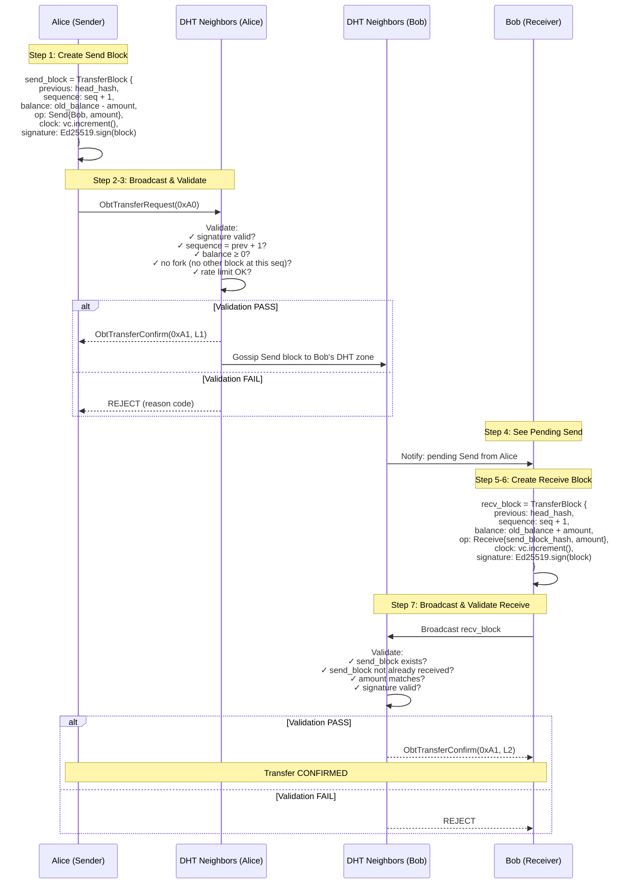

# §6 Transfer Protocol — Giao Thức Chuyển OBT

> OBT Specification · Module 6 · Version 1.0 · 30/06/2026
>
> **Cross-references**:
> [§5 Anti-Gaming](./05_ANTI_GAMING.md) ·
> [OBT_DESIGN.md §D4/D9](../OBT_DESIGN.md) ·
> [03_crdt_ledger_research.md](../../research/obt/03_crdt_ledger_research.md) ·
> [OBP_SPEC.md §5 Message Format](../OBP_SPEC.md)
>
> **Source code**:
> [messages.rs](../../../src/ku-net/src/messages.rs) ·
> [dht.rs](../../../src/ku-net/src/dht.rs) ·
> [sync.rs](../../../src/ku-net/src/sync.rs)

---

## 6.1 New Message Types — 6 Loại Message Mới (0xA0–0xA5)

OBP currently uses message type codes up to `0x95` (Encoding range). The OBT
Transfer Protocol adds **6 new message types** in the `0xA0–0xA5` range, following
the same 6-byte header format defined in [OBP_SPEC §5](../OBP_SPEC.md):

```
Header: [type: u8] [flags: u8] [payload_len: u32 BE]
Payload: type-specific (see §6.4)
Trailer: [signature: 64 bytes Ed25519] (required for 0xA0, 0xA4)
```

### Message Type Table

| Code | Name | Direction | Payload Fields | Signed? |
|------|------|-----------|----------------|---------|
| `0xA0` | `ObtTransferRequest` | Sender → DHT | `from`, `to`, `amount`, `nonce`, `send_block_hash`, `signature` | ✅ Ed25519 |
| `0xA1` | `ObtTransferConfirm` | Witness → Network | `tx_id`, `witness_node_id`, `witness_signature` | ✅ Ed25519 |
| `0xA2` | `ObtBalanceQuery` | Any → DHT | `node_id` | ❌ |
| `0xA3` | `ObtBalanceResponse` | DHT → Requester | `node_id`, `balance`, `head_hash`, `sequence`, `merkle_proof` | ❌ |
| `0xA4` | `ObtMintBroadcast` | Minter → Network | `mint_proof` (full `MintProof` struct) | ✅ Multi-sig |
| `0xA5` | `ObtStorageChallenge` | Challenger → Provider | `ku_cid`, `challenge_type`, `params` | ❌ |

### Data Structures

```rust
/// 0xA0: Request to transfer OBT from sender to receiver.
pub struct ObtTransferRequest {
    pub from: [u8; 32],           // Sender Ed25519 public key
    pub to: [u8; 32],             // Receiver Ed25519 public key
    pub amount: u64,              // OBT amount (integer, no decimals)
    pub nonce: u64,               // Monotonically increasing per-sender
    pub send_block_hash: [u8; 32],// BLAKE3 hash of the Send TransferBlock
    pub signature: [u8; 64],      // Ed25519(from, BLAKE3(to||amount||nonce))
}

/// 0xA1: Witness confirmation of a transfer or mint event.
pub struct ObtTransferConfirm {
    pub tx_id: [u8; 32],          // BLAKE3 hash of the TransferBlock being witnessed
    pub witness_node_id: [u8; 32],// Witness's public key
    pub witness_signature: [u8; 64],
    pub confirmation_level: u8,   // 1=TENTATIVE, 2=CONFIRMED, 3=SETTLED
}

/// 0xA2: Query a node's OBT balance.
pub struct ObtBalanceQuery {
    pub node_id: [u8; 32],        // Account to query
}

/// 0xA3: Response with balance + cryptographic proof.
pub struct ObtBalanceResponse {
    pub node_id: [u8; 32],
    pub balance: u64,             // Current balance
    pub head_hash: [u8; 32],      // Hash of latest TransferBlock
    pub sequence: u64,            // Latest block sequence number
    pub merkle_proof: Vec<[u8; 32]>, // Proof against global state root
}

/// 0xA4: Broadcast a newly minted OBT with full proof.
pub struct ObtMintBroadcast {
    pub mint_proof: MintProof,    // Full MintProof (see OBT_DESIGN.md)
}

/// Already defined in OBT_DESIGN.md, reproduced for completeness.
pub struct MintProof {
    pub activity: MintActivity,       // Encode | Verify | PoMV | Storage
    pub ku_cid: [u8; 32],
    pub obt_amount: u64,
    pub formula_inputs: FormulaInputs,
    pub witnesses: Vec<WitnessSignature>, // K threshold signatures
    pub gossip_receipts: Vec<GossipReceipt>, // ≥3 connectivity proofs
    pub vector_clock: VectorClock,
    pub timestamp: u64,
}

/// 0xA5: Storage challenge (Proof-of-Storage-KU).
pub struct ObtStorageChallenge {
    pub ku_cid: [u8; 32],           // KU to challenge
    pub challenge_type: ChallengeType, // TypeA | TypeB | TypeC
    pub params: ChallengeParams,    // Type-specific parameters
}

pub enum ChallengeType {
    TypeA,  // Return BLAKE3 hash of full KU
    TypeB,  // Return bytes[offset..offset+len]
    TypeC,  // Return GeneType + ConceptID of first gene
}

pub struct ChallengeParams {
    pub seed: [u8; 32],    // BLAKE3(epoch || node_id) — deterministic
    pub offset: u32,       // For TypeB: byte offset
    pub length: u16,       // For TypeB: number of bytes
    pub deadline_s: u16,   // Response timeout (default: 30s)
}
```

---

## 6.2 Transfer Flow — Luồng Chuyển OBT 2-Phase (Nano-Style)

### 6.2.1 Overview

OBT transfers follow the **2-phase send/receive** model pioneered by Nano's
block-lattice. Each account maintains its own chain of `TransferBlock`s (defined
in [03_crdt_ledger_research.md](../../research/obt/03_crdt_ledger_research.md)).
A transfer requires two blocks: a **Send block** on the sender's chain and a
**Receive block** on the receiver's chain.

### 6.2.2 Detailed Sequence



### 6.2.3 Validation Rules for Send Block

DHT neighbors validate Send blocks against these rules before propagation:

| Rule | Check | Failure |
|------|-------|---------|
| R1: Signature | `Ed25519.verify(block, sender_pubkey)` | REJECT — invalid signature |
| R2: Sequence | `block.sequence == prev_block.sequence + 1` | REJECT — gap or fork |
| R3: Balance | `block.balance == prev_block.balance - amount` AND `block.balance ≥ 0` | REJECT — insufficient funds |
| R4: No Fork | No other block exists with same `(account, sequence)` | REJECT + WARRANT |
| R5: Rate Limit | Transfer count this epoch ≤ tier limit | REJECT — rate limited |
| R6: Nonce | `nonce > last_seen_nonce[sender]` | REJECT — replay attack |

### 6.2.4 Validation Rules for Receive Block

| Rule | Check | Failure |
|------|-------|---------|
| R1: Signature | `Ed25519.verify(block, receiver_pubkey)` | REJECT |
| R2: Sequence | `block.sequence == prev_block.sequence + 1` | REJECT |
| R3: Send Exists | Referenced `send_block_hash` exists in DHT | REJECT — no matching send |
| R4: Not Double-Received | No other Receive references same `send_block_hash` | REJECT |
| R5: Amount Match | `recv_amount == send_block.amount` | REJECT — amount mismatch |
| R6: Receiver Match | `recv_block.account == send_block.op.receiver` | REJECT — wrong recipient |

---

## 6.3 Confirmation Levels — 4 Cấp Độ Xác Nhận

### 6.3.1 Level Definitions

OBT uses a **progressive confirmation model** where blocks accumulate witness
signatures over time, moving through 4 levels:

| Level | Name | Witnesses | Typical Latency | Semantics |
|-------|------|-----------|-----------------|-----------|
| L0 | `PENDING` | 0 | 0ms | Block created, not yet broadcast |
| L1 | `TENTATIVE` | 1–2 | 50–200ms | First DHT neighbors confirmed; **visible but not spendable** |
| L2 | `CONFIRMED` | K = 3–5 | 1–3 seconds | Threshold witnesses confirmed; **spendable** |
| L3 | `SETTLED` | Widely propagated | 10–30 seconds | Deeply embedded in network state; **irreversible** |

### 6.3.2 Per-Operation Confirmation Requirements

| Operation | Min Level to Commit | Min Level to Spend | Rationale |
|-----------|--------------------|--------------------|-----------|
| `Mint` | L2 (3+ witnesses) | L2 | Minting creates new OBT — must have K witness threshold |
| `Send` | L2 (3+ witnesses) | — | Sender's balance is immediately reduced |
| `Receive` | L1 (visible) | L2 (to spend received OBT) | Receiver sees pending at L1, can spend at L2 |
| `Open` | L1 | — | Account creation — low security requirement |

### 6.3.3 Witness Selection

Witnesses are selected **deterministically** from the sender's DHT neighborhood:

```
witness_set = DHT.k_closest(sender_account, k=K)
WHERE K = min(5, max(3, active_neighbors))
```

- Witnesses are chosen by XOR-distance to sender's public key in DHT keyspace.
- This is **deterministic but uncontrollable** — attacker cannot choose their own witnesses.
- Witnesses must be at NodeTier ≥ Contributor (Leaf nodes cannot witness).

```rust
pub const MIN_WITNESSES_CONFIRMED: usize = 3;  // K minimum
pub const MAX_WITNESSES_CONFIRMED: usize = 5;  // K maximum
pub const MIN_WITNESS_TIER: NodeTier = NodeTier::Contributor;
```

### 6.3.4 Speed Comparison

| System | 1st Confirmation | Full Confirmation |
|--------|-----------------|-------------------|
| Bitcoin | ~10 minutes | ~1 hour (6 blocks) |
| Ethereum | ~12 seconds | ~2.5 minutes (2 epochs) |
| Nano | ~0.2 seconds | ~0.5 seconds (ORV quorum) |
| **OBT** | **50–200ms (L1)** | **1–3s (L2), 10–30s (L3)** |

---

## 6.4 Wire Format Details — Định Dạng Byte Trên Dây

### 6.4.1 Common Header (6 bytes)

All OBT messages share the OBP 6-byte header:

```
Offset  Size  Field
──────  ────  ──────────────
0x00    1     message_type     (u8: 0xA0–0xA5)
0x01    1     flags            (u8: bit 0 = has_signature)
0x02    4     payload_length   (u32 BE, max 16 MB)
0x06    var   payload          (type-specific)
```

### 6.4.2 ObtTransferRequest (0xA0) — 168 bytes

```
Offset  Size  Field
──────  ────  ──────────────
0x00    6     header           (type=0xA0, flags=0x01, len=162)
0x06    32    from             (Ed25519 pubkey)
0x26    32    to               (Ed25519 pubkey)
0x46    8     amount           (u64 LE)
0x4E    8     nonce            (u64 LE)
0x56    32    send_block_hash  (BLAKE3)
0x76    64    signature        (Ed25519)
──────  ────  ──────────────
Total:  168 bytes (fixed)
```

### 6.4.3 ObtTransferConfirm (0xA1) — 135 bytes

```
Offset  Size  Field
──────  ────  ──────────────
0x00    6     header           (type=0xA1, flags=0x01, len=129)
0x06    32    tx_id            (BLAKE3 hash of TransferBlock)
0x26    32    witness_node_id  (Ed25519 pubkey)
0x46    64    witness_sig      (Ed25519)
0x86    1     conf_level       (u8: 1=TENTATIVE, 2=CONFIRMED, 3=SETTLED)
──────  ────  ──────────────
Total:  135 bytes (fixed)
```

### 6.4.4 ObtBalanceQuery (0xA2) — 38 bytes

```
Offset  Size  Field
──────  ────  ──────────────
0x00    6     header           (type=0xA2, flags=0x00, len=32)
0x06    32    node_id          (Ed25519 pubkey)
──────  ────  ──────────────
Total:  38 bytes (fixed)
```

### 6.4.5 ObtBalanceResponse (0xA3) — 86+ bytes

```
Offset  Size  Field
──────  ────  ──────────────
0x00    6     header           (type=0xA3, flags=0x00, len=variable)
0x06    32    node_id          (Ed25519 pubkey)
0x26    8     balance          (u64 LE)
0x2E    32    head_hash        (BLAKE3 of latest TransferBlock)
0x4E    8     sequence         (u64 LE)
0x56    2     proof_count      (u16 LE)
0x58    var   merkle_proof     (proof_count × 32 bytes)
──────  ────  ──────────────
Total:  86 + proof_count × 32 bytes
```

### 6.4.6 ObtMintBroadcast (0xA4) — Variable

```
Offset  Size  Field
──────  ────  ──────────────
0x00    6     header           (type=0xA4, flags=0x01, len=variable)
0x06    1     activity         (u8: 0=Encode, 1=Verify, 2=PoMV, 3=Storage)
0x07    32    ku_cid           (BLAKE3 hash)
0x27    8     obt_amount       (u64 LE)
0x2F    var   formula_inputs   (TLV-encoded, see below)
var     2     witness_count    (u16 LE)
var     var   witnesses        (witness_count × 96 bytes: 32 pubkey + 64 sig)
var     2     receipt_count    (u16 LE)
var     var   gossip_receipts  (receipt_count × 72 bytes: 32 from + 32 hash + 8 ts)
var     var   vector_clock     (VectorClock binary encoding)
var     8     timestamp        (u64 LE)
```

### 6.4.7 ObtStorageChallenge (0xA5) — 76 bytes

```
Offset  Size  Field
──────  ────  ──────────────
0x00    6     header           (type=0xA5, flags=0x00, len=70)
0x06    32    ku_cid           (BLAKE3 hash)
0x26    1     challenge_type   (u8: 0=TypeA, 1=TypeB, 2=TypeC)
0x27    32    seed             (BLAKE3 challenge seed)
0x47    4     offset           (u32 LE, for TypeB)
0x4B    2     length           (u16 LE, for TypeB)
0x4D    2     deadline_s       (u16 LE, default=30)
──────  ────  ──────────────
Total:  76 bytes (fixed, unused fields = 0 for non-TypeB)
```

---

## 6.5 Dispute Resolution — Giải Quyết Tranh Chấp (D9)

### 6.5.1 Double-Spend / Fork Detection

When a node creates **two blocks with the same sequence number**, this constitutes
a fork. Forks are the primary dispute scenario:

```
Alice's chain (legitimate):     [...] → Block(seq=5, Send 50 to Bob)
Alice's chain (fraudulent):     [...] → Block(seq=5, Send 80 to Charlie)

DHT Neighbor sees BOTH → FORK DETECTED
```

**Resolution: First-Seen Wins + Warrant**

```rust
/// Fork detection and resolution.
pub fn resolve_fork(block_a: &TransferBlock, block_b: &TransferBlock) -> ForkResult {
    assert_eq!(block_a.account, block_b.account);
    assert_eq!(block_a.sequence, block_b.sequence);
    assert_ne!(block_a.block_hash, block_b.block_hash);

    // 1. First-seen wins (based on local arrival timestamp)
    let winner = if arrived_first(block_a) { block_a } else { block_b };

    // 2. Tiebreak: lower BLAKE3 hash wins (deterministic, unbiased)
    let winner = if arrival_time_equal() {
        if block_a.block_hash < block_b.block_hash { block_a } else { block_b }
    } else { winner };

    // 3. Issue warrant — cryptographic proof of cheating
    let warrant = Warrant {
        forker: block_a.account,
        evidence_a: block_a.clone(),
        evidence_b: block_b.clone(),
        reporter: local_node_id(),
        reporter_sig: Ed25519.sign(evidence_a || evidence_b),
    };

    ForkResult { winner, loser, warrant }
}
```

### 6.5.2 Warrant System

A **warrant** is irrefutable cryptographic proof that a node attempted a fork
(double-spend). It contains both conflicting blocks with their valid Ed25519
signatures — the forker cannot deny having signed both.

```rust
pub struct Warrant {
    pub forker: [u8; 32],              // Account that forked
    pub evidence_a: TransferBlock,     // First conflicting block
    pub evidence_b: TransferBlock,     // Second conflicting block
    pub reporter: [u8; 32],            // Node that detected the fork
    pub reporter_sig: [u8; 64],        // Reporter's attestation
    pub timestamp: u64,
}
```

**Warrant consequences:**

| Offense | Penalty Tier | Trust Impact |
|---------|-------------|--------------|
| First fork (possibly accidental) | Tier 2: Trust Reduction | `trust × 0.7` |
| Second fork within 30 days | Tier 3: Jail | `trust × 0.2`, excluded 7–30 days |
| Third fork or correlated | Tier 4: Trust Zero | `trust = 0.001`, 180 days |
| Systematic (ring leader) | Tier 5: Tombstone | Permanent ban |

### 6.5.3 Confirmation Timeout

Transfers that do not reach L2 (CONFIRMED) within a timeout window are handled
as follows:

```
CONFIRMATION_TIMEOUT = 30 seconds

Timeline:
  t=0:    Sender broadcasts Send block (ObtTransferRequest 0xA0)
  t≤30s:  Collecting ObtTransferConfirm (0xA1) from witnesses
  t=30s:  Timeout check

  IF confirms ≥ K (3-5):
      → Level 2: CONFIRMED ✅
  ELIF confirms ≥ 1:
      → Level 1: TENTATIVE — sender MAY retry broadcast
      → Retry up to 3 times (30s each, total 120s)
  ELSE (0 confirms):
      → FAILED — sender should retry with fresh nonce
      → Balance reverts (Send block NOT propagated)
```

```rust
pub const CONFIRMATION_TIMEOUT_S: u64 = 30;
pub const MAX_RETRY_COUNT: u8 = 3;
pub const TOTAL_TIMEOUT_S: u64 = 120; // 30s × 4 attempts
```

### 6.5.4 VectorClock Tiebreak

When conflicting blocks arrive at the same DHT neighbor with identical arrival
timestamps, `VectorClock` causal ordering provides a secondary tiebreak:

```
Tiebreak cascade:
  1. First-seen (arrival timestamp at DHT neighbor)
  2. VectorClock: if block_a.clock < block_b.clock → block_a wins (causally earlier)
  3. BLAKE3 hash: lower hash wins (deterministic, arbitrary)
```

VectorClock comparison follows standard partial-order rules:
- `vc_a < vc_b` if all entries in `vc_a` ≤ corresponding entries in `vc_b`, and at least one is strictly less.
- If neither `vc_a < vc_b` nor `vc_b < vc_a` (concurrent), fall through to hash tiebreak.

### 6.5.5 Unreceived Sends

If a Send block is confirmed but the receiver never creates a Receive block,
the OBT remains "in transit" indefinitely:

| Duration | Status | Action |
|----------|--------|--------|
| 0–24h | Normal | Pending in `ORSet<PendingSend>` on receiver's DHT zone |
| 24h–7d | Stale | DHT neighbors periodically re-notify receiver |
| > 7d | Expired | Sender MAY create a **Refund block** (special `Receive` referencing own Send) |

```rust
pub const SEND_EXPIRY_EPOCHS: u64 = 168; // 7 days × 24 epochs/day

pub enum TransferOp {
    Open,
    Mint { source: MintSource, amount: u64 },
    Send { receiver: [u8; 32], amount: u64 },
    Receive { send_block_hash: [u8; 32], amount: u64 },
    Refund { send_block_hash: [u8; 32], amount: u64 }, // Self-receive after expiry
}
```

---

## 6.6 CRDTs in Transfer Protocol — Vai Trò Của CRDT

While the **account chain** handles balance state (not CRDT), CRDTs remain
essential for supporting infrastructure:

| CRDT Type | Usage in Transfer Protocol | Reference |
|-----------|---------------------------|-----------|
| `GCounter` | `total_earned` — lifetime OBT earned (analytics only) | Increment-only, non-punitive |
| `GCounter` | `global_supply` — total OBT ever minted (network metric) | Shared across all nodes |
| `ORSet` | Pending unreceived Send blocks per DHT zone | Add/remove as sends are received |
| `VectorClock` | Causal ordering between account chains | Embedded in every TransferBlock |
| `LWWRegister` | Account metadata (display name, tier cache) | Last-writer-wins for mutable fields |

> [!NOTE]
> **Critical distinction**: Account-chain is the **source of truth** for balance.
> CRDTs are **auxiliary** — they track analytics, manage pending sets, and provide
> ordering. This separation was decided in [Q4](../../research/obt/06_q4_q5_q6_decisions.md)
> after discovering G-Counter cannot support spending.

---

## 6.7 Constants Summary — Tổng Hợp Hằng Số

| Constant | Value | Unit | Defined In |
|----------|-------|------|------------|
| `MSG_OBT_TRANSFER_REQUEST` | `0xA0` | u8 | §6.1 |
| `MSG_OBT_TRANSFER_CONFIRM` | `0xA1` | u8 | §6.1 |
| `MSG_OBT_BALANCE_QUERY` | `0xA2` | u8 | §6.1 |
| `MSG_OBT_BALANCE_RESPONSE` | `0xA3` | u8 | §6.1 |
| `MSG_OBT_MINT_BROADCAST` | `0xA4` | u8 | §6.1 |
| `MSG_OBT_STORAGE_CHALLENGE` | `0xA5` | u8 | §6.1 |
| `MIN_WITNESSES_CONFIRMED` | 3 | witnesses | §6.3.3 |
| `MAX_WITNESSES_CONFIRMED` | 5 | witnesses | §6.3.3 |
| `MIN_WITNESS_TIER` | Contributor (1) | NodeTier | §6.3.3 |
| `CONFIRMATION_TIMEOUT_S` | 30 | seconds | §6.5.3 |
| `MAX_RETRY_COUNT` | 3 | retries | §6.5.3 |
| `TOTAL_TIMEOUT_S` | 120 | seconds | §6.5.3 |
| `SEND_EXPIRY_EPOCHS` | 168 | epochs (7d) | §6.5.5 |

---

## 6.8 Security Properties — Thuộc Tính Bảo Mật

| Property | Mechanism | Strength |
|----------|-----------|----------|
| **No double-spend** | Account-chain sequence + fork detection + warrant | Same as Nano (proven at scale) |
| **No balance forgery** | Ed25519 signature on every block | Computationally infeasible |
| **No replay** | Monotonic nonce + VectorClock | Deterministic rejection |
| **No unauthorized receive** | Receive must reference existing Send with matching receiver | Cryptographically bound |
| **Partition tolerance** | CRDT eventual consistency + confirmation levels | Blocks in partition = TENTATIVE until reconnect |
| **Liveness** | 30s timeout + 3 retries + refund after 7d | Transfer never permanently stuck |

---

*End of §6 Transfer Protocol*
