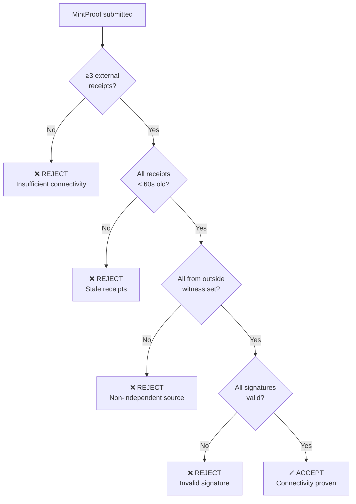
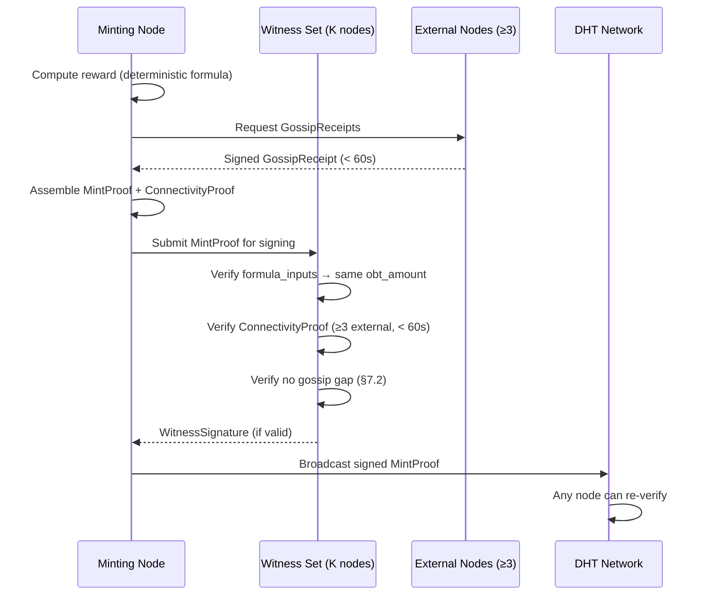

# §7 Trust & Security Mechanisms

> OBT Specification v1.0 — Trust Decay, Connectivity Proofs, Anti-Manipulation
>
> Cross-refs: [§8 Penalty](./08_PENALTY.md) · [§9 Constants](./09_CONSTANTS.md) · [OBT_DESIGN §Security](../OBT_DESIGN.md)
>
> Quyết định thiết kế: D6 (Trust Decay), D7 (Gossip Gap), D8 (Connectivity Proof) — xem [research synthesis](../../research/obt/05_research_synthesis.md)

---

## 7.1 Trust Decay Formula (D6)

### Triết lý

> **Trust phải EARNED, không phải DEFAULT.** Node offline lâu → mạng mất thông tin về hành vi → trust giảm. Đây KHÔNG phải punishment — đây là sự mất dần thông tin (information decay). Xem [§8](./08_PENALTY.md) cho hệ thống phạt thực sự.

### Công thức chính

$$\text{trust}(t) = \text{trust}_0 \times e^{-\lambda \times t_{\text{offline\_hours}}}$$

| Parameter | Value | Rationale |
|-----------|-------|-----------|
| `λ` (TRUST_DECAY_LAMBDA) | `0.01` | Half-life ≈ 69.3 hours (~3 days). Đủ chậm để cho phép maintenance, đủ nhanh để phát hiện abandonment |
| `trust_0` | Trust score trước khi offline | EigenTrust score cuối cùng được ghi nhận bởi peers |
| `t_offline_hours` | Số giờ offline liên tục | Đo bằng SWIM probe failures × probe interval |

### Bảng Trust Decay (trust₀ = 1.0)

| Thời gian offline | t (hours) | e^(-0.01 × t) | Trust còn lại | % mất |
|-------------------|-----------|----------------|---------------|-------|
| 1 giờ | 1 | 0.990 | 0.990 | -1.0% |
| 1 ngày (24h) | 24 | 0.787 | 0.787 | -21.3% |
| 3 ngày (72h) | 72 | 0.487 | 0.487 | -51.3% |
| 1 tuần (168h) | 168 | 0.186 | 0.186 | -81.4% |
| 2 tuần (336h) | 336 | 0.035 | 0.035 | -96.5% |
| 30 ngày (720h) | 720 | 0.001 | ≈0.001 | -99.9% |

> [!NOTE]
> Half-life = ln(2) / λ = 0.693 / 0.01 = **69.3 hours ≈ 2.89 days**. Sau 3 half-lives (~9 days), trust còn 12.5%. Sau 30 ngày, trust gần như zero — node phải rebuild from scratch giống Leaf mới.

### Grace Period

```
if t_offline_hours < 1.0 {
    // Không decay — cho phép restart, upgrade, maintenance
    trust(t) = trust_0
}
```

**Rationale**: Network có thể probe timeout do latency, node reboot (~30s), hoặc ISP hiccup. 1 giờ grace period tránh false positive cho normal operations.

### Trust Recovery Formula

$$\text{recovery\_rate} = \min(\text{interaction\_rate} \times 0.01, \ 0.05 / \text{hour})$$

| Parameter | Value | Meaning |
|-----------|-------|---------|
| `interaction_rate` | Số interactions/epoch đo bởi peers | Gossip responses, encoding jobs, storage challenges, KU serves |
| Cap | 0.05/hour | Tối đa phục hồi 0.05 trust/giờ → cần 20 giờ hoạt động tích cực để +1.0 |

**Thiết kế bất đối xứng (asymmetric by design)**:

```
Decay:    trust 0.8 → 0.4 trong ~69 hours (tự động, exponential)
Recovery: trust 0.4 → 0.8 cần ~8 hours hoạt động TÍCH CỰC (max 0.05/hr)

→ Phá hoại NHANH HƠN xây dựng → khuyến khích online liên tục
```

### Rust Pseudocode

```rust
/// Trust decay constants
pub const TRUST_DECAY_LAMBDA: f64 = 0.01;
pub const TRUST_GRACE_PERIOD_HOURS: f64 = 1.0;
pub const TRUST_RECOVERY_MAX_PER_HOUR: f64 = 0.05;
pub const TRUST_RECOVERY_INTERACTION_FACTOR: f64 = 0.01;

/// Calculate trust after offline period
pub fn trust_after_offline(trust_0: f64, offline_hours: f64) -> f64 {
    if offline_hours < TRUST_GRACE_PERIOD_HOURS {
        return trust_0; // Grace period — no decay
    }
    trust_0 * (-TRUST_DECAY_LAMBDA * offline_hours).exp()
}

/// Calculate trust recovery per hour based on interaction rate
pub fn trust_recovery_rate(interactions_per_epoch: u32) -> f64 {
    let raw = interactions_per_epoch as f64 * TRUST_RECOVERY_INTERACTION_FACTOR;
    raw.min(TRUST_RECOVERY_MAX_PER_HOUR)
}
```

---

## 7.2 Gossip Gap Detection (D7)

### Vấn đề

> Khi ≥3 nodes **đồng loạt** offline rồi online lại → dấu hiệu của isolation attack (§OBT_DESIGN Kịch bản C). Mạng cần phát hiện pattern này tự động.

### Detection Rules

| Metric | Threshold | Alert Level | Response |
|--------|-----------|-------------|----------|
| Nodes cùng offline trong 30s window | ≥ 3 | `ELEVATED_SCRUTINY` | Mint proofs → TENTATIVE, cần 2× witnesses |
| Nodes cùng offline trong 30s window | ≥ 5 | `RED_FLAG` | Tất cả mint proofs → QUARANTINE, manual review trigger |
| Nodes cùng offline từ cùng subnet | ≥ 2 | `ELEVATED_SCRUTINY` | Subnet isolation suspected |

### Constants

```rust
pub const GOSSIP_GAP_WINDOW_S: u64 = 30;
pub const GOSSIP_GAP_ELEVATED_THRESHOLD: u32 = 3;
pub const GOSSIP_GAP_RED_FLAG_THRESHOLD: u32 = 5;
pub const GOSSIP_GAP_WITNESS_MULTIPLIER: u32 = 2;
```

### Chế độ ELEVATED_SCRUTINY

Khi ≥3 nodes cùng offline/online trong 30-second window:

1. **Tất cả mint proofs** từ gap period → trạng thái `TENTATIVE` (thay vì `CONFIRMED`)
2. **Witness requirement tăng gấp đôi**: K × 2 witnesses (thay vì K)
3. **Re-verification**: Encoding consensus results từ gap period phải re-verify bởi nodes NGOÀI gap set
4. **Duration**: ELEVATED_SCRUTINY kéo dài min(gap_duration × 10, 24 hours)

### Chế độ RED_FLAG

Khi ≥5 nodes cùng offline/online:

1. Tất cả hoạt động từ gap → `QUARANTINE` (không mint, không transfer)
2. Alert broadcast tới top-tier nodes (SuperPeer+)
3. Manual audit required trước khi release quarantine
4. Potential trust slash nếu fraud confirmed → xem [§8.4](./08_PENALTY.md#84-trust-slash-formulas-by-fraud-type)

### Detection Algorithm

```rust
pub struct GossipGapDetector {
    /// Sliding window: recent offline events
    offline_events: BTreeMap<Timestamp, Vec<NodeId>>,
}

impl GossipGapDetector {
    pub fn record_offline(&mut self, node: NodeId, ts: Timestamp) {
        self.offline_events.entry(ts).or_default().push(node);
        self.cleanup_old(ts - GOSSIP_GAP_WINDOW_S);
    }

    pub fn check(&self, ts: Timestamp) -> AlertLevel {
        let window_start = ts - GOSSIP_GAP_WINDOW_S;
        let nodes_in_window: HashSet<NodeId> = self.offline_events
            .range(window_start..=ts)
            .flat_map(|(_, nodes)| nodes.iter().cloned())
            .collect();

        match nodes_in_window.len() {
            n if n >= GOSSIP_GAP_RED_FLAG_THRESHOLD as usize => AlertLevel::RedFlag,
            n if n >= GOSSIP_GAP_ELEVATED_THRESHOLD as usize => AlertLevel::ElevatedScrutiny,
            _ => AlertLevel::Normal,
        }
    }
}
```

---

## 7.3 Connectivity Proof (D8)

### Yêu cầu

> **Mỗi MintProof phải chứng minh node đang kết nối với mạng thật** — không phải mạng cô lập. Mạng cô lập = không có gossip từ bên ngoài = invalid proof.

### Cấu trúc ConnectivityProof

```rust
pub struct ConnectivityProof {
    /// ≥3 gossip receipts từ nodes NGOÀI witness set
    pub external_receipts: Vec<GossipReceipt>,
    /// Timestamp khi proof được tạo
    pub proof_timestamp: u64,
}

pub struct GossipReceipt {
    /// Node gửi receipt (phải NGOÀI witness set)
    pub from_node: [u8; 32],
    /// Epoch number tại thời điểm receipt
    pub epoch: u64,
    /// Timestamp nhận gossip message gần nhất
    pub last_gossip_ts: u64,
    /// BLAKE3 hash của gossip payload (chống forgery)
    pub gossip_hash: [u8; 32],
    /// Ed25519 signature của from_node
    pub signature: [u8; 64],
}
```

### Validation Rules

| Rule | Value | Rationale |
|------|-------|-----------|
| Minimum external receipts | **≥ 3** (`CONNECTIVITY_PROOF_COUNT`) | Cần ≥3 independent nodes xác nhận connectivity |
| Receipt freshness | **< 60 seconds** (`CONNECTIVITY_PROOF_TTL_S`) | Receipts phải recent — cũ hơn 60s = potentially stale |
| Receipt source | Outside witness set | Witnesses tham gia consensus — cần nguồn INDEPENDENT |
| Receipt uniqueness | Mỗi receipt từ node khác nhau | Không chấp nhận 3 receipts từ cùng 1 node |

### Validation Flow



### Tại sao mạng cô lập fail

```
Isolated network (10 nodes):
  → Không có gossip từ bên ngoài
  → Không ai NGOÀI 10 nodes ký GossipReceipt
  → external_receipts.len() = 0 < 3
  → ConnectivityProof INVALID
  → MintProof REJECTED
  → 0 OBT earned during isolation
```

---

## 7.4 Five Anti-Manipulation Mechanisms

> Xem chi tiết từng cơ chế tại [OBT_DESIGN §Chống 5 loại thao túng](../OBT_DESIGN.md). Dưới đây là formal specification.

### Tổng quan

| # | Attack Vector | Primary Defense | Secondary Defense | Cross-ref |
|---|--------------|-----------------|-------------------|-----------|
| 1 | **Double-spend** | VectorClock + causal ordering | Account-Chain sequence numbers | [§D4](../../research/obt/05_research_synthesis.md) |
| 2 | **Balance forgery** | Ed25519 multi-signature | Threshold K/N witness signing | [OBT_DESIGN §2](../OBT_DESIGN.md) |
| 3 | **Sybil attack** | EigenTrust + 7-tier hierarchy | Trust-gated rate limits | [§D3](../../research/obt/04_anti_gaming_research.md) |
| 4 | **Replay attack** | TransferBlock nonce (sequence) | VectorClock dedup | [§D4](../../research/obt/05_research_synthesis.md) |
| 5 | **Collusion** | Threshold signing | BLAKE3-deterministic witness selection | [§7.3](#73-connectivity-proof-d8) |

### 7.4.1 Double-Spend Prevention

```rust
/// Account-Chain makes double-spend structurally impossible:
/// Two Send blocks with the same sequence = FORK DETECTED
pub fn validate_send(chain: &AccountChain, new_block: &TransferBlock) -> Result<(), Error> {
    // 1. Sequence must be exactly prev + 1
    if new_block.sequence != chain.head().sequence + 1 {
        return Err(Error::InvalidSequence);
    }
    // 2. Previous hash must match chain head
    if new_block.previous != chain.head().block_hash {
        return Err(Error::ForkDetected); // DOUBLE-SPEND ATTEMPT
    }
    // 3. Balance must be non-negative after operation
    if new_block.balance > chain.head().balance && !matches!(new_block.operation, TransferOp::Mint{..} | TransferOp::Receive{..}) {
        return Err(Error::InsufficientBalance);
    }
    // 4. VectorClock must advance causally
    if !new_block.clock.dominates(&chain.head().clock) {
        return Err(Error::CausalViolation);
    }
    Ok(())
}
```

**Fork Resolution**: Khi DHT neighbors phát hiện 2 blocks cùng sequence:
- Chấp nhận block **thấy trước** (first-seen rule)
- Tiebreak: `lower block_hash` wins (deterministic)
- Fork = **warrant** (cryptographic proof of fraud) → [§8 Penalty](./08_PENALTY.md)

### 7.4.2 Balance Forgery Prevention

Mỗi MintProof cần **threshold K witnesses** ký xác nhận:

```rust
pub struct MintProof {
    pub activity: MintActivity,          // Encode | Verify | PoMV | Storage
    pub ku_cid: [u8; 32],               // BLAKE3 hash of related KU
    pub obt_amount: u64,                 // Deterministic — everyone computes same
    pub formula_inputs: FormulaInputs,   // raw_size, role, pomv_score...
    pub witnesses: Vec<WitnessSignature>,// K/N threshold
    pub connectivity: ConnectivityProof, // §7.3 — prove network connectivity
    pub vector_clock: VectorClock,       // Causal ordering, no replay
    pub timestamp: u64,
}

/// K = min(max(3, active_nodes / 100), 7)
pub fn required_witnesses(active_nodes: u32) -> u32 {
    3.max(active_nodes / 100).min(7)
}
```

### 7.4.3 Sybil Resistance

Defense layers:

| Layer | Mechanism | Code |
|-------|-----------|------|
| 1 | EigenTrust — trust(new_node) = 0 | [eigentrust.rs](file:///c:/Users/shpy2/Documents/OneBrain/src/ku-core/src/eigentrust.rs) |
| 2 | 7-tier hierarchy — Leaf = 10% reward | [membership.rs](file:///c:/Users/shpy2/Documents/OneBrain/src/ku-net/src/membership.rs) |
| 3 | Rate limit — Leaf = 1 KU/hour | [§9.3](./09_CONSTANTS.md) |
| 4 | S/Kademlia puzzle — BLAKE3 cost to create NodeId | [dht.rs](file:///c:/Users/shpy2/Documents/OneBrain/src/ku-net/src/dht.rs) |

Cost to Sybil: 1000 fake nodes × trust=0 × Leaf rate × months to build trust = **economically futile**.

### 7.4.4 Replay Prevention

```rust
/// Each TransferBlock has unique (account, sequence) pair
/// Replaying old block → sequence already seen → REJECT
pub fn is_replay(chain: &AccountChain, block: &TransferBlock) -> bool {
    block.sequence <= chain.head().sequence
}
```

### 7.4.5 Collusion Prevention

**BLAKE3-deterministic witness selection** — attacker cannot choose witnesses:

```rust
/// Witnesses selected by content hash — deterministic but uncontrollable
pub fn select_witnesses(ku_cid: &[u8; 32], epoch: u64, k: u32) -> Vec<NodeId> {
    let seed = blake3::hash(&[ku_cid.as_slice(), &epoch.to_le_bytes()].concat());
    // DHT closest-to-seed selection — attacker must control >50% network
    dht::closest_nodes(seed.as_bytes(), k)
}
```

**Threshold requirement**: Collusion needs control of > K/N witnesses for a specific CID. Changing content = different CID = different witnesses. Cost: must control >50% of network to reliably collude → prohibitively expensive.

---

## 7.5 Integrated MintProof Validation (Complete Flow)



> [!IMPORTANT]
> **Triết lý bảo mật OneBrain**: Không cần ngăn 100% gian lận (bất khả thi). Chỉ cần: **chi phí gian lận >> lợi ích gian lận**. Xem [OBT_DESIGN §Đánh Giá Trung Thực](../OBT_DESIGN.md) cho honest assessment.
