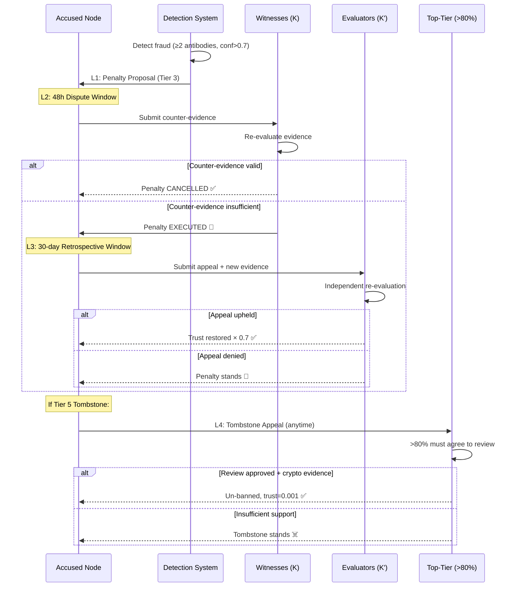

# §8 Penalty System

> OBT Specification v1.0 — Graduated Penalties, Trust Slashing, Appeal Process
>
> Cross-refs: [§7 Trust & Security](./07_TRUST_SECURITY.md) · [§9 Constants](./09_CONSTANTS.md) · [Penalty Research](../../research/obt/02_penalty_slashing_research.md)
>
> Quyết định thiết kế: D10 — xem [research synthesis](../../research/obt/05_research_synthesis.md), [Q5 Tombstone decision](../../research/obt/06_q4_q5_q6_decisions.md)

---

## 8.0 Core Principle

> **PoMV is non-punitive for NORMAL behavior. FRAUD is punished.**

```
┌───────────────────────────────┐  ┌───────────────────────────────┐
│       PoMV (REWARDS)          │  │    FRAUD DEFENSE (PENALTIES)  │
│                               │  │                               │
│  OBT = G-Counter analytics    │  │  Trust = PN-Counter           │
│  Chỉ tăng, không clawback    │  │  Có thể giảm khi fraud       │
│  Earned = permanent           │  │  Earned = losable             │
│                               │  │                               │
│  Target: KNOWLEDGE (KUs)      │  │  Target: NODES (actors)       │
│  "Tri thức không bị phạt"     │  │  "Kẻ gian bị phạt"           │
└───────────────────────────────┘  └───────────────────────────────┘
```

---

## 8.1 Separation: OBT vs Trust

### Tại sao tách biệt?

Inspired by real-world analogy: **"Không lấy lại lương cũ. Nhưng tước bằng hành nghề."**

| Dimension | OBT (Token) | Trust (Reputation) |
|-----------|------------|-------------------|
| **CRDT type** | G-Counter (increment-only, analytics tracking) | PN-Counter (can increase and decrease) |
| **Mutability** | Immutable once earned — no clawback | Mutable — can be slashed on fraud detection |
| **Represents** | Past value created (knowledge contribution) | Current trustworthiness (ongoing reputation) |
| **Analogy** | Salary earned | Medical license / driver's license |
| **On fraud** | OBT already earned stays forever | Trust can be reduced to 0 |
| **Punishment scope** | None — OBT is a record, not a privilege | Full — trust gates access to rewards, witness roles, tier |

### Implication cho Account-Chain

```rust
/// OBT balance = Account-Chain (spendable, transferable)
/// Total earned = G-Counter (analytics, never decreases)
/// Trust = PN-Counter (slashable)

pub struct NodeEconomicState {
    /// Account-Chain: current spendable balance (can go down via Send)
    pub account_chain: AccountChain,
    /// G-Counter: total OBT ever earned (only increments, analytics)
    pub total_earned: GCounter,
    /// G-Counter: total OBT ever spent (only increments, analytics)
    pub total_spent: GCounter,
    /// PN-Counter: current trust score (can be slashed)
    pub trust_score: PNCounter,
}
```

> [!NOTE]
> Fraud punishment **never touches OBT balance**. A node that earned 10,000 OBT legitimately then commits fraud keeps those 10,000 OBT. But their trust drops to 0 → they cannot earn NEW OBT, cannot serve as witness, cannot participate in consensus. The OBT is economically frozen by social exclusion, not confiscation.

---

## 8.2 Five Penalty Tiers (Graduated System)

### Design Philosophy

Inspired by [Ethereum 2.0 slashing](../../research/obt/02_penalty_slashing_research.md) (correlation-scaled), [Cosmos tombstoning](../../research/obt/02_penalty_slashing_research.md) (permanent ban), and [EigenLayer](../../research/obt/02_penalty_slashing_research.md) (veto committee + appeal).

### Tier Overview

| Tier | Name | Icon | Trigger | Trust Formula | Duration | Escalation |
|------|------|------|---------|---------------|----------|------------|
| **0** | Natural Decay | 🌿 | Low quality, offline, inactive | Organic exponential decay ([§7.1](./07_TRUST_SECURITY.md#71-trust-decay-formula-d6)) | Continuous | N/A — not punishment |
| **1** | Warning (Yellow Card) | ⚠️ | 1 antibody type detected, suspicious pattern | **No trust reduction** — flag only | Expires **90 days** | 3 × Tier 1 → Tier 2 |
| **2** | Trust Reduction (Soft Slash) | 🟡 | ≥2 antibodies + confidence > 0.7 | `trust × (1 - severity × 0.3)` | Permanent (must re-earn) | 3 × Tier 2 → Tier 3 |
| **3** | Jail (Temporary Ban) | 🔴 | Collusion ≥3 nodes, isolation attack | `trust × 0.2` (80% slash) | **7–30 days** exclusion | 2 × Tier 3/year → Tier 4 |
| **4** | Trust Zero | ⛔ | Proven fraud with economic gain | `trust = 0.001` | **180 days**, restart as Leaf | Automatic if re-offend |
| **5** | Tombstone | ☠️ | Systematic ring leader, identity forgery | `trust = 0`, NodeID banned | **PERMANENT** | No further escalation |

### Tier 0: Natural Decay (NOT punishment)

```
Trigger: Node goes offline, stops contributing, KU quality drops
Effect:  Trust decays organically via formula in §7.1
         trust(t) = trust_0 × e^(-0.01 × t_offline_hours)
Recovery: Resume activity → trust recovers at max 0.05/hour
Note:    This is information decay, not punishment
```

### Tier 1: Warning (Yellow Card)

```rust
pub struct Warning {
    pub antibody_type: AntibodyType,   // Which detection triggered
    pub detected_at: u64,              // Epoch timestamp
    pub expires_at: u64,               // detected_at + 90 days (in epochs)
    pub evidence: Vec<u8>,             // BLAKE3 hash of evidence data
}
```

- **Trigger**: Single antibody pattern detector fires (burst spam, suspicious timing, etc.)
- **Effect**: Node flagged in local peer trust tables. No trust reduction.
- **Expiry**: Auto-expires after 90 days if no repeat
- **Escalation**: 3 active warnings (non-expired) → automatic Tier 2

### Tier 2: Trust Reduction (Soft Slash)

**Formula**:

$$\text{trust\_new} = \text{trust\_old} \times (1 - \text{severity} \times 0.3)$$

| Severity | Trust loss | Example trigger |
|----------|-----------|-----------------|
| 0.3 (low) | 9% | 2 antibodies, low confidence |
| 0.5 (medium) | 15% | Pattern match, moderate confidence |
| 0.7 (high) | 21% | Clear evidence, high confidence |
| 1.0 (maximum) | 30% | Multiple confirmed antibodies |

```rust
pub fn apply_soft_slash(trust: f64, severity: f64) -> f64 {
    let severity_clamped = severity.clamp(0.0, 1.0);
    let new_trust = trust * (1.0 - severity_clamped * 0.3);
    new_trust.max(0.001) // Floor — never exactly 0 except Tombstone
}
```

### Tier 3: Jail (Temporary Ban)

```rust
pub struct JailSentence {
    pub node_id: [u8; 32],
    pub start_epoch: u64,
    pub duration_days: u32,           // 7–30 days
    pub pre_jail_trust: f64,
    pub post_jail_trust: f64,         // pre_jail × 0.2
    pub reason: JailReason,
    pub witnesses: Vec<[u8; 32]>,     // K witnesses who confirmed
}

pub enum JailReason {
    CollusionDetected { ring_size: u32 },
    IsolationAttack { gap_duration_s: u64 },
    RepeatedTier2 { count: u32 },
}
```

- **Trust slash**: `trust × 0.2` (80% immediate reduction)
- **Exclusion**: Cannot earn rewards, serve as witness, or participate in consensus
- **Duration**: 7 days (minor) to 30 days (severe), scaled by offense gravity
- **Post-jail**: Trust stays at slashed level. Must re-earn through activity.

### Tier 4: Trust Zero

```
trust = 0.001  (near-zero, but not permanent ban)
Duration: 180 days
After 180 days: Node restarts as Leaf tier (trust = initial Leaf trust)
All tier privileges revoked during ban
Must re-earn trust from scratch — months of legitimate activity
```

### Tier 5: Tombstone (Permanent Ban)

> [!CAUTION]
> **Tombstone is irreversible** (absent successful Tier 5 appeal). NodeID is cryptographically banned — the Ed25519 public key is added to a distributed denylist replicated across all peers.

```rust
pub struct Tombstone {
    pub node_id: [u8; 32],           // Ed25519 public key — permanently banned
    pub timestamp: u64,
    pub reason: TombstoneReason,
    pub evidence_hash: [u8; 32],     // BLAKE3 hash of cryptographic evidence
    pub confirming_nodes: Vec<[u8; 32]>, // Top-tier nodes who confirmed
}

pub enum TombstoneReason {
    /// Organized multi-node fraud ring, node was coordinator/leader
    SystematicCollusionRingLeader,
    /// Forged Ed25519 identity or impersonated another node
    IdentityForgery,
}
```

**Only 2 triggers** ([Q5 decision](../../research/obt/06_q4_q5_q6_decisions.md)):
1. **Systematic collusion ring leader** — organized, repeated, multi-node
2. **Identity forgery** — attacks the foundation of trust itself

**Cost to attacker after Tombstone**:
- Old key: permanently banned, trust = 0, all access revoked
- New key: trust = 0, Leaf tier, S/Kademlia puzzle cost, months to rebuild
- Effective cost: **months of work**, not seconds

---

## 8.3 Correlation Penalty (Ethereum-inspired)

### Rationale

> Isolated mistakes should be forgiven lightly. Coordinated attacks must be punished harshly. If 16 nodes commit the same fraud simultaneously, it's almost certainly organized — each participant deserves harsher penalty.

### Formula

$$\text{multiplier} = 1 + \log_2(\text{simultaneous\_nodes\_penalized})$$

### Multiplier Table

| Nodes penalized | log₂(n) | Multiplier | Effect |
|-----------------|---------|------------|--------|
| 1 | 0.0 | **×1.0** | Base penalty (isolated incident) |
| 2 | 1.0 | **×2.0** | Double penalty |
| 4 | 2.0 | **×3.0** | Triple penalty — likely coordinated |
| 8 | 3.0 | **×4.0** | Quadruple — almost certainly organized |
| 16 | 4.0 | **×5.0** | 5× penalty — ring attack |
| 32 | 5.0 | **×6.0** | Large-scale attack |

### Application

```rust
pub fn correlation_multiplier(simultaneous_nodes: u32) -> f64 {
    if simultaneous_nodes <= 1 {
        return 1.0;
    }
    1.0 + (simultaneous_nodes as f64).log2()
}

/// Apply correlation to a Tier 2 soft slash:
/// Example: 4 nodes caught simultaneously, severity=0.5
///   base_slash = 0.15 (15%)
///   correlated_slash = 0.15 × 3.0 = 0.45 (45%) → escalates to Tier 3
pub fn apply_correlated_penalty(
    trust: f64,
    severity: f64,
    simultaneous_nodes: u32,
) -> (f64, u8) {
    let base_loss = severity * 0.3;
    let multiplier = correlation_multiplier(simultaneous_nodes);
    let total_loss = (base_loss * multiplier).min(1.0);

    let new_trust = trust * (1.0 - total_loss);

    // Auto-escalate if correlated loss exceeds tier thresholds
    let tier = if total_loss >= 0.999 { 5 }    // Tombstone territory
        else if total_loss >= 0.95 { 4 }        // Trust Zero
        else if total_loss >= 0.80 { 3 }         // Jail
        else if total_loss > 0.0  { 2 }          // Soft Slash
        else { 1 };                              // Warning

    (new_trust.max(0.001), tier)
}
```

> [!WARNING]
> Correlation penalty can **escalate tiers automatically**. Four nodes caught in a Tier 2 offense (×3.0 multiplier) can be escalated to Tier 3 or higher. This is by design — coordinated fraud is qualitatively different from isolated mistakes.

---

## 8.4 Trust Slash Formulas by Fraud Type

| Fraud Type | Detection Method | Base Severity | Default Tier | Trust Formula | Correlation? |
|-----------|-----------------|---------------|-------------|---------------|-------------|
| **Fake KU (spam)** | Encoding Consensus re-verify + PoMV=0 after 7d | 0.3 | Tier 2 | `trust × 0.91` | ✅ Yes |
| **Fake PoMV** | Metabolism anomaly (G-Counter jump), circular access | 0.5 | Tier 2 | `trust × 0.85` | ✅ Yes |
| **Isolation Attack** | Gossip Gap Detection [§7.2](./07_TRUST_SECURITY.md#72-gossip-gap-detection-d7) | 0.8 | Tier 3 | `trust × 0.20` | ✅ Yes |
| **Collusion Ring** | BLAKE3-deterministic witness set + warrant | 1.0 | Tier 3–5 | `trust × 0.20` (Tier 3) or `0.001` (Tier 4) or `0` (Tier 5 for leader) | ✅ Yes (heavy) |
| **Identity Forgery** | Ed25519 signature verification failure, impersonation | 1.0 | Tier 5 | `trust = 0` (Tombstone) | N/A |
| **Double-spend** | Account-Chain fork detection, warrant proof | 0.7 | Tier 3 | `trust × 0.20` | ✅ Yes |
| **Rate Limit Violation** | Per-tier rate exceeded | 0.2 | Tier 1 | No trust change (warning) | ❌ No |
| **Storage Challenge Fail** | PoS-KU challenge timeout or wrong answer | 0.4 | Tier 2 | `trust × 0.88` | ✅ Yes |

### Warrant System (Cryptographic Fraud Proof)

```rust
/// A warrant is irrefutable cryptographic evidence of fraud
pub struct Warrant {
    /// The offending node
    pub accused: [u8; 32],
    /// Two conflicting blocks signed by the same key (fork = double-spend)
    pub evidence: WarrantEvidence,
    /// BLAKE3 hash of evidence
    pub evidence_hash: [u8; 32],
    /// Node that discovered the fraud
    pub discoverer: [u8; 32],
    /// Timestamp
    pub timestamp: u64,
}

pub enum WarrantEvidence {
    /// Two TransferBlocks with same (account, sequence) but different content
    Fork {
        block_a: TransferBlock,
        block_b: TransferBlock,
    },
    /// MintProof with forged signatures
    ForgedMint {
        mint_proof: MintProof,
        invalid_witness: [u8; 32],
    },
    /// Node impersonating another node's Ed25519 key
    IdentityForgery {
        claimed_key: [u8; 32],
        real_owner_proof: [u8; 64],
    },
}
```

---

## 8.5 Appeal Process (4 Layers)

### Design Principle

> Every penalty Tier ≥ 2 has at least one appeal mechanism. False positives are inevitable in any automated system — appeals provide correction without undermining deterrence.

### Layer Overview

| Layer | Name | Available for | Timing | Evaluators | Success threshold |
|-------|------|--------------|--------|-----------|------------------|
| **L1** | Auto-Protection | Tier 2+ | Pre-penalty | Automated | ≥2 antibodies + conf > 0.7 |
| **L2** | Dispute Window | Tier 3+ | 48h before execution | Accused node | Counter-evidence submitted |
| **L3** | Retrospective | Tier 3–4 | 30 days post-penalty | K random high-trust evaluators | Majority vote |
| **L4** | Tombstone Appeal | Tier 5 only | Anytime | >80% top-tier nodes | Supermajority + crypto evidence |

### L1: Auto-Protection (Pre-filter)

```
Before any penalty ≥ Tier 2 is applied:
  → Must have ≥2 distinct antibody types confirming fraud
  → Combined confidence must be > 0.7
  → Single antibody (even high confidence) = Tier 1 Warning only

Purpose: Reduce false positives. Single detector can be wrong.
```

### L2: Dispute Window (48 hours)

```rust
pub struct DisputeWindow {
    pub penalty_proposal: PenaltyProposal,
    pub window_start: u64,
    pub window_end: u64,           // start + 48 hours (in epochs)
    pub counter_evidence: Option<Vec<u8>>,
    pub status: DisputeStatus,
}

pub enum DisputeStatus {
    Open,                          // Within 48h window
    CounterEvidenceSubmitted,      // Accused submitted evidence
    Dismissed,                     // Counter-evidence insufficient
    Upheld,                        // Counter-evidence valid → penalty cancelled
    Expired,                       // No counter-evidence → penalty executes
}
```

- Penalty **does not execute** until 48h window closes
- Accused node can submit counter-evidence (logs, receipts, connectivity proofs)
- K witnesses re-evaluate with counter-evidence
- If upheld: penalty cancelled, no record (clean slate)

### L3: Retrospective Appeal (30 days)

```
Available: Tier 3 and Tier 4 penalties
Window: 30 days from penalty execution
Process:
  1. Node submits appeal + evidence
  2. K random evaluators selected (K = max(5, active_top_tier / 20))
  3. Evaluators are HIGH-TRUST only (SuperPeer+ tier)
  4. Must NOT be in original witness set (independence)
  5. Majority vote to overturn

If overturned:
  restored_trust = pre_penalty_trust × 0.7  (30% permanent scar)
```

### L4: Tombstone Appeal (Extraordinary)

```
Available: Tier 5 (Tombstone) only
Window: No time limit (can appeal anytime)
Requirements:
  1. >80% of top-tier nodes (SuperPeer+) must agree to review
  2. Cryptographic evidence proving innocence required
     (e.g., prove another node forged signatures, network partition proof)
  3. Full re-evaluation by independent panel
  4. If overturned: NodeID un-banned, trust = 0.001 (restart as Leaf)
  
Rationale: Tombstone is PERMANENT — extraordinary claims require
           extraordinary evidence. >80% threshold ensures near-unanimous
           agreement that the ban was unjust.
```

### Restored Trust Formula

$$\text{restored\_trust} = \text{pre\_penalty\_trust} \times 0.7$$

| Pre-penalty trust | Restored trust | Permanent scar |
|------------------|---------------|----------------|
| 0.90 | 0.63 | -0.27 (30%) |
| 0.70 | 0.49 | -0.21 (30%) |
| 0.50 | 0.35 | -0.15 (30%) |

> [!IMPORTANT]
> **30% permanent scar** is intentional. Even successful appeals leave a mark — this prevents gaming the appeal system (commit fraud → appeal → repeat). The scar means: "you were in a situation suspicious enough to trigger penalty. Even if cleared, the uncertainty remains."

### Appeal Flow



---

## 8.6 Penalty Constants Summary

| Constant | Value | Unit | Cross-ref |
|----------|-------|------|-----------|
| `TIER1_EXPIRY_DAYS` | 90 | days | [§9.6](./09_CONSTANTS.md) |
| `TIER2_MAX_SLASH` | 0.30 | fraction | severity × 0.3 |
| `TIER3_SLASH_FACTOR` | 0.20 | fraction | trust × 0.2 |
| `TIER3_JAIL_MIN_DAYS` | 7 | days | — |
| `TIER3_JAIL_MAX_DAYS` | 30 | days | — |
| `TIER4_TRUST_FLOOR` | 0.001 | — | Near-zero |
| `TIER4_BAN_DAYS` | 180 | days | — |
| `TIER5_TRUST` | 0.0 | — | Permanent |
| `DISPUTE_WINDOW_HOURS` | 48 | hours | L2 |
| `RETROSPECTIVE_WINDOW_DAYS` | 30 | days | L3 |
| `APPEAL_TRUST_SCAR` | 0.30 | fraction | 30% permanent |
| `TOMBSTONE_APPEAL_THRESHOLD` | 0.80 | fraction | >80% top-tier |
| `CORRELATION_BASE` | 1.0 | — | + log₂(n) |
| `AUTO_PROTECTION_MIN_ANTIBODIES` | 2 | count | L1 |
| `AUTO_PROTECTION_MIN_CONFIDENCE` | 0.70 | fraction | L1 |
