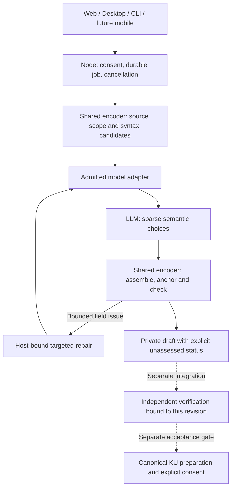

# Shared KU semantic selection profile v1

Owner approved this division of work on 2026-09-09 and explicitly requires the
same architecture across platforms. This extends the
[shared extraction framework](KU_EXTRACTION_FRAMEWORK_PROFILE_V1.md) and the
[private draft workflow](KU_REVIEW_DRAFT_PROFILE_V1.md). It does not change
canonical KU/SEM, Registry trust, publication, rewards or model qualification.

## Common ownership boundary

The shared Rust encoder owns the source planner, selection schema, deterministic
assembler, validation, repair scope and resource accounting. The node owns
consent, durable jobs, cancellation and stored revisions. Web, Desktop, CLI and
future mobile adapters consume these same results; they MUST NOT maintain their
own semantic rules, prompts, number converters or draft assemblers. Model adapters
only implement admitted inference/tokenizer/resource mechanics. Device memory,
threading and transport may differ; semantic decisions and acceptance MUST NOT.

This is a shared contract update, not mobile implementation or mobile build
evidence. Mobile integration remains subject to its existing build contract and
work packages. No mobile-specific implementation is authorized or claimed here.

| Task | Owner | Meaning of the result |
|---|---|---|
| Find numeric syntax and attached text | Host rules | Candidate substrings, not inferred units or counted entities |
| Locate omitted lexical cues inside one source-grounded claim | Host rules | A suggested repair field; the LLM still chooses or declines the semantic value |
| Choose claims, subject, predicate and arguments | LLM or a separately admitted rule extractor | Unverified semantic selections |
| Attach frequency, negation, condition and other qualifiers | LLM | Scope chosen from source; a lexical match alone is insufficient |
| Choose relation kind and the target source clause | LLM | Semantic relationship proposal, not a numeric claim index |
| Resolve quotes, offsets, evidence and relation indices | Host | Deterministic mapping or an explicit ambiguity issue |
| Parse numeric values and fill structural defaults | Host | Exact source-preserving mechanics, not implicit knowledge |
| Serialize the complete draft and check schema/coverage | Host | Mechanical conformance only |
| Assess extraction fidelity or factual accuracy | Separate verification stage | Bound review evidence; not implied by schema success |

## Sparse model wire contract

The provider returns `claims`, with required `subject` and `predicate` quotes.
Only populated semantic fields are emitted: `arguments`, qualifier arrays,
`quantities`, `links`, and an optional disambiguating `anchor`. Difficult content
can be retained as `unresolved`. The host generates empty structural arrays;
absence of a selection never proves absence of the corresponding source meaning.

Each quantity selects a source `quote`, with optional `unit` or `counted_entity`
quotes. The host parses the one exact number in that quote. The model does not
repeat a separate numeric value, compute conversions or assign Registry IDs.
Missing, multiple or unsupported numbers and simultaneous unit/count annotations
remain explicit issues. Rule candidates are suggestions: the model may select
other source phrases; no candidate list may silently delete unrecognized content.

Each link selects `to` (a source clause identifying the target claim), `kind` and
`via` (the source connective). Host mapping requires exactly one compatible target
claim. It MUST NOT choose a nearby claim, infer a target from list order, or accept
self-links. Choosing the right semantic target remains the model's responsibility.

The host derives the smallest continuous evidence interval containing the chosen
claim fields when each quote can be anchored uniquely. Repeated/ambiguous quotes
require an explicit source `anchor` or remain unresolved. An anchor is a scope
selection, never an instruction to assert every clause inside it. Connectives and
target-clause quotes are not evidence for the originating claim's semantic roles.
Original text and all unassigned content remain available for review.

The closed schemas and detailed semantic instructions are in
`ku-semantic-selection-v1/`. Compact output does not justify removing instructions
about condition, negation, relation scope or multiple claims. Formatting mechanics
are delegated to the host; language interpretation is retained in the model task.

## Targeted repair

After assembly, host-detectable issues may produce a repair request bound to one
recorded claim/revision and an explicit allow-list of fields. The provider returns
only `patch` values for those fields. It supplies no claim index, old-value copy,
arbitrary path or executable action. The host owns the target binding.
The decoder schema itself MUST restrict patch properties to the allow-list,
including long focus windows. Natural-language instructions are not a substitute
for this structural restriction; host validation remains mandatory as well.

For a missing argument preposition, the host offers the retained argument quotes
and their exact source-adjacent extensions. A repair cannot replace an argument
with the entire sentence to hide missing coverage. For a link repair, it offers
only uniquely mapped evidence quotes of other retained claims, excluding self
and ambiguous targets. These are structural alternatives, not asserted semantic
relationships: the model chooses the target/kind, removes a wrong link or reports
unresolved. The same choice set constrains decoding and host patch validation.
It does not expand the repair into missing-claim discovery or arbitrary rewriting.

Apply a patch atomically; reassemble and validate the entire retained selection.
Reject undeclared fields, stale bindings, source fabrication, dropped quantities,
increased uncovered source or new errors. Preserve previous good revisions and
raw proposals, including rejected proposals. An ambiguous repair target is an
issue, not permission to regenerate unrelated claims. Missing claims remain
visible for separate semantic review rather than silently narrowing the scope.

Initial bounds retain 8192 source bytes, 16 focus windows, 64 claims, 32 job calls,
6144 input/2048 output tokens, 600 seconds per call and 1800 charged seconds per
job. Selection uses at most one extraction and two targeted repairs per window.
No-op/unsuccessful repairs stop; changing provider or restarting cannot reset
budgets. Context carries source scope, never permission to read another source.

## Extraction and verification are separate states

For this profile, `draft_extracted` means mechanical assembly/coverage succeeded.
It explicitly has `semantic_verification: unassessed` and
`factual_verification: unassessed`. It MUST NOT be labeled the legacy
`draft_ready` (which included a bounded model review), verified, accepted or
saveable KU. Host-detectable defects produce `needs_review`; partial drafts remain
readable. A same-model repair is not independent verification.

Verification is a separate node-owned asynchronous stage with its own declared
scope, reviewer/model identity, source/revision binding, budget and durable
outcome. If no verifier is configured, expose `unassessed`; do not silently invoke
the drafting model and call it independent verification. A verifier must review
semantic relationships as well as host errors: no host error does not imply
correct meaning. Changed revisions invalidate earlier verification bindings.
Publications remain dependent on their own existing authority and consent.

The first implementation may produce and retain unassessed drafts without an
independent verifier configured. This is an explicit product state, not evidence
that independent verification has been implemented. Verification integration and
canonical lowering retain their separate acceptance gates.

## Versioning and evidence

New jobs bind `ku-semantic-selection/1.0` and the exact prompts, schemas, planner
and assembler implementation. Existing v1 review jobs remain readable with their
original status and provenance. An old commitment may not be resumed under a new
executor without an explicit compatible implementation; no silent reinterpretation
or budget-reset migration is allowed.

Common tests cover fabricated/repeated quotes, swapped link targets, quantity
omissions, unsafe repairs, preserved prior revisions, restart/cancel and source
coverage. They run below the platform layer. Adapters additionally test tokenizer,
template, grammar support, memory and cancellation on their target platform.

Development evaluation records meaning checks separately from mechanical state,
model calls, input/output tokens and latency. Compare extraction-only latency as
well as total work: removing automatic self-review must not be reported as the
same verified work becoming faster. Five known short cases are not broad model
qualification or proof of fidelity on long or ambiguous documents.
