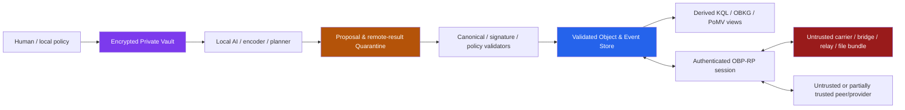

# OneBrain vNext — Foundation Threat Model v1

> **Task:** `FND-008`  
> **Status:** Normative foundation threat model  
> **Scope:** identity, object/event integrity, Need privacy, OBP-RP, capability/AI, fidelity, provider records, checkpoint/GC and legacy migration  
> **Out of scope:** OBT economics, BCI/actuator safety certification and a truth oracle

## 1. Security objective

OneBrain must preserve useful local operation during partition while preventing transport, routing, storage, AI execution and derived ranking from silently acquiring semantic or human authority.

Security is scoped. This threat model does not promise unconditional availability, global anonymity, global revocation or truth consensus.

## 2. Protected assets

| Asset | Required property | Failure example |
|---|---|---|
| Canonical object/event bytes | integrity and content-address consistency | same CID overwrites different accepted bytes |
| Knowledge branch diversity | preservation of concurrent/opposing valid artifacts | winner/finality cleanup deletes a minority branch |
| Feed/key authority | scoped authentication and no authority amplification | bridge/provider signs or adopts as the author |
| Private intent/context | confidentiality and unlinkability within stated disclosure profile | private NeedIR or goal commitment appears in transcript |
| Mapping/adoption boundary | explicit durable and authority transitions | ranked proposal changes Assembly/OBKG state |
| Local autonomy | operation without seed/global quorum | isolated node cannot create/query/use local KU |
| Reconciliation correctness | exact scoped convergence under stated delivery/resource assumptions | probabilistic summary creates false completion |
| Fidelity evidence | source-representation assessment without Sybil inflation | 100 NodeIDs using one pipeline count as independent |
| Provider/revocation state | no replay renewal/resurrection | old lease/retire ordering revives provider authority |
| Checkpoint/retention anchors | restorable compaction without unseen-fork loss | checkpoint suppresses an event without proof |
| Local resources | bounded CPU, memory, storage and bandwidth | malicious manifest/parser exhausts node |
| Private Vault/Quarantine | storage-class isolation | remote output executes a tool or enters public graph |

## 3. Trust boundaries



### 3.1 Boundary rules

1. Everything arriving from a carrier/peer is untrusted until canonical, CID, signature, schema, resource and policy checks complete.
2. Quarantine is non-executable. Validation success creates eligibility for an explicit durable action, not the action itself.
3. Derived views may be deleted/rebuilt and cannot grant authority to their source events.
4. Private Vault data leaves only through an explicit disclosure compiler/permit; normal reconciliation excludes the Vault storage class.
5. A local AI process is not automatically trusted for publish, adoption, disclosure or side effects.
6. Seed/relay/DHT/provider data is routing evidence only.

## 4. Adversary classes

| Adversary | Capabilities | Assumed limitations |
|---|---|---|
| Malicious peer | sends arbitrary bytes/messages, replays/reorders/drops data, advertises false availability, opens many sessions | cannot forge uncompromised signatures or BLAKE3 preimages |
| Malicious bridge/relay | observes timing/size, duplicates/substitutes/delays bundles, withholds paths | has no content/author authority by position |
| Malicious/compromised seed | returns Sybil/eclipse hints or no hints | not required after bootstrap; hints are untrusted |
| Sybil operator | creates many NodeIDs/devices/offers/attestations using correlated pipelines | cannot turn self-claims into evidenced-distinct correlation groups |
| Curious provider | learns requested selector/task and attempts cross-context linkage | disclosure/session profiles limit but do not guarantee global anonymity |
| Compromised remote AI | returns malicious instructions/results, lies about model/tool/runtime | result remains signed provenance in Quarantine; local evaluator controls effects |
| Stale partition peer | honestly replays old lease, key state, event or checkpoint after long isolation | may lack later revocation/retirement proof |
| Legacy peer | emits `GLOBAL/FULL`, truncated identity or unscoped status | isolated adapter downgrades semantics and preserves bytes |
| Local unprivileged process | reads logs/status and tries API misuse | OS/key-store sandboxing exists; raw Vault access is denied |
| Compromised local root/device key | can read local secrets or sign within compromised authority | recovery cannot retroactively protect the compromised endpoint; scope/rotation limits blast radius |

## 5. Explicit non-goals and assumptions

- OneBrain does not prove a proposition true or false by network vote.
- It does not guarantee availability under permanent isolation, total local storage loss or all providers refusing service.
- It does not guarantee traffic-analysis anonymity against a global observer.
- Revocation is effective relative to observed key-state evidence; a permanently isolated component cannot know an unseen revocation.
- A fully compromised local root/device may violate local confidentiality until recovery/rotation evidence is observed.
- BCI writes, irreversible actuators and OBT transfer require separate higher-risk threat models.
- Cryptographic primitives are assumed correctly implemented; side-channel/hardware fault analysis is deferred to implementation profiles.

## 6. Data classification and disclosure ceilings

| Class | Examples | Default storage/transmission | Required transition |
|---|---|---|---|
| `PUBLIC_CANONICAL` | public KU, explicit public Affordance, public signed event | validated Public Store; selector-scoped reconciliation | canonical/CID/schema/signature checks |
| `PUBLIC_OPAQUE` | unknown non-executable object bytes | bounded opaque store/forward | CID check; no projection/execution |
| `ROUTE_MINIMAL` | coarse Need token, one-time reply key, padding/expiry | short-lived OBP message | disclosure compiler; support/generalization policy |
| `NEGOTIATED_ENCRYPTED` | progressive Need/capability capsule | encrypted session only | recipient/purpose/TTL Permit |
| `PRIVATE_LOCAL` | full NeedIR, ClaimEnvelope, goal, propensity/debt, raw observation | encrypted Vault; no inventory | informed local policy/consent + explicit transform |
| `QUARANTINED` | remote result, BindingProposal, unknown critical object | non-executable Quarantine | local evaluation then separate durable/publish/adopt/use action |
| `SECRET_KEY` | device/feed/private reply keys | OS keystore/HSM where available | key-use API only; never log/export |

## 7. Threats and required controls

### 7.1 Canonical bytes, CID and store

| Threat | Controls | Kill condition |
|---|---|---|
| Same CID/different bytes overwrite | domain-separated CID recomputation, canonical byte equality, immutable put, quarantine | any accepted overwrite blocks G1/G3 |
| Parser/decompression bomb | pre-allocation byte limits, depth/item/node/scalar caps, chunk manifests | panic/OOM/unbounded CPU blocks profile |
| Cross-type substitution | typed IDs, record-domain hash/signature separation | same signature/digest accepted in another domain blocks G1 |
| Unknown schema execution | opaque original-byte store; no projection/action | unknown critical object reaches reducer/tool blocks release |

### 7.2 Identity, session and feed

| Threat | Controls | Kill condition |
|---|---|---|
| `u64` prefix collision | full-width typed IDs across wire/store/clock/ACK/watch | any alias in conformance suite blocks G1 |
| Handshake downgrade/replay | transcript nonce, profile/capability binding, full transport principal | accepted downgrade/replay blocks G1 |
| Feed namespace linking | do not bind all FeedIDs to transport identity; disclose scoped proof only | default transcript links two private namespaces blocks G1 |
| Feed equivocation accusation without proof | unresolved head state until consistency/conflict proof | missing proof emits equivocation blocks G3 |
| Authority amplification by forwarding | permit/key-state evaluation independent of carrier | bridge/relay/provider gains effects blocks G4 |

### 7.3 Reconciliation and partition

| Threat | Controls | Kill condition |
|---|---|---|
| False completion | named selector/boundary/root/frontier; deterministic Merkle fallback | accepted false completion blocks G3 |
| Eclipse/withholding | multipath/manual/mDNS/peer-memory/file carriers; explicit limitations | status claims global absence/completion blocks G3 |
| Duplicate/reorder side effects | immutable union, EventCID/idempotency key, durable ACK after persist | replay materializes/adopts twice blocks G3 |
| Malicious inventory proof | proof/root validation and resource caps | invalid proof changes accepted set blocks G3 |
| Seed dependency | seed only supplies hints; disconnect test | seed outage disables local operation blocks G3 |

### 7.4 Need/KQL privacy

| Threat | Controls | Kill condition |
|---|---|---|
| Raw private Need leakage | full NeedIR Vault-only; never OBP payload | forbidden field in transcript blocks G4 |
| Dictionary attack on private goal hash | no deterministic commitment; randomized binding-hiding only under explicit policy | raw hash/nonce/opening appears publicly blocks G4 |
| Linkability across subqueries | at most three packets, one coarse token and distinct reply key per packet | stable Receptor/Assembly/Need/User/Node ID blocks G4 |
| Rare token deanonymization | support threshold/generalize/suppress, padding and expiry | below-policy token sent blocks G4 |
| StandingNeed leakage | outbound inventory excludes private Claim/StandingNeed | private watch object in public inventory blocks G3/G4 |

### 7.5 Mapping, Capability and AI

| Threat | Controls | Kill condition |
|---|---|---|
| Model/ranker creates authoritative relation | proposal in Quarantine; explicit Materialize command; separate ADOPT event | candidate creates active edge blocks M2 |
| Remote output prompt/tool injection | sandbox, typed result, Quarantine, local validation and separate effect action | verify-pass executes side effect blocks M4b |
| Offer mistaken for permission | Definition/Manifest/Offer/Permit split; effect-set evaluator | Offer alone authorizes task blocks G4 |
| Delegation expansion | child effect/purpose/budget/lifetime intersection; onward off by default | property finds expanded child blocks G4 |
| Private input retention | purpose/TTL/retention Permit and auditable execution record | provider exceeds ceiling without explicit policy blocks M4b |

### 7.6 Fidelity and Sybil correlation

| Threat | Controls | Kill condition |
|---|---|---|
| Many correlated nodes inflate corroboration | per-dimension correlation evidence; conservative UNKNOWN grouping | 100 same-pipeline Sybils increase group count blocks G4 |
| Blind attempt copies revealed target | commit-before-reveal, source/task commitments | copied/replayed output counts as blind blocks G4 |
| Fidelity becomes truth vote | assessment names source/encoding/policy/frontier only | API labels proposition verified/true from fidelity blocks G5 |
| Legacy FULL deletes alternatives | LegacyEncodingClaim only; immutable alternatives | adapter removes raw/alternate blocks G5 |

### 7.7 Provider, revocation and time

| Threat | Controls | Kill condition |
|---|---|---|
| Lease replay renews availability | local `first_seen_monotonic(record_cid)`; higher generation only renews | same CID resets age blocks G4 |
| Provider overwrite/hot key | multi-provider reducer; bounded diversity-aware sample + partial coverage | one provider erases another or response claims full after sampling blocks G4 |
| Stale retirement resurrection | exact retire-through-generation high-water state | old lease becomes active after observed retirement blocks G4/G6 |
| Fixed Earth TTL in DTN/Mars | named policy profile and task-specific signed local bounds | Earth default silently applied as cosmic invariant blocks profile |
| Wall-clock winner | generation/proof/frontier reducers; advisory time only | arrival/wall clock chooses semantic winner blocks G4 |

### 7.8 Checkpoint and GC

| Threat | Controls | Kill condition |
|---|---|---|
| Checkpoint hides unseen fork | inclusion/consistency/effect proof; unresolved missing head | unseen branch suppressed blocks G6 |
| Retirement floor loss | exact high-water roots retained/restored | stale state resurrects after restore blocks G6 |
| Destructive GC before proof | shadow/dry-run, model/property gates, restore drill, kill switch | payload deleted before G7 blocks release |
| Local eviction presented globally | retention audit wording and re-fetch semantics | network tombstone/global delete inferred blocks G6 |

### 7.9 Legacy migration

| Threat | Controls | Kill condition |
|---|---|---|
| Invented full identity from `u64` | `LegacyIdentityPrefix` only; no pad/hash claim | migrated row claims original full principal blocks G5 |
| Legacy GLOBAL/FULL semantic leak | isolated adapter; canonical enum negative tests | vNext serializer emits alias blocks G5 |
| Provenance rewrite | preserve original bytes/ref; signed migration event | original bytes lost/rewritten blocks G5 |
| Unsafe rollback | validated vNext store retained; never send vNext through legacy sync | rollback overwrites/truncates vNext blocks G3/G5 |

## 8. Abuse budgets

Every remotely triggerable operation requires local configurable limits:

- concurrent sessions per transport principal and per local interface;
- bytes, objects, proof nodes and decoded nodes per session;
- CPU/work tokens per selector/query/proof;
- Quarantine and opaque-store quotas by source/profile;
- manifest dependency depth and missing-parent requests;
- retry, resume and duplicate-path ceilings;
- provider offers per tuple/principal and response sample cap;
- remote task duration, memory, output bytes and effect ceiling.

Exceeding a budget returns a scoped partial/error status. It must not produce global absence, peer epistemic distrust or knowledge deletion.

## 9. Security invariants

The verification program must preserve:

```text
NoAcceptedSameCIDDifferentBytes
NoAuthorityAmplification
NoPrivateNeedInPublicTranscript
NoGlobalCompletionClaim
NoObservedRetirementResurrection
CheckpointSuppressesOnlyProvenCoveredEvents
PreserveConcurrentKnowledgeBranch
ExactlyOnceLocalMaterialization
RemoteResultHasNoImplicitEffect
OBTFailureDoesNotBlockKnowledgePlane
```

## 10. Kill switches

| Feature | Default | Kill trigger | Safe fallback |
|---|---|---|---|
| Public RouteNeedSketch | Off | identifier/token leakage or support-policy failure | local Need + bounded public selector/exact CID |
| Remote cognition M4b | Off | sandbox/permit/quarantine escape | local AI only |
| Provider DHT vNext | Opt-in | replay renewal, overwrite, hot-key resource failure | PEX/direct/exact CID + probe |
| RIBLT | Off/optional | root mismatch, resource amplification, no measured benefit | deterministic Merkle |
| Checkpoint suppression | Shadow first | proof/model mismatch | replay full feed |
| Destructive payload GC | Off through G6 | restore failure or resurrection | retain payload/local cache eviction only |
| Legacy adapter outbound | Off unless negotiated | authority/disclosure expansion | inbound opaque/partial adapter only |

Kill switches are local policy. No central activation epoch or global rollout authority exists.

## 11. Required adversarial tests

1. same CID/different bytes through 1/2/5 bridges;
2. duplicate/reorder/drop/delay and crash/resume at every reconciliation state;
3. full-width IDs sharing the same 64-bit prefix;
4. handshake profile/selector/budget/resume-token tampering;
5. private Need/Claim/StandingNeed forbidden-field and corpus-dictionary tests;
6. 100 Sybil NodeIDs sharing model/prompt/pipeline lineage;
7. Offer without Permit and child Permit authority-expansion attempts;
8. ProviderLease replay, retire-before-lease and same-generation fork;
9. checkpoint-before-old-event, unseen fork and missing proof/head;
10. legacy GLOBAL/FULL parse and canonical reserialize;
11. remote output attempting graph/profile/tool mutation from Quarantine;
12. OBT unavailable/corrupt/backpressured during publish/query/sync/adopt.

## 12. Acceptance and review

- [x] Protected assets and their security properties are enumerated.
- [x] Trust boundaries and storage classes are explicit.
- [x] Adversary capabilities and assumptions are explicit.
- [x] Threats cover identity, privacy, network, AI, fidelity, provider, GC and migration.
- [x] Resource-abuse budgets and local kill switches are explicit.
- [x] Security invariants and adversarial test seeds map to future verification gates.

