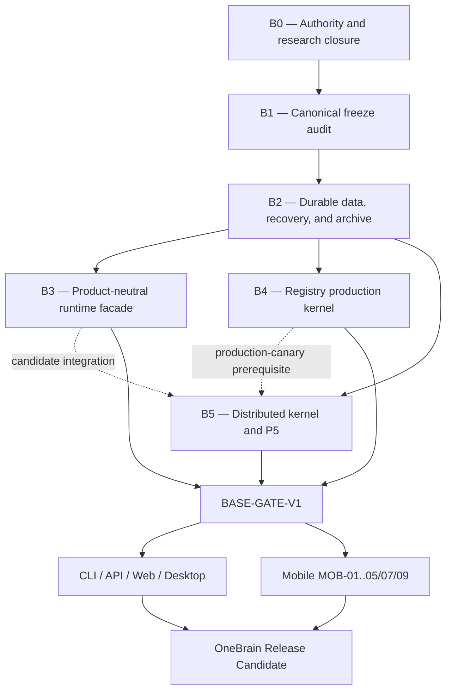

# OneBrain Base v1 Production-Qualified — Program Design

> Date: 2026-08-06
>
> Status: Approved design direction; written-spec review pending
>
> Target: `BASE-GATE-V1` before any new Desktop or Mobile product behavior
>
> Strategy: Research first, complete and freeze Base v1, then build product adapters in parallel

## 1. Purpose

This document defines the program boundary, dependency order, evidence gates,
and product handoff for a production-qualified OneBrain Base v1.

The objective is not merely to freeze public types. It is to ensure that
Desktop and Mobile consume one versioned backend whose canonical data,
recovery, storage, runtime, Registry, and distributed behavior have already
been implemented and qualified. Product teams must not compensate for missing
Base behavior or cause incompatible Base changes after product implementation
begins.

This is a program-level design. Each Base workstream receives its own focused
design specification and TDD implementation plan before code changes begin.

## 2. Approved decisions

1. **Base-first delivery is mandatory.** New Desktop and Mobile product
   behavior remains blocked until `BASE-GATE-V1` passes.
2. **The target is production-qualified, not contract-only.** A frozen schema
   without recovery, full-size Registry evidence, and a multi-host P5 canary is
   insufficient.
3. **vNext is the canonical Base v1 write path.** Legacy data remains available
   only through an explicit, versioned, read-only compatibility and migration
   boundary. Product clients must not silently select a legacy backend with
   different meaning.
4. **One product-neutral service boundary owns Base behavior.** REST, CLI,
   Desktop, Web, C ABI, native hosts, and Flutter are projections of the same
   typed Rust semantics; they are not independent contracts.
5. **Product release remains default-off for distributed capabilities.** Base
   qualification proves the distributed kernel, but does not automatically
   enable public networking, publication, or seeding.
6. **Incompatible Base v1 changes are forbidden after freeze.** Additive
   compatible changes require a Base v1 minor revision. Incompatible changes
   require Base v2, migration, rollback evidence, and new golden vectors.

## 3. Current baseline

### 3.1 Proven foundation

- The KU v7.1 foundation tracker has 96 of 99 items complete. The three open
  items—`RUN-003`, `RIB-001`, and `RIB-002`—are explicitly optional and do not
  block Base v1.
- Canonical codec, typed full-width identifiers, immutable objects, signed
  event/feed contracts, semantic firewalls, property suites, migration
  guidance, and the vNext product integration profile are present.
- Distributed runtime P0 through P3 and DR-M5/M5-00..07 are implemented.
- The accepted M5-07 72-hour evidence is valid only for its pinned artifact and
  approved carry-forward boundary.
- Concept Registry signed release, atomic activation foundations, CCID
  stability harness, resource harness, and corruption/disk-shortage harness
  exist.
- Mobile authority and build-contract validators pass against the current
  required read set.

### 3.2 Base gaps that block product work

- The product backup API ignores its password, writes plaintext JSON, and does
  not restore canonical KU or blob data.
- Identity recovery accepts arbitrary 24-token input, ignores the password,
  and does not recover the original cryptographic identity.
- Filesystem blob paths use a collision-prone short identifier and reads do
  not revalidate the complete content identity.
- Derived retriever and KQL indexes are not consistently crash-safe,
  rebuildable, or delete/update consistent.
- Some UTF-8 previews use byte slicing that can panic.
- Import/export is not yet a complete canonical round trip.
- A single product-neutral runtime/API/ABI compatibility tuple is not emitted
  or enforced across consumers.
- Concept Registry production-size qualification remains open.
- P5 multi-host production canary and exact-candidate qualification remain
  open.

Passing workspace tests therefore describes the current snapshot but does not
close `BASE-GATE-V1`.

## 4. Scope

### 4.1 Included in Base v1

- Canonical identity, object, event, feed, KU, Receptor, Mapping, KQL, typed
  CID, codec, domain, schema, resource-limit, and semantic-firewall contracts.
- Validated public store, encrypted Vault, bounded Quarantine, canonical blob
  storage, journals, outbox, migration state, and deterministically rebuildable
  derived indexes.
- Real identity recovery and a versioned encrypted OneBrain archive/restore
  path.
- One product-neutral runtime facade with lifecycle, cancellation, generation
  fencing, budgets, typed errors, status, idempotency, and version negotiation.
- Generated JSON/TypeScript, C ABI, native-host, and Flutter projections of the
  same semantic interface.
- Platform-neutral Concept Registry trust, signed release, chunk/whole-file
  verification, immutable activation, rollback, and bounded indexed access.
- Authenticated distributed runtime, durable reconciliation, network-off
  correctness, resource admission, rollback, and multi-host P5 qualification.
- Base CI, compatibility, migration, security, SBOM, evidence manifest, tag,
  and rollback documentation.

### 4.2 Excluded from the Base v1 gate

- Desktop/Web visual completion, Tauri packaging, installers, and public
  product release.
- Mobile product completion, platform-specific Registry transfer adapters,
  physical store qualification, and Store release.
- `RUN-003` remote cognition and `RIB-001/002` RIBLT optimization.
- M6A active distributed KQL/provider DHT/WATCH.
- M6B distributed Outcome/Benefit workflows.
- M7 reward firewall, production OBT, ledger, and wallet.
- AI provider selection, local model bake-offs, and cloud inference.
- Generic KU publication, external-blind verifier exchange, mobile seeding,
  passive OBP matching, and social/global product semantics.

Excluded features must use versioned extension points and must not force an
incompatible change to Base v1.

## 5. Architecture and dependency gates



Before `BASE-GATE-V1`, product repositories may receive only security fixes,
CI maintenance, design/authority maintenance, and scaffold-preserving changes.
They may not add behavior that depends on an unfinished Base contract.

## 6. Workstreams

### WS-00 — Base authority closure

This workstream precedes Base implementation and closes all decisions that
would otherwise cause redesign:

1. Freeze the vNext object/event/feed family as the Base v1 canonical write
   source. Define exact legacy read/migration and retirement behavior.
2. Select one reviewed recovery profile before WS-11 implementation:
   - a versioned encrypted recovery package with a separately verified
     recovery key, which is the recommended Base v1 profile; or
   - audited mnemonic derivation with frozen parameters and vectors.
   The current BIP39-shaped placeholder is not an allowed profile.
3. Freeze archive scope, retention classes, encryption/KDF profile, device-key
   behavior, and non-exportable signer recovery/re-provisioning semantics.
4. Freeze canonical semantic IDL ownership and generated projection rules.
5. Freeze Registry modes: Bootstrap/Limited may run without an active release;
   Registry-dependent encoding and `ReadyOffline` fail closed until one exact
   release is active.
6. Freeze the P5 Base profile and keep all production network lanes default-off
   after qualification.
7. Freeze user-visible delete as an explicit event/local-retention operation;
   it must not rewrite immutable canonical history or imply global deletion.

**Exit:** owner-approved ADRs and machine contracts contain no contradictory
authority, ambiguous ownership, or silent fallback. Any conflict among
canonical documents stops the workstream for owner resolution.

### WS-01 — Canonical freeze audit

- Reconcile `FND-*`, `IDN-*`, `OBJ-*`, `EVT-*`, `FEED-*`, `KU-*`, and `KQL-*`
  authority with code, vectors, traceability, and negative assertions.
- Correct documentation/status drift without changing frozen meaning.
- Freeze a Base schema/domain/resource registry and its digest.
- Prove cross-crate encode/decode/invalid-vector conformance.

**Exit:** every public Base schema has valid and invalid vectors; schema,
domain, and resource registry drift fails CI.

### WS-10 — Storage, blob, and derived-index integrity

- Replace collision-prone short blob paths with a collision-resistant full-CID
  namespace and a migration that detects existing collisions.
- Revalidate length, content hash, and expected type on every authoritative
  read before returning bytes.
- Enforce per-object and total quota, free-space admission, atomic writes,
  reference/retention rules, and bounded cleanup.
- Give KQL, retriever, OBKG, and search indexes a version and canonical source
  root. Write them atomically and rebuild deterministically after corruption.
- Make update/delete/rebuild parity explicit and testable.
- Correct UTF-8 byte/character boundaries and complete canonical import/export
  round trips.

**Exit:** collision, corrupt-read, quota, ENOSPC, kill, stale-index, delete,
update, rebuild, and Unicode tests pass; a corrupt derived index cannot prevent
startup when canonical storage is valid.

### WS-11 — Identity recovery and encrypted archive

- Implement the recovery profile approved by WS-00 with versioned parameters,
  negative vectors, and domain-separated keys.
- Replace the legacy plaintext/incomplete product backup path with a versioned
  encrypted OneBrain archive.
- Archive all portable canonical object/event/feed state, owned blobs, Vault,
  Quarantine, journals, pending outbox, migration state, configuration required
  for interpretation, and recovery metadata permitted by the key policy.
- Exclude rebuildable derived indexes and re-provisionable Registry/model bytes,
  while retaining the signed authority/high-water metadata required to detect
  downgrade or equivocation.
- Verify the entire archive before creating a restore target. Restore into a
  new dataset generation and atomically switch only after parity and health
  checks pass.
- Re-provision non-exportable device/transport keys through explicit policy;
  never claim that an absent key was restored.

**Exit:** archive to a clean directory reproduces canonical/object/blob/feed
roots. Wrong password/key, modified byte, unsafe path, missing file, downgrade,
duplicate restore, and kill at every commit boundary fail without partial
activation.

### WS-20 — Product-neutral runtime facade

One `OneBrainNode` owns at most one Base runtime. Consumers use a typed service
interface rather than subsystem handles, raw database access, secrets, paths,
or runtime references.

The minimum semantic surface is:

```text
open / negotiate(profile, capabilities, compatibility_tuple)
status / snapshot
query(request, opaque_continuation)
prepare(command) -> PreparedIntent
confirm(intent, idempotency_key) -> OperationReceipt
cancel(operation_id)
reconcile(operation_id)
subscribe(topic, cursor)
drain / close
```

The stable C ABI uses opaque handles, `struct_size`, ABI major/minor, explicit
byte lengths, asynchronous operation IDs, clear ownership/lifetime rules, and
process-generation fencing. JSON/TypeScript and Flutter projections carry the
same required fields and error semantics. REST is a local authenticated
projection, not the canonical in-process boundary.

**Exit:** Rust, REST, C/native, and Flutter conformance vectors have identical
semantic outcomes; N-1 negotiate/decode/migrate/rollback tests pass; packaged
CLI/API use the vNext facade by default and legacy requires an explicit
compatibility flag.

### WS-21 — Registry production kernel

- Preserve signed exact-file releases, immutable generations, provenance/SBOM,
  stable CCID mapping, atomic activation, rollback, and required-mode failure.
- Complete full-size reference qualification for cold cache, low RAM, SSD,
  HDD, truncated indexes, disk shortage, update interruption, and live-reader
  generation swaps.
- Keep mobile/desktop OS transfer scheduling outside the Base kernel. Those
  adapters feed verified bytes into the same signed, versioned Base contract.

**Exit:** a 2.2 GB-class release qualifies on declared reference profiles;
corruption or interruption cannot damage the active generation; rollback and
CCID stability evidence bind the exact candidate.

### WS-22 — Distributed kernel and P5

- P5 harness and fault-matrix preparation may proceed alongside WS-20/21, but
  the exact production canary cannot begin until the WS-20 facade candidate and
  WS-21 Registry production-kernel exit are complete.
- Qualify authenticated real-QUIC sessions, durable outbox/journal,
  deterministic reunion, route/key authority boundaries, resource admission,
  telemetry, kill switches, and network-off correctness.
- Run a multi-host candidate canary covering partition, drop/reorder/duplicate,
  restart, address change, seed outage, signer outage, disk pressure, slow peer,
  restore, rollback, and re-enable.
- Bind accepted 72-hour evidence only when its carry-forward profile covers the
  exact Base candidate; otherwise rerun the soak.

**Exit:** the exact Base candidate passes multi-host P5 evidence with bounded
memory/disk/tasks and no authority, truth, completion, reward, or wallet
amplification. Local KQL and canonical storage remain usable with every network
lane disabled.

### WS-23 — Cross-lane integration

- Assign one integration owner for high-conflict exports, `node.rs`, Cargo
  manifests, schema registries, and generated interfaces.
- Integrate in the fixed order: contract/vector → pure core → persistence →
  facade/adapter → migration → product-neutral smoke.
- Reject adapter-specific semantic forks and duplicated handwritten DTOs.

**Exit:** all Base consumers negotiate one compatibility tuple and observe the
same typed status, errors, limits, and canonical roots.

### WS-30 — Base qualification and freeze

Converge WS-00/01/10/11/20/21/22/23 into one exact candidate and run the full
Base matrix. Produce:

- immutable `base-v1.0.0` tag and commit digest;
- Base compatibility tuple and machine-readable evidence manifest;
- schema/domain/storage/archive/wire/API/ABI versions and digests;
- feature/default/kill-switch matrix;
- SBOM, dependency-audit triage, migration guide, rollback guide, and changelog;
- exact evidence links and artifact hashes.

**Exit:** all `BASE-GATE-V1` criteria in Section 11 pass and no P0/P1 remains in
the Base scope.

## 7. Base data and command flow

1. A product projection negotiates the Base profile and compatibility tuple.
2. The facade validates capability, lifecycle, budget, data class, and
   idempotency before admitting work.
3. Read requests use canonical storage plus bounded derived projections. A
   projection failure returns typed degraded status and triggers bounded
   rebuild; it does not reinterpret canonical state.
4. Mutating commands are prepared into an exact intent. Confirmation binds the
   intent, current generation, authority/policy, and idempotency key.
5. Durable intent/journal state is committed before an external side effect.
6. Completion or an unknown outcome is reconciled through an operation receipt;
   non-idempotent unknown work is never replayed blindly.
7. Product clients receive versioned status, coverage, limitations, and typed
   errors. They do not receive raw signer material, database handles, private
   runtime references, or permission to supply authority.

## 8. Failure and recovery semantics

- Invalid canonical bytes, signature/schema mismatch, wrong key, corruption,
  unsafe path, incompatible version, or insufficient resources fail before an
  authoritative side effect.
- A process kill at any transaction boundary leaves none, the previous complete
  generation, or one new complete generation—never a mixed state.
- Derived data may be deleted and rebuilt. Canonical data requires a migration
  or explicit retention operation and is never silently rewritten.
- Error retryability is explicit. Transport/dependency errors do not upgrade
  pending or deferred work to accepted, published, or complete.
- All network and optional capability lanes remain independently disableable.
- A document conflict, new P0/P1, root mismatch, or API/ABI drift is a
  stop-the-line condition. The affected workstream cannot lower its gate or
  mask backend incompleteness in the UI.

## 9. Product work after `BASE-GATE-V1`

### 9.1 CLI, API, Web, and Desktop lane

Order:

1. API schema-diff and black-box auth/privacy/idempotency gates.
2. CLI compatibility negotiation and black-box command tests.
3. Web browser E2E, accessibility, token expiry, and recovery.
4. Desktop embedded-node lifecycle, onboarding persistence, and Tauri bundles.
5. Native install/upgrade/downgrade/uninstall smoke on Windows, Linux, and
   macOS.
6. Signed artifacts, checksums, SBOM, provenance, release notes, and rollback
   assets.

Existing Tauri build-hook, setup-wizard, installer placeholder, stale binary,
versioning, and supply-chain gaps are product-lane blockers, not reasons to
weaken Base.

### 9.2 Mobile lane

After the Base gate, resume the canonical package order:

- `MOB-00`: update authority and evidence for the frozen Base tuple.
- `MOB-01`: close final generated ABI/thread/lifetime and physical-launch
  evidence.
- `MOB-02/03`: bind runtime lifecycle, platform custody, archive/recovery, and
  migration to Base v1.
- `MOB-05B/05C`: complete platform-specific Registry transfer, whole-artifact
  verification, activation, health, rollback, GC, and full-size device evidence.
- `MOB-04`: complete canonical encode → preview → immutable private Save →
  Library/search/KQL → archive/restore and close Offline MVP.
- `MOB-07/09`: close media/lifecycle/energy, physical-device, signing, SBOM,
  rollback, Store, and soak evidence.

Planning and this document do not constitute mobile implementation evidence.
Any mobile implementation change must name its active `MOB-00..09` package and
affected canonical `MOB-*`, `MOB-SCR-*`, `OBM-CMP-*`, and `OBM-PAT-*` IDs, update
the mobile evidence ledger, and keep the mobile contract validator green.

## 10. Standard Definition of Done

Every workstream must satisfy all five categories:

1. **Contract:** version, ownership, resource limits, error behavior, negative
   assertions, and rollback semantics are frozen.
2. **TDD:** a failing acceptance or regression test precedes implementation;
   unit, property, integration, and negative tests pass.
3. **Durability:** restart, process kill, corruption, ENOSPC/resource pressure,
   cancellation, and rollback have explicit oracles where applicable.
4. **Compatibility:** migration, N-1 behavior, profile negotiation, and
   no-silent-fallback behavior are proven.
5. **Evidence:** a deterministic report binds commit, artifact hashes,
   environment, versions, commands, results, and limitations.

## 11. `BASE-GATE-V1` acceptance criteria

The gate passes only when all of the following are true:

1. vNext and mobile contract validators pass with current authority digests.
2. Canonical valid/invalid vectors and cross-crate conformance pass.
3. Default and feature-enabled format/check/clippy/test matrices pass on Linux,
   Windows, and macOS.
4. Blob collision, full-hash read, quota, index rebuild/parity, update/delete,
   and Unicode regressions pass.
5. Archive/recovery to a clean directory reproduces exact canonical/object/blob/
   feed roots; all negative and kill-window tests fail safely.
6. Transaction-boundary process-kill/reopen oracles pass for every authoritative
   Base state transition.
7. Runtime facade cross-language conformance, N-1 migration, and rollback pass.
8. Registry full-size reference qualification and CCID stability evidence pass.
9. Multi-host P5 and exact-candidate soak/carry-forward evidence pass.
10. Dependency/security review has no untriaged Base P0/P1 finding.
11. Packaged CLI/API use Base v1 by default; legacy is explicit and cannot
    change vNext meaning.
12. The Base evidence manifest, SBOM, compatibility tuple, changelog, and
    rollback guide are complete and internally consistent.

## 12. Versioning and compatibility tuple

Every Base consumer and artifact must expose the same tuple:

```text
base_semver
base_commit
canonical_schema_digest
storage_schema_version
archive_profile_version
registry_profile_version
wire_session_version
product_api_profile_major_minor
c_abi_major_minor
feature_set_digest
target_triple
toolchain_digest
```

The tuple appears in verbose CLI version output, the API capability endpoint,
Desktop About/diagnostics, Mobile diagnostics, and every artifact manifest.

Version rules:

- `1.0.x`: compatible correctness/security fix; no semantic or wire break.
- `1.x.0`: additive optional capability with old-client behavior preserved.
- `2.0.0`: incompatible contract, storage, archive, wire, or ABI change; requires
  a new design, migration, rollback, vectors, and product requalification.

## 13. Delivery and Git model

- `main` remains the integration branch and must stay releasable at the current
  declared capability level.
- Each workstream uses a short-lived `codex/base-v1-<workstream>` branch and an
  isolated worktree.
- Contract/vector/test commits precede implementation commits.
- High-conflict integration files have one owner; other branches add focused
  modules and small export changes.
- A workstream merges only after its local acceptance gate passes. Downstream
  work starts from the merged dependency commit, not an unreviewed sibling
  branch.
- No product feature branch may merge new Base-dependent behavior before
  `BASE-GATE-V1`.
- The final Base candidate is cut from one exact integrated commit. P5,
  Registry, archive, and cross-platform evidence must bind that commit or an
  explicitly approved carry-forward relation.

## 14. Required follow-on specifications

The program is intentionally decomposed. The master implementation plan will
schedule these focused design → plan → implementation cycles:

1. Base authority and recovery profile.
2. Storage/blob/index integrity.
3. Identity recovery and encrypted archive.
4. Product-neutral runtime facade and generated projections.
5. Registry production qualification.
6. Distributed P5 production qualification.
7. Base compatibility, evidence manifest, and freeze.
8. Desktop/Web/CLI product completion after Base.
9. Mobile Offline RC completion after Base.

The first implementation cycle is Base authority closure, followed by the two
durable-data workstreams. Registry harness preparation may proceed in parallel
only where it does not depend on an unresolved WS-00 decision or unfinished
WS-10/11 semantics.

## 15. Program completion condition

The Base program is complete only when `BASE-GATE-V1` passes and
`base-v1.0.0` is frozen with its evidence manifest. At that point Desktop and
Mobile may implement against the compatibility tuple. A later product finding
may produce a compatible Base patch, but it may not silently redefine Base v1;
an incompatible finding reopens the Base program as Base v2 rather than being
worked around in a product adapter.
