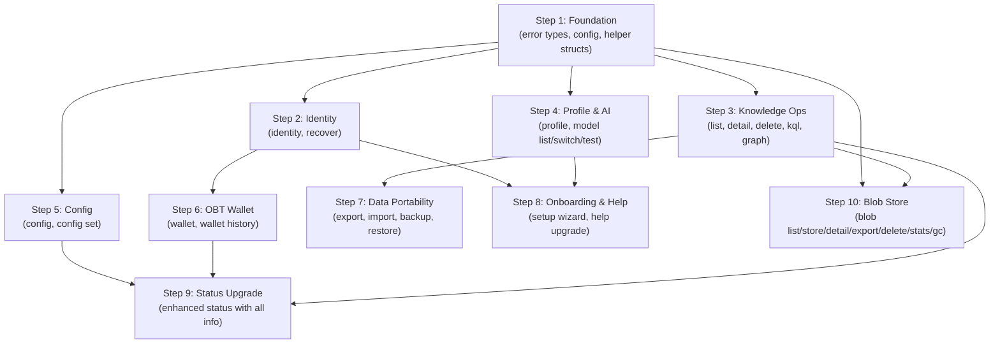

# 📟 OneBrain CLI — Đặc tả tính năng & Tài liệu tham khảo

> Tài liệu mô tả đầy đủ tính năng, câu lệnh, output format của `onebrain-cli`.
> Binary name: `onebrain` | Tech: Rust | Phase: 0 (Foundation)

---

## 1. Tổng quan

OneBrain CLI là **interface đầu tiên** của hệ thống — chạy trực tiếp trên terminal.
Nó là **Full Node**: chạy toàn bộ Rust stack, tự join P2P, tự chạy AI.

```
┌─────────────────────────────────────────┐
│           onebrain-cli (REPL)           │  ← Text UI
├─────────────────────────────────────────┤
│         onebrain-node (library)         │  ← Shared runtime
├─────────────────────────────────────────┤
│ ku-core │ ku-net │ ku-ai │ ku-encoder │ │  ← Core crates
│ ku-kql  │ ku-mediator │ protocol      │ │
└─────────────────────────────────────────┘
```

### Đặc điểm

| Đặc điểm | Giá trị |
|-----------|---------|
| **Loại** | Full Node (direct Rust call) |
| **Giao tiếp** | Interactive REPL (stdin/stdout) |
| **Không login** | Identity = Ed25519 keypair, BIP39 recovery |
| **AI** | Local Ollama (localhost:11434) |
| **P2P** | TCP/QUIC, port 4242 |
| **Storage** | redb (embedded) |
| **Blob Store** | redb (separate `.blob.redb`, 256KB chunks, dedup) |
| **Offline** | Hoạt động một phần (browse, search keyword, graph, blob) |

---

## 2. Khởi động

### 2.1 Lệnh khởi động

```bash
onebrain start [OPTIONS]
```

| Flag | Default | Mô tả |
|------|---------|-------|
| `--name NAME` | `"OneBrain"` | Tên hiển thị của node |
| `--port PORT` | `4242` | Port P2P |
| `--data-dir DIR` | `./onebrain_data` | Thư mục dữ liệu |
| `--ollama-url URL` | `http://localhost:11434` | Ollama API URL |
| `--model MODEL` | `qwen3:8b` | AI model mặc định |
| `--seeds ADDR,ADDR` | `[]` | Địa chỉ seed nodes |

### 2.2 First-Run (Lần chạy đầu tiên)

Khi `{data_dir}/identity.json` chưa tồn tại:

```
╔══════════════════════════════════════╗
║   Welcome to OneBrain!               ║
╚══════════════════════════════════════╝

  ── Step 1/5: Display Name ──
  Enter your name (hoặc Enter để dùng mặc định):
  > Phúc

  ── Step 2/5: Language ──
  Choose language / Chọn ngôn ngữ:
    1. English
    2. Tiếng Việt
  > 2

  ── Step 3/5: Identity Generation ──
  Generating Ed25519 keypair...
  Solving crypto puzzle (difficulty=16)... ✓ (2.3s)
  
  Your NodeId: a1b2c3d4e5f6...

  ── Step 4/5: Recovery Phrase (BIP39) ──
  ⚠ QUAN TRỌNG: Ghi lại 24 từ này. Đây là cách DUY NHẤT để khôi phục identity.
  
  1. abandon  2. ability  3. able    4. about
  5. above    6. absent   7. absorb  8. abstract
  ...
  
  Confirm: Nhập từ #3 và #17 để xác nhận:
  > able
  > ...
  ✓ Recovery phrase đã được xác nhận.

  ── Step 5/5: AI Setup ──
  Detecting hardware... GPU: NVIDIA RTX 3060 (12GB VRAM)
  Device tier: T4 → Recommended model: qwen2.5:7b
  Checking Ollama... ✓ Connected (model: qwen3:8b)
  
  ✓ Setup complete! Type 'help' to begin.
```

### 2.3 Startup (Lần chạy tiếp theo)

```
╔══════════════════════════════════════╗
║       OneBrain Node Starting...      ║
╚══════════════════════════════════════╝

  Name:     Phúc
  Port:     4242
  NodeId:   a1b2c3d4...
  Tier:     Contributor (0.35)
  KUs:      42 stored
  Balance:  1,250.00 OBT

  ✓ Node initialized
  ✓ TCP listener on 0.0.0.0:4242
  ✓ Connected to seed (3 peers online)
  ✓ Remembered 5 peer(s) from last session

Type 'help' for commands.
```

---

## 3. Danh sách câu lệnh — Đầy đủ

### 3.1 Tổng quan commands

| Nhóm | Command | Mô tả | Status |
|-------|---------|-------|--------|
| **Knowledge** | `encode <text>` | Encode text → KU | ✅ Implemented |
| | `remember <text>` | Alias cho encode | ✅ Implemented |
| | `search <query>` | Tìm kiếm semantic | ✅ Implemented |
| | `find <query>` | Alias cho search | ✅ Implemented |
| | `list` | Browse KUs | ✅ Implemented |
| | `detail <cid>` | Xem chi tiết KU | ✅ Implemented |
| | `delete <cid>` | Xóa KU local | ✅ Implemented |
| | `kql <query>` | KQL query | ✅ Implemented |
| | `graph <cid>` | Xem graph neighbors | ✅ Implemented |
| **Network** | `connect <addr>` | Kết nối peer | ✅ Implemented |
| | `status` | Trạng thái node | ✅ Implemented |
| | `peers` | Danh sách peers | ✅ Implemented |
| **Identity** | `identity` | Xem identity info | ✅ Implemented |
| | `recover` | Khôi phục BIP39 | ✅ Implemented |
| **Profile** | `profile` | Xem profile | ✅ Implemented |
| | `profile set <field> <value>` | Sửa profile | ✅ Implemented |
| **AI** | `model list` | Liệt kê models | ✅ Implemented |
| | `model switch <name>` | Chuyển model | ✅ Implemented |
| | `model test` | Test AI connection | ✅ Implemented |
| **Wallet** | `wallet` | Xem balance OBT | ✅ Implemented |
| | `wallet history` | Lịch sử giao dịch | ✅ Implemented |
| **Blob** | `blob list` | Liệt kê blobs đã lưu | ✅ Implemented |
| | `blob store <file>` | Lưu file thành blob | ✅ Implemented |
| | `blob detail <cid>` | Xem chi tiết blob | ✅ Implemented |
| | `blob export <cid> [output]` | Xuất blob ra file | ✅ Implemented |
| | `blob delete <cid>` | Xóa blob | ✅ Implemented |
| | `blob stats` | Thống kê dung lượng blob | ✅ Implemented |
| | `blob gc` | Garbage collect orphaned blobs | ✅ Implemented |
| **Data** | `export` | Export KUs ra file | ✅ Implemented |
| | `import <file>` | Import file vào | ✅ Implemented |
| | `backup` | Full backup | ✅ Implemented |
| | `restore <file>` | Restore from backup | ✅ Implemented |
| **Config** | `config` | Xem config hiện tại | ✅ Implemented |
| | `config set <key> <value>` | Sửa config | ✅ Implemented |
| **System** | `help [command]` | Trợ giúp (grouped + per-command) | ✅ Implemented |
| | `quit` / `exit` | Thoát | ✅ Implemented |
| | `<free text>` | Chat với AI | ✅ Implemented |

**Tổng: 33/33 commands ✅ — All implemented**

---

### 3.2 Chi tiết từng command

---

#### `encode <text>` / `remember <text>`

Encode text thành Knowledge Unit (KU) và publish lên mạng.

```
OneBrain> encode Albert Einstein phát triển thuyết tương đối đặc biệt năm 1905, 
  chứng minh rằng E=mc² — năng lượng bằng khối lượng nhân bình phương vận tốc ánh sáng.

  ✓ Encoded and stored successfully
  CID:          a1b2c3d4e5f6789...
  Gene type:    Fact
  Confidence:   92%
  Wire size:    1,234 bytes
  Instructions: 47
  Codons:       [Vật lý] (Domain), [Einstein] (Agent), [E=mc²] (Content)
  Bonds:        2 outgoing
  📡 Broadcasting to 3 peer(s)...
  🔍 Verification requested from 3 peer(s)
```

**Rate limit**: Leaf=1/h, Contributor=5/h, LocalSP+=10/h. Nếu vượt:
```
  ✗ Rate limit exceeded. Tier: Leaf (max 1 KU/hour).
    Try again in 42 minutes.
    Tip: Contribute quality KUs to increase your tier.
```

**Quality gate fail**:
```
  ✗ Content too short (128 bytes, minimum: 256 bytes).
    Add more detail to encode as knowledge.
```

---

#### `search <query>` / `find <query>`

Tìm kiếm KUs bằng semantic search (AI) + keyword matching.

```
OneBrain> search thuyết tương đối

  ── Search Results (3 found) ──
  1. [Fact] Einstein phát triển thuyết tương đối...    Score: 0.95  CID: a1b2c3...
  2. [Hypo] Hiệu ứng giãn nở thời gian...             Score: 0.82  CID: d4e5f6...
  3. [Proc] Cách tính hệ số Lorentz...                 Score: 0.71  CID: 789abc...
  
  Use 'detail <cid>' to view full KU.
```

---

#### `list [OPTIONS]`

Browse tất cả KUs trong storage local.

| Flag | Default | Mô tả |
|------|---------|-------|
| `--page N` | 1 | Trang |
| `--limit N` | 15 | Số KU/trang |
| `--type TYPE` | all | Filter: fact, procedure, experience, creative, hypothesis... |
| `--sort FIELD` | created | Sort: created, pomv, trust |

```
OneBrain> list

  ── Knowledge Units (42 total, page 1/3) ──
  #   Gene   PoMV  Trust  Created     CID         Preview
  1.  Fact   0.85  0.92   07/07 14:30 a1b2c3...   Einstein phát triển thuyết tương...
  2.  Proc   0.72  0.88   07/07 13:15 d4e5f6...   Cách nấu phở Hà Nội truyền thống...
  3.  Exp    0.45  0.65   07/06 22:00 789abc...    Lần đầu tôi nhìn thấy dải ngân hà...
  ...
  
  Page 1/3. Use 'list --page 2' for next page.
```

```
OneBrain> list --type hypothesis --sort pomv

  ── Knowledge Units (type: hypothesis, 5 total) ──
  ...
```

---

#### `detail <cid>`

Xem chi tiết đầy đủ một KU.

```
OneBrain> detail a1b2c3d4

  ══════════════════════════════════════════
  KU Detail — a1b2c3d4e5f6789012345678...
  ══════════════════════════════════════════
  
  Gene type:    Fact
  Created:      2026-07-07 14:30:00
  Wire size:    1,234 bytes
  Confidence:   92%
  
  ── Trust & PoMV ──
  Epistemic:    Established (level 6/10)
  Evidence:     Observational
  Trust score:  0.92
  PoMV rate:    0.85
    ├─ Metabolic:     0.80
    ├─ Prediction:    0.90
    ├─ Entropy:       0.75
    ├─ Survival:      0.88
    ├─ Centrality:    0.82
    └─ Niche:         0.91
  
  Verification: FULL (3/3 verifiers agreed)
  
  ── Codons (Concepts) ──
  [Vật lý] (Domain)  [Einstein] (Agent)  [E=mc²] (Content)
  [1905] (Time)  [Thuyết tương đối] (Result)
  
  ── Content ──
  Albert Einstein phát triển thuyết tương đối đặc biệt năm 1905,
  chứng minh rằng E=mc² — năng lượng bằng khối lượng nhân bình
  phương vận tốc ánh sáng.
  
  ── Bonds (3 outgoing, 1 incoming) ──
  OUT → [Extends]    → Thuyết lượng tử      CID: x1y2z3...  w: 0.80
  OUT → [Cites]      → Newton's Laws         CID: a4b5c6...  w: 0.65
  OUT → [DerivedFrom]→ Maxwell equations     CID: m7n8o9...  w: 0.55
  IN  ← [Refutes]    ← Ether theory          CID: d7e8f9...  w: 0.30
```

---

#### `delete <cid>`

Xóa KU khỏi storage local (không ảnh hưởng copies trên mạng).

```
OneBrain> delete a1b2c3d4

  ⚠ This will delete KU [a1b2c3d4...] from LOCAL storage.
    Gene: Fact | "Einstein phát triển thuyết tương đối..."
    Other nodes may still have copies.
  
  Confirm delete? (y/N): y
  ✓ Deleted from local storage.
```

---

#### `kql <query>`

Thực thi KQL (Knowledge Query Language) query.

```
OneBrain> kql FIND facts WHERE trust > 0.8 LIMIT 5

  ── KQL Results (3 matches) ──
  1. [Fact] Einstein E=mc²              trust: 0.92  CID: a1b2c3...
  2. [Fact] DNA double helix            trust: 0.88  CID: d4e5f6...
  3. [Fact] Water boils at 100°C        trust: 0.95  CID: 789abc...
```

```
OneBrain> kql FIND procedures WHERE codons CONTAINS "nấu" ORDER BY pomv DESC

  ── KQL Results (2 matches) ──
  1. [Proc] Cách nấu phở Hà Nội        pomv: 0.72  CID: d4e5f6...
  2. [Proc] Cách nấu cơm tấm Sài Gòn   pomv: 0.45  CID: abc123...
```

**Syntax error**:
```
OneBrain> kql FIND WHERE

  ✗ KQL syntax error at position 5:
    FIND WHERE
         ^^^^^
    Expected: pattern (facts, procedures, experiences, ...)
    Example: FIND facts WHERE trust > 0.5
```

---

#### `graph <cid> [--depth N]`

Hiển thị graph neighbors dạng tree (text-based, không visual).

| Flag | Default | Mô tả |
|------|---------|-------|
| `--depth N` | 1 | Độ sâu traversal (max 3) |

```
OneBrain> graph a1b2c3 --depth 2

  ── Knowledge Graph: a1b2c3... (depth=2) ──
  
  ● [a1b2c3] Einstein E=mc² (Fact, PoMV: 0.85)
  ├── → [Extends]     → ● [x1y2z3] Thuyết lượng tử (Fact, PoMV: 0.78)
  │   ├── → [PartOf]  → ○ [m1n2o3] Vật lý hiện đại
  │   └── → [Cites]   → ○ [p1q2r3] Planck constant
  ├── → [Cites]       → ● [a4b5c6] Newton's Laws (Fact, PoMV: 0.92)
  │   └── → [Extends] → ○ [w1x2y3] Kepler's Laws
  ├── → [DerivedFrom] → ● [m7n8o9] Maxwell equations (Formal, PoMV: 0.81)
  └── ← [Refutes]     ← ● [d7e8f9] Ether theory (Hypo, PoMV: 0.12)
  
  ● = có trong local storage  ○ = chỉ có CID (chưa sync)
  Nodes: 8  |  Edges: 7  |  Max depth reached: 2
```

---

#### `identity`

Hiện thông tin identity của node hiện tại.

```
OneBrain> identity

  ── Identity ──
  NodeId:       a1b2c3d4e5f6789012345678901234567890abcdef...
  Display name: Phúc
  Created:      2026-07-07 14:00:00
  Puzzle:       difficulty=16, solved in 2.3s
  
  ── Device Group ──
  Devices:      1/16
  This device:  Desktop (Windows)
  
  ── Trust ──
  Tier:         Contributor (score: 0.35)
  Next tier:    LocalSP (need: 0.60)
  Progress:     ████████░░░░░░░░ 58%
  
  ── Statistics ──
  KUs encoded:  42
  KUs received: 156
  Queries:      89
  Uptime:       12h 34m
```

---

#### `recover`

Khôi phục identity từ BIP39 recovery phrase (interactive).

```
OneBrain> recover

  ⚠ This will REPLACE the current identity on this device.
    Current NodeId: a1b2c3d4...
  
  Continue? (y/N): y
  
  Enter your 24-word recovery phrase:
  > abandon ability able about above absent absorb abstract ...
  
  Verifying phrase... ✓ Valid BIP39
  Deriving keypair... ✓
  Solving crypto puzzle... ✓ (1.8s)
  
  ✓ Identity recovered!
  NodeId: x9y8z7w6v5u4...
```

---

#### `profile` / `profile set`

Xem và chỉnh sửa user profile.

```
OneBrain> profile

  ── User Profile ──
  Display name:     Phúc
  Language:         vi (Tiếng Việt)
  Response style:   Balanced
  Proactive encode: On
  
  ── Expertise ──
  1. Vật lý         (15 KUs, active 2h ago)
  2. Lập trình      (12 KUs, active 1d ago)
  3. Ẩm thực        (8 KUs, active 3d ago)
  
  ── Statistics ──
  Total KUs:     42
  Total queries: 89
  Member since:  2026-07-07
  Last active:   2 minutes ago
```

```
OneBrain> profile set name "Phúc Nguyễn"
  ✓ Display name updated to "Phúc Nguyễn"

OneBrain> profile set language en
  ✓ Language updated to "en" (English)

OneBrain> profile set style detailed
  ✓ Response style updated to "Detailed"
  Options: concise, balanced, detailed, academic
```

---

#### `model list` / `model switch` / `model test`

Quản lý AI model (Ollama).

```
OneBrain> model list

  ── AI Models ──
  Device tier: T4 (16GB RAM, RTX 3060 12GB VRAM)
  
  Available (installed in Ollama):
    ★ qwen3:8b         8B params   [current]
      qwen2.5:3b       3B params
      nomic-embed-text  embedding
  
  Recommended for your hardware:
      qwen2.5:7b       7B params   (min: T4)
      qwen2.5:14b      14B params  (min: T5, your GPU may be slow)
  
  To install: ollama pull <model_name>
  To switch:  model switch <model_name>
```

```
OneBrain> model switch qwen2.5:7b
  Checking model availability... ✓ Found in Ollama
  Switching... ✓ Now using qwen2.5:7b
```

```
OneBrain> model test
  
  ── AI Health Check ──
  Ollama:    ✓ Connected (http://localhost:11434)
  Model:     qwen3:8b (loaded)
  Latency:   245ms (good)
  GPU:       NVIDIA RTX 3060 (CUDA)
  VRAM used: 6.2 / 12.0 GB
  
  Test encode: "The sky is blue" → ✓ Fact gene detected (confidence: 94%)
```

---

#### `wallet` / `wallet history`

Xem OBT balance và lịch sử giao dịch.

> **Kiến trúc OBT**: Nano-style block-lattice — mỗi node có chain riêng, KHÔNG có central ledger.
> Balance đọc từ local `AccountState` (head block).

```
OneBrain> wallet

  ── OBT Wallet ──
  Balance:     1,250.000 OBT
  Account:     a1b2c3d4... (Ed25519)
  Chain:       47 blocks (head: x9y8z7...)
  
  ── Tier ──
  Current:     Contributor (trust: 0.35)
  Multiplier:  0.50x
  Next tier:   LocalSP (need trust ≥ 0.60, multiplier: 1.00x)
  
  ── Earnings Summary ──
  Total earned: 1,380.000 OBT
  Total spent:    130.000 OBT
  
  By stream:
    R1 Owner (40%):    552.000 OBT  ████████████░░░░
    R2 Encoder (25%):  345.000 OBT  ████████░░░░░░░░
    R3 Verifier (15%): 207.000 OBT  █████░░░░░░░░░░░
    R4 Storage (20%):  276.000 OBT  ██████░░░░░░░░░░
  
  ── Rate Limits ──
  KU/hour:     5 (Contributor tier)
  Used:        2/5 this hour
  Cooldown:    none
```

```
OneBrain> wallet history --limit 10

  ── Transaction History (latest 10) ──
  #   Type      Amount      When          Detail
  1.  Mint     +25.000 OBT  2m ago       R1:Owner — KU a1b2c3... (PoMV: 0.85)
  2.  Mint      +5.000 OBT  15m ago      R3:Verifier — verified KU d4e5f6...
  3.  Mint     +12.500 OBT  1h ago       R2:Encoder — consensus on KU 789abc...
  4.  Mint      +8.000 OBT  2h ago       R4:Storage — storing 42 KUs
  5.  Mint     +25.000 OBT  3h ago       R1:Owner — KU x1y2z3... (PoMV: 0.92)
  ...
  
  Chain: 47 blocks | Confirmation: Settled
```

---

#### `export` / `import`

Export/import KUs.

```
OneBrain> export --format json --output my_knowledge.json

  Exporting 42 KUs...
  ✓ Exported to my_knowledge.json (156 KB)
```

```
OneBrain> import knowledge_backup.json

  Reading file... ✓ Found 15 text entries
  Encoding: [████████████████] 15/15
  
  ✓ Imported 15 KUs (3 skipped as duplicates)
```

---

#### `backup` / `restore`

Full backup/restore toàn bộ node data.

```
OneBrain> backup

  Creating encrypted backup...
  Enter password: ********
  Confirm password: ********
  
  Backing up:
    ✓ identity.json (encrypted)
    ✓ ku.redb (42 KUs)
    ✓ user_profile.json
    ✓ known_peers.json
    ✓ retriever_index.json
  
  ✓ Backup saved: onebrain_backup_20260707.obk (2.1 MB)
    ⚠ Keep this file safe. It contains your private key (encrypted).
```

```
OneBrain> restore onebrain_backup_20260707.obk

  ⚠ This will REPLACE all local data.
  Continue? (y/N): y
  Enter backup password: ********
  
  Restoring:
    ✓ identity.json
    ✓ ku.redb (42 KUs)
    ✓ user_profile.json
    ✓ known_peers.json
    ✓ retriever_index.json
  
  ✓ Restore complete! Restart the node to apply.
```

---

#### `blob list` / `blob store` / `blob detail` / `blob export` / `blob delete` / `blob stats` / `blob gc`

Quản lý media/file attachment (Blob Store).

> **Kiến trúc**: Blob lưu riêng trong `.blob.redb`, tách biệt khỏi KU. KU chỉ chứa 34-byte `MediaRef` CID tham chiếu.
> File tự động chunk 256KB, dedup bằng BLAKE3, device-adaptive quota (min 10GB).

**Lưu file:**
```
OneBrain> blob store photo.jpg

  ✓ Blob stored successfully
  CID:    0101a3b4c5d6e7f8
  Name:   photo.jpg
  Type:   Image
  Size:   3.2 MB
  Chunks: 13
  MIME:   image/jpeg
```

**Liệt kê blobs:**
```
OneBrain> blob list

  ── Stored Blobs (3) ──

  CID          Name                 Type       Size       Refs
  ────────────────────────────────────────────────────────────
  0101a3b4c5d6 photo.jpg            Image      3.2 MB     1
  0101f7e8d9c0 report.pdf           Document   1.8 MB     2
  0100b2a3c4d5 data.bin             Raw        512.0 KB   0
```

**Xem chi tiết:**
```
OneBrain> blob detail 0101a3b4c5d6e7f8...

  ── Blob Detail ──
  CID:        0101a3b4c5d6e7f8a1b2c3d4e5f6789012345678...
  Name:       photo.jpg
  Type:       Image
  MIME:       image/jpeg
  Size:       3.2 MB (3,355,648 bytes)
  Chunks:     13 × 256KB
  BLAKE3:     a3b4c5d6e7f8a1b2c3d4e5f6789012345678...
  Created:    1720396800
  Pinned:     No
  References: 1 KU(s)
    → a1b2c3d4e5f67890
```

**Xuất blob ra file:**
```
OneBrain> blob export 0101a3b4c5d6 output.jpg
  ✓ Exported 3.2 MB to output.jpg

OneBrain> blob export 0101a3b4c5d6
  ✓ Exported 3.2 MB to photo.jpg    (dùng tên gốc)
```

**Xóa blob:**
```
OneBrain> blob delete 0101a3b4c5d6
  Delete blob 0101a3b4c5d6...? (y/N): y
  ✓ Blob deleted.
```

**Thống kê:**
```
OneBrain> blob stats

  ── Blob Storage Stats ──
  Blobs:  3
  Size:   5.5 MB
```

**Garbage collect orphans:**
```
OneBrain> blob gc
  Scanning for orphaned blobs...
  ✓ Deleted 1 orphaned blob(s), freed 512.0 KB
```

**Deduplication tự động:**
```
OneBrain> blob store einstein.jpg
  ✓ Blob stored successfully (NEW)
  CID:    0101abc123...

OneBrain> blob store einstein_copy.jpg    (nội dung giống hệt)
  ✓ Blob stored successfully (DEDUP — already exists)
  CID:    0101abc123...                    (cùng CID!)
```

**Lỗi:**
```
OneBrain> blob store huge_video.mp4       (> 100MB)
  ✗ Blob too large: 209,715,200 bytes (max: 104,857,600 bytes)

OneBrain> blob detail invalid_cid
  ✗ Invalid blob CID: invalid_cid
```

---

#### `config` / `config set`

Xem và sửa cấu hình node.

```
OneBrain> config

  ── Node Configuration ──
  name:       Phúc
  port:       4242
  data_dir:   ./onebrain_data
  ollama_url: http://localhost:11434
  model:      qwen3:8b
  seeds:      []
  
  ── Derived Paths ──
  identity:   ./onebrain_data/identity.json
  storage:    ./onebrain_data/ku.redb
  blob_store: ./onebrain_data/ku.blob.redb
  graph:      ./onebrain_data/ku.graph.redb
  profile:    ./onebrain_data/user_profile.json
  peers:      ./onebrain_data/known_peers.json
  api_token:  ./onebrain_data/api_token
```

```
OneBrain> config set name "New Name"
  ✓ name updated to "New Name" (takes effect next restart)

OneBrain> config set ollama_url http://192.168.1.100:11434
  ✓ ollama_url updated (takes effect next restart)
```

---

#### `status` (upgraded)

```
OneBrain> status

  ── Node Status ──
  Name:       Phúc
  NodeId:     a1b2c3d4... (Contributor, trust: 0.35)
  Uptime:     12h 34m
  
  ── Storage ──
  KUs:        42 stored (1.2 MB)
  Blobs:      3 stored (5.5 MB)
  Bonds:      87 edges
  Graph:      42 nodes, 87 edges
  
  ── Network ──
  Listen:     0.0.0.0:4242
  Peers:      3 connected, 5 remembered
  Seed:       n1.onebrain.live (connected)
  
  ── AI ──
  Ollama:     ✓ Connected
  Model:      qwen3:8b (loaded, latency: 245ms)
  Device:     T4 (RTX 3060, 12GB VRAM)
  
  ── Wallet ──
  Balance:    1,250.000 OBT
  Rate:       2/5 KU used this hour
```

---

#### `help [command]`

```
OneBrain> help

  ╔═══════════════════════════════════════════════════════════════╗
  ║                    OneBrain Commands                         ║
  ╠═══════════════════════════════════════════════════════════════╣
  ║                                                               ║
  ║  ── Knowledge ──                                              ║
  ║  encode <text>           Encode knowledge into KU             ║
  ║  search <query>          Search your knowledge base           ║
  ║  list [--type T]         Browse all KUs                       ║
  ║  detail <cid>            View KU details                      ║
  ║  delete <cid>            Delete KU from local storage         ║
  ║  kql <query>             Execute KQL query                    ║
  ║  graph <cid>             View knowledge graph (text tree)     ║
  ║                                                               ║
  ║  ── Network ──                                                ║
  ║  connect <ip:port>       Connect to peer                      ║
  ║  peers                   Show connected peers                 ║
  ║  status                  Show node status                     ║
  ║                                                               ║
  ║  ── Identity & Profile ──                                     ║
  ║  identity                Show identity info                   ║
  ║  recover                 Recover from BIP39 phrase            ║
  ║  profile                 View/edit profile                    ║
  ║                                                               ║
  ║  ── AI ──                                                     ║
  ║  model list              Show available AI models             ║
  ║  model switch <name>     Switch AI model                      ║
  ║  model test              Test AI connection                   ║
  ║                                                               ║
  ║  ── Wallet ──                                                 ║
  ║  wallet                  Show OBT balance                     ║
  ║  wallet history          Transaction history                  ║
  ║                                                               ║
  ║  ── Data ──                                                   ║
  ║  export [--format json]  Export KUs to file                   ║
  ║  import <file>           Import file into knowledge base      ║
  ║  backup                  Full encrypted backup                ║
  ║  restore <file>          Restore from backup                  ║
  ║                                                               ║
  ║  ── Config ──                                                 ║
  ║  config                  Show configuration                   ║
  ║  config set <key> <val>  Update configuration                 ║
  ║                                                               ║
  ║  ── System ──                                                 ║
  ║  help [command]          Show help (or help for command)      ║
  ║  quit / exit             Exit the node                        ║
  ║                                                               ║
  ║  Any other text → chat with AI (Mediator)                    ║
  ╚═══════════════════════════════════════════════════════════════╝
```

```
OneBrain> help encode

  encode <text>
  remember <text>  (alias)
  
  Encode text into a Knowledge Unit (KU) and publish to the network.
  
  Pipeline: Text → AI analysis → Gene extraction → Bond creation
            → CID calculation → Store → Broadcast → Verify
  
  Rate limits:
    Leaf:        1 KU/hour
    Contributor: 5 KU/hour
    LocalSP+:   10 KU/hour
  
  Quality requirements:
    Min text length: 256 bytes
    Min genes:       2
    Min bonds:       1
  
  Examples:
    encode Einstein developed special relativity in 1905
    encode Cách nấu phở: Bước 1: Ninh xương bò 8 tiếng...
    remember The mitochondria is the powerhouse of the cell
```

---

## 4. Real-time Events (Background Notifications)

Trong khi user nhập lệnh, CLI hiển thị events từ mạng:

```
  🔗 Peer connected: 'Alice' at 192.168.1.5:4242 (156 KUs)
  📥 Received KU from Bob: [d4e5f6...]
  ✅ Verification from Charlie: [a1b2c3...] agreement=95%
  💰 Earned 5.000 OBT (R3:Verifier for KU d4e5f6...)
  ⚠ Peer disconnected: 'Dave'
```

---

## 5. Offline Mode

Khi không có internet hoặc không có Ollama:

```
  ⚠ OFFLINE MODE — Some features are limited.
  
  Available:                    Unavailable:
  ✓ list, detail, graph        ✗ encode (needs AI)
  ✓ search (keyword only)      ✗ search (semantic)
  ✓ wallet, identity           ✗ chat (needs AI)
  ✓ profile, config            ✗ import (needs AI)
  ✓ export, backup
  ✓ blob list/store/export/gc  ✗ blob replicate (needs P2P)
  ✓ peers (show remembered)
```

---

## 6. Error Messages

Tất cả error đều theo format thống nhất:

```
  ✗ [ERROR_CODE] Message
    Detail / suggestion
```

| Code | Khi nào | Message |
|------|---------|---------|
| `RATE_LIMIT` | Vượt giới hạn | "Tier X: max Y KU/hour. Try again in Z minutes" |
| `KU_TOO_SHORT` | Text < 256 bytes | "Content too short (N bytes, min: 256)" |
| `KU_LOW_QUALITY` | Thiếu genes | "Content needs more detail for encoding" |
| `AI_UNAVAILABLE` | Ollama tắt | "AI not available. Check: ollama serve" |
| `AI_MODEL_MISSING` | Model chưa pull | "Model X not found. Run: ollama pull X" |
| `AI_TIMEOUT` | AI chậm | "AI processing... (slow hardware, please wait)" |
| `KU_NOT_FOUND` | CID không có | "KU not found: CID..." |
| `KQL_SYNTAX` | KQL sai | "KQL syntax error at position N: ..." |
| `NO_PEERS` | Không có peer | "Not connected to network" |
| `NETWORK_ERROR` | Mạng lỗi | "Connection failed: ..." |
| `IDENTITY_EXISTS` | Đã có identity | "Identity already exists. Use 'recover' to replace" |
| `INVALID_PHRASE` | BIP39 sai | "Invalid recovery phrase" |
| `BACKUP_PASSWORD` | Sai password | "Incorrect backup password" |
| `BLOB_TOO_LARGE` | File > 100MB | "Blob too large: N bytes (max: 104857600)" |
| `BLOB_NOT_FOUND` | CID không có | "Blob not found" |
| `BLOB_INVALID_CID` | CID format sai | "Invalid blob CID: ..." |
| `BLOB_QUOTA` | Vượt quota | "Blob quota exceeded: used / quota bytes" |

---

## 7. OBT Token — Kiến trúc phi tập trung

> **Quan trọng**: OBT sử dụng **Nano-style block-lattice** — KHÔNG có central ledger.

```
┌─────────────────────────────────────────────────┐
│              Mỗi Node có chain riêng            │
│                                                  │
│  Node A chain:  [Open] → [Mint] → [Mint] → ... │
│  Node B chain:  [Open] → [Mint] → [Send] → ... │
│  Node C chain:  [Open] → [Receive] → [Mint]    │
│                                                  │
│  Balance = head_block.balance (local, instant)  │
│  Không cần query mạng để biết balance mình      │
└─────────────────────────────────────────────────┘
```

| Hoạt động | Cách hoạt động |
|-----------|---------------|
| **Mint** | Deterministic từ verified work, K=3 witnesses attest, mọi node có thể re-verify |
| **Transfer** | Sender tạo Send block → K=3 witnesses confirm → Receiver tạo Receive block |
| **Balance** | Đọc local `AccountState.balance` (head block) — instant, không cần network |
| **Fork detect** | Nếu 2 blocks cùng sequence → ForkWarrant → penalty |

**5 loại block**:
| Block | Balance | Mô tả |
|-------|---------|-------|
| `Open` | = 0 | Genesis block (1 lần duy nhất) |
| `Mint` | += amount | Nhận OBT từ verified work |
| `Send` | -= amount | Gửi OBT cho node khác |
| `Receive` | += amount | Nhận OBT từ Send block |
| `Refund` | += amount | Lấy lại OBT (Send expired 7 ngày) |

---

## 8. Thứ tự Implementation (tối ưu để ít sửa lại)



| Step | Depends on | Methods vào `onebrain-node` | Commands vào CLI |
|------|-----------|---------------------------|-----------------|
| **1. Foundation** | — | Error types, helper structs | — |
| **2. Identity** | Step 1 | `get_identity_info()`, `recover_identity()` | `identity`, `recover` |
| **3. Knowledge** | Step 1 | `list_kus()`, `get_ku()`, `delete_ku()`, `execute_kql()`, `get_neighbors()` | `list`, `detail`, `delete`, `kql`, `graph` |
| **4. Profile & AI** | Step 1 | `get_profile()`, `update_profile()`, `list_ai_models()`, `switch_model()`, `test_ai_connection()` | `profile`, `model *` |
| **5. Config** | Step 1 | `get_config()`, `update_config()` | `config`, `config set` |
| **6. Wallet** | Step 2 | `get_balance()`, `get_wallet_history()` | `wallet`, `wallet history` |
| **7. Data** | Step 3 | `export_kus()`, `import_file()`, `create_backup()`, `restore_backup()` | `export`, `import`, `backup`, `restore` |
| **8. Onboarding** | Step 2, 4 | — (CLI only) | Setup wizard, `help [cmd]` |
| **9. Status** | Step 3, 5, 6 | — (combines existing) | Enhanced `status` |
| **10. Blob Store** | Step 1, 3 | `store_blob()`, `list_blobs()`, `get_blob_meta()`, `export_blob()`, `delete_blob_file()`, `blob_stats()`, `blob_gc()`, `blob_add_ku_ref()` | `blob list`, `blob store`, `blob detail`, `blob export`, `blob delete`, `blob stats`, `blob gc` |
