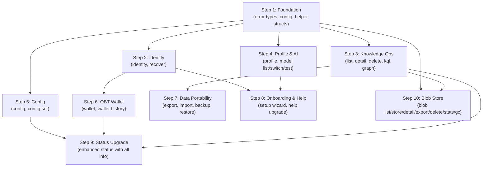

# 📟 OneBrain CLI — Feature Specification & Reference

> Complete documentation of features, commands, and output formats for `onebrain-cli`.
> Binary name: `onebrain` | Tech: Rust | Phase: 0 (Foundation)

---

## 1. Overview

OneBrain CLI is the **first interface** of the system — runs directly in the terminal.
It is a **Full Node**: runs the entire Rust stack, self-joins P2P, and runs AI locally.

```
┌─────────────────────────────────────────┐
│           onebrain-cli (REPL)           │  ← Text UI
├─────────────────────────────────────────┤
│         onebrain-node (library)         │  ← Shared runtime
├─────────────────────────────────────────┤
│ ku-core │ ku-net │ ku-ai │ ku-encoder │ │  ← Core crates
│ ku-kql  │ ku-mediator │ protocol      │ │
└─────────────────────────────────────────┘
```

### Characteristics

| Characteristic | Value |
|----------------|-------|
| **Type** | Full Node (direct Rust call) |
| **Communication** | Interactive REPL (stdin/stdout) |
| **No login** | Identity = Ed25519 keypair, BIP39 recovery |
| **AI** | Local Ollama (localhost:11434) |
| **P2P** | TCP/QUIC, port 4242 |
| **Storage** | redb (embedded) |
| **Blob Store** | redb (separate `.blob.redb`, 256KB chunks, dedup) |
| **Offline** | Partially functional (browse, keyword search, graph, blob) |

---

## 2. Startup

### 2.1 Start Command

```bash
onebrain start [OPTIONS]
```

| Flag | Default | Description |
|------|---------|-------------|
| `--name NAME` | `"OneBrain"` | Display name for the node |
| `--port PORT` | `4242` | P2P port |
| `--data-dir DIR` | `./onebrain_data` | Data directory |
| `--ollama-url URL` | `http://localhost:11434` | Ollama API URL |
| `--model MODEL` | `qwen3:8b` | Default AI model |
| `--seeds ADDR,ADDR` | `[]` | Seed node addresses |
| `--api` | `false` | Enable REST/WebSocket API for Web Dashboard |
| `--api-port PORT` | `4280` | API server port |
| `--api-token TOKEN` | `onebrain-dev-token` | API Bearer token for authentication |
| `--web-dir DIR` | auto-detect | Path to built web dashboard assets |
| `--vnext-kql` | `false` | Enable bounded one-hop private Need runtime |
| `--vnext-public-use` | `false` | Enable explicitly confirmed Public UseEvidence |
| `--vnext-pomv-view` | `false` | Enable read-only Metabolic Evidence Views |
| `--vnext-feed-signer-provider PROVIDER` | `none` | Explicit Feed signer selection: `none` or `development-file` |
| `--allow-development-file-signer` | `false` | Required second opt-in for the non-production file signer |
| `--vnext-feed-key-file PATH` | data directory | Optional development Feed key path |
| `--version` | — | Display version and exit |

### 2.2 First-Run

When `{data_dir}/identity.json` does not yet exist:

```
╔══════════════════════════════════════╗
║   Welcome to OneBrain!               ║
╚══════════════════════════════════════╝

  ── Step 1/5: Display Name ──
  Enter your name (or press Enter for default):
  > Alice

  ── Step 2/5: Language ──
  Choose language:
    1. English
    2. Tiếng Việt
  > 1

  ── Step 3/5: Identity Generation ──
  Generating Ed25519 keypair...
  Solving crypto puzzle (difficulty=16)... ✓ (2.3s)
  
  Your NodeId: a1b2c3d4e5f6...

  ── Step 4/5: Recovery Phrase (BIP39) ──
  ⚠ IMPORTANT: Write down these 24 words. This is the ONLY way to recover your identity.
  
  1. abandon  2. ability  3. able    4. about
  5. above    6. absent   7. absorb  8. abstract
  ...
  
  Confirm: Enter word #3 and #17 to verify:
  > able
  > ...
  ✓ Recovery phrase confirmed.

  ── Step 5/5: AI Setup ──
  Detecting hardware... GPU: NVIDIA RTX 3060 (12GB VRAM)
  Device tier: T4 → Recommended model: qwen2.5:7b
  Checking Ollama... ✓ Connected (model: qwen3:8b)
  
  ✓ Setup complete! Type 'help' to begin.
```

### 2.3 Startup (Subsequent Runs)

```
╔══════════════════════════════════════╗
║       OneBrain Node Starting...      ║
╚══════════════════════════════════════╝

  Name:     Alice
  Port:     4242
  NodeId:   a1b2c3d4...
  Tier:     Contributor (0.35)
  KUs:      42 stored
  Balance:  1,250.00 OBT

  ✓ Node initialized
  ✓ TCP listener on 0.0.0.0:4242
  ✓ Connected to seed (3 peers online)
  ✓ Remembered 5 peer(s) from last session

Type 'help' for commands.
```

---

## 3. Command List — Complete

### 3.1 Commands Overview

| Group | Command | Description | Status |
|-------|---------|-------------|--------|
| **Knowledge** | `encode <text>` | Encode text → KU | ✅ Implemented |
| | `remember <text>` | Alias for encode | ✅ Implemented |
| | `encode --draft` | Save as draft instead of encoding | ✅ Implemented |
| | `encode --attach <file>` | Encode with file attachment | ✅ Implemented |
| | `search <query>` | Semantic search | ✅ Implemented |
| | `find <query>` | Alias for search | ✅ Implemented |
| | `list` | Browse KUs | ✅ Implemented |
| | `detail <cid>` | View KU details | ✅ Implemented |
| | `delete <cid>` | Delete KU locally | ✅ Implemented |
| | `delete --gene <type>` | Bulk delete by gene type | ✅ Implemented |
| | `deprecate <cid>` | Mark KU as obsolete | ✅ Implemented |
| | `edit <cid>` | Create new version of KU | ✅ Implemented |
| | `kql <query>` | KQL query | ✅ Implemented |
| | `graph <cid>` | View graph neighbors | ✅ Implemented |
| **Tags & Pins** | `tag add <cid> <tag>` | Add tag to KU | ✅ Implemented |
| | `tag remove <cid> <tag>` | Remove tag from KU | ✅ Implemented |
| | `tag list` | List all tags | ✅ Implemented |
| | `pin [cid]` | Pin KU / list pinned | ✅ Implemented |
| | `unpin <cid>` | Unpin KU | ✅ Implemented |
| **Watch** | `watch create <kql>` | Create standing query | ✅ Implemented |
| | `watch list` | List active watches | ✅ Implemented |
| | `watch delete <id>` | Delete a watch | ✅ Implemented |
| **Network** | `connect <addr>` | Connect to peer | ✅ Implemented |
| | `status` | Node status | ✅ Implemented |
| | `peers` | Peer list | ✅ Implemented |
| **Social** | `follow <node_id>` | Follow a node | ✅ Implemented |
| | `unfollow <node_id>` | Unfollow a node | ✅ Implemented |
| | `following` | List followed nodes | ✅ Implemented |
| | `peer-info <node_id>` | View peer profile | ✅ Implemented |
| | `share <cid>` | Generate shareable link | ✅ Implemented |
| **Identity** | `identity` | View identity info | ✅ Implemented |
| | `recover` | BIP39 recovery | ✅ Implemented |
| | `devices` | List linked devices | ✅ Implemented |
| | `sync [status]` | Multi-device sync status | ✅ Implemented |
| **Profile** | `profile` | View profile | ✅ Implemented |
| | `profile set <field> <value>` | Edit profile | ✅ Implemented |
| **AI** | `model list` | List models | ✅ Implemented |
| | `model switch <name>` | Switch model | ✅ Implemented |
| | `model test` | Test AI connection | ✅ Implemented |
| **Wallet** | `wallet` | View OBT balance | ✅ Implemented |
| | `wallet history` | Transaction history | ✅ Implemented |
| **Blob** | `blob list` | List stored blobs | ✅ Implemented |
| | `blob store <file>` | Store file as blob | ✅ Implemented |
| | `blob detail <cid>` | View blob details | ✅ Implemented |
| | `blob export <cid> [output]` | Export blob to file | ✅ Implemented |
| | `blob delete <cid>` | Delete blob | ✅ Implemented |
| | `blob stats` | Blob storage statistics | ✅ Implemented |
| | `blob gc` | Garbage collect orphaned blobs | ✅ Implemented |
| | `blob pin <cid>` | Pin blob (prevent GC) | ✅ Implemented |
| | `blob unpin <cid>` | Unpin blob (allow GC) | ✅ Implemented |
| **Data** | `export` | Export KUs to file | ✅ Implemented |
| | `import <file>` | Import file | ✅ Implemented |
| | `backup` | Full backup | ✅ Implemented |
| | `restore <file>` | Restore from backup | ✅ Implemented |
| **Config** | `config` | View current config | ✅ Implemented |
| | `config set <key> <value>` | Edit config | ✅ Implemented |
| **System** | `help [command]` | Help (grouped + per-command) | ✅ Implemented |
| | `quit` / `exit` | Exit | ✅ Implemented |
| | `<free text>` | Chat with AI | ✅ Implemented |

**Total: 51 legacy REPL commands plus 11 additive vNext command paths ✅**

---

### 3.2 Additive vNext commands

These commands are non-REPL clients of the authenticated local API. Supply
`--api-token` or set `ONEBRAIN_API_TOKEN`.

```text
onebrain need prepare|activate|list|scan|matches|retire
onebrain pomv use prepare|confirm|status
onebrain pomv view
onebrain vnext status
```

`need matches` always presents results as `quarantined proposal` with
`executable=false`. Empty pages are bounded/local results, never claims that
knowledge is absent from the network.

Public Use is two-step:

1. `pomv use prepare` requires `--public-permanent` and prints the exact
   canonical preview, target, recipient, selector, namespace and `intent_cid`.
2. `pomv use confirm --intent <CID>` warns about Public/permanent publication
   and requires typing the exact CID interactively. There is no `--yes` bypass.

Example development startup:

```powershell
cargo run -p onebrain-cli --features vnext-network-runtime -- start `
  --api --vnext-kql --vnext-public-use --vnext-pomv-view `
  --vnext-feed-signer-provider development-file `
  --allow-development-file-signer
```

The file signer is explicitly development-only and prints an exportable-key
warning. Production custody must be injected by a host implementation rather
than inferred from this adapter.

### 3.3 Command Details

---

#### `encode <text>` / `remember <text>`

Encode text into a Knowledge Unit (KU) and publish it to the network.

```
OneBrain> encode Albert Einstein developed the special theory of relativity in 1905, 
  proving that E=mc² — energy equals mass times the speed of light squared.

  ✓ Encoded and stored successfully
  CID:          a1b2c3d4e5f6789...
  Gene type:    Fact
  Confidence:   92%
  Wire size:    1,234 bytes
  Instructions: 47
  Codons:       [Physics] (Domain), [Einstein] (Agent), [E=mc²] (Content)
  Bonds:        2 outgoing
  📡 Broadcasting to 3 peer(s)...
  🔍 Verification requested from 3 peer(s)
```

**Rate limit**: Leaf=1/h, Contributor=5/h, LocalSP+=10/h. If exceeded:
```
  ✗ Rate limit exceeded. Tier: Leaf (max 1 KU/hour).
    Try again in 42 minutes.
    Tip: Contribute quality KUs to increase your tier.
```

**Quality gate fail**:
```
  ✗ Content too short (128 bytes, minimum: 256 bytes).
    Add more detail to encode as knowledge.
```

---

#### `search <query>` / `find <query>`

Search KUs using semantic search (AI) + keyword matching.

```
OneBrain> search theory of relativity

  ── Search Results (3 found) ──
  1. [Fact] Einstein developed the theory of relativity... Score: 0.95  CID: a1b2c3...
  2. [Hypo] Time dilation effects near light speed...      Score: 0.82  CID: d4e5f6...
  3. [Proc] How to calculate the Lorentz factor...         Score: 0.71  CID: 789abc...
  
  Use 'detail <cid>' to view full KU.
```

---

#### `list [OPTIONS]`

Browse all KUs in local storage.

| Flag | Default | Description |
|------|---------|-------------|
| `--page N` | 1 | Page number |
| `--limit N` | 15 | KUs per page |
| `--type TYPE` | all | Filter by gene type: `fact`, `procedure`, `experience`, `creative`, `media_experience`, `testimony`, `formal`, `hypothesis`, `narrative`, `sensory`, `composite`, `normative`, `definition` |
| `--sort FIELD` | created | Sort by: created, pomv, trust |

**All 13 KU v7 gene types:**

| Gene Type | Abbreviation | Description |
|-----------|-------------|-------------|
| `Fact` | Fact | Verified factual knowledge |
| `Procedure` | Proc | Step-by-step instructions or how-to knowledge |
| `Experience` | Exp | First-person lived experiences |
| `Creative` | Crea | Original creative works (text, ideas) |
| `MediaExperience` | Media | Experiences tied to media (films, music, books) |
| `Testimony` | Test | Witness accounts and reported observations |
| `Formal` | Form | Formal/mathematical/logical statements |
| `Hypothesis` | Hypo | Unverified theories or conjectures |
| `Narrative` | Narr | Stories, chronicles, and sequential accounts |
| `Sensory` | Sens | Sensory-grounded observations (taste, smell, sight) |
| `Composite` | Comp | Multi-type knowledge units combining several gene types |
| `Normative` | Norm | Value judgments, ethical principles, and standards |
| `Definition` | Defn | Definitions, glossary entries, and term explanations |

```
OneBrain> list

  ── Knowledge Units (42 total, page 1/3) ──
  #   Gene   PoMV  Trust  Created     CID         Preview
  1.  Fact   0.85  0.92   07/07 14:30 a1b2c3...   Einstein developed the theory of...
  2.  Proc   0.72  0.88   07/07 13:15 d4e5f6...   How to brew traditional Vietnamese pho...
  3.  Exp    0.45  0.65   07/06 22:00 789abc...    The first time I saw the Milky Way...
  ...
  
  Page 1/3. Use 'list --page 2' for next page.
```

```
OneBrain> list --type hypothesis --sort pomv

  ── Knowledge Units (type: hypothesis, 5 total) ──
  ...
```

---

#### `detail <cid>`

View full details of a KU.

```
OneBrain> detail a1b2c3d4

  ══════════════════════════════════════════
  KU Detail — a1b2c3d4e5f6789012345678...
  ══════════════════════════════════════════
  
  Gene type:    Fact
  Created:      2026-07-07 14:30:00
  Wire size:    1,234 bytes
  Confidence:   92%
  
  ── Trust & PoMV ──
  Epistemic:    Established (level 6/10)
  Evidence:     Observational
  Trust score:  0.92
  PoMV rate:    0.85
    ├─ Metabolic:     0.80
    ├─ Prediction:    0.90
    ├─ Entropy:       0.75
    ├─ Survival:      0.88
    ├─ Centrality:    0.82
    └─ Niche:         0.91
  
  Verification: FULL (3/3 verifiers agreed)
  
  ── Codons (Concepts) ──
  [Physics] (Domain)  [Einstein] (Agent)  [E=mc²] (Content)
  [1905] (Time)  [Theory of Relativity] (Result)
  
  ── Content ──
  Albert Einstein developed the special theory of relativity in 1905,
  proving that E=mc² — energy equals mass times the speed of light
  squared.
  
  ── Bonds (3 outgoing, 1 incoming) ──
  OUT → [Extends]    → Quantum Theory           CID: x1y2z3...  w: 0.80
  OUT → [Cites]      → Newton's Laws            CID: a4b5c6...  w: 0.65
  OUT → [DerivedFrom]→ Maxwell equations        CID: m7n8o9...  w: 0.55
  IN  ← [Refutes]    ← Ether theory             CID: d7e8f9...  w: 0.30
```

---

#### `delete <cid>`

Delete a KU from local storage (does not affect copies on the network).

```
OneBrain> delete a1b2c3d4

  ⚠ This will delete KU [a1b2c3d4...] from LOCAL storage.
    Gene: Fact | "Einstein developed the theory of relativity..."
    Other nodes may still have copies.
  
  Confirm delete? (y/N): y
  ✓ Deleted from local storage.
```

---

#### `kql <query>`

Execute a KQL (Knowledge Query Language) query.

```
OneBrain> kql FIND facts WHERE trust > 0.8 LIMIT 5

  ── KQL Results (3 matches) ──
  1. [Fact] Einstein E=mc²              trust: 0.92  CID: a1b2c3...
  2. [Fact] DNA double helix            trust: 0.88  CID: d4e5f6...
  3. [Fact] Water boils at 100°C        trust: 0.95  CID: 789abc...
```

```
OneBrain> kql FIND procedures WHERE codons CONTAINS "cooking" ORDER BY pomv DESC

  ── KQL Results (2 matches) ──
  1. [Proc] How to brew traditional pho     pomv: 0.72  CID: d4e5f6...
  2. [Proc] How to make broken rice         pomv: 0.45  CID: abc123...
```

**KQL supports all 13 v7 gene type patterns:**

| KQL Pattern | Gene Type |
|-------------|-----------|
| `facts` | Fact |
| `procedures` | Procedure |
| `experiences` | Experience |
| `creatives` | Creative |
| `media_experiences` | MediaExperience |
| `testimonies` | Testimony |
| `formals` | Formal |
| `hypotheses` | Hypothesis |
| `narratives` | Narrative |
| `sensories` | Sensory |
| `composites` | Composite |
| `normatives` | Normative |
| `definitions` | Definition |

**Syntax error**:
```
OneBrain> kql FIND WHERE

  ✗ KQL syntax error at position 5:
    FIND WHERE
         ^^^^^
    Expected: pattern (facts, procedures, experiences, creatives,
              media_experiences, testimonies, formals, hypotheses,
              narratives, sensories, composites, normatives, definitions)
    Example: FIND facts WHERE trust > 0.5
```

---

#### `graph <cid> [--depth N]`

Display graph neighbors as a text-based tree (not visual).

| Flag | Default | Description |
|------|---------|-------------|
| `--depth N` | 1 | Traversal depth (max 3) |

```
OneBrain> graph a1b2c3 --depth 2

  ── Knowledge Graph: a1b2c3... (depth=2) ──
  
  ● [a1b2c3] Einstein E=mc² (Fact, PoMV: 0.85)
  ├── → [Extends]     → ● [x1y2z3] Quantum Theory (Fact, PoMV: 0.78)
  │   ├── → [PartOf]  → ○ [m1n2o3] Modern Physics
  │   └── → [Cites]   → ○ [p1q2r3] Planck constant
  ├── → [Cites]       → ● [a4b5c6] Newton's Laws (Fact, PoMV: 0.92)
  │   └── → [Extends] → ○ [w1x2y3] Kepler's Laws
  ├── → [DerivedFrom] → ● [m7n8o9] Maxwell equations (Form, PoMV: 0.81)
  └── ← [Refutes]     ← ● [d7e8f9] Ether theory (Hypo, PoMV: 0.12)
  
  ● = in local storage  ○ = CID only (not yet synced)
  Nodes: 8  |  Edges: 7  |  Max depth reached: 2
```

---

#### `identity`

Display identity information for the current node.

```
OneBrain> identity

  ── Identity ──
  NodeId:       a1b2c3d4e5f6789012345678901234567890abcdef...
  Display name: Alice
  Created:      2026-07-07 14:00:00
  Puzzle:       difficulty=16, solved in 2.3s
  
  ── Device Group ──
  Devices:      1/16
  This device:  Desktop (Windows)
  
  ── Trust ──
  Tier:         Contributor (score: 0.35)
  Next tier:    LocalSP (need: 0.60)
  Progress:     ████████░░░░░░░░ 58%
  
  ── Statistics ──
  KUs encoded:  42
  KUs received: 156
  Queries:      89
  Uptime:       12h 34m
```

---

#### `recover`

Recover identity from a BIP39 recovery phrase (interactive).

```
OneBrain> recover

  ⚠ This will REPLACE the current identity on this device.
    Current NodeId: a1b2c3d4...
  
  Continue? (y/N): y
  
  Enter your 24-word recovery phrase:
  > abandon ability able about above absent absorb abstract ...
  
  Verifying phrase... ✓ Valid BIP39
  Deriving keypair... ✓
  Solving crypto puzzle... ✓ (1.8s)
  
  ✓ Identity recovered!
  NodeId: x9y8z7w6v5u4...
```

---

#### `profile` / `profile set`

View and edit user profile.

```
OneBrain> profile

  ── User Profile ──
  Display name:     Alice
  Language:         en (English)
  Response style:   Balanced
  Proactive encode: On
  
  ── Expertise ──
  1. Physics        (15 KUs, active 2h ago)
  2. Programming    (12 KUs, active 1d ago)
  3. Cooking        (8 KUs, active 3d ago)
  
  ── Statistics ──
  Total KUs:     42
  Total queries: 89
  Member since:  2026-07-07
  Last active:   2 minutes ago
```

```
OneBrain> profile set name "Alice Smith"
  ✓ Display name updated to "Alice Smith"

OneBrain> profile set language en
  ✓ Language updated to "en" (English)

OneBrain> profile set style detailed
  ✓ Response style updated to "Detailed"
  Options: concise, balanced, detailed, academic
```

---

#### `model list` / `model switch` / `model test`

Manage AI models (Ollama).

```
OneBrain> model list

  ── AI Models ──
  Device tier: T4 (16GB RAM, RTX 3060 12GB VRAM)
  
  Available (installed in Ollama):
    ★ qwen3:8b         8B params   [current]
      qwen2.5:3b       3B params
      nomic-embed-text  embedding
  
  Recommended for your hardware:
      qwen2.5:7b       7B params   (min: T4)
      qwen2.5:14b      14B params  (min: T5, your GPU may be slow)
  
  To install: ollama pull <model_name>
  To switch:  model switch <model_name>
```

```
OneBrain> model switch qwen2.5:7b
  Checking model availability... ✓ Found in Ollama
  Switching... ✓ Now using qwen2.5:7b
```

```
OneBrain> model test
  
  ── AI Health Check ──
  Ollama:    ✓ Connected (http://localhost:11434)
  Model:     qwen3:8b (loaded)
  Latency:   245ms (good)
  GPU:       NVIDIA RTX 3060 (CUDA)
  VRAM used: 6.2 / 12.0 GB
  
  Test encode: "The sky is blue" → ✓ Fact gene detected (confidence: 94%)
```

---

#### `wallet` / `wallet history`

View OBT balance and transaction history.

> **OBT Architecture**: Nano-style block-lattice — each node has its own chain, NO central ledger.
> Balance is read from local `AccountState` (head block).

```
OneBrain> wallet

  ── OBT Wallet ──
  Balance:     1,250.000 OBT
  Account:     a1b2c3d4... (Ed25519)
  Chain:       47 blocks (head: x9y8z7...)
  
  ── Tier ──
  Current:     Contributor (trust: 0.35)
  Multiplier:  0.50x
  Next tier:   LocalSP (need trust ≥ 0.60, multiplier: 1.00x)
  
  ── Earnings Summary ──
  Total earned: 1,380.000 OBT
  Total spent:    130.000 OBT
  
  By stream:
    R1 Owner (40%):    552.000 OBT  ████████████░░░░
    R2 Encoder (25%):  345.000 OBT  ████████░░░░░░░░
    R3 Verifier (15%): 207.000 OBT  █████░░░░░░░░░░░
    R4 Storage (20%):  276.000 OBT  ██████░░░░░░░░░░
  
  ── Rate Limits ──
  KU/hour:     5 (Contributor tier)
  Used:        2/5 this hour
  Cooldown:    none
```

```
OneBrain> wallet history --limit 10

  ── Transaction History (latest 10) ──
  #   Type      Amount      When          Detail
  1.  Mint     +25.000 OBT  2m ago       R1:Owner — KU a1b2c3... (PoMV: 0.85)
  2.  Mint      +5.000 OBT  15m ago      R3:Verifier — verified KU d4e5f6...
  3.  Mint     +12.500 OBT  1h ago       R2:Encoder — consensus on KU 789abc...
  4.  Mint      +8.000 OBT  2h ago       R4:Storage — storing 42 KUs
  5.  Mint     +25.000 OBT  3h ago       R1:Owner — KU x1y2z3... (PoMV: 0.92)
  ...
  
  Chain: 47 blocks | Confirmation: Settled
```

---

#### `export` / `import`

Export canonical public data, render non-importable views, or import text as
new drafts. The mode is mandatory so view files cannot be mistaken for a
canonical exchange.

```
OneBrain> export --mode canonical-v1 --output public_exchange.obx

  Exporting canonical public records...
  ✓ Exported to public_exchange.obx (156 KB)
```

```
OneBrain> import --mode text-drafts-v1 notes.txt

  Reading file... ✓ Found 15 text entries
  Encoding: [████████████████] 15/15
  
  ✓ Imported 15 KUs (3 skipped as duplicates)
```

---

#### `backup` / `restore`

Full backup/restore of all node data.

```
OneBrain> backup

  Creating encrypted backup...
  Enter password: ********
  Confirm password: ********
  
  Backing up:
    ✓ identity.json (encrypted)
    ✓ ku.redb (42 KUs)
    ✓ user_profile.json
    ✓ known_peers.json
    ✓ retriever_index.json
  
  ✓ Backup saved: onebrain_backup_20260707.obk (2.1 MB)
    ⚠ Keep this file safe. It contains your private key (encrypted).
```

```
OneBrain> restore onebrain_backup_20260707.obk

  ⚠ This will REPLACE all local data.
  Continue? (y/N): y
  Enter backup password: ********
  
  Restoring:
    ✓ identity.json
    ✓ ku.redb (42 KUs)
    ✓ user_profile.json
    ✓ known_peers.json
    ✓ retriever_index.json
  
  ✓ Restore complete! Restart the node to apply.
```

---

#### `blob list` / `blob store` / `blob detail` / `blob export` / `blob delete` / `blob stats` / `blob gc`

Manage media/file attachments (Blob Store).

> **Architecture**: Blobs are stored separately in `.blob.redb`, isolated from KUs. KUs only contain a 34-byte `MediaRef` CID reference.
> Files are automatically chunked at 256KB, deduped via BLAKE3, with device-adaptive quota (min 10GB).

**Store a file:**
```
OneBrain> blob store photo.jpg

  ✓ Blob stored successfully
  CID:    0101a3b4c5d6e7f8
  Name:   photo.jpg
  Type:   Image
  Size:   3.2 MB
  Chunks: 13
  MIME:   image/jpeg
```

**List blobs:**
```
OneBrain> blob list

  ── Stored Blobs (3) ──

  CID          Name                 Type       Size       Refs
  ────────────────────────────────────────────────────────────
  0101a3b4c5d6 photo.jpg            Image      3.2 MB     1
  0101f7e8d9c0 report.pdf           Document   1.8 MB     2
  0100b2a3c4d5 data.bin             Raw        512.0 KB   0
```

**View details:**
```
OneBrain> blob detail 0101a3b4c5d6e7f8...

  ── Blob Detail ──
  CID:        0101a3b4c5d6e7f8a1b2c3d4e5f6789012345678...
  Name:       photo.jpg
  Type:       Image
  MIME:       image/jpeg
  Size:       3.2 MB (3,355,648 bytes)
  Chunks:     13 × 256KB
  BLAKE3:     a3b4c5d6e7f8a1b2c3d4e5f6789012345678...
  Created:    1720396800
  Pinned:     No
  References: 1 KU(s)
    → a1b2c3d4e5f67890
```

**Export blob to file:**
```
OneBrain> blob export 0101a3b4c5d6 output.jpg
  ✓ Exported 3.2 MB to output.jpg

OneBrain> blob export 0101a3b4c5d6
  ✓ Exported 3.2 MB to photo.jpg    (uses original filename)
```

**Delete blob:**
```
OneBrain> blob delete 0101a3b4c5d6
  Delete blob 0101a3b4c5d6...? (y/N): y
  ✓ Blob deleted.
```

**Storage statistics:**
```
OneBrain> blob stats

  ── Blob Storage Stats ──
  Blobs:  3
  Size:   5.5 MB
```

**Garbage collect orphans:**
```
OneBrain> blob gc
  Scanning for orphaned blobs...
  ✓ Deleted 1 orphaned blob(s), freed 512.0 KB
```

**Automatic deduplication:**
```
OneBrain> blob store einstein.jpg
  ✓ Blob stored successfully (NEW)
  CID:    0101abc123...

OneBrain> blob store einstein_copy.jpg    (identical content)
  ✓ Blob stored successfully (DEDUP — already exists)
  CID:    0101abc123...                    (same CID!)
```

**Errors:**
```
OneBrain> blob store huge_video.mp4       (> 100MB)
  ✗ Blob too large: 209,715,200 bytes (max: 104,857,600 bytes)

OneBrain> blob detail invalid_cid
  ✗ Invalid blob CID: invalid_cid
```

---

#### `config` / `config set`

View and edit node configuration.

```
OneBrain> config

  ── Node Configuration ──
  name:       Alice
  port:       4242
  data_dir:   ./onebrain_data
  ollama_url: http://localhost:11434
  model:      qwen3:8b
  seeds:      []
  
  ── Derived Paths ──
  identity:   ./onebrain_data/identity.json
  storage:    ./onebrain_data/ku.redb
  blob_store: ./onebrain_data/ku.blob.redb
  graph:      ./onebrain_data/ku.graph.redb
  profile:    ./onebrain_data/user_profile.json
  peers:      ./onebrain_data/known_peers.json
  api_token:  ./onebrain_data/api_token
```

```
OneBrain> config set name "New Name"
  ✓ name updated to "New Name" (takes effect next restart)

OneBrain> config set ollama_url http://192.168.1.100:11434
  ✓ ollama_url updated (takes effect next restart)
```

---

#### `status` (upgraded)

```
OneBrain> status

  ── Node Status ──
  Name:       Alice
  NodeId:     a1b2c3d4... (Contributor, trust: 0.35)
  Uptime:     12h 34m
  
  ── Storage ──
  KUs:        42 stored (1.2 MB)
  Blobs:      3 stored (5.5 MB)
  Bonds:      87 edges
  Graph:      42 nodes, 87 edges
  
  ── Network ──
  Listen:     0.0.0.0:4242
  Peers:      3 connected, 5 remembered
  Seed:       n1.onebrain.live (connected)
  
  ── AI ──
  Ollama:     ✓ Connected
  Model:      qwen3:8b (loaded, latency: 245ms)
  Device:     T4 (RTX 3060, 12GB VRAM)
  
  ── Wallet ──
  Balance:    1,250.000 OBT
  Rate:       2/5 KU used this hour
```

---

#### `help [command]`

```
OneBrain> help

  ╔═══════════════════════════════════════════════════════════════╗
  ║                    OneBrain Commands                         ║
  ╠═══════════════════════════════════════════════════════════════╣
  ║                                                               ║
  ║  ── Knowledge ──                                              ║
  ║  encode <text>           Encode knowledge into KU             ║
  ║  search <query>          Search your knowledge base           ║
  ║  list [--type T]         Browse all KUs                       ║
  ║  detail <cid>            View KU details                      ║
  ║  delete <cid>            Delete KU from local storage         ║
  ║  kql <query>             Execute KQL query                    ║
  ║  graph <cid>             View knowledge graph (text tree)     ║
  ║                                                               ║
  ║  ── Network ──                                                ║
  ║  connect <ip:port>       Connect to peer                      ║
  ║  peers                   Show connected peers                 ║
  ║  status                  Show node status                     ║
  ║                                                               ║
  ║  ── Identity & Profile ──                                     ║
  ║  identity                Show identity info                   ║
  ║  recover                 Recover from BIP39 phrase            ║
  ║  profile                 View/edit profile                    ║
  ║                                                               ║
  ║  ── AI ──                                                     ║
  ║  model list              Show available AI models             ║
  ║  model switch <name>     Switch AI model                      ║
  ║  model test              Test AI connection                   ║
  ║                                                               ║
  ║  ── Wallet ──                                                 ║
  ║  wallet                  Show OBT balance                     ║
  ║  wallet history          Transaction history                  ║
  ║                                                               ║
  ║  ── Data ──                                                   ║
  ║  export --mode <mode>    Export canonical data or a view      ║
  ║  import --mode <mode>    Import canonical data or text drafts ║
  ║  backup                  Full encrypted backup                ║
  ║  restore <file>          Restore from backup                  ║
  ║                                                               ║
  ║  ── Blob ──                                                   ║
  ║  blob list               List stored blobs                    ║
  ║  blob store <file>       Store file as blob                   ║
  ║  blob detail <cid>       View blob details                    ║
  ║  blob export <cid>       Export blob to file                  ║
  ║  blob delete <cid>       Delete blob                          ║
  ║  blob stats              Blob storage statistics              ║
  ║  blob gc                 Garbage collect orphaned blobs       ║
  ║                                                               ║
  ║  ── Config ──                                                 ║
  ║  config                  Show configuration                   ║
  ║  config set <key> <val>  Update configuration                 ║
  ║                                                               ║
  ║  ── System ──                                                 ║
  ║  help [command]          Show help (or help for command)      ║
  ║  quit / exit             Exit the node                        ║
  ║                                                               ║
  ║  Any other text → chat with AI (Mediator)                    ║
  ╚═══════════════════════════════════════════════════════════════╝
```

```
OneBrain> help encode

  encode <text>
  remember <text>  (alias)
  
  Encode text into a Knowledge Unit (KU) and publish to the network.
  
  Pipeline: Text → AI analysis → Gene extraction → Bond creation
            → CID calculation → Store → Broadcast → Verify
  
  Gene types (KU v7, 13 types):
    Fact, Procedure, Experience, Creative, MediaExperience,
    Testimony, Formal, Hypothesis, Narrative, Sensory,
    Composite, Normative, Definition
  
  Rate limits:
    Leaf:        1 KU/hour
    Contributor: 5 KU/hour
    LocalSP+:   10 KU/hour
  
  Quality requirements:
    Min text length: 256 bytes
    Min genes:       2
    Min bonds:       1
  
  Examples:
    encode Einstein developed special relativity in 1905
    encode How to make pho: Step 1: Simmer beef bones for 8 hours...
    remember The mitochondria is the powerhouse of the cell
```

---

#### `deprecate <cid>` — Mark KU as Obsolete

Marks a Knowledge Unit as deprecated (obsolete) without deleting it from storage.

```
  onebrain〉deprecate a1b2c3d4

  ✓ KU marked as deprecated (obsolete)
  CID: a1b2c3d4e5f6...
  Note: KU is still in storage but marked as obsolete.
        Other nodes may still have copies.
```

---

#### `edit <cid>` — Create New Version of KU

Displays the current content and prompts for new content. Creates a new KU version linked to the original.

```
  onebrain〉edit a1b2c3d4

  ── Current KU Content ──
  Gene type: Fact
  Content:
  Einstein developed special relativity in 1905.

  Enter new content (or press Enter to cancel):
  > Einstein published special relativity in 1905, revolutionizing physics.

  ✓ New version created
  New CID:      e5f6a7b8...
  Previous CID: a1b2c3d4...
  Gene type:    Fact
  Confidence:   93%
```

---

#### `delete --gene <type>` — Bulk Delete by Gene Type

Bulk-delete KUs filtered by gene type, with optional date filters.

```
  onebrain〉delete --gene Draft

  ⚠ Found 15 KUs matching filter:
    Gene type: Draft
  Confirm bulk delete? (y/N): y

  ✓ Deleted 15 KUs.
```

---

#### `tag add/remove/list` — Tag Management

Manage tags on Knowledge Units for organization and quick retrieval.

```
  onebrain〉tag add a1b2c3d4 important

  ✓ Tag 'important' added to KU a1b2c3d4e5f6...

  onebrain〉tag remove a1b2c3d4 important

  ✓ Tag 'important' removed from KU a1b2c3d4e5f6...

  onebrain〉tag list

  ── Tags (3) ──
  • important
  • physics
  • todo
```

---

#### `pin [cid]` / `unpin <cid>` — Pin/Unpin KUs

Pin KUs for quick access. Running `pin` without arguments lists all pinned KUs.

```
  onebrain〉pin a1b2c3d4

  📌 KU pinned: a1b2c3d4

  onebrain〉pin

  ── Pinned KUs (2) ──
  📌 [a1b2c3d4] (Fact) Einstein developed special relativity...
  📌 [e5f6a7b8] (Method) How to make pho: Step 1...

  onebrain〉unpin a1b2c3d4

  ✓ KU unpinned: a1b2c3d4
```

---

#### `watch create/list/delete` — Standing Queries

Create persistent KQL queries that notify you when new matching KUs arrive.

```
  onebrain〉watch create FIND facts WHERE trust > 0.8

  ✓ Watch created: w_abc123
  Query: FIND facts WHERE trust > 0.8
  You will be notified when new matching KUs arrive.

  onebrain〉watch list

  ── Active Watches (1) ──
  [w_abc123] FIND facts WHERE trust > 0.8 (matches: 12)

  onebrain〉watch delete w_abc123

  ✓ Watch deleted: w_abc123
```

---

#### `follow/unfollow/following` — Social Commands

Follow other nodes to receive their new KUs in your feed.

```
  onebrain〉follow 3a4b5c6d7e8f

  ✓ Now following node: 3a4b5c6d7e8f

  onebrain〉following

  ── Following (2 nodes) ──
  Node ID                           Name                  Since
  ──────────────────────────────────────────────────────────────────────
  3a4b5c6d7e8f9a0b  Alice                 2h ago
  1234567890abcdef  Bob                   3d ago

  onebrain〉unfollow 3a4b5c6d7e8f

  ✓ Unfollowed node: 3a4b5c6d7e8f
```

---

#### `peer-info <node_id>` — View Peer Profile

View the public profile of a connected peer.

```
  onebrain〉peer-info 3a4b5c6d7e8f

  ╔═══════════════════════════════════════╗
  ║         Node Profile                  ║
  ╚═══════════════════════════════════════╝
  Node ID:    3a4b5c6d7e8f9a0b...
  Name:       Alice
  Trust:      0.85
  Tier:       Verified
  KUs:        1,234
  Expertise:  physics, mathematics
```

---

#### `share <cid>` — Generate Shareable Link

Generate a shareable link for a Knowledge Unit.

```
  onebrain〉share a1b2c3d4

  ── Share KU ──
  CID:       a1b2c3d4e5f6...
  Gene type: Fact
  Preview:   Einstein developed special relativity in 1905.

  📋 Shareable link:
  onebrain://ku/a1b2c3d4e5f6...

  Recipients can use: detail a1b2c3d4e5f6
```

---

#### `devices` — List Linked Devices

Show all devices linked to your identity, including sync status.

```
  onebrain〉devices

  ── Devices (2) ──
  Device ID         Name                  Type      Last Seen     KUs     Status
  ────────────────────────────────────────────────────────────────────────────────
  a1b2c3d4e5f6  Desktop-Home          desktop   5m ago        1,234   🟢 up-to-date
  f6e5d4c3b2a1  Laptop-Work           laptop    2h ago        1,230   🟡 behind
```

---

#### `sync [status]` — Multi-Device Sync

View the sync status across linked devices.

```
  onebrain〉sync status

  ── Sync Status ──
  Status:      🟢 up-to-date
  Pending:     0 items
  Last sync:   5m ago
  Devices:     2
```

---

#### `blob pin/unpin` — Pin/Unpin Blobs

Pin blobs to prevent garbage collection. Pinned blobs are retained even if no KU references them.

```
  onebrain〉blob pin a1b2c3d4

  📌 Blob pinned: a1b2c3d4
  This blob will not be removed by garbage collection.

  onebrain〉blob unpin a1b2c3d4

  ✓ Blob unpinned: a1b2c3d4
```

---

## 4. Real-time Events (Background Notifications)

While the user is typing commands, the CLI displays events from the network:

```
  🔗 Peer connected: 'Alice' at 192.168.1.5:4242 (156 KUs)
  📥 Received KU from Bob: [d4e5f6...]
  ✅ Verification from Charlie: [a1b2c3...] agreement=95%
  💰 Earned 5.000 OBT (R3:Verifier for KU d4e5f6...)
  ⚠ Peer disconnected: 'Dave'
```

---

## 5. Offline Mode

When there is no internet connection or Ollama is unavailable:

```
  ⚠ OFFLINE MODE — Some features are limited.
  
  Available:                    Unavailable:
  ✓ list, detail, graph        ✗ encode (needs AI)
  ✓ search (keyword only)      ✗ search (semantic)
  ✓ wallet, identity           ✗ chat (needs AI)
  ✓ profile, config            ✗ import (needs AI)
  ✓ export, backup
  ✓ blob list/store/export/gc  ✗ blob replicate (needs P2P)
  ✓ peers (show remembered)
```

---

## 6. Error Messages

All errors follow a unified format:

```
  ✗ [ERROR_CODE] Message
    Detail / suggestion
```

| Code | Condition | Message |
|------|-----------|---------|
| `RATE_LIMIT` | Rate limit exceeded | "Tier X: max Y KU/hour. Try again in Z minutes" |
| `KU_TOO_SHORT` | Text < 256 bytes | "Content too short (N bytes, min: 256)" |
| `KU_LOW_QUALITY` | Insufficient genes | "Content needs more detail for encoding" |
| `AI_UNAVAILABLE` | Ollama is down | "AI not available. Check: ollama serve" |
| `AI_MODEL_MISSING` | Model not pulled | "Model X not found. Run: ollama pull X" |
| `AI_TIMEOUT` | AI is slow | "AI processing... (slow hardware, please wait)" |
| `KU_NOT_FOUND` | CID not found | "KU not found: CID..." |
| `KQL_SYNTAX` | Invalid KQL | "KQL syntax error at position N: ..." |
| `NO_PEERS` | No peers connected | "Not connected to network" |
| `NETWORK_ERROR` | Network failure | "Connection failed: ..." |
| `IDENTITY_EXISTS` | Identity already exists | "Identity already exists. Use 'recover' to replace" |
| `INVALID_PHRASE` | Invalid BIP39 phrase | "Invalid recovery phrase" |
| `BACKUP_PASSWORD` | Wrong password | "Incorrect backup password" |
| `BLOB_TOO_LARGE` | File > 100MB | "Blob too large: N bytes (max: 104857600)" |
| `BLOB_NOT_FOUND` | CID not found | "Blob not found" |
| `BLOB_INVALID_CID` | Invalid CID format | "Invalid blob CID: ..." |
| `BLOB_QUOTA` | Quota exceeded | "Blob quota exceeded: used / quota bytes" |

---

## 7. OBT Token — Decentralized Architecture

> **Important**: OBT uses a **Nano-style block-lattice** — there is NO central ledger.

```
┌─────────────────────────────────────────────────┐
│           Each Node has its own chain            │
│                                                  │
│  Node A chain:  [Open] → [Mint] → [Mint] → ... │
│  Node B chain:  [Open] → [Mint] → [Send] → ... │
│  Node C chain:  [Open] → [Receive] → [Mint]    │
│                                                  │
│  Balance = head_block.balance (local, instant)  │
│  No network query needed to check own balance   │
└─────────────────────────────────────────────────┘
```

| Operation | How it works |
|-----------|-------------|
| **Mint** | Deterministic from verified work, K=3 witnesses attest, any node can re-verify |
| **Transfer** | Sender creates Send block → K=3 witnesses confirm → Receiver creates Receive block |
| **Balance** | Reads local `AccountState.balance` (head block) — instant, no network needed |
| **Fork detect** | If 2 blocks share the same sequence → ForkWarrant → penalty |

**5 block types**:
| Block | Balance | Description |
|-------|---------|-------------|
| `Open` | = 0 | Genesis block (created once) |
| `Mint` | += amount | Receive OBT from verified work |
| `Send` | -= amount | Send OBT to another node |
| `Receive` | += amount | Receive OBT from a Send block |
| `Refund` | += amount | Reclaim OBT (Send expired after 7 days) |

---

## 8. Implementation Order (optimized to minimize rework)



| Step | Depends on | Methods in `onebrain-node` | CLI Commands |
|------|-----------|---------------------------|-------------|
| **1. Foundation** | — | Error types, helper structs | — |
| **2. Identity** | Step 1 | `get_identity_info()`, `recover_identity()` | `identity`, `recover` |
| **3. Knowledge** | Step 1 | `list_kus()`, `get_ku()`, `delete_ku()`, `execute_kql()`, `get_neighbors()` | `list`, `detail`, `delete`, `kql`, `graph` |
| **4. Profile & AI** | Step 1 | `get_profile()`, `update_profile()`, `list_ai_models()`, `switch_model()`, `test_ai_connection()` | `profile`, `model *` |
| **5. Config** | Step 1 | `get_config()`, `update_config()` | `config`, `config set` |
| **6. Wallet** | Step 2 | `get_balance()`, `get_wallet_history()` | `wallet`, `wallet history` |
| **7. Data** | Step 3 | `export_data()`, `import_canonical_exchange()`, `import_text_drafts()`, `create_backup()`, `restore_backup()` | `export`, `import`, `backup`, `restore` |
| **8. Onboarding** | Step 2, 4 | — (CLI only) | Setup wizard, `help [cmd]` |
| **9. Status** | Step 3, 5, 6 | — (combines existing) | Enhanced `status` |
| **10. Blob Store** | Step 1, 3 | `store_blob()`, `list_blobs()`, `get_blob_meta()`, `export_blob()`, `delete_blob_file()`, `blob_stats()`, `blob_gc()`, `blob_add_ku_ref()` | `blob list`, `blob store`, `blob detail`, `blob export`, `blob delete`, `blob stats`, `blob gc` |
