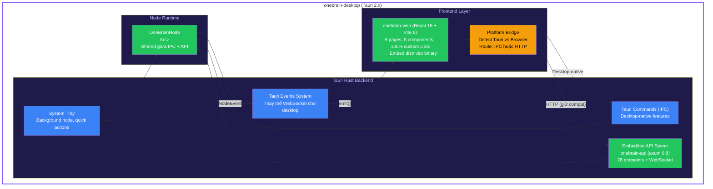
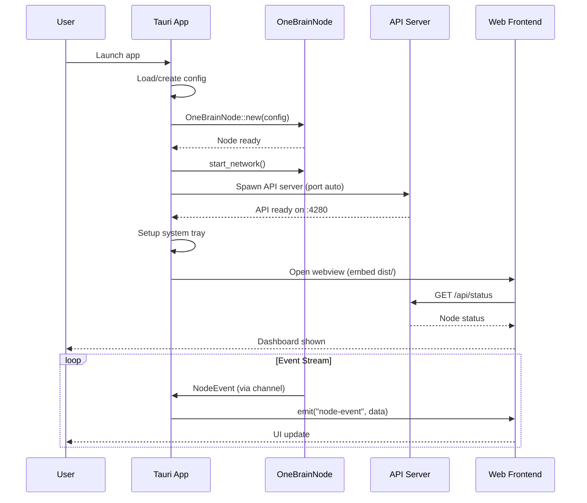
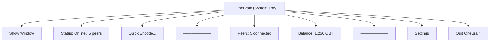
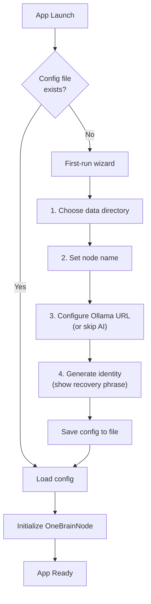
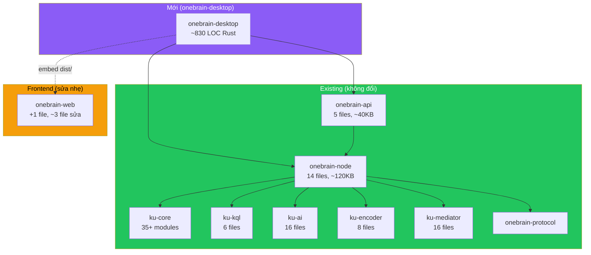
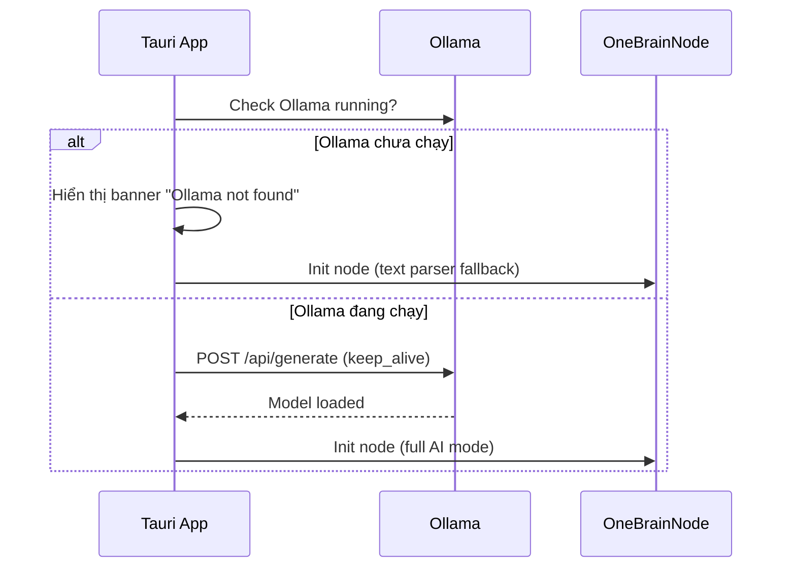
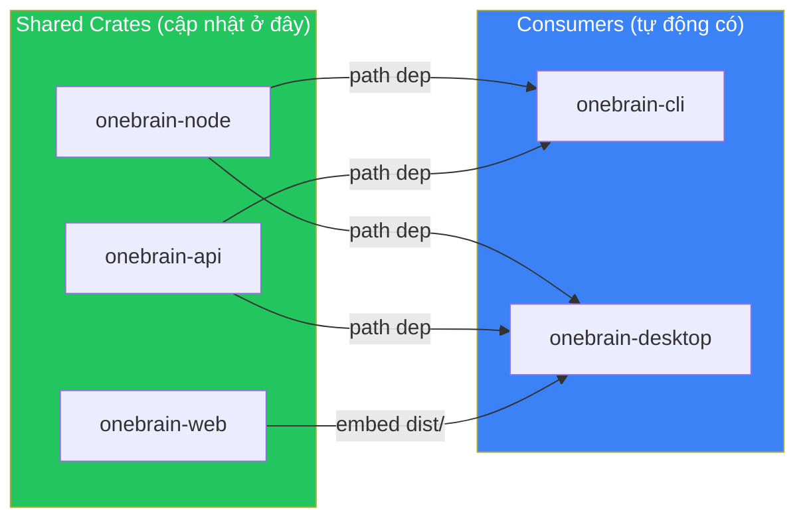

# 🖥️ OneBrain Desktop — Thiết kế Kiến trúc

> **Tauri 2.x + React (onebrain-web) + Rust (onebrain-node)**
> Mỗi user chạy node riêng trên máy cá nhân — đúng triết lý phi tập trung.

---

## 1. Tổng quan Kiến trúc

### Chiến lược: Hybrid Approach

Sau khi phân tích kỹ, chiến lược **Hybrid** là tối ưu nhất — kết hợp **Tauri IPC commands** cho desktop-native features với **embedded API server** để giữ nguyên frontend code.



### Tại sao Hybrid?

| Approach | Ưu điểm | Nhược điểm |
|----------|---------|-----------|
| **IPC only** | Nhanh nhất, native nhất | Phải rewrite toàn bộ `api/client.ts` |
| **HTTP only** | Zero thay đổi frontend | Port conflicts, network overhead |
| **✅ Hybrid** | Giữ nguyên frontend + thêm native features | Phức tạp hơn chút, nhưng flexible nhất |

**Hybrid hoạt động như sau:**
1. Frontend detect `window.__TAURI__` → biết đang chạy trong Desktop
2. API calls vẫn qua HTTP → `onebrain-api` chạy embedded trên localhost
3. Events chuyển từ WebSocket → **Tauri native events** (nhanh hơn, ổn định hơn)
4. Desktop-specific features dùng Tauri IPC: tray, notifications, file dialogs, auto-update

---

## 2. Cấu trúc Project

```
src/
├── onebrain-desktop/                    # ← NEW (Tauri crate)
│   ├── Cargo.toml                       # Depends: onebrain-node, onebrain-api, tauri 2
│   ├── tauri.conf.json                  # Tauri app config
│   ├── capabilities/
│   │   └── default.json                 # Tauri permissions
│   ├── src/
│   │   ├── main.rs                      # Entry point (~80 LOC)
│   │   ├── lib.rs                       # Tauri builder setup (~120 LOC)
│   │   ├── state.rs                     # AppState definition (~40 LOC)
│   │   ├── commands.rs                  # Tauri IPC commands (~200 LOC)
│   │   ├── events.rs                    # NodeEvent → Tauri events (~80 LOC)
│   │   ├── tray.rs                      # System tray (~100 LOC)
│   │   ├── setup.rs                     # First-run setup, config (~150 LOC)
│   │   └── config.rs                    # Desktop-specific config (~60 LOC)
│   ├── icons/
│   │   ├── icon.png                     # App icon (1024x1024)
│   │   ├── icon.ico                     # Windows icon
│   │   └── icon.icns                    # macOS icon
│   └── build.rs                         # Tauri build script
│
├── onebrain-web/                        # ← EXISTING (minimal changes)
│   ├── src/
│   │   ├── api/
│   │   │   ├── client.ts               # ← MODIFY: add Tauri detection
│   │   │   ├── ws.ts                    # ← MODIFY: add Tauri events fallback  
│   │   │   └── tauri.ts                 # ← NEW: Tauri-specific API bridge
│   │   ├── hooks/
│   │   │   └── usePlatform.ts           # ← NEW: platform detection hook
│   │   ├── components/
│   │   │   └── AuthGate.tsx             # ← MODIFY: skip auth for desktop
│   │   └── ...                          # Pages unchanged
│   └── dist/                            # Built output → embedded in Tauri binary
│
├── onebrain-node/                       # ← EXISTING (no changes)
├── onebrain-api/                        # ← EXISTING (no changes)
└── onebrain-cli/                        # ← EXISTING (no changes)
```

### Tổng LOC mới: ~830 LOC Rust + ~200 LOC TypeScript

---

## 3. Chi tiết từng module

### 3.1 `main.rs` — Entry Point

```rust
// Chuẩn bị:
// 1. Load hoặc tạo NodeConfig (từ file hoặc default)
// 2. Khởi tạo OneBrainNode
// 3. Wrap trong Arc<Mutex<>>
// 4. Spawn embedded API server (random available port)
// 5. Spawn event drain task (NodeEvent → Tauri events)
// 6. Khởi tạo Tauri app với state, commands, tray
```

**Flow khởi động Desktop app:**



### 3.2 `state.rs` — Shared State

```rust
pub struct DesktopState {
    /// Shared node instance (same pattern as CLI)
    pub node: Arc<Mutex<OneBrainNode>>,
    /// API server port (dynamically assigned)
    pub api_port: u16,
    /// API token (auto-generated per session)
    pub api_token: String,
    /// Node config
    pub config: NodeConfig,
}
```

### 3.3 `commands.rs` — Tauri IPC Commands

Chỉ cần IPC commands cho **desktop-native features** mà HTTP API không hỗ trợ:

| Command | Mục đích | Lý do cần IPC |
|---------|---------|---------------|
| `get_api_config` | Trả về API URL + token cho frontend | Frontend cần biết port/token tự động |
| `get_node_data_dir` | Trả về data directory path | File system access |
| `open_data_dir` | Mở data dir trong file explorer | Native OS feature |
| `show_notification` | Desktop notification | Native OS feature |
| `export_ku_file` | Export KU ra file (save dialog) | Native file dialog |
| `import_knowledge_file` | Import file → encode (open dialog) | Native file dialog |
| `get_app_version` | App version cho Settings page | Build-time info |
| `check_update` | Check for app updates | Auto-update system |
| `restart_node` | Restart node runtime | Internal lifecycle |
| `quit_app` | Quit từ tray/menu | App lifecycle |

> [!NOTE]
> Tất cả 28 API endpoints hiện tại (encode, search, chat, graph, wallet, etc.) vẫn đi qua embedded HTTP server. Frontend code gần như không đổi.

### 3.4 `events.rs` — Event Bridge

Thay thế WebSocket bằng Tauri native events (nhanh hơn, ổn định hơn):

```rust
// Drain NodeEvent từ channel → emit Tauri events
pub async fn run_event_bridge(
    app: tauri::AppHandle,
    node: Arc<Mutex<OneBrainNode>>,
) {
    loop {
        tokio::time::sleep(Duration::from_millis(300)).await;
        let events = match node.try_lock() {
            Ok(mut n) => n.drain_events(),
            Err(_) => continue,
        };
        for event in events {
            let ws_event = event_to_json(&event);
            let _ = app.emit("node-event", &ws_event);
        }
    }
}
```

Frontend listens:
```typescript
import { listen } from '@tauri-apps/api/event';

// Thay thế WebSocket connection
const unlisten = await listen('node-event', (event) => {
    handleNodeEvent(event.payload);
});
```

### 3.5 `tray.rs` — System Tray



**Behavior:**
- Close window → app chạy nền trong tray (node vẫn online)
- Click tray icon → show window
- Right-click → context menu
- Double-click → show window
- Tray icon thay đổi theo trạng thái (online/offline/encoding)

### 3.6 `setup.rs` — First Run Setup



Config file: `%APPDATA%/OneBrain/config.toml` (Windows) hoặc `~/.config/onebrain/config.toml` (Linux/macOS)

---

## 4. Thay đổi cần thiết cho onebrain-web

### 4.1 `src/api/tauri.ts` — NEW (~80 LOC)

```typescript
// Platform detection & Tauri-specific utilities
export const isTauri = () => '__TAURI__' in window;

export async function getApiConfig(): Promise<{ baseUrl: string; token: string }> {
    if (isTauri()) {
        const { invoke } = await import('@tauri-apps/api/core');
        return invoke('get_api_config');
    }
    // Browser mode: use localStorage (existing behavior)
    return getApiConfigFromStorage();
}

export async function setupTauriEvents(onEvent: (event: any) => void) {
    if (!isTauri()) return null;
    const { listen } = await import('@tauri-apps/api/event');
    return listen('node-event', (e) => onEvent(e.payload));
}
```

### 4.2 `src/api/client.ts` — MODIFY (minimal)

```diff
+ import { isTauri, getApiConfig } from './tauri';

  // Thêm auto-config cho Tauri mode
- const getBaseConfig = () => {
-     const saved = localStorage.getItem('api_config');
-     ...
- };
+ const getBaseConfig = async () => {
+     if (isTauri()) {
+         return getApiConfig(); // Auto từ Tauri backend
+     }
+     const saved = localStorage.getItem('api_config');
+     ...
+ };
```

### 4.3 `src/api/ws.ts` — MODIFY (add Tauri fallback)

```diff
+ import { isTauri, setupTauriEvents } from './tauri';

  export function connectEvents(onEvent: (event: any) => void) {
+     if (isTauri()) {
+         return setupTauriEvents(onEvent); // Native events
+     }
      // Existing WebSocket code for browser mode
      return connectWebSocket(onEvent);
  }
```

### 4.4 `src/components/AuthGate.tsx` — MODIFY

```diff
+ import { isTauri } from '../api/tauri';

  export function AuthGate({ children }) {
+     // Desktop mode: skip auth gate (config managed by Tauri backend)
+     if (isTauri()) {
+         return <>{children}</>;
+     }
      // Existing browser auth flow...
  }
```

### 4.5 `src/hooks/usePlatform.ts` — NEW (~30 LOC)

```typescript
export function usePlatform() {
    return {
        isDesktop: isTauri(),
        isBrowser: !isTauri(),
        canShowNotifications: isTauri(),
        canOpenFileDialog: isTauri(),
        canAutoUpdate: isTauri(),
    };
}
```

> [!IMPORTANT]
> **Tổng thay đổi frontend**: 1 file mới (`tauri.ts`), 1 hook mới (`usePlatform.ts`), 3 file sửa nhẹ. **9 pages KHÔNG đổi**.

---

## 5. Tauri Configuration

### 5.1 `tauri.conf.json`

```json
{
  "$schema": "https://raw.githubusercontent.com/nickel-org/tauri/refs/heads/main/crates/tauri-utils/schema.json",
  "productName": "OneBrain",
  "version": "0.1.0",
  "identifier": "live.onebrain.desktop",
  "build": {
    "beforeDevCommand": "cd ../onebrain-web && npm run dev",
    "devUrl": "http://localhost:5173",
    "beforeBuildCommand": "cd ../onebrain-web && npm run build",
    "frontendDist": "../onebrain-web/dist"
  },
  "app": {
    "windows": [
      {
        "title": "OneBrain — Decentralized Knowledge Network",
        "width": 1280,
        "height": 800,
        "minWidth": 900,
        "minHeight": 600,
        "center": true,
        "decorations": true,
        "resizable": true
      }
    ],
    "trayIcon": {
      "iconPath": "icons/icon.png",
      "iconAsTemplate": true
    },
    "security": {
      "csp": "default-src 'self'; connect-src 'self' http://127.0.0.1:* ws://127.0.0.1:*; style-src 'self' 'unsafe-inline'"
    }
  },
  "bundle": {
    "active": true,
    "targets": "all",
    "icon": [
      "icons/icon.png",
      "icons/icon.ico",
      "icons/icon.icns"
    ],
    "windows": {
      "wix": {
        "language": "en-US"
      }
    }
  }
}
```

### 5.2 `capabilities/default.json`

```json
{
  "identifier": "default",
  "description": "Default capabilities for OneBrain Desktop",
  "windows": ["main"],
  "permissions": [
    "core:default",
    "core:window:allow-close",
    "core:window:allow-minimize",
    "core:window:allow-set-title",
    "dialog:allow-open",
    "dialog:allow-save",
    "notification:default",
    "shell:allow-open",
    "fs:allow-read-text-file",
    "fs:allow-write-text-file",
    "store:default",
    "window-state:default"
  ]
}
```

### 5.3 `Cargo.toml`

```toml
[package]
name = "onebrain-desktop"
version = "0.1.0"
edition = "2021"

[build-dependencies]
tauri-build = { version = "2", features = [] }

[dependencies]
# Core
onebrain-node = { path = "../onebrain-node" }
onebrain-api = { path = "../onebrain-api" }

# Tauri
tauri = { version = "2", features = ["tray-icon"] }
tauri-plugin-dialog = "2"
tauri-plugin-notification = "2"
tauri-plugin-shell = "2"
tauri-plugin-store = "2"
tauri-plugin-window-state = "2"
tauri-plugin-single-instance = "2"
tauri-plugin-log = "2"

# Shared workspace deps
serde.workspace = true
serde_json.workspace = true
tokio.workspace = true
tracing.workspace = true

# Desktop-specific
toml = "0.8"
dirs = "6"
port_check = "0.2"
```

---

## 6. Dependency Graph



---

## 7. So sánh với CLI (pattern đã có)

| Aspect | CLI (đang test) | Desktop (đề xuất) |
|--------|-----------------|-------------------|
| Entry point | `clap` CLI args | Tauri window |
| Node ownership | `Arc<Mutex<OneBrainNode>>` | `Arc<Mutex<OneBrainNode>>` (same) |
| API server | Optional (`--api` flag) | Always embedded |
| Frontend | Terminal REPL | onebrain-web (embed dist/) |
| Events | Chưa có | Tauri native events |
| Persistence | Data dir from args | Config file + data dir |
| Background | Không | System tray |
| Distribution | `cargo install` | `.msi`/`.dmg`/`.AppImage` |

> [!TIP]
> Desktop app về bản chất là **CLI + API + Web** gói lại trong 1 native app, thêm system tray và native features. Pattern hoàn toàn giống CLI (`Arc<Mutex<OneBrainNode>>`).

---

## 8. Kế hoạch triển khai

### Phase 1: Foundation (~1 ngày)
- [ ] Thêm `onebrain-desktop` vào workspace
- [ ] Setup Tauri 2.x project structure
- [ ] `main.rs` + `lib.rs`: khởi tạo node, spawn API, setup Tauri
- [ ] `state.rs`: AppState definition
- [ ] `config.rs`: load/save config từ file
- [ ] Verify: app build và hiển thị onebrain-web

### Phase 2: Native Integration (~1 ngày)
- [ ] `commands.rs`: IPC commands (get_api_config, get_app_version, etc.)
- [ ] `events.rs`: NodeEvent → Tauri events bridge
- [ ] `tray.rs`: system tray + menu + close-to-tray
- [ ] Frontend changes: `tauri.ts`, `usePlatform.ts`, modify AuthGate/client/ws

### Phase 3: Setup & UX (~0.5 ngày)
- [ ] `setup.rs`: first-run wizard (config, identity)
- [ ] Desktop notifications cho encode complete, peer connect
- [ ] File import/export dialogs
- [ ] Window state persistence (size, position)
- [ ] Single instance guard

### Phase 4: Build & Distribution (~0.5 ngày)
- [ ] App icons (generate from OneBrain logo)
- [ ] Windows `.msi` build
- [ ] Test trên Windows
- [ ] GitHub Actions CI cho multi-platform build (future)

**Tổng ước lượng: ~3 ngày**

---

## 9. Quyết định thiết kế (đã duyệt)

| # | Quyết định | Kết luận |
|---|-----------|---------|
| Q1 | Config file format | ✅ **TOML** — consistent với Cargo.toml, dễ edit |
| Q2 | Auto-start với OS | ✅ **Có**, default OFF. **Khi start phải auto-start AI model (Ollama)** |
| Q3 | Ollama required? | ✅ **Optional** — hiển thị banner nếu chưa có |
| Q4 | Data directory | ✅ **OS-standard**: `%APPDATA%/OneBrain/` (Win), `~/Library/Application Support/OneBrain/` (Mac), `~/.local/share/onebrain/` (Linux) |
| Q5 | First-run wizard | ✅ **Có wizard** (4 bước: tên → data dir → Ollama → recovery phrase) |

### AI Model Startup Flow

Khi app khởi động, cần tự động load AI model:



---

## 10. Chiến lược cập nhật — Tại sao Desktop không bị "outdate"

> [!TIP]
> Desktop **không duplicate logic** — chỉ là lớp vỏ mỏng (~830 LOC) bọc lại 3 thứ đã có. Khi web/node/api cập nhật, Desktop **tự động có** khi rebuild.

### Dependency flow



### Ma trận cập nhật

| Khi thay đổi... | CLI | Desktop | Cần sửa Desktop? |
|-----------------|:---:|:-------:|:-----------------:|
| `onebrain-node` (thêm method) | ✅ auto | ✅ auto | ❌ Không |
| `onebrain-api` (thêm endpoint) | ✅ auto | ✅ auto | ❌ Không |
| `onebrain-web` (thêm page) | N/A | ✅ rebuild dist/ | ❌ Không |
| `onebrain-web` (thêm Tauri-specific feature) | N/A | ⚠️ | ✅ Thêm IPC command |
| Desktop-only feature (tray, notification) | N/A | ⚠️ | ✅ Sửa desktop code |

### Quy trình rebuild

```bash
# Khi web thay đổi:
cd src/onebrain-web && npm run build    # → dist/ mới

# Khi bất kỳ Rust crate nào thay đổi:
cd src && cargo build -p onebrain-desktop   # → binary mới, tự link crates mới

# Hoặc dev mode (auto-reload):
cd src/onebrain-desktop && cargo tauri dev  # → HMR frontend + rebuild backend
```

> [!IMPORTANT]
> **Kết luận**: Phát triển Desktop song song với web/CLI **không có rủi ro duplicate**. Ngược lại, Desktop _buộc_ chúng ta phải giữ `onebrain-node` và `onebrain-api` là clean library crates — điều này tốt cho kiến trúc tổng thể.
